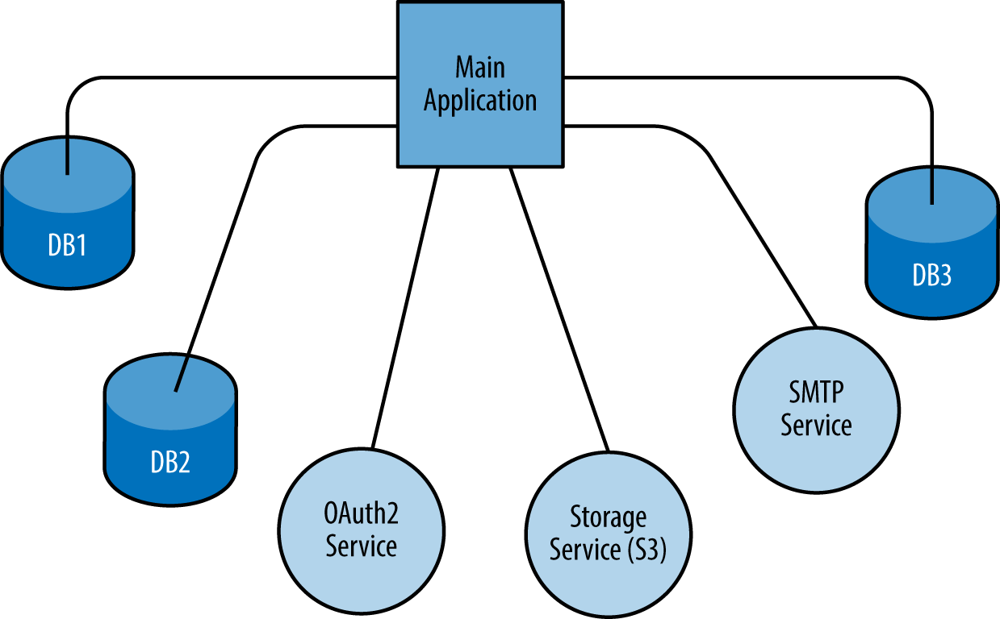

# 5⃣ Backing Services

<figure><figcaption></figcaption></figure>

**Backing Services (Alt Yapı Hizmetleri)**

"Backing Services," bir uygulamanın dışarıdan kullanılan hizmetlere (veritabanlar, önbellek sunucuları, mesaj kuyrukları, vb.) nasıl bağımlılık kurduğunu ele alır. Bu ilke, uygulamanın bu hizmetlere nasıl entegre olduğunu ve bunları nasıl yönettiğini tanımlar. İşte bu ilkenin anahtar unsurları:

**1. Bağımlılıkları Belirleme:** Uygulamanızın hangi dış hizmetlere ihtiyaç duyduğunu ve bu hizmetlerin neler olduğunu belirlemelisiniz.

**Örnek:** Bir web uygulaması, bir veritabanına ve bir önbellek sunucusuna ihtiyaç duyabilir.

**2. Hizmetlere Erişim Ayarları:** Hizmetlere erişim ayarlarını uygulamanızın yapılandırmasında bulundurmalısınız. Bu ayarlar, hizmetlerin konumunu, kimlik doğrulama bilgilerini ve diğer gereksinimleri içerir.

**Örnek:** Veritabanı bağlantı dizesi, önbellek sunucusu adresi ve kimlik doğrulama anahtarı gibi ayarlar.

**3. Dış Hizmetleri Bağımsız Tutma:** Dış hizmetler, uygulama kodundan ayrı olarak yönetilmelidir. Bu, hizmetlerin bağımsızca ölçeklenmesini ve yönetilmesini sağlar.

**Örnek:** Veritabanı hizmeti, uygulamanın kodundan ayrı bir sunucu veya hizmet olarak çalışmalıdır.

**4. Hizmet Bağlantılarını Ayırma:** Hizmet bağlantıları, uygulama kodundan ayrılmalı ve dışarıdan konfigürasyon veya çevresel değişkenlerle sağlanmalıdır.

**Örnek:** Veritabanı bağlantı dizesi, uygulama kodunda sabit olarak yerine yazılmamalıdır.

**5. Hizmet Değişikliklerini Yönetme:** Dış hizmetlerin sürüm ve konfigürasyon değişikliklerini izlemeli ve bu değişikliklere uyum sağlamalısınız.

**Örnek:** Veritabanı hizmetinin sürümü güncellendiğinde, uygulama bu değişikliğe uyum sağlamalıdır.

**6. Hizmetlere Güvenlik Uygulama:** Dış hizmetlere erişirken güvenlik önlemleri almalısınız. Veri şifreleme, kimlik doğrulama ve yetkilendirme gibi güvenlik uygulamalarını düşünmelisiniz.

**Örnek:** Veritabanı erişimi için kullanıcı adı ve parola yerine kimlik doğrulama anahtarları veya tokenler kullanmak.

**7. Yerel Geliştirme Ortamı:** Geliştiricilerin yerel geliştirme ortamlarında dış hizmetleri taklit edebilmeleri için uygun çözümleri sağlamalısınız.

**Örnek:** Geliştiriciler, yerel bir veritabanı sunucusu veya önbellek sunucusu kullanarak uygulamayı test edebilmelidir.

Backing Services ilkesi, uygulamanızın dış hizmetlere nasıl bağımlılık kurduğunu ve bu bağımlılıkları nasıl yönettiğinizi düzenler. Bu, uygulamanızın esnek ve ölçeklenebilir olmasını sağlar, çünkü dış hizmetler bağımsız olarak ölçeklendirilebilir ve güncellenebilir.
