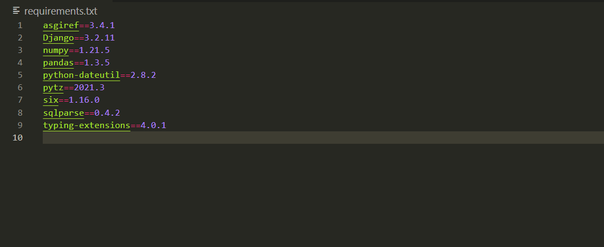

# 2⃣ Dependencies

<figure><figcaption></figcaption></figure>

**Dependencies (Bağımlılıklar)**

12 Factor App metodolojisinin ikinci ilkesi olan "Dependencies," bir uygulamanın dışarıdan gelen bağımlılıklarını nasıl yönetmesi gerektiğini tanımlar. Bu ilke, uygulamanızın ihtiyaç duyduğu ve dışarıdan aldığı yazılım bileşenlerini düzenli bir şekilde yönetmeyi amaçlar. İşte bu ilkenin önemli unsurları:

**1. Bağımlılıkları Belirleme:** Uygulamanızın hangi dış bağımlılıklara ihtiyacı olduğunu belirleyin. Bu, uygulamanızın doğru şekilde çalışabilmesi için gereken tüm bileşenleri tanımlamayı içerir.

* Örnek: Bir web uygulaması için, web sunucu çerçevesi (örneğin, Flask veya Express), veritabanı sürücüsü, ve farklı paketler olabilir.

**2. Sürüm Numaralarını Belirtme:** Kullandığınız bağımlılıkların sürüm numaralarını açıkça belirtin. Bu, her bağımlılığın belirli bir sürümünün kullanılacağını gösterir.

* Örnek: Flask web çerçevesi için "Flask==2.0.0" şeklinde sürüm numarasını belirtmek.

**3. Yönetim Araçları Kullanma:** Bağımlılıkları eklemek, kaldırmak ve güncellemek için uygun araçları kullanın. Bu araçlar, bağımlılıkların kolayca yönetilmesini sağlar.

* Örnek: Python projeleri için "pip," Node.js projeleri için "npm" veya "yarn."

**4. İzolasyon:** Bağımlılıkları uygulama kodundan ayrı olarak saklayın ve izole edin. Bu, uygulama ve bağımlılıklar arasında net bir ayrımı korur ve karışıklıkları önler.

* Örnek: Python projelerinde sanal ortamlar (virtual environments) veya Docker konteynerleri ile izolasyon sağlamak.

**5. Bağımlılıkları Kayıt Altına Alma:** Kullandığınız bağımlılıkları bir belge (örneğin, bir "requirements.txt" dosyası) veya bir yapılandırma dosyası içinde kayıt altına alın. Bu, uygulamanızın farklı ortamlarda tekrar kurulabilmesini sağlar.

* Örnek: Python projelerinde "requirements.txt" dosyası, Node.js projelerinde "package.json."

**6. Güvenlik ve Güncelleme:** Bağımlılıkların güvenliği ve güncel tutulması önemlidir. Güvenlik güncellemeleri yayınlandığında, bağımlılıkları hızlıca güncellemelisiniz.

* Örnek: Zaman zaman "pip install -U" komutuyla güncelleme yapmak.

Bu ilke, uygulamanın dış bağımlılıklarını düzenli ve güvenli bir şekilde yönetmesini ve sürüm kontrolünü sağlamasını amaçlar. Bağımlılıkların açıkça belirtilmesi ve izolasyonu, uygulamanın güvenilirliğini ve kararlılığını artırır.
