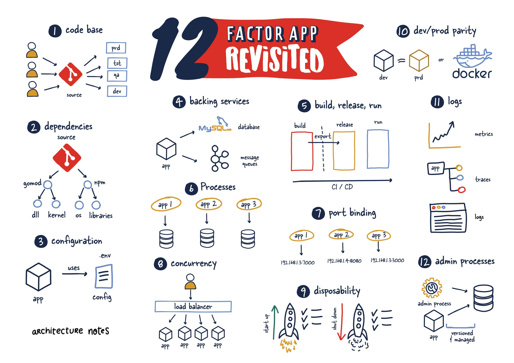

# 🏗 Introduction

<figure><figcaption></figcaption></figure>

12 Factor App, yazılım geliştirme ve dağıtımı için en iyi uygulamaları tanımlayan bir metodoloji veya bir dizi prensipten oluşur. 12 Factor App, modern ve ölçeklenebilir yazılım uygulamalarını oluşturmak için tasarlanmıştır ve bu prensipler uygulandığında yazılım geliştirme, dağıtım ve bakım süreçlerini daha iyi hale getirir.

#### 12 Factor App'in temel prensipleri ve aşamaları;

1. **Codebase (Kod Tabanı):** Bir uygulamanın tüm sürümleri, tek bir kaynak kod deposu (codebase) içinde takip edilmelidir. Örnek: Git veya SVN gibi bir sürüm kontrol sistemine sahip olmak.
2. **Dependencies (Bağımlılıklar):** Uygulamanın dışa bağımlı olduğu kütüphane ve paketler açıkça belirtilmeli ve yalıtılmalıdır. Örnek: Bir Node.js projesinin package.json dosyasında belirtilen bağımlılıklar.
3. **Config (Yapılandırma):** Uygulama yapılandırmaları kod içinde sabit olmamalı, dışarıdan ayarlanabilir olmalıdır. Örnek: Veritabanı bağlantı bilgileri gibi yapılandırmaları çevre değişkenleri (environment variables) kullanarak ayarlamak.
4. **Backing services (Hizmetler):** Uygulama, dışarıdan gelen hizmetlere (örneğin, veritabanları veya mesaj kuyrukları) bağımlı olmalıdır. Örnek: Uygulama, bir PostgreSQL veritabanına bağlanır.
5. **Build, release, run (Derleme, sürüm, çalıştır):** Derleme (build), sürüm (release) ve çalıştırma (run) aşamalarını sıkı bir şekilde ayırmak gerekir. Örnek: Bir uygulama kodunun derlenmesi ve paketlenmesi ayrı adımlar olarak gerçekleştirilir.
6. **Processes (Süreçler):** Uygulama, bir veya daha fazla durumsuz süreç olarak çalıştırılmalıdır. Her süreç, ayrı bir örneğini temsil eder. Örnek: Web sunucuları, birden çok aynı süreci çalıştırabilir.
7. **Port binding (Portla Taşıma):** Hizmetler, URL'ler ve portlar gibi taşınabilir iletişim kanalları üzerinden dışa sunulmalıdır. Örnek: Web uygulaması, HTTP portu üzerinden kullanıcı isteklerini dinler.
8. **Concurrency (Eşzamanlılık):** Uygulama, süreç modeli kullanarak ölçeklendirilmelidir. Birden fazla süreç, yükü dengelemek için kullanılabilir. Örnek: Web sunucularının eşzamanlı olarak çok sayıda isteği işlemesi.
9. **Disposability (Atılabilirlik):** Uygulamanın hızlı bir şekilde başlatılması ve düzgün bir şekilde kapatılması gerekmektedir. Bu, uygulamanın dayanıklılığını artırır. Örnek: Sürecin hızlı bir şekilde yeniden başlatılabilmesi.
10. **Dev/prod parity (Geliştirme/Üretim Benzerliği):** Geliştirme, test ve üretim ortamları birbirine benzer olmalıdır. Bu, sürpriz hataların önlenmesine yardımcı olur. Örnek: Üretimde aynı veritabanı sürümünün kullanılması.
11. **Logs (Günlükler):** Uygulama günlükleri, bir olay akışı gibi ele alınmalı ve bu günlükler merkezi olarak izlenebilir olmalıdır. Örnek: Uygulama hata günlüklerinin JSON formatında bir merkezi günlük hizmetine iletilmesi.
12. **Admin processes (Yönetim Görevleri):** Yönetim veya bakım görevleri, ayrı bir işlem olarak çalıştırılmalıdır. Bu, uygulama işlevselliğini etkilemeden yönetim görevlerini gerçekleştirmenizi sağlar. Örnek: Veritabanı yedeklemelerini oluşturmak için ayrı bir yönetim işlemi.

Bu prensipler, modern uygulama geliştirme süreçlerini daha düzenli, ölçeklenebilir ve bakımı kolay hale getirir.


