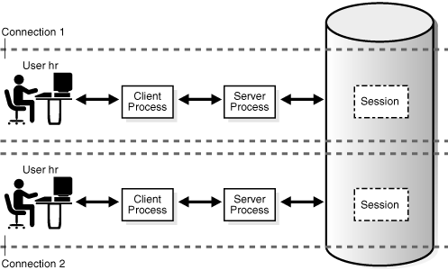

# 4⃣ Processes

<figure><figcaption></figcaption></figure>

**Processes (Süreçler)**

"Processes," bir uygulamanın nasıl çalıştığını ve nasıl yönetildiğini ele alır. Bu ilke, uygulamanın her bir işlevselliğini ayrı süreçler (processes) içinde çalıştırılabilir ve yönetilebilir hale getirir. İşte bu ilkenin anahtar unsurları:

**1. İşlevselliği Parçalama:** Uygulama, farklı işlevselliği olan bileşenlere ayrılmalıdır. Her bileşen, kendi sürecinde çalıştırılır ve bağımsız olarak yönetilir.

**Örnek:** Bir web uygulaması, web sunucu, veritabanı işlemleri ve arka plan görevler olmak üzere farklı bileşenlere sahip olabilir.

**2. Bağımsız Süreçler:** Her bileşen veya hizmet, kendi sürecinde çalıştırılmalıdır. Bu, her sürecin kendi kaynaklarını ve çevresini yönetmesini sağlar.

**Örnek:** Bir veritabanı hizmeti, kendi sürecinde çalışır ve veritabanı bağlantılarını yönetir.

**3. Bağımsız Ortam:** Her süreç, bağımsız bir çalışma ortamına sahip olmalıdır. Bu, her sürecin kendi konfigürasyon ayarlarını ve bağımlılıklarını yönetmesini sağlar.

**Örnek:** Bir web sunucusu, kendi bağımlılıklarını ve yapılandırma ayarlarını yönetir.

**4. İzolasyon ve Hafiflik:** Süreçler, birbirlerinden izole edilmelidir. Aynı zamanda, süreçler hafif (lightweight) olmalıdır, yani hızlı başlatılmalı ve kapatılmalıdır.

**Örnek:** İzole edilmiş süreçler, bir sürecin çökmesinin diğerlerini etkilemesini önler.

**5. İş Parçacığı ve İşlem Yönetimi:** İş parçacıkları (threads) veya işlemler (processes) kullanarak eşzamanlılık (concurrency) ve iş paralelliği (parallelism) sağlanır.

**Örnek:** Bir web sunucusu, gelen istekleri eşzamanlı olarak işlemek için iş parçacıkları veya işlemler kullanabilir.

**6. Tek Bir Görev:** Her süreç, bir işlevselliği veya görevi gerçekleştirmelidir. Karmaşık işlevselliği olan süreçler yerine, bir görevi tamamlamak için birden çok süreç kullanmak daha uygundur.

**Örnek:** Bir veritabanı sorgusu yürütmek için ayrı bir süreç kullanılabilir.

**7. Yönetim Araçları:** Süreçlerin başlatılması, durdurulması ve izlenmesi için uygun araçlar ve komutlar kullanılmalıdır.

**Örnek:** Linux'ta "ps," "top" veya "kill" komutları süreçlerin yönetiminde kullanılabilir.

Süreçler ilkesi, uygulamanın modüler ve ölçeklenebilir bir şekilde tasarlanmasını ve her bir bileşenin bağımsız olarak çalışmasını sağlar. Bu, uygulamanın kararlılığını artırır ve geliştirme, bakım ve ölçeklendirme süreçlerini daha etkili hale getirir.
