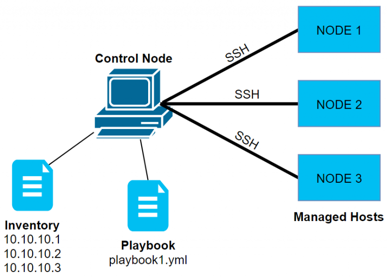

# Ansible Introduction

<figure><figcaption></figcaption></figure>

Ansible, BT ortamlarında sıkça yapılan tekrar eden işlemleri otomatikleştirmek amacıyla kullanılan güçlü ama öğrenmesi kolay bir otomasyon aracıdır. Bu tekrarlayan işlemler arasında:

* Sunucu/VM oluşturma (provisioning)
* Uygulama kurulumu ve konfigürasyonu
* Yüzlerce sunucu üzerinde yama yükleme (patching)
* Migrasyonlar (taşımalar) veya dağıtımlar (deployments)

gibi birçok tipik görev bulunur. Ansible, bu görevlerinizi basit ve anlaşılır tanımlarla (Playbook’lar) merkezî bir yerden otomatikleştirmenize olanak sağlar. Aşağıda, **Ansible**’ın önemini ve nasıl çalıştığını kısaca özetleyelim:

#### 1. Neden Ansible?

1. **Tekrarlayan Görevleri Kolaylaştırma**\
   Geleneksel yöntemlerle, birden fazla sunucuda benzer değişiklikleri yapmak için script yazmanız veya manuel olarak yüzlerce komut girmeniz gerekebilir. Bu oldukça zaman alıcı, hata riski yüksek ve yönetimi zor bir iştir. Ansible ile bu tür rutin işleri **“playbook”** adı verilen basit YAML dosyalarıyla tanımlayabilir, sonra tek bir komutla yüzlerce/ binlerce makineye aynı işlemleri uygulayabilirsiniz.
2. **Kolay Öğrenme ve Basit Söz Dizimi**\
   Ansible, öğrenmesi görece kolay bir araçtır. Bunun nedeni:
   * **YAML** gibi kolay okunup yazılabilen bir söz dizimi kullanması
   * Önceden yazılmış yüzlerce modül (ör. paket kurulum, dosya yönetimi, servis yönetimi vb.) ile gelmesi
3. **Kod Yazma Zorunluluğunu Azaltma**\
   Klasik otomasyon senaryolarında (örneğin Bash, Python, PowerShell script’leri) uzun ve karmaşık script’ler hazırlamak gerekir. Ansible ile aynı işi yapmak için çoğu zaman birkaç satırlık YAML tanımlaması yeterli olur.
4. **Ölçek ve Esneklik**
   * İster tek bir makinede, ister yüzlerce sunucuda çalıştırın
   * İster bulut (AWS, Azure), ister şirket içi (VMware gibi) ortamlarda kullanın
   * Aynı playbook’u ufak değişikliklerle farklı ortamlar (test, prod, DR vb.) için yeniden kullanın

#### 2. Ansible Nasıl Çalışır?

1. **Merkezi Kontrol (Control Node)**\
   Ansible’ı çalıştırdığınız ana makineye “Control Node” (kontrol düğümü) denir. Bu makineden, yönetmek istediğiniz tüm hedef sistemlere (örneğin 10 tane web sunucusu + 5 tane veritabanı sunucusu) bağlanır ve komutlarınızı (playbook’larınızı) uygular.
2. **Agent’siz Yapı**\
   Birçok başka otomasyon aracının aksine Ansible, hedef sunucularda (managed node) ayrı bir “agent” kurulumuna gerek duymaz. Bağlantılar çoğunlukla SSH üzerinden kurulur (Windows ortamlarında WinRM kullanılır). Bu sayede ek yazılım yüklemeye gerek kalmaz.
3. **Modüler Mimari**\
   Ansible, farklı işlevler için yazılmış “modüller” kullanır. Örneğin bir paketi kurmak için `package` modülünü, bir servisi yönetmek için `service` modülünü, bir dosyayı kopyalamak için `copy` modülünü kullanırsınız. Bu modüller zaten Ansible’ın içinde gelir ve geniş bir yelpazede işletim sistemi görevlerini destekler.
4.  **YAML ve Playbook Mantığı**\
    Ansible’da yapılacak işler bir ya da birden fazla “play” içinde tanımlanır ve bunlar “playbook” adı verilen YAML dosyalarında saklanır. Örneğin:

    ```yaml
    - hosts: webservers
      tasks:
        - name: Nginx paketini kur
          apt:
            name: nginx
            state: present
    ```

    Yukarıdaki örnek, web sunucularına (hosts: webservers) bağlanıp “nginx” paketini kurar (Debian/Ubuntu ortamında apt modülünü kullanarak).

#### 3. Ansible ile Neler Yapılabilir?

1.  **Basit Bir Örnek: Sunucuları Kapatıp Açma Sırası**\
    Diyelim ki bir uygulamayı kapatıp açmanız gerekiyor ve sıralama şu olmalı:

    1. Web sunucular kapanacak
    2. Veritabanı sunucuları kapanacak
    3. Veritabanı sunucuları açılacak
    4. Web sunucular açılacak

    Bu işlemi her seferinde manuel yapmak yerine, Ansible’da bir playbook yazarak tek bir komutla tüm sıralamayı otomatikleştirebilirsiniz.
2. **Büyük Ortamların Kurulum ve Konfigürasyonu**
   * AWS, Azure gibi bulut ortamlarda aynı anda birçok VM oluşturabilir
   * VMware gibi şirket içi sanallaştırma altyapılarında yeni makineler kurabilir
   * Uygulamaları yükleyip yapılandırabilir (application deployment)
   * Güvenlik duvarı (firewall) kuralları, load balancer ayarları gibi ağ işlemlerini yapabilir
   * Sistemleri birbirine bağlamak için konfigürasyon dosyalarını güncelleyebilir
3.  **Dış Sistemlerle Entegrasyon**

    * CMDB (Configuration Management Database) gibi bir veritabanından sunucu listesini otomatik çekebilir
    * ServiceNow gibi bir ITSM (IT Service Management) aracıyla entegre olarak, bir onay süreci ardından otomasyonu tetikleyebilir


***

#### Play Kavramı:

**Play**, Ansible dünyasında bir _playbook_ içerisindeki temel çalışma birimidir.

* Bir **playbook**, bir veya birden fazla “play” içerebilir.
* Her “play”, hangi **hedef sunucu grubuna** (hosts) hangi **görevlerin (tasks)** hangi sırayla uygulanacağını tanımlar.

Örneğin, aşağıdaki gibi bir _playbook_’ta iki ayrı “play” vardır:

```yaml
- name: Web sunucularına Nginx kur
  hosts: webservers
  tasks:
    - name: Nginx paketini kur
      apt:
        name: nginx
        state: present

- name: Veritabanı sunucularını yapılandır
  hosts: dbservers
  tasks:
    - name: PostgreSQL kur
      apt:
        name: postgresql
        state: present
```

Bu örnekte:

* İlk “play”, `webservers` grubundaki sunuculara Nginx kurmayı hedefliyor.
* İkinci “play” ise `dbservers` grubuna PostgreSQL kurmayı hedefliyor.
