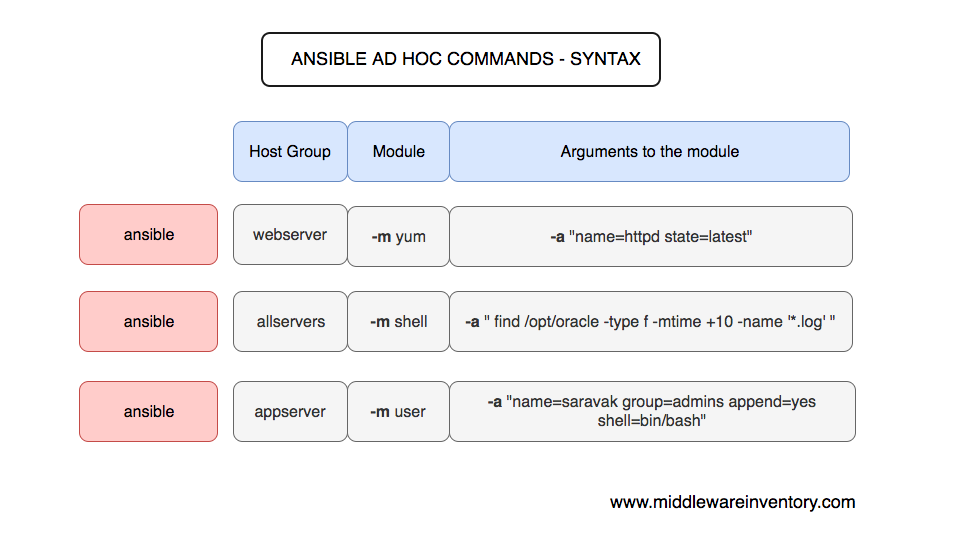

# ⚙ Komponentler

### Control Node


Ansible 'in yüklü olduğu herhangi bir sunucudur. Control node üzerinde, ansible playbook'ları, ya da ad-hoc komutlarını çalıştırabiliriz. Bir Windows cihazı, control node olarak kullanabiliriz. Birden fazla Control node olabilir.

### Manage Node

Ansible ile yönettiğimiz sunucu(lar) ağı. Manage node'lara host ismi verebiliriz. Windows cihazı manage node olarak kullanabiliriz. Ansible manage node'lara kurulmuş olması gerekmez.

### Inventory

```
# /etc/ansible/hosts

mail.example.com

[webservers]
foo.example.com
bar.example.com

[dbservers]
one.example.com
two.example.com
three.example.com
```

```
# /etc/ansible/hosts

all:
  hosts:
    mail.example.com:
  children:
    webservers:
      hosts:
        foo.example.com:
        bar.example.com:
    dbservers:
      hosts:
        one.example.com:
        two.example.com:
        three.example.com:
```

Manage node'ların listelendiği envanterdir. Aslında inventory dediğimiz şey bir <mark style="color:red;">dosyadır.</mark>  Manage node bilgileri, isimleri, IP adresleri, Connection modu, Connection user 'ı, Connection şifresi gibi spesifik bilgiler inventory dosyası içerisinde bulunabilir. Node'ları istersek tek tek, istersek grup halinde ekleyip düzenleyebiliriz.

### Modules

Ansible 'ın çalıştırdığı kod birimleri, asıl işi yapan komponentlerdir. Her modül belirli bir kullanıma sahiptir. Örneğin, database kullanıcılarını yönetebiliriz, network ayarları yapabiliriz. Bir task ile single modül çağırabiliriz. Yada birden fazla modülü bir araya getirip taskları yada playbookları çağırabiliriz.



### Task


Ansible 'da yürütülen görevlerdir. Bu tasklar içerisinde yapılması istenilen işler vardır. Ansible 'da her task için, bir modül yer alabilir. Yani bir task bir modül çalıştırabilir. ad-hoc ile de, single task çalıştırarak modülü çalıştırabiliriz.

### Ad-Hoc




Manage node'larda, bir taskı çalıştırmak için kullandığımız komutlardır.

### Playbook


Bir veya birden fazla task 'ın, sıralanmış listeli hali diyebiliriz. Bunları yaml dosyalarına yazarız. Playbook 'lar, yazılan tüm taskları çalıştırmak ile yükümlüdür. Playbook'lar çalıştırılırken, bir task için hata aldığında, playbook'ların çalışması sona erer. Hatanın düzeltilmesi gerekir. Düzeltildikten sonra playbook 'un tekrar çalıştırılması gerekir. Modüller'den, task'ları, task'lardan play'leri, play'lerden, playbook'lar oluşur.

### Collection & Role



Plugin, modülleri, rolleri, ve playbook'ları, içeren ansible contentleri için içerik ağı oluşturmak için kullanılır.

{% embed url="https://www.youtube.com/watch?ab_channel=edureka%21&index=1&list=LL&v=Or6k2UcKeN4" %}
