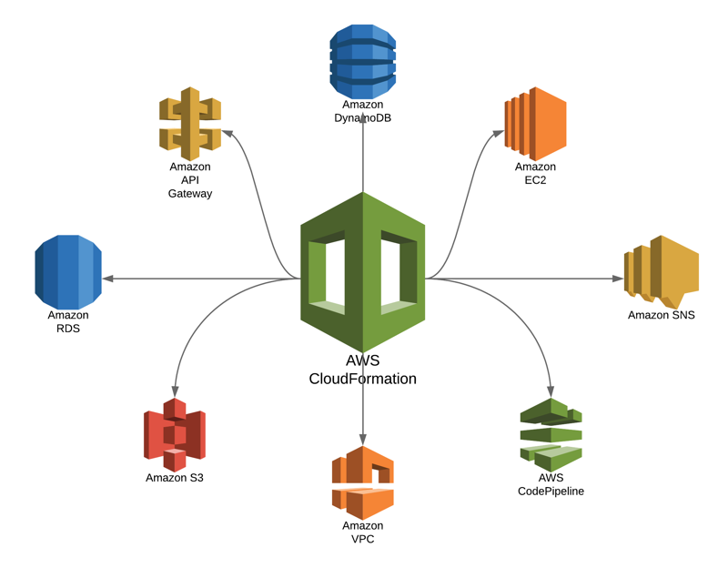

# 📃 CloudFormation

Kurmak istediğimiz alt yapıyı adım adım kurulum aşamaları ve kurmak istediğimiz servisler şeklinde yazabileceğimiz bir template dosyası yaratmamıza imkan sağlıyor. Daha sonrasında, template dosyasında belirlediğimiz servisi tek bir tıklama ile kurmamızı sağlıyor.

Cloudformation temel de 2 ana bölüme sahip,

Template : JSON/YAML formatında template 'ler oluşturabiliriz. Misal, x isimli bir sec-group yarat 80 portunu dışarıya aç. Ve ya, 1 adet t2micro sunucu yarat şeklinde template oluşturabiliriz. Daha sonra bu template dosyasını, cloudfront 'a aktarıp bana bu template 'den adımları takip ederek bir stack yarat diyebiliyoruz.

Stack : Template ile yaratılmasını istediğimiz yapıdır. Örneğin template 'de bir sanal sunucu daha ekle şeklinde güncelleme yaptığımız zamani bunu güncelle komutu vererek, mevcut yapıya bir sunucu eklenmesini sağlayabiliyoruz. Ayrıca stack 'e sil komutu verdiğimiz zaman yapı silinebiliyor.

#### Örnek Bir Template dosyası içerisinde,

Template 4 farklı alt kısım içerir. Ayrıca 8 alt kısımdan oluşabilir.

* Version : Template versiyon numarası atayarak, gelişimini takip etmemize ve birden fazla versiyon yaratmamıza imkan sağlıyor.
* Description : Template ile ilgili bir açıklama girmek istediğimiz zaman kullanılır. Örneğin bu template neden oluşturuldu, amacı nedir ve sonucunda ne olacak tarzı yazılı bir açıklama girilmesi sonradan takip etmek açısından çok mantıklı olacaktır.
* Metadata : Template'in temel özelliklerini ve template hakkında ek bilgiler tutabiliriz. Örn: aws: cloudformation:  Designer attribute ile bu template kim oluşturuldu bilgisi tutulabilir.
* Parameters : Yaratılacak kaynaklar ile ilgili seçilmesi gereken seçenekleri, bu kısımda belirtiyoruz. Misal, ec2 sunucu yaratan bir template'e parameters kısmında key-pair seçimi parametresini girersek, daha sonra bu template'den yaratılacak bir stack'in yaratım aşamasında kullanıcıya hangi key-pair kullanmak istediğini soracak ve kullanıcının girdiği değer o sanal sunucu yaratılırken kullanılacak.
* Mappings : Yaratılan kaynakların diğer AWS kaynakları ve özellikleri ile eşleştirilmesini sağlayabiliriz. Misal, kullanıcıya hangi sunucu yaratmak istediğini sorduğumuz zaman onun seçtiği sanal sunucu türüne göre hangi AMI kullanılacağı bilgisini Mappings kısmında belirleyebiliriz.
* Conditions : Şartlar bu kısımda belirlenir. Eğer, şu seçildiyse bunu yap. Ama seçilmediyse, şunu yap şeklinde koşullayabiliriz.
* Outputs : Stack yaratımı sunucuda kullanıcıya geri bildirmek istediğimiz bilgileri bu kısımda bildiriyoruz. Örneğin yaratılan EC2 sunucu IP adresi bilgilerini ekranda kullanıcıya göstermek istersek bunu outputs kısmında seçmemiz gerekir.
* Resources : Her template 'de mutlaka bulunması şart olan tek alandır. Template ile yaratılmasını istediğimiz kaynakları belirtiyoruz.

#### Stack oluşturmak,

* Create a stack : Template 'den stack yarat.
* Create stack set : Birden fazla account ve region'a kurabildiğimiz türü.
* Desing a template : Gui arayüzünden template oluşturabiliriz.
* Create template from your resources : Mevcut kaynağımızı template haline çevirebiliriz.

İstersek template dosyasında her şeyi belirleriz. Stack yaratan kişi hiç bir şey seçmez, ya da bazı şeyleri son kullanıcıya sorarız. Örn, kaç ec2 sunucu olsun vb. Parameters kısmında bu tür soruları sorabiliyoruz. Kaç sunucu, vpc hangisi olacak vb..

* Create new stack : Yeni bir stack yaratıyoruz. örnek bir aws template bulup deneyebiliriz.
* Stack Name : ilk-stack
* Options : Kaynaklara tag girebiliriz.
* Permissions : Cloudform stack yaratırken yetkili olmasını istediğimiz IAM role varsa bu rolü atayabiliyoruz.&#x20;
* Rollback Triggers : Buraya 90 yazıp, ARN kısmına cloudwatch 'dan eğer yarattıysak, X bir alarmın ARN bilgisini giriyoruz. Bu da stack yaratılırken o alarm tetiklenirse stack oluşturmayı durdur. 90 dakika boyunca alarmı gözleyecek.

#### Advanced,

* Notification : Stack yaratılınca bildirim atmak istiyor muyuz? SNS olarak gönderebilir. Önceden oluşturulmuş bir alarm varsa seçebiliriz. Topic ARN girebiliriz.
* Termination Protection : Stack silinebilir durumda olsun mu?
* Timeout : Bu stack buraya yazdığımız süre boyunca oluşturulmazsa, oluşturulan kaynakları sil. Örneğin, bazı parametreler yanlış girilmiş olabilir. O ana kadar oluşturulan kaynakları sil.
* Rollback on failure : Stack yaratılırken, bir sorun olduğunda cloudformation bir sonraki adım ile devam etmesini ister miyiz? Örneğin 10 sunucu kurulmasını istediğimizde, 6.sunucuda, hata verdi. Cloudformation 7 sunucuya geçsin mi? Yoksa tüm işlemleri alıp her şeyin silinmesini mi isteriz?&#x20;
* Stack Policy : Stack yaratıldıktan sonra kimin, ne işlem yapıp, yapamayacağını burada belirleriz. (Bu stack ile ilgili)
* Next

Stack yaratıldıktan sonra, kaynak template üzerinde bir değişiklik yapıp, (misal bir sec-group daha yarat ve ya bir sunucu kur) gibi güncellemeleri stack üzerine çift tıklayıp update stack diyerek, güncel template dosyasını gösterirsek, güncelleyebiliriz.
