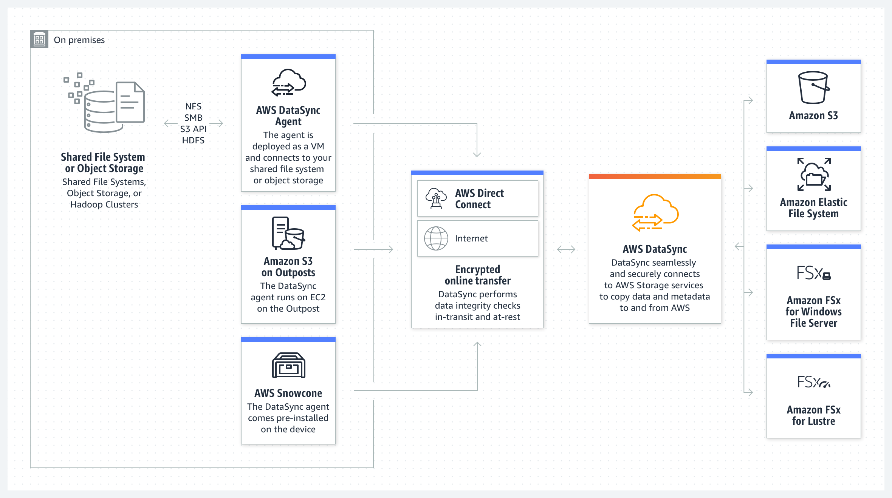

# 📀 DataSync

Kendi lokasyonumuzda bulunan verimizi AWS 'e veya AWS 'de bulunan verimizi kendi lokasyonumuza aktarmamızı sağlıyor. Misal, Lokal NFS sunucumuzdan S3 'e veri aktarımı.

Datasync, aslında bir agent. Bizler bu agent 'ı indirip kendi lokasyonumuzda bulunan sunuculara kuruyoruz veya EC2 sunucularımıza kuruyoruz. Daha sonra aktarılması gereken datayı belirtiyoruz. Misal biz bu datayı S3 'e göndermek istiyoruz. Bunun için kurallar(task) oluşturabiliriz Böylelikle agent aktarılacak veri alınır ve AWS tarafına senkron olur.

* Script ve kontrol etmemize gerek yok. (AWS kontrol ediyor)
* Hızlı aktarım.
* Servis ücretsiz, dosya boyutuna göre ücretlendirme yapılıyor.

#### Uygulama,

* Datasync agent sunucuna X 'IP adresine gidip, A dizinini al diyebiliyoruz.
* Hem ilk tam kopyasını, hem de değişen veriyi alır.
* Service Endpoint
* Public service endpoint : İnternet üzerinden veri aktarımı yapar. (Veri güvende, şifrelenmiş)
* VPC endpoint : AWS ile lokalimiz arasında direct connect vb gibi bağlantımız varsa tercih edilebilir. (İnternete çıkmadan)
* Agent Address : Agent 'da oluşturduğumuz aktivasyon keyi giriyoruz.
* Task : Verileri agent'dan al. Örn, S3 'e yaz. gibi görevler oluşturabiliyoruz.

