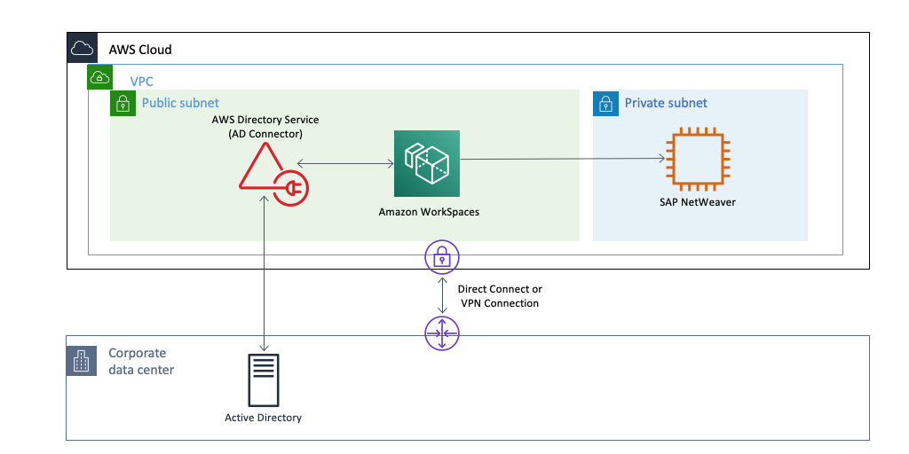

# 📂 Directory Service

Popüler AD hizmetleri desteği mevcuttur. Samba (Linux) - Active Directory (Windows)

Alt yapı tamamen AWS tarafından yönetiliyor. AWS 4 farklı hizmet sunuyor.

* AWS Microsoft AD : Bu hizmet ile AWS ortamımızda bir Microsoft Active Directory yaratmamıza imkan tanıyor. Standart ve enterprise olarak 2 sürümü vardır.
  * Standart : Orta ölçekli işletmeler. 30k obje.
  * Enterprise : Büyük ölçekli işletmeler. 500k obje.
* Her 2 sürüm çift AD ile gelmektedir. Otomatik yedekleme gibi tüm yönetilen servislere sahip olmaktadır.
* 2 DC yanına dilersek ek ADC ekleyebiliriz. Microsoft AD özelliklerine sahip. Kurulum yaparken çalışmasını istediğimiz VPC'yi seçiyoruz kurulum 2 temel DC farklı AZ üzerinde yaratılıyor. Daha sonra direct connect ve ya VPN kullanarak bu VPC yi kendi şirket ağımıza bağlanarak buradaki sistemlerin oluşturduğumuz dizin hizmeti ile konuşmasını sağlayabiliriz.

<table><thead><tr><th width="272">AWS Managed Microsoft AD</th><th width="442.0491092922484">AD Connector</th></tr></thead><tbody><tr><td>Std-Ent sürümleri mevcut.</td><td>AD Proxy hizmeti.</td></tr><tr><td>STD 30 B obje, ENT 500k obje limitli.</td><td>Small ve large 2 seçenek olarak mevcut. Small  500 kullanıcıya, Large 500 kullanıcıya, large  5000 kullanıcıya kadar uygundur.</td></tr><tr><td>Trust oluşturma özellikleri dahil, tüm ad özellikleri mevcut.</td><td>Mevcut on-prem Active Directory kurulumu  VPC içerisinde genişletme imkanı tanıyor.</td></tr><tr><td>Kurulu bulunan region içerisinde 2 ayrı AZ'de birer DC ile geliyor. Ve Ek olarak DC eklenebiliyor.</td><td></td></tr></tbody></table>

AD Connector : Bulut da her hangi bir bilgiyi ön belleğe almadan mevcut microsoft AD 'mize dizin isteklerini yeniden yönlendirmek için kullanılan proxy'dir.  Yani zaten bir AD hizmetimiz varsa, ve bizim amacımız VPC içerisinde kaynaklara, kaynaklarında bu dizin hizmetine ulaşmasını sağlamak ise boş yere konfigürasyon ile uğraşmak yerine, bir sürü ayarlama ile VPC içerisinde mevcut AD'nin uzantısı olacak bir ek DC kurmak yerine. AWS bize bu hizmeti sunuyor. Bu hizmet sayesinde VPC'mizde bulunan tüm kaynaklar her hangi bir dizin sorgusu yaptığında bunu kendi lokasyonumuzda kurduğumuz//var olan Active Directory'e yönlendirebiliriz.

Simple AD: Yönetilen Linux Samba4 hizmetidir. Small ve Large olarak 2 hizmeti mevcut. Small 2k objeye Large 20k obje desteği sunar. Trust vb. gelişmiş AD özelliklerini desteklemez.

Amazon Cognito Your user Pools : AWS de cognito bir kullanıcı dizinidir. Bir kullanıcı havuzuyla kullanıcılarımız web ve ya mobil uygulamamızda Amazon Cognito kullanarak oturum açar. Uygulamalara kullanıcı kaydı ve oturum açma özellikleri eklememize imkan tanır. Kullanıcı havuzdan SAML kimlik sağlayıcıları ile birlikte Facebook,Google,Amazon ile giriş yapma imkanı verir.

Cognito, Bir uygulama yazdığınızı düşünün. (mobil ve ya web) uygulamayı kullanan kullanıcıların kayıt olmasını istiyoruz. Ve bir form yarattık. isim,soyisim vb bilgileri istiyoruz. Cognito servisi ile bu bilgileri saklayarak daha sonra uygulamamızda kullanabilecek temel bir dizin hizmeti yaratabiliyoruz. Cognito uygularımıza kullanıcı kaydı, oturum açma özellikleri ekleyebiliyor. Kullanıcılar sosyal medya hesapları ile oturum açma zorunlulukları kalmıyor.

AWS Cloud Directory, Diğer dizin hizmetlerinden biraz farklı. Şirket çalışan bilgisini ve organizasyon şeması tutmak için bir dizin yaratmamız gerekiyor.  Yani bizim bir yerde objeler yaratıp aynı zamanda da o yarattığımız  yerde bu objeler arasında ilişkilere ait verileri de saklamamız gerekiyor. Normal de bu işler için veritabanı kullanabiliyoruz fakat AWS sırf bu iş için özelleştirilmiş bir dizin hizmeti sunuyor. Örn, IOT cihazları, o cihazların yer bilgisi ile o cihaza bağlı sensörlerin bir hiyerarşi halinde tutmak istersek bu servis çok işimize yarıyor.  Bir geliştirici olarak uygulamamız içerisinden erişmek için hiyerarşik veri tutabileceğimiz bir dizin hizmetidir.
