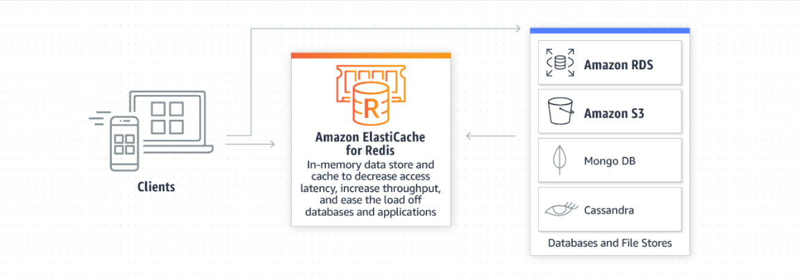

# 🏢 ElastiCache

* DB'den aldığı cevapları, cache de tutup cevaplar.
* Kullanıcı oturum bilgilerini saklayabiliriz ( Sessions )
* AWS 'nin in-memory-caching servisidir.
* En popüler 2 in-memory-caching servisi olan, memcache ve redis desteğine sahiptir.
* Tamamen yönetilen servis.

#### Memcache

* Sadece string data tipinde veri tutabiliyor.
* Basit ve hızlı in-memory-cache ihtiyaçlarını karşılamak içindir.
* Multi thread yapısı sayesinde dikey genişlemeye imkan tanır.

#### Redis

* String dışında list,dizin, veri tiplerini de barındırabiliyor.
* Konteks in-memory-cache ihtiyaçlarını karşılamak içindir.
* Single thread yapısı sayesinde yatay genişlmeye imkan tanır.
* Multi AZ / master-slave yapıları kurulabilir.

#### ElastiCache Yapılandırma,

* Services > Elaticache > Get started now
* Cluster engine > Redis - Memcache
* Name : Elaticache 'e vereceğimiz bir isim.
* Engine version comp : Engine sürüm seçebiliriz.
* Port : Default port kalabilir.
* Parameter Group : Default
* Node Type : Node kaynaklarını değiştirebiliriz.
* Number of nodes : Kaç node olacağını seçebiliriz.
* Subnet Group : istersek yeni bir subnet oluşturabilir ve ya mevcut subnetleri kullanabiliriz.
* Maintanance Window : Bakım,patch, işlemlerinin ne zaman olabileceğini seçiyoruz.
* Create

Parameters Group, memcache için parametre değişikliği yapabiliriz.&#x20;

Configuration Endpoint, Node'lara bağlanıp konfigürasyon değişikliği yapabiliriz.

Node Endpoints,  Bağlanıp veri girip, veri tutmak için. Memcache  ve ya Redis 'e sec-group kuralları oluşturup, telnet ile veri oluşturabiliriz.

Böylelikle DB ile memcache-redis ayarlarımızı yapıp, iletişim kurmalarını sağlarsak, istekler memcache-redis e gelir. Memcache-Redis ilk isteği DB'ye sorup, aynı istek gelirse kullanıcıya ram'de sakladığı bilgi üzerinden döner.



