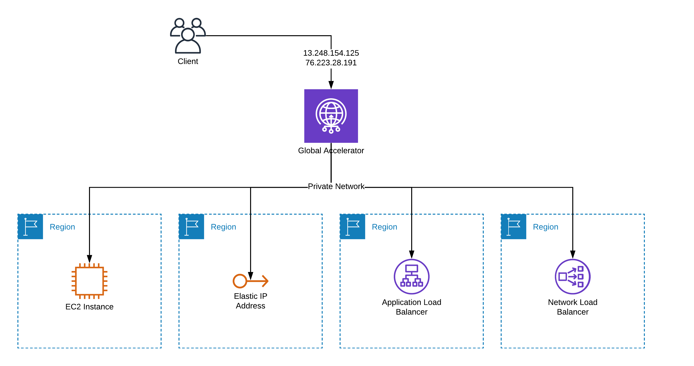

# 🌐 Global Accelerator

_Global Accelerator bize ölçeklendirme ve performans sağlar. Misal bir uygulamamız var ve bu uygulamamız farklı regionlar içerisinde kopyalar halinde çalışmaktadır. Global Accelerator yapılandırırken, Global Accelerator servisinin hangi port 'u dinleyeceğini ve TCP/UDP mi olacağını seçiyoruz. Ardından uygulamamızın bulunduğu regionları seçiyoruz. Bir sonraki aşama da uygulama sunucularımızı veya ELB vb servisini target olarak belirtiyoruz(Uygulamamız nerede çalışıyorsa). Servis kurulumu ve yapılandırması tamamlandığında Global Accelerator bize 2 adet IP adresi iletmektedir. Bu IP adreslerini route53 içerisinde uygulamamızın A kaydına Multiple şekilde ekleyebiliriz. Böylelikle AWS bir region da sorun olsa bile, diğer region üzerinden uygulamamız çalışmaya devam edecektir._

* _Global Accelerator üzerinde bulunan IP adreslerine gelen istekleri alır ve Global Accelerator yapılandırması içerisinde, o istek veya kullanıcı nereye gitmesi gerekiyorsa, oraya yönlendirir._
* _Birden fazla region olabilir. Kendi veri merkezimiz olabilir. AWS 'nin çeşitli regionlarında çalışan servisler olabilir. Bunların hepsi için bir giriş noktası oluşturuyoruz._

Misal, _Global Accelerator kullanan bir uygulamamız var ve kullanıcılarımız uygulamaya Global Accelerator üzerinden gelmektedir. Global Accelerator arkasında Frankfurt ve İrlanda region 'u olduğunu düşünelim. Kullanıcılar Global Accelerator 'a geliyor, hangi region o kullanıcıya yakın ise, Global Accelerator kullanıcıyı yakın olduğu region 'a yönlendiriyor. Frankfurt 'da çalışma yapıyorsak, Global Accelerator 'a butün kullanıcıları İrlanda 'ya gönder diyebiliriz._&#x20;

_Global Accelerator DNS tabanlı değil. IP tabanlıdır. Yüksek trafik alan siteler için uygundur. Global Accelerator sayesinde LB hizmeti gibi yük dağıtımı yapabiliyoruz. Örneğin, X region 'da A sunucusuna git vb._


