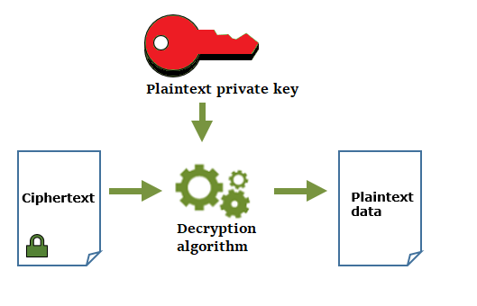

# 🔑 KMS

Encryption : Bir veriyi sadece yetkili kişilerin anlayabileceği deşifre edebileceği şekilde orjinal halinden farklı bir hale getirme işlemine denir.

Decryption : Şifrelenen verinin yetkili kişiler tarafından şifresinin açılması. Deşifre ederken kullandığımız yönteme key diyoruz.&#x20;

Bilgisayar sistemleri encryption işlemlerini 2 farklı şekilde sağlıyorlar.

* Symmetric : Encryption ve Decryption işlemleri için tek anahtar kullanır. Oldukça hızlıdır. Taraflar arasında  key değişimi sırasında key açığa çıkabilir. Göreceli olarak daha güvensiz.
* Asymmetric : Encryption ve Decryption işlemleri için çift anahtar kullanır. Public ve Private key. Symmetric 'e göre daha yavaş. Key exhange işlemleri de güvence altındadır.

AWS çoğu veri barındırma servisinde bize şifreleme imkanını sunuyor.

KMS : Anahtar oluşturmamızı, yönetmemizi ve çok çeşitli AWS hizmetleri ve Uygulamalarımızda şifreleme kullanımı kontrol etmemizi sağlayan servistir. AWS tarafından yaratılan ve var olan kullanılan anahtarları yönetmemizi hem de tamamen kendimizin yaratabileceği mevcut anahtarlarımızı aktarıp, onların saklayıp kullanabileceğimiz bir ortam sunmaktadır.&#x20;

AWS KMS anahtarlarımızı korumak için FIPS-140-2 onaylı donanım güvenlik modülünü kullanıyor. AWS KMS düzenleme ve uyumluluk gereksinimi karşılamak ve yardımcı olmak için tüm anahtar kullanım günlüklerini bize sunmak için AWS CloudTrail ile entegre etmiştir.

#### KMS Paneli,

AWS Managed Key, AWS tarafından yaratılan tamamen AWS tarafından yönetilen anahtarlar.

Customer Managed Keys, Kendimiz anahtarlar yaratabiliriz ve anahtarlarımızı kendimiz yönetebiliriz.

Custom Key Store, Güvenliği bir adım daha ileriye götürmek istiyorsak, CloudHSM cluster kurarak bize dedike bir hardware modül oluşturuluyor. Böylelikle yarattığımız keyleri burada tutabiliyoruz.

#### Örnek bir key yaratma aşaması,

* Create key
* Alias : ilkkey
* Advanced Options : Anahtarın nasıl yaratılacağını sormaktadır.
  * KMS : KMS üzerinde yaratılır.
  * External : Var olan anahtarlarımızı buraya upload edebiliriz.
  * Custom Key Store : HSM cluster 'mız varsa anahtarı oradan yaratılmasını söyleyebiliriz.
* KMS seçiyoruz. Dilersek TAG girebiliriz.
* Key Administrators : Hangi kullanıcılar bu keyleri yönetebilsin?
* This Account : Bu anahtarı kim kullanabilecek?

Json dosyası halinde bizim için anahtar yaratılabilecek.

Misal, EC2 EBS üzerinde bir volume yaratalım. Encryption kısmında oluşturduğumuz keyi seçebiliriz. Böylelikle diskimizi oluşturabildik ve bu diski bir sunucuya attach edebiliriz. Normal bir şekilde kullanabiliriz. Bu diske yazılan veriler şifrelenmiş olarak yazılacaktır. Bu şifrelenmiş disk şifrelediğimiz için normal bir şekilde kullanabiliriz. Birileri bizim verimizi alırsa onlarda (bizde bulunan) anahtar olmadığı için diski okuyamayacak ve yazamayacaktır.
