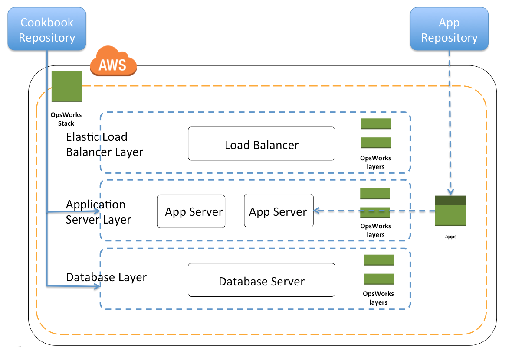
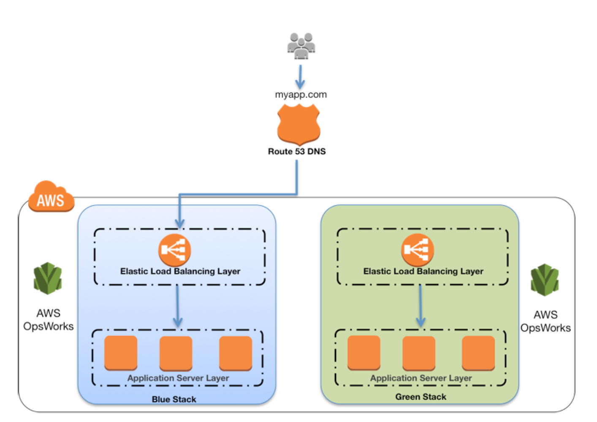

# 👩🏭 OpsWork

Manuel işlemleri otomatize eder. Alt yapı yönetimini kod haline getirir (infra as code) Sistemi belirtilen durumda tutar.

Conf management araçları sunucu yapılandırması/servis yapılandırma'yı tek bir merkezden, yapılmasına imkan tanır.  Sonrasında sunucuların bizim belirlediğimiz ayarlarla çalışmasını garanti altına alır. Öncelikle ortamda tüm ayarları yönettiğimiz, conf management yönetim sunucusu yer almaktadır. Daha sonra bu sunucunun (Agent) dediğimiz, yazılımını yönetmek istediğimiz sunuculara kuruyoruz.  Ve sunucuları ana konfigürasyon sunucusuyla konuşur hale getiriyoruz. Sonrasında ana sunucuda çeşitli template'ler (Reçete)ler oluşturuyoruz. Örneğin Frontend diye bir reçete yazıyor ve bu reçete içerisinde frontend sunucularımız da olmasını istediğimiz servisleri vb kod halinde belirtiyoruz. Örneğin Nginx kur, xyz ayarlarını yap vb. Ve reçeteyi hazırlayıp sunuculara gönderiyoruz.&#x20;

İstenilmeyen (Reçete de olmayan) servis manuel olarak başlatılırsa, ana sunucu tekrardan bu durumu reçeteye göre ayarlar.&#x20;


Chef ve puppet günümüzde bu işi yapan servislerdir.


Opswork, chef ve puppet'ın yönetilen örneklerini sağlayan bir yönetim hizmetidir. Chef ve puppet sunucuların konfigürasyonlarını ayarlamamıza izin veren araçlardır. (kod kullanarak servis yönetimi yapmamızı sağlar) Opswork Amazon EC2 ve kendi veri merkezimizde barınan sunucular için, nasıl yapılandırıldığını, dağıtıldığını, yönetildiğini otomatikleştirmek için chef ve puppet 'i kullanmamızı sağlar. Opswork gücünü chef 'den alarak, tamamen yönetilen AWS servisidir. Yük dengeleme,db gibi farklı katmanları içeren bir yığın olarak modelleyebiliriz. Her katmanda EC2 sunucuları hazırlayabilir otomatik olarak ölçeklendirmeyi etkinleştirebiliriz. Örnekleri chefsolo kullanarak chef tarifleriyle yapılandırabiliriz.
