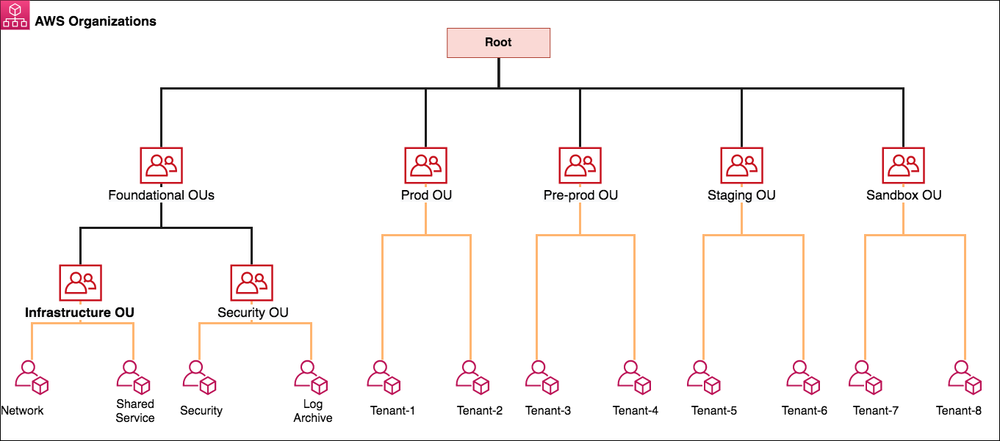

# 🏠 Organizations

Birden fazla AWS hesabını yönetmek için, politikalar oluşturmayı kolaylaştıran bir servistir. Hesap grupları oluşturmak için kullanılır. Gruplara policy ekleyebiliriz. Hesap yaratma ve silme işlemlerini otomatikleştirir. Servis control policies dediğimiz policy 'ler yaratarak AWS hesapları üzerinde yapılabilecek işlemlerin kısıtlanabilmesine imkan tanır.  OU 'lar (GRUPLAR) tanımlayarak benzer yetki seviyesindeki hesaplar bir araya toplanır. Consolidated biling özelliği devreye alma imkanı tanır. Tüm hesaplara tek fatura özelliği, EC2 gibi bazı servislerde toplu indirim sağlar.

#### Uygulama,

* Create Organizations
* Organizations eklendi.
* Diğer AWS hesaplarımıza invite gönderebiliriz.&#x20;
* Organize Account : Gruplar (OU) yaratabilir, hesapları bu gruplara ekleyebiliriz.
* Policies : Gruplara policy oluşturup, atayabiliriz. Root dizinine gelip services control policies devreye alıyoruz. İlgili ou ya gelip, yarattığımız policy sağ ekrandan attach ediyoruz. Böylelikle policy atadığımız gruplara bağlı olan kullanıcılar policy 'de atadığımız kurallara göre servislere erişebilir.  Condition sayesinde policy'leri saat bazında vb. bir çok seçeneklerle özelleştirebiliriz.
