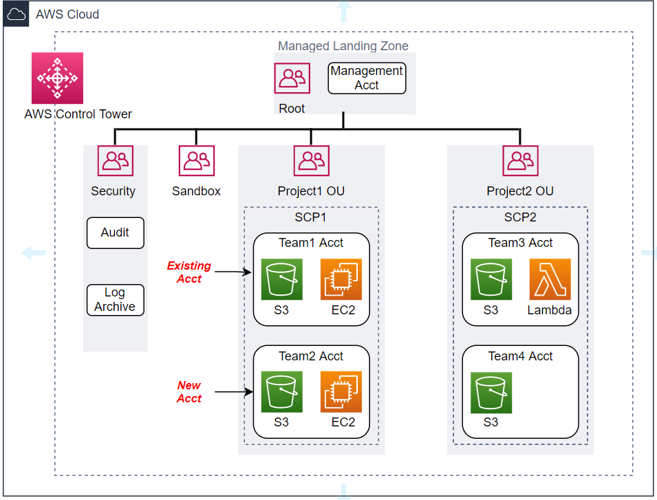

# 🗼 Others

### Control Tower

AWS Control Tower, AWS'deki çoklu hesap yapısından "ölçekli" yapıyı otomatikleştirir. AWS'ye geçiş yapan büyük şirketler için, farklı işletme işlevlerinin farklı erişim gereksinimleri, uyumluluk gereksinimleri vb. olacağından çoklu hesap mimarisine sahip olmak mantıklıdır - bu işlevler hesaplar arasında kolayca ayrılabilir. AWS Control Tower ile yöneticiler, AWS Management Console'da tek bir tıklamayla yeni bir çok hesaplı ortam oluşturabilir. AWS Organizations, ortamınızı birden çok hesapta merkezi olarak yönetmenize olanak tanırken, AWS Control Tower, ortamınızı oluşturmak ve geniş ölçekte yönetmek için gereken adımların çoğunu otomatik hale getirir.

### EC2 Image Builder



İstediğimiz OS türünde sunucu AMI alıyor, bizim image builder ekranında seçtiğimiz servisleri yüklüyor ve testlerini yapıyor. Sunucu türünü seçip, bu AMI deploy edebiliyoruz. Böylelikle AMI oluşturup, istediğimiz regionlara bu AMI kopyalayarak, bu AMI kullanarak sunucu kurabiliriz.

### AWS IQ

AWS 'de tıkandığımız yerde uzmanlardan belirli bir ücret ve süre karşılığında destek alabiliyoruz.

### _Amplify Framework_

AWS Amplify, mobil (android, ios) ve web uygulamaları oluşturmak ve dağıtmak için Kitaplıklar, UI bileşenleri ve CLI arabirimlerinden oluşan JavaScript tabanlı bir geliştirme _aracıdır_. Bu hizmet, sunucusuz backend sahip statik web sitelerinin yanı sıra tek sayfalı uygulamaların oluşturulmasına, dağıtılmasına ve barındırılmasına yardımcı olur. Sunucusuz anlamda geliştiricilerin yalnızca uygulama kodu uygulamasına odaklanması gerekir ve sunucu düzenlemesi ve diğer kaynak yönetimi hakkında düşünmesine gerek yoktur, AWS veya diğer bulut satıcıları trafiğe vb. bakarak altyapıyı yönetmekten ve işletmekten sorumludur. Bu sunucusuz yapıyla, amplify kullanarak hem güvenli hem de ölçeklenebilir mobil ve web uygulamaları oluşturabiliriz.
