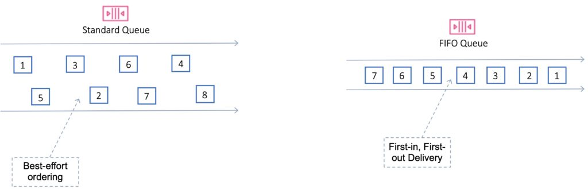

# 📬 SQS

Tamamen yönetilen mesaj kuyruk servisidir. İki tip SQS kuyruk tipi mevcuttur.

#### Standart

Saniye de sınırsıza yakın işlem kapasitesi, mesajın tek bir defa iletilmesi ve giriş çıkış sırası garanti değildir.

#### Fifo

Saniye de 300 mesaj kapasitesi, batch request ile bu 3000 mesaja kadar çıkabilir. Kuyruğa ilk giren mesaj işlenir. Mesajın tek seferde işleneceği garanti edilir.

#### SQS Oluşturmak,

* Queue Name : ilkSQS > Kuyruk tipi seç.&#x20;

#### Configure Queue

* Default visbilty Timeout : Servisin kuyruğu çekip, işlemin kuyrukta gizli bekletilmesi için belirtilen süre.
* Default Retention Period : Bir mesajın kuyrukta ne kadar zaman bekleyebileceğini belirtiyoruz. Bu süre boyunca, bu mesaj servisler tarafından çekilmezse mesaj silinir.
* Maximum Message Size : Bir mesajın maksimum boyutunu belirtiyoruz.
* Delivery Delay : Mesajın kuyruğa eklenip, ne kadar süre erişilemez olacağını belirtiyoruz.
* Receive Message Wait time : Bir isteğin kuyrukta ne kadar süre yeni bir mesaj bekleyeceğini belirtiyor. Servis mesaj çekmek için queue 'da ne kadar beklemelidir.
* Dead Letter Queue Settings : Bazı durumlarda mesajlar bir sebepten işlenemezse, Bu mesajların belirli bir deneme sayısı sonrasında incelemek üzere başka bir kuyruğa aktarılmasına imkan sağlar.
* Server Side Encryption (SSE) Settings : Kuyrukların şifrelenmesi için ayarlar yapılır.
* Create Queue

Text mesajı göndermek için "Actions" kısmından send a message kısmını seçebiliriz. SQS kullanımı genelde SDK'ler arayıcılığıyla bir programın içine gömdüğümüz kodlar ile yapılmaktadır. Daha sonrasında servis gelir bu mesajı çekip işler ve siler.
