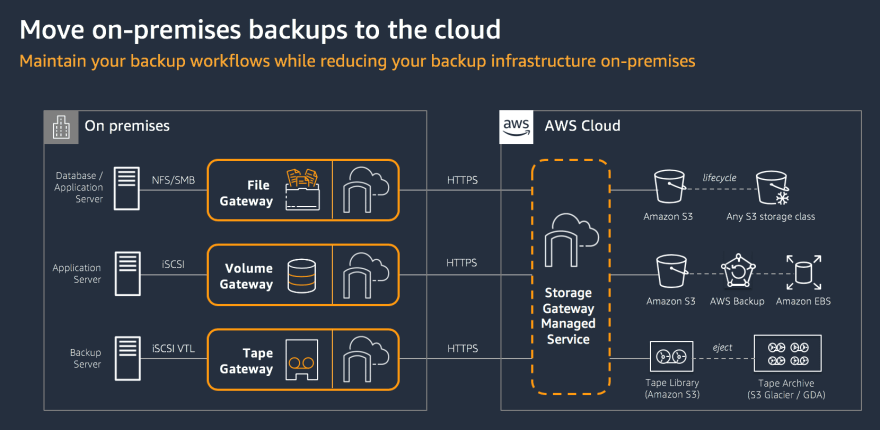

# 💾 Storage Gateway

* Kurum içi uygulamaları AWS bulut depolama alanını sorunsuz bir şekilde kullanmasını sağlayan bir karma depolama hizmetidir.
* Servisi yedekleme, arşivleme, felaket kurtarma, bulut veri işleme, depolama katmanları ve geçiş için kullanabilirsiniz.
* Servis, bant genişliği yönetimi otomatik ağ esnekliği ve etkin veri aktarımı ile birlikte, en etkin verilerinize düşük gecikme süresi içerisinde kurum içi erişim için yüksek öneme sahip veri aktarım mekanizması içerir.
* Uygulamalarımız, NFS, SMB, ISCSI, gibi standart depolama protokolü kullanarak bir sanal sunucu ve ya donanım ağ geçidi arayıcılığıyla servise bağlanır.
* Ağ geçidi S3,Glacier,EBS gibi AWS depolama hizmetlerine bağlanır. AWS 'de dosyalar birimler ve sanal bantlar için depolama sağlar.
* Servis bant genişliği yönetimi otomatik ağ esnekliği ve etkin veri aktarımı ile birlikte kurum içi yüksek erişim hızı sağlar.
* Verilerimize buluta sürekli aktarmamızı sağlar. Bu sayede bir felaket durumunda, mevcut ortamımızın bir benzerini buluta kurmamızı ya da buluttan mevcut ortamımıza yedeklerimizi dönmemizi sağlayan bir servistir.
* Storage GW içinde Storage-Gateway yazılımın kurulu olduğu bir sanal sunucu imajıdır.
* Bunu alıp ister, vmware esxi, Hyper V, AWS EC2 sanal sunucu olarak kurabiliyoruz.&#x20;

Storage Gateway altında 3 temel hizmet mevcuttur.

* File Gateway
* Volume Gateway
* Tape Gateway

#### File Gateway

Temel NFS hizmetidir. Veri merkezinde bulunan sunucu ve istemciler SMB ya da NFS vb protokolünü kullanarak burada oluşturduğumuz  paylaşılan klasörleri mount edebiliyoruz. Tüm veriler S3 servisinde tutuluyor. File Gateway hizmeti sık kullanılan dosyaları ön bellekleyerek hızlı erişimi sağlıyor.

