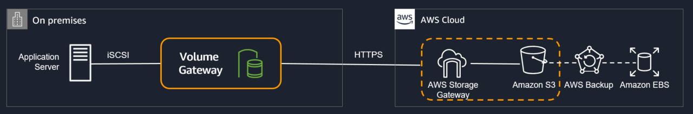

# 💽 Volume Gateway

#### Stored

* Volume GW on-prem sunucularımıza ISCSI olarak bağlayabileceğimiz blok base disk birimleri yaratmamızı sağlar.&#x20;
* Yaratılan stored volume'ler lokal veri merkezinde depolanır.&#x20;
* Her volume asenkron olarak AWS 'e EBS snapshot 'lar olarak gönderilir.
* Volume GW yarattığımız volume 'un belirlediğimiz aralıklarla bir snapshot 'ını yaratır ve sıkıştırma uygulayarak küçülttükten sonra bunu S3 e gönderir. Daha sonra periyodik olarak olarak incremental olarak büyümeye devam eder.&#x20;
* Storage GW başına toplamda 32 storaged volume yaratma imkanımız olur. Her volume 16TB kadar büyüklükte olabilir. Toplamda 522TB boyutunda Storaged volumes yaratabiliriz.

#### Cached

* Yaratılan cached volumeler AWS 'de depolanır.
* Volumeler lokal veri merkezinde hızlı erişim için önbelleklenir.
* Toplam da 32 Cache volume yaratabilme imkanımız vardır. Ve volume 32TB kadar büyüklükte olabilir. Topam 1 petabyte boyutunda cached volume gw yaratabiliriz.

