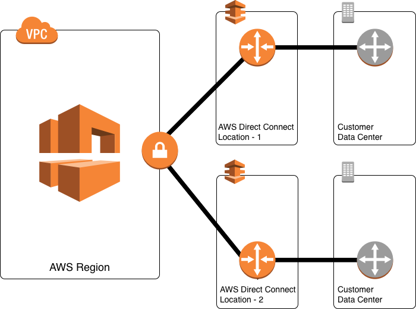

# 🔐 VPC

Kendi özel ağ alt yapımızı oluşturmamızı sağlayan, sanal ağ katmanıdır. Tamamen kullanıcıya özel ve paylaşımlı değil.&#x20;

Her AWS hesabında, her region da bir adet varsayılan VPC ile gelmektedir. Biz istersek her region için 5 tane daha VPC yaratabiliriz.  5 soft bir limittir. 5den fazla VPC ihtiyacımız olduğunda AWS den bunu talep edebiliriz.

Her VPC bizim önceden tanımladığımız IP aralığına sahip olur. Yani VPC içerisinde kullanabileceğimiz IP bloğu tanımlıyoruz.&#x20;

Örneğin 10.0.0.0/16lı bir blok ekleyip, bunları alt subnetlere ayırabiliyoruz.&#x20;

Subnetler public ve private olarak 2 çeşitle ayrılabiliyor.

Public : Dış dünyadan erişimin yapılacağı subnet.

Private : VPC içerisindeki sunucuların birbirine erişim yaparken kullanılır.

VPC altında tüm trafik yönlendirmesini "routing table" dediğimiz servisle yaparız.

Örnek olarak, X subnetinden Y subnetine ya da Z subnetinden internete nasıl gidileceğini ya da, hangi yolun kullanılacağını anlatan ayarlama (konfigürasyon) dosyaları arayıcılığıyla yapılır.

Tüm bu karmaşık yapının, güvenliğini sağlamak adına da, ağ alt yapısında hangi subnet'e, hangi trafik gidebilsin, ve ya hangi subnet'den hangi trafik dışarıya çıkabilsin gibi kuralları belirlediğimiz Network access list ya da network ACL ayarlamaları yapabiliyoruz.

Buna ek olarak VPC de oluşturduğumuz kaynaklara, direkt atayarak da bu kaynaklara ne tarz bir trafik erişimine izin verebileceğimizi belirlediğimiz EC2 kısmında da gördüğümüz SGlar yaratabiliyoruz.

Public subnetlerin internet erişimini sağlayan ve aynen evimizde bulunan internete girmemizi sağlayan modem,router larla aynı mantığa sahip olan, internet gateway hizmetini de VPC altında kullanabiliyoruz.

Bunun yanı sıra kendi şirket ağ altyapısı ile bu VPC arasındaki direkt bir bağlantı olacak olan VPN   bağlantısını sonlandırmak için VPN gateway tanımı yapılabiliyor.

S3 ya da dynomoDB gibi diğer AWS servislerine bu vpc'den direkt ulaşmak adına private endpoint linkleri yaratabiliyoruz. Ayrıca hem kendi hesabımızda bulunan diğer VPC'ler, hem başka hesapta bulunan VPCler ile pear dediğimiz ayarlamalar yaparak bu VPCler arasında direkt bağlantı kurulabiliyor. Ve bu VPClerde bulunan kaynakların birbirine erişebilmelerini sağlayabiliyoruz.

Internet Gateway, Dış dünyaya çıkış ve dış dünyadan gelişi sağlar.

Nat Gateway, Private subnetlerde bulunan sunucular internete çıkması için kullanılacak. Public subnetlerin birinde bulunması gerekmektedir.

Private subnet'de bulunan sunucularımızın S3 servisi gibi servislerle iletişime geçebilmesi için bir private link oluşturmalıyız.

#### VPC Oluştururken,

* VPC konsoluna girip, create diyoruz. IP bloğu ne olacaksa onu giriyoruz.
* IPv6 istiyorsak VPC oluştururken seçiyoruz.

Her region'da default bir VPC bulunur.

İlk VPC yaratıldıktan sonra VPC'ye tıklayıp actions kısmından DNS hostname açmamız gerekiyor. Bunu seçmezsek VPC altında bulunan sunucular VPC DNS'i üzerinden haberleşemez.

Route tables, her VPC yaratıldığında otomatik olarak bir route table oluşur. Route table VPCnin nereye nasıl erişeceğini belirlediğimiz kısımdır.

Internet Gateway, İnternet gw oluşturup, yapımızı internete çıkarmalıyız. oluşturup, üzerine çift tıklayıp VPCmize mount ediyoruz. Böylelikle dışarıdan da kaynaklarımıza erişim olacak.

Route table, 0.0.0.0/0 a giderken internet gw kullan diyerek. İnternet çıkışımız aktif oluyor.

Subnets kısmından yeni bir subnet yaratabiliriz.

* Create subnet
* İsim giriyoruz.
* Yeni yarattığımız VPCyi seçiyoruz.
* Hangi AZ olacağını seçiyoruz. Hangi blokta olacaksa bunu seçiyoruz.

Private subnetler için yeni bir route table yaratıyoruz.  subnet associations kısmından edit diyerek private bloklarımızı seçiyoruz private ve public ayrımını bu şekilde yapıyoruz. Subnets kısmına gelip, public subnetleri tek tek seçip, Actions kısmından Auto-assingn IP setting enable diyoruz. Ve böylelikle public subnetlere otomatik olarak public IP adresi tanımlanacak.

Dış dünyadan içeride private subnet' de bulunan sunuculara erişmek istersek, public subnet bloğuna jump box sunucusu kurup ilk bu sunucuya bağlanıp, daha sonra private blokta bulunan sunuculara erişebiliriz.

Sunucu kurulumu esnasında oluşturduğumuz VPC seçebiliriz. Auto-assingn public IP kısmını eğer public subnetler auto assingn IP olarak seçmediysek enable diyoruz. Fakat biz public subnetlerde enable etmiştik. O yüzden default kalabilir.

Sunucu kurulumunda VPC seçtiğimizde bu VPC için yeni bir SG oluşturmalıyız. Çünkü her VPC nin SG kuralları farklıdır. Ek olarak private blokta sunucu oluşturuyoruz. Jump box sunucudan private subnet de bulunan sunucuya erişmek için AWS nin bize verdiği pem dosyasını JUMP box sunucuna import ediyoruz.

Network Access list, atandığı subnetin hangi originden hangi türden trafiği kabul edeceğini,hangi destination hangi türde trafik göndermesine izin verileceğini belirlediğimiz kural bölümü. Her subnet de en azından bir ACL atanmak zorundadır. Her subnet için  ayrı ayrı ACL yaratılabilir. Tek bir ACL yaratılıp birden fazla subnete atanabilir. Bir nevi subnet bazında SGlardır.

Network ACL : Subnetlere atanıp, subnet bazında kurallar oluşturulur.

Security Group : Sunuculara atanıp, sunucu bazında kurallar oluşturulur.

Network ACL de kurallar baştan sona bakılır. Kurallar ACL de yoksa paket (istek) deny olur.

**NACL, alt ağ düzeyinde çalışır ve bu nedenle önce trafiğe erişim sağlar. Bu, trafiği bir sonraki seviyeye, yani Güvenlik grubuna ulaşmadan önce filtrelemesine izin verir. NACL tarafından herhangi bir trafik reddedilirse, güvenlik grubu bunu asla görmez. Güvenlik grubu, NACL tarafından izin verilen trafiği yine de reddedebilir.**

Normal de Public bir blokta bulunan sunucular her restart ettiğimizde IP adresleri değişiyor. Sunucularımızın da sabit bir IP adresi olmasını istersek aşağıda bulunan adımları yapmalıyız**.**

* Elastic IPs
* Allocate new address
* Allocate

Böylelikle AWS bize sabit bir IP adresi verdi. Bu IP adresinin üzerine tıklayıp,

* Actions
* Associate address
* instance (IP adresini kullanacağımız sunucuyu seçiyoruz)
* Associate

Sabit IP adresimizi yukarıda belirttiğimiz sunucuya tanımlamış olduk. Ve ilgili sunucu sürekli olarak bu IP adresini kullanıyor olacak.

Subnetlerin, private ve public olmasını belirleyen etken route table'dır. Route table üzerinde private blok kendi içerisinde haberleşebiliyor. Public ise internet GW kullanarak dışarı çıkabiliyor.

Private blokta bulunan sunucuların (lokal IP 'ye sahip olan) internete çıkmasını istersek nat gw yaratıp, public subnet'in içerisine konumlandırıyoruz. (herhangi bir public subnet'e konumlandırabiliriz) daha sonra private subnetlerin bulunduğu route table'na diyoruz ki, sen internete giderken bu nat gw servisine paketleri teslim et. Dolayısıyla  private sunucular internete bu şekilde erişebilir. Ama nat gw bir internet gw olmadığı için dış dünyadan burada bulunan sunuculara erişilemiyor.

#### NATGW VS INTERNETGW

> Bu şekilde düşünebilirsiniz, diyelim ki iki alt ağınız var. sunucuları her iki alt ağda da başlatırsınız. Şimdi IGW'yi alt ağlara eklerseniz, bu alt ağ herkese açık hale gelir. Bu, dış dünyanın bu alt ağa bağlanabileceği anlamına gelir. Bulut sunucunuza dışarıdan erişilebildiği ve bulut sunucunuzun dış dünyaya bağlanabileceği anlamına gelir.
>
> Ancak dış dünyanın sizin bulut sunucunuza bağlanamaması gibi bir gereksiniminiz varsa, o zaman alt ağınızda NAT kullanmanız gerekir ve alt ağınız özel alt ağ olur. Böylece, bu alt ağdaki her örnek dış dünyaya bağlanabilir, ancak dış dünya sizin bulut sunucularınıza bağlanamaz.
>
> \---------------------------------------------------------------------------------------------------
>
> Bir İnternet Ağ Geçidi (IGW), VPC'nizdeki kaynakların internete erişmesine izin verir ve bunun tersi de geçerlidir. Bunun olması için, bir alt ağın IGW'ye erişmesine izin veren bir yönlendirme tablosu girişi olması gerekir.
>
> Yani - bir IGW, genel alt ağınızdaki kaynakların internete erişmesine ve internetin söz konusu kaynaklara erişmesine izin verir.
>
> Bir NAT Ağ Geçidi benzer bir şey yapar, ancak iki ana fark vardır:
>
> 1. Özel bir alt ağdaki kaynakların internete erişmesine izin verir (yum güncellemelerini, harici veritabanı bağlantılarını, wget çağrılarını vb. düşünün) ve
> 2. sadece tek yönlü çalışır. Siz açıkça izin vermedikçe, internet genel olarak NAT'ınızdan özel kaynaklarınıza ulaşamaz.

#### Nat Gateway Oluşturmak;

* Create Nat Gateway
* Subnet (Hangi public subnet de olacağını seçiyoruz)
* Elastic IP allocation ( Nat gw için bir IP adresi ayırıyoruz )
* Create Nat GW

Ardından private subnet için yarattığımız route table geliyoruz. 0.0.0.0/0 a giderken NAT GW  'kullanmasını söyleyen route ekliyoruz.&#x20;

Private sunucuların internete çıkmasını sağlayan bir diğer yolu nat instance kurmaktır. Bunun için yeni sunucu kuruyoruz. Ami olarak arama kısmına "NAT" yazıp, amazonun nat ami 'ını seçiyoruz. Eğer ki yapımız büyük ise, nat instance olarak kuracağımız sunucunun instance type'ını daha uygun yüksek paketler seçmeliyiz. Bu sunucuyu da Public Subnetlerin birine kuruyoruz. Mevcut yarattığımız SG seçiyoruz. Böylelikle nat instance oluşturuluyor. Ardından nat instance olarak oluşturduğumuz sunucuyu seçip, Actions kısmından source/destination check kısmını disable ediyoruz.&#x20;

Private subnetlerin route tablolarına gidip 0.0.0.0/0 a giderken bu sunucuyu kullan diyebiliyoruz.

Nat GW : AWS kontrolü altındadır.\
Nat Instance : Bizim kontrolümüz altındadır.

Endpoints, sunucuların internete çıkmadan (zaman harcamadan) AWS servislerine erişmesini sağlar.

#### Endpoints Oluşturmak için;

* Create endpoints
* AWS services (AWS servislerine erişmek için kullanacağız) Örnek olarak S3 servisini seçebiliriz.
* Service Name : S3
* VPC ( kullanacağımız, yarattığımız VPC'yi seçmeliyiz)
* Route tables, Hangi subnetler endpoint üzerinden AWS servislerine ulaşabilsin? Burada bunu seçmeliyiz. Hepsini seçiyoruz.
* Policy, Erişimleri vs kısıtlamak istersek custom bir policy yaratabiliriz. Biz full access seçebiliriz.
* Create endpoint

Route tablolarına bu endpoint için ilgili rule'lar otomatik olarak eklendi.

VPC Peering, Farklı VPCler internete çıkmadan kendi aralarında  haberleşmelerini sağlar. Örnek olarak A VPC'si B VPC'si arasında peering yaparsak kendi aralarında irtibatı olur.



Peering connections, örnek olarak varsayılan VPC'miz ile sonradan yarattığımız VPCyi peering yaparak birbirleri ile haberleştirebiliriz.&#x20;

Peering connections name : isim giriyoruz.

VPC (requester) : Bağlantı kurmayı kim talep ediyor? Bunu seçmeliyiz.

Select Another VPC to peer with : Neredeki VPC ile iletişim kuracağız bunu seçiyoruz. Kendi hesabımızdaki mi? Başka bir hesapta bulunan VPC mi?

VPC (accepter) : Bağlantıyı hangi VPC ye göndereceğiz bunu seçmeliyiz. Create diyerek ilerleyebiliriz.

Farklı bir hesapta bulunan VPC ile de bağlantı kurabiliriz. Ayrıca farklı bir region da bulunan VPCler içinde peering yapabiliriz. Peering yaparken, VPClerin IP blokları (lokal) birbirinden farklı olmalıdır.

Farklı bir hesap ile peering yaparsak o hesaba bir onay gidecektir. O hesap onay verirse, bağlantı sorunsuz sağlanacaktır. Kendi hesabımızda bulunan VPCler için peering 'imizi seçip actions kısmından Accept VPC peering connections request diyoruz. Ardından route tablolarını güncellememiz gerekiyor. Sayfada çıkan modify my route tables now seçeneğine tıklıyoruz. Öncelikle isteği gönderen VPCnin route tablosuna gelip, edit diyoruz.

Her 2 VPC nin route tablolarına gidip, birbilerinin subnetlerini destination olarak belirtip, Peering connections'  servisini kullanmalarını söyledik.

Yani her 2 VPCnin de birbirine erişebilmeleri için route tablolarını güncelledik. 2 VPC birbirleri ile iletişim kurabilir.

#### Direct Connect ve VPN

VPN şirket ağımızdan VPC arasında internet üzerinden bağlantı kurmamızı sağlar.

Direct Connect, Örnek olarak AWS Türkiye de Turk Telekom ile kendi arasında kapalı devre yüksek hızlarda bağlantı kuruyor. Biz de Turk Telekom tarafına hat çekerek AWS ile iletişimi sağlıyoruz.
