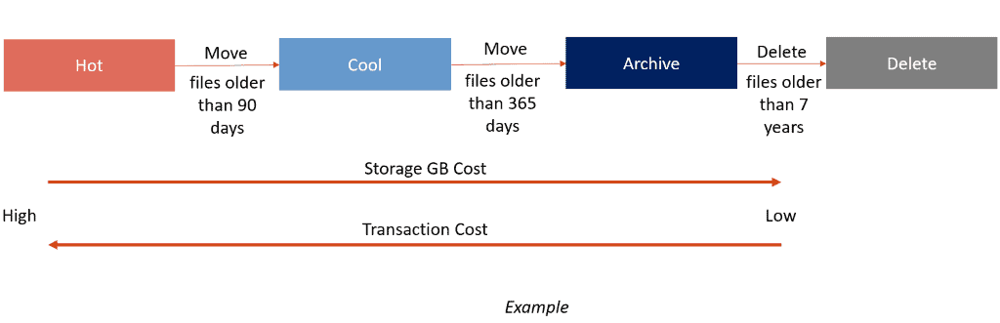

# 📓 Administering Azure Blobs and Azure Files

### Creating Azure File share;

Azure File Share, Microsoft Azure'un bulut tabanlı depolama hizmetlerinden biridir. Bu hizmet, kullanıcıların ve organizasyonların dosyalarını Azure bulutunda depolamasına ve bu dosyalara çeşitli işletim sistemlerinden (Windows, Linux ve macOS) erişmesine olanak tanır. Sunulan hizmet, kurumsal düzeyde dosya paylaşımı sağlar ve hem Azure içindeki sanal makinelerle hem de Azure dışındaki sistemlerle uyumlu çalışır.

1. **Storage Account Oluşturma**: Azure portalında bir storage account oluştururmalıyız.
2. **File Share Oluşturma**: Storage account içerisinde 'File shares' sekmesine giderek yeni bir file share oluştururmamız gerekiyor. Bu file share, paylaşılan dosyalarınızın bulut üzerinde saklanacağı alan olacaktır.
3. **Bağlantı Bilgilerini Almak**: Oluşturduğunuz file share'a gidip 'Connect' butonuna tıklayarak, bağlantı için gerekli script'i alabiliriz. Azure, farklı işletim sistemleri (Windows, Linux ve macOS) için farklı bağlantı script'leri sağlar.
4. **Mount Script'inin Çalıştırılması**:
   * **Windows**: Windows cihazlarda, genellikle bir PowerShell script'i verilir ve bu script'i PowerShell üzerinden çalıştırarak file share'ı bir sürücü harfine atarsınız.
   * **Linux**: Linux cihazlarda, NFS veya SMB protokolünü kullanarak bir mount komutu çalıştırırsınız. Gerekli paketlerin yüklü olduğundan (örneğin, `nfs-common` veya `cifs-utils`) ve mount noktasının hazır olduğundan emin olmanız gerekir.
5. **File Share Kullanmaya Başlama**: Mount işlemi tamamlandıktan sonra, file share'ınızı yerel bir dosya sistemi gibi kullanmaya başlayabilirsiniz. Dosyalarınızı yükleyebilir, düzenleyebilir ve paylaşılan dosyalara erişim sağlayabilirsiniz.

### Azure File Sync;

<figure><figcaption></figcaption></figure>

Azure File Sync, Azure'un bulut hizmetlerinin bir parçası olarak, şirket içi sunucularınızdaki dosyalarınızı Azure bulut depolama hizmetleriyle senkronize etmenizi sağlayan bir hizmettir. Bu, dosyalarınızı çeşitli lokasyonlarda bulunan sunucular arasında veya on-premise sunucularınız ile Azure bulutu arasında senkronize tutmanıza olanak tanır.

Azure File Sync'in temel özellikleri ve bileşenleri;

* **Lift and Shift**: Şirket içi dosya paylaşımlarınızı merkezileştirir ve Azure File Share aracılığıyla Windows ve Azure Files arasında erişim sağlar.
* **Adding New Offices**: Yeni şube ofislerini kolayca ekleyip dosyaları onlarla paylaşabilirsiniz.
* **BCDR**: Azure Backup, senkronize olduktan sonra şirket içi verilerinizi yedekler ve büyük bir arıza sonrasında verileri hızlı bir şekilde geri yüklemenize olanak tanır.
* **Archiving**: Az kullanılan verileri Azure Files'da saklar ve yalnızca talep üzerine geri alınabilirler.

Azure File Sync uygulamasının nasıl yapılandırılacağına dair bir yol haritası:

<figure><figcaption></figcaption></figure>

Bu hizmet, özellikle birden çok lokasyonda çalışan büyük şirketler için dosya yönetimini basitleştirmek ve veri yedekleme süreçlerini kolaylaştırmak için kullanışlıdır. Azure File Sync'in kullanılmasıyla, dosyalarınız otomatik olarak Azure bulutuna senkronize edilir.



### Creating Containers;

<figure><figcaption></figcaption></figure>

1. **Azure Portalına Giriş Yapın**:
   * [Azure Portal](https://portal.azure.com/) adresine gidin ve Microsoft hesabınız ile giriş yapın.
2. **Storage Account Oluşturun**:
   * Portalın sol üst köşesinde yer alan "Create a resource" (Bir kaynak oluştur) seçeneğine tıklayın.
   * "Storage" kategorisini seçin ve ardından "Storage account" üzerine tıklayın.
   * Gerekli bilgileri girin:
     * **Subscription**: Kullanmak istediğiniz Azure aboneliğini seçin.
     * **Resource Group**: Bir kaynak grubu seçin veya yeni bir tane oluşturun.
     * **Storage Account Name**: Depolama hesabınıza benzersiz bir ad verin.
     * **Location**: Verilerinizi fiziksel olarak depolamak istediğiniz bölgeyi seçin.
     * **Performance**: Standart veya Premium performans seçeneklerinden birini seçin.
     * **Account Kind**: Genellikle "StorageV2 (general purpose v2)" seçeneği tercih edilir.
     * **Replication**: Veri dayanıklılığı seviyesini seçin (örn. LRS, GRS, ZRS).
     * **Access Tier**: Erişim seviyesi olarak "Hot" veya "Cool" seçeneklerinden birini seçin.
   * "Review + create" (İncele + oluştur) butonuna tıklayın ve ardından "Create" (Oluştur) butonuna tıklayarak hesabı oluşturun.
3. **Blob Container Oluşturun**:
   * Oluşturulan storage account'a gidin ve "Blob service" altında "Containers" seçeneğine tıklayın.
   * "+ Container" butonuna tıklayarak yeni bir container oluşturun.
   * Container için bir ad girin ve erişim seviyesini belirleyin (Private, Blob veya Container).
   * "Create" (Oluştur) butonuna tıklayarak container'ınızı oluşturun.
4. **Blob'lara Erişim İzinleri Ayarlayın** (Opsiyonel):
   * Gerekirse, "Access policies" (Erişim politikaları) bölümünden erişim izinlerini ve SAS token'larını (Shared Access Signature) yapılandırabilirsiniz.
5. **Blob Yükleme**:
   * Oluşturduğunuz container'ı açın ve "Upload" (Yükle) butonuna tıklayarak dosyalarınızı Azure Blob Storage'a yükleyin.
6. **Azure Blob Storage Kullanmaya Başlayabilirsiniz**:
   * Blob'larınızı yükledikten sonra, uygulamalarınızda veya web sitelerinizde kullanmaya başlayabilirsiniz. Blob'ları doğrudan erişilebilir yapmak için URL'lerini alabilir veya programatik olarak Azure SDK'ları kullanarak erişebilirsiniz.

### Blob Access Tiers;

Azure Blob Storage'da "access tiers" ya da erişim katmanları, depolanan verilerin erişim sıklığına ve maliyet optimizasyonuna göre belirlenen üç farklı veri depolama katmanıdır: Hot, Cool ve Archive.&#x20;

1. **Hot Tier**:
   * **Amaç**: Sık erişilen veriler için idealdir.
   * **Depolama Maliyeti**: Yüksek (en yüksek depolama maliyetine sahiptir).
   * **Erişim Maliyeti**: Düşük (verilere erişimde düşük maliyet sunar).
   * **Kullanım Durumu**: Aktif olarak kullanılan, sürekli erişilen veriler için uygundur.
2. **Cool Tier**:
   * **Amaç**: Daha az sıklıkta erişilen, ancak yine de erişilmesi gereken veriler için idealdir.
   * **Depolama Maliyeti**: Orta (hot tier'a göre daha düşük depolama maliyetine sahiptir).
   * **Erişim Maliyeti**: Orta (hot tier'dan daha yüksek erişim maliyetine sahiptir).
   * **Kullanım Durumu**: En az 30 gün süreyle depolanması planlanan, düzenli ama sık olmayan aralıklarla erişilen veriler için uygundur. Verilerinizi bu katmanda 30 günden daha kısa bir süre tutarsanız, ek maliyetlerle karşılaşabilirsiniz, çünkü Azure bu katmanı en az 30 gün kullanım için fiyatlandırır.
3. **Archive Tier**:
   * **Amaç**: Çok nadiren erişilmesi gereken ve yüksek gecikme sürelerine tolerans gösterilebilen veriler için idealdir.
   * **Depolama Maliyeti**: Düşük (en düşük depolama maliyetine sahiptir).
   * **Erişim Maliyeti**: Yüksek (verilere erişim maliyeti en yüksektir ve veri geri getirme işlemi saatler sürebilir).
   * **Kullanım Durumu**: Uzun süre depolanacak ve çok nadiren erişilecek veriler için uygundur. Verilerinizi bu katmanda en az 180 gün tutmanız beklenir. Erken çıkış yaparsanız ek maliyetlerle karşılaşabilirsiniz.

Access tiers arasındaki geçişler, verilerin erişim ihtiyacı değiştikçe ihtiyaca göre yapılabilir. Örneğin, belirli bir veri setine bir süre sıkça erişildikten sonra daha az erişilmesi gerekiyorsa, bu verileri hot tier'dan cool ya da archive tier'a taşıyarak maliyet optimizasyonu yapılabilir.&#x20;

Erişim katmanları genellikle veri Lifecycle Management ile otomatik olarak yönetilebilir. Bu, belirli kurallar ve politikalar belirleyerek, verilerin erişim sıklığına bağlı olarak otomatik olarak farklı katmanlara taşınmasını sağlar.

### Blob Lifecycle Management;

<figure><figcaption></figcaption></figure>

Azure Blob Storage için Blob Lifecycle Management (BLM), depolanan blob verilerinin yaşam döngüsünü otomatik olarak yönetmek için kullanılan bir özelliktir. Bu, belirli kurallar ve politikalar oluşturarak, verilerinizi otomatik olarak farklı erişim katmanları arasında taşımanızı, gereksiz verileri silmenizi ve genel olarak depolama maliyetlerinizi optimize etmenizi sağlar.&#x20;

İşte Blob Lifecycle Management'ın ana özellikleri:

1. **Policy based transition**: Blob verilerini, son değişiklik tarihine göre otomatik olarak daha soğuk katmanlara (cool ya da archive gibi) taşımanızı sağlar.
2. **Delete blobs and snapshots**: Veriler belirli bir süre boyunca değişiklik yapılmazsa, blobları ve snapshotları otomatik olarak silebilirsiniz.
3. **Filtering option**: Policy, depolama alanındaki tüm bloblara uygulayabilir veya filtrelerle belirli blobları hedefleyebilirsiniz.
4. **Target different types**: Farklı blob tiplerini (block blob, append blob vb.) hedef alabilir ve bunları daha da alt tiplere (temel bloblar, versiyonlar, snapshotlar) bölebilirsiniz.

<figure><figcaption></figcaption></figure>

Ekran görüntüsündeki örnekte, bir lifecycle yönetim kuralı şu şekilde tanımlanmıştır:

* Blob verisi son değişiklikten 60 gün sonra Cool katmana geçirilir.
* Eğer veriye 180 gün boyunca erişilmezse veya değiştirilmezse Archive katmana taşınır.
* Veri üzerinde 365 gün boyunca herhangi bir işlem yapılmazsa silinir.
* Bu kural yalnızca "blockBlob" tipi bloblar için uygulanır.

<figure><figcaption>
blob types
</figcaption></figure>

Bu tür bir yönetim, özellikle büyük miktarda veri depolayan ve bu verilerin yönetimini otomatize etmek isteyen kuruluşlar için çok faydalıdır. Veri saklama maliyetlerini düşürmek ve depolama verimliliğini artırmak için kullanılır.&#x20;

**Azure Blob Storage için bir Lifecycle Policy oluşturma süreci:**

1. **Azure Portal'a Giriş Yapın**:
   * Azure Portal'a ([portal.azure.com](https://portal.azure.com/)) gidin ve hesabınıza giriş yapın.
2. **Storage Account Seçin**:
   * Dashboard'da veya "All resources" altında Blob Storage hesabınızı bulun ve seçin.
3. **Lifecycle Policy'a Git**:
   * Sol menüde "Data management" kategorisinde bulunan "Lifecycle Management" seçeneğine tıklayın.
4. **Yeni Policy Oluştur**:
   * Lifecycle Management sayfasında, "+ Add a rule" (Bir kural ekle) butonuna tıklayarak yeni bir policy oluşturun.
5. **Policy Detaylarını Belirleyin**:
   * Policynin adını girin.
   * Blob tipini seçin (örneğin, block blobs, append blobs vs.).
   * Policynın uygulanacağı blobları belirlemek için prefix ve/veya suffix filtreleri belirleyebilirsiniz.
6. **Eylemleri Tanımlayın**:
   * Blobların hangi koşullar altında farklı katmanlara taşınacağını veya silineceğini belirleyin. Örneğin:
     * Verilerin ne zaman Cool tier'a taşınacağını belirtin (örneğin, son değişiklikten 30 gün sonra).
     * Verilerin ne zaman Archive tier'a taşınacağını belirtin (örneğin, son değişiklikten 180 gün sonra).
     * Verilerin ne zaman silineceğini belirtin (örneğin, son değişiklikten 365 gün sonra).
7. **Policy'yi Kaydet**:
   * Tüm detayları doldurduktan sonra, policy'yi gözden geçirin ve "Save" (Kaydet) butonuna tıklayarak policy'nizi aktifleştirin.

Bu policy'ler, belirtilen süreler ve koşullar dahilinde otomatik olarak çalışacak ve verilerinizin yönetimini kolaylaştıracaktır.
