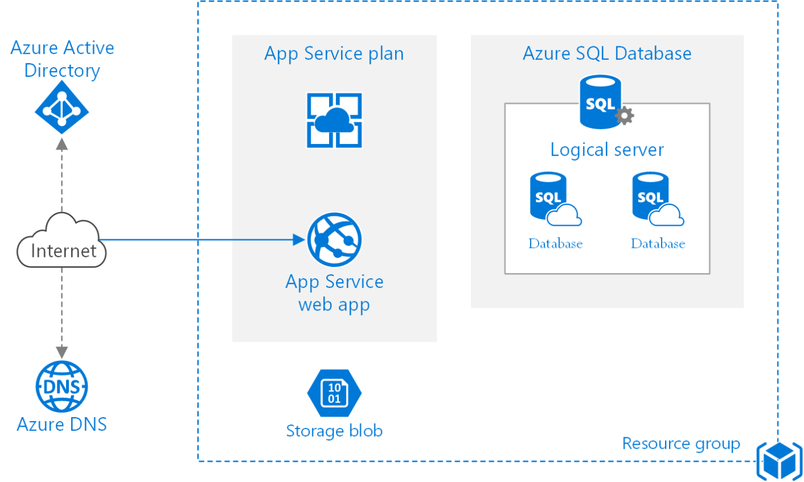
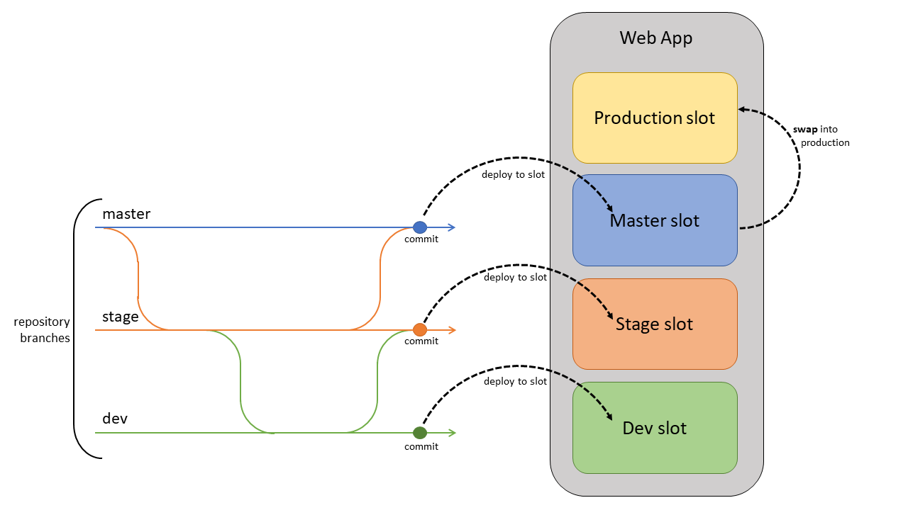

# 🎁 App Service

<figure><figcaption></figcaption></figure>

Azure App Service, Microsoft tarafından sağlanan bir Platform olarak Hizmet (PaaS) çözümüdür. Geliştiricilere web uygulamaları, API'ler, mobil uygulamalar ve sunucusuz uygulamaları barındırma ve yönetme imkanı verir.

* **Compute**: App Service Plan, Azure App Service'de uygulamalarınızı çalıştırmak için gereken compute kaynaklarının bir setini tanımlar. Bu kaynaklar, uygulamalarınızın gereksinimleri doğrultusunda ölçeklenebilir ve yönetilebilir.
* **Performance Tier**: App Service Planlar, farklı seviyelerde veya katmanlarda gelir. Bu katmanlar, sanal makinelerde olduğu gibi performans, özellikler, boyut ve ödediğiniz fiyatı temsil eder.
* **Host Multiple Apps**: Tek bir App Service Plan üzerinde birden fazla uygulamayı çalıştırabilirsiniz. Farklı bir bölgede uygulamalarınızı deploy etmek, farklı bir işletim sistemi gerektiği durumda veya daha yüksek performans gerekiyorsa, istiyorsanız farklı bir App Service Planı seçebilirsiniz.
* **Considerations**: Kaç uygulama çalıştırırsanız çalıştırın, App Service Planlarının maliyetini ödemek zorundasınız. Maliyeti optimize etmek için planları akıllıca seçmemiz gerekiyor.

### App Service Plans;

<table data-full-width="true"><thead><tr><th>Features</th><th width="99">Free</th><th width="86">Shared</th><th width="111">Basic</th><th width="128">Standard</th><th width="122">Premium</th><th>Isolated</th></tr></thead><tbody><tr><td>Web, mobile or API apps</td><td>10</td><td>100</td><td>Unlimited</td><td>Unlimited</td><td>Unlimited</td><td>Unlimited</td></tr><tr><td>Disk space</td><td>1 GB</td><td>1 GB</td><td>10 GB</td><td>50 GB</td><td>250 GB</td><td>1 TB</td></tr><tr><td>Auto Scale</td><td>–</td><td>–</td><td>–</td><td>Supported</td><td>Supported</td><td>Supported</td></tr><tr><td>Deployment Slots</td><td>0</td><td>0</td><td>0</td><td>5</td><td>20</td><td>20</td></tr><tr><td>Max Instances</td><td>–</td><td>–</td><td>Up to 3</td><td>Up to 10</td><td>Up to 30</td><td>Up to 100</td></tr></tbody></table>

* **Shared Compute (Free ve Shared)**: Uygulamalarınızı, uygulamanızın diğer uygulamalarla birlikte yer alacağı paylaşılan Azure VM altyapısında çalıştırın.
* **Dedicated Compute (Basic, Standard, ve Premium)**: Dedicated VM'ler tahsis edilecek ve uygulamalarınız bu VM'ler üzerinde çalışacak.
* **Isolated**: Uygulamalarınız için dedicated VM'ler, dedicated sanal ağlarda tahsis edilecek.

<figure><figcaption></figcaption></figure>

**Scale up**: Bu, mevcut planınızı daha fazla CPU, bellek, disk alanı ve özellikler içeren başka bir plana geçirmenizi sağlar. Temelde, plan seviyesini değiştirirsiniz.

**Scale out**: Bu özellik, instance sayısını manuel olarak (sabit bir instance sayısı ile) veya otomatik ölçeklendirme ile (metrikler veya programlamaya dayalı olarak artan/azalan) ayarlamanıza olanak tanır.

* **Single Plan**: App Service Plan kullanarak, web uygulamaları, API uygulamaları, mobil uygulamalar ve sunucusuz uygulamalar barındırabilirsiniz.
* **Fully Managed PaaS Solution**: Geliştiriciler kodlarını geliştirmeye odaklanabilirken, Microsoft arka planda sanal makineleri ve altyapıyı yönetir.
* **CI/CD and Visual Studio Integration**: Source kontrolü yaparak, CI/CD desteği sağlar ve kodunuzu doğrudan Visual Studio'dan deploy edebilirsiniz.
* **API and Mobile Features**: CORS desteği, çevrimdışı veri senkronizasyonu, push bildirimleri gibi özellikler sunar.
* **Support Multiple Languages**: Geliştiriciler, .NET, .NET Core, Node.js, PHP, Java, Python ve hatta konteynerize edilmiş uygulamaları App Service üzerinde çalıştırabilir.
* **Security and Compliance**: ISO, SOC, PCI gibi kurumsal uyumluluk standartlarını destekler. Azure AD veya sosyal medya girişi ile kimlik doğrulama kurabilirsiniz.
* **Marketplace Templates**: WordPress, Drupal gibi Azure Marketplace şablonlarını kullanarak dağıtımlarınızı kolaylaştırabilirsiniz.
* **Run Function Apps**: Fonksiyon uygulamalarınızı, ekstra altyapıya gerek kalmadan mevcut app service planınız üzerinde çalıştırabilirsiniz.

#### App Service Plan Oluşturma;

App Service Plan, uygulamalarınız için fiziksel kaynakların bir koleksiyonunu temsil eder. Aşağıda, bir App Service Plan oluşturmak için izlenecek adımlar yer almaktadır:

1. **Azure Portal'a Giriş Yapın**: Azure portalına giriş yaparak başlayın ve 'App Service plans' bölümüne gidin.
2. **Plan Oluşturma**:
   * **Subscription Seçimi**: Uygulamanızı dağıtmak için kullanacağınız aboneliği seçin.
   * **Resource Group Oluştur veya Seç**: Uygulamanızı organize etmek için bir kaynak grubu oluşturun veya mevcut birini seçin.
   * **App Service Plan Detayları**:
     * **Ad**: Planınıza bir ad verin.
     * **İşletim Sistemi**: Uygulamanızın çalışacağı işletim sistemini seçin (Linux veya Windows).
     * **Bölge**: Uygulamanızın barındırılacağı coğrafi bölgeyi seçin.
     * **Fiyatlandırma Katmanı**: Uygulamanız için uygun olan fiyatlandırma planını seçin.
3. **Zone Redundancy**: Uygulamanızın bölge yedekliliğini etkinleştirebilir veya devre dışı bırakabilirsiniz.

#### Web App Oluşturma;

App Service Planınızı oluşturduktan sonra, bir Web App oluşturarak uygulamanızı yayınlamaya başlayabilirsiniz:

1. **Web App Oluşturma**:
   * **Project Details**:
     * **Subscription**: Dağıtım için aboneliğinizi seçin.
     * **Resource Group**: Uygulamanız için bir kaynak grubu seçin veya oluşturun.
   * **Instance Details**:
     * **Ad**: Uygulamanıza bir ad verin.
     * **Publish**: Uygulamanızı nasıl yayınlayacağınızı seçin (Kod, Docker Konteyner veya Statik Web App).
     * **Runtime stack**: Uygulamanız için çalışma zamanı yığınını (.NET, Java, Node.js vb.) seçin.
     * **İşletim Sistemi**: Web uygulamanız için bir işletim sistemi seçin.
     * **Bölge**: Uygulamanızın barındırılacağı bölgeyi seçin.
2. **Fiyatlandırma Planları**:
   * **App Service Plan**: Daha önce oluşturduğunuz App Service Planınızı seçin.
3. **Zone Redundancy**: Uygulamanız için bölge yedekliliğini ayarlayın.
4. **Review + create**: Tüm seçimlerinizi gözden geçirin ve 'Oluştur' düğmesine tıklayarak uygulamanızı yayınlayın.

### Securing App Service;

**Kimlik Doğrulama;**

Azure App Service, uygulamanıza kimlik doğrulama katmanı eklemenize olanak tanır. Kimlik doğrulama, belirli kimlik sağlayıcıları kullanılarak yapılır. Yaygın kimlik sağlayıcıları arasında Microsoft, Apple, Facebook, GitHub, Google ve Twitter bulunur. Bu hizmetler OpenID Connect protokolünü kullanarak entegrasyon sağlar. Bu kimlik sağlayıcılarından birini seçmek, kullanıcıların ilgili platformdaki kimlik bilgileriyle oturum açmalarını sağlar.

#### Güvenlik;

Azure App Service, SSL sertifikaları, teşhis ayarları, ağ ACL'leri (Erişim Kontrol Listeleri) ve Azure Key Vault ile anahtar entegrasyonu gibi bir dizi güvenlik özelliği sunar. SSL sertifikaları, uygulamanızın ve kullanıcılarınızın verilerinin şifrelenmesini sağlar. Teşhis ayarları, olası sorunları belirlemenize ve çözmenize yardımcı olur. Ağ ACL'leri, belirli IP adreslerinin uygulamanıza erişimini kısıtlamanıza olanak tanır. Azure Key Vault ile entegrasyon, güvenlik anahtarlarınızı ve sertifikalarınızı güvenli bir şekilde yönetmenizi sağlar.

### Custom Domains in App Service;

Azure App Service'de özel alan adlarını kullanmak, uygulamanızı Azure'un varsayılan `{yourapp}.azurewebsites.net` domaini yerine kişiselleştirilmiş bir domain adı ile erişilebilir kılar.&#x20;

#### Özel Domain Ekleme Adımları,

1. **Azure Portal’a Giriş Yapın**: Azure portalına giriş yapın ve App Service uygulamanıza gidin.
2. **Custom Domains Bölümüne Git**: Sol menüden "Custom Domains" sekmesini seçin.
3. **Özel Domain Ekleyin**: "Add custom domain" alanına özel domain adınızı yazın (örneğin: `app.yourcustomdomain.com`).
4. **Hostname Kaydı Yapın**:
   * **CNAME**: Genellikle, bir `CNAME` kaydı kullanarak, özel domaininizi Azure App Service uygulamanızın alt alan adına yönlendirirsiniz (örneğin: `app.yourcustomdomain.com` to `yourapp.azurewebsites.net`).
   * **A Kaydı**: Ayrıca, bir IP adresine doğrudan çözümlenmesi için bir `A` kaydı da kullanabilirsiniz.
5. **Domain Doğrulama**:
   * Azure, domain sahipliğinizi doğrulamanızı ister. Bunu genellikle DNS yönetim paneliniz üzerinden bir `TXT` kaydı oluşturarak yaparsınız.
   * Domain doğrulama için gereken `Custom Domain Verification ID` Azure tarafından sağlanır.

### Backup App Service;

Azure App Service'de yedekleme özelliği, uygulamanızın ve ilişkili veritabanlarının düzenli olarak yedeklenmesini sağlamak için kullanılır. Bu, olası veri kaybı durumunda uygulamanızın veya veritabanınızın önceki bir durumuna geri dönmenizi sağlar.

**Yedekleme Programı**: Yedeklemelerinizi manuel olarak tetikleyebileceğiniz gibi, belirli aralıklarla otomatik olarak yedekleme yapacak şekilde bir zamanlama da ayarlayabilirsiniz.

**Yedekleme Veritabanı**: Uygulamanızla ilişkili veritabanlarını da yedeklemenize olanak tanır. Uygulamanızın yapılandırılmış bağlantı dizeleri temel alınarak hangi veritabanlarının yedekleneceği belirlenir. Büyük veritabanları için Azure Backup hizmeti önerilmektedir.

<mark style="color:orange;">Yedekleme özelliği, Standard veya Premium planlarda mevcuttur ve bu planlardan birine sahip olmanız gerekmektedir.</mark>&#x20;

<mark style="color:orange;">Uygulama ve veritabanı için toplamda 10 GB'a kadar yedekleme yapılabilir. Hem tam hem de kısmi yedeklemeler yapılandırılabilir. Uygulamanızı önceki bir geri yükleme noktasına geri yükleyebilir veya tamamen yeni bir uygulama oluşturabilirsiniz.</mark>

### App Service CI\&CD;

<figure><figcaption></figcaption></figure>

Azure App Service CI/CD süreçleri, kodunuzun depolandığı kaynak kodu yönetim sistemlerinden uygulamanızın canlı ortama sürekli ve otomatik bir şekilde dağıtılmasını sağlar. Hataları azaltır ve yazılım deploy süreçlerini hızlandırır.

1. **Otomatik Dağıtım**: Geliştiriciler, yeni özellikleri, yamaları ve hata düzeltmelerini içeren kodları push ettiklerinde, bu değişiklikler hemen Azure App Service'de güncellenir. App Service, GitHub, Azure Repos, Bitbucket, Git ve diğer kaynak kodu depoları ile entegre olabilir.
2. **Manuel Dağıtım**: Geliştiriciler, kodlarını OneDrive, Dropbox veya harici bir Git deposu gibi uzak bir bulut depolama hizmetine saklayabilirler. Manuel dağıtım, geliştiricilerin kodu App Service'i güncellemek için belirli bir konuma manuel olarak yüklemelerini gerektirir.

**App Service Deployment Slots,**

<figure><figcaption></figcaption></figure>

Azure App Service Deployment Slots, uygulamanızın farklı versiyonlarını veya aşamalarını (örneğin geliştirme, test, prod) aynı App Service kaynağında barındırmanıza olanak tanıyan bir özelliktir. Bu, her bir versiyonun kendi ortamını, ayarlarını ve URL'sini korumasına olanak tanır.

#### Deployment Slots Nasıl Çalışır?

1. **Birden Fazla Ortam**: Prod ortamınız varsa ve yeni bir özellik geliştiriyorsanız, doğrudan prod ortama kod göndermek riskli olabilir. Bunun yerine, bir "staging" slotu oluşturabilirsiniz. Bu, prod ile aynı App Service içinde, ancak farklı bir URL altında çalışan bir kopyasıdır.
2. **Benzer Ortamlar**: Staging slotu, prod ortama çok benzer ayarlara sahip olabilir. Böylece, geliştirme sırasında prod ortamınızla aynı koşulları simüle edebilirsiniz.
3. **Canlıya Alma (Swap)**: Bir özellik ya da güncelleme staging ortamında test edildiğinde ve hazır olduğunda, "swap" işlemi ile prod ortamıyla yer değiştirebilir. Bu işlem sırasında, prod ortamınızla staging ortamınız tek bir tıklama ile yer değiştirir.
4. **Downtime Azaltma**: Swap işlemi sırasında, uygulamanızın kullanılabilir olmaya devam etmesini sağlar, yani kullanıcılarınızın deneyimi kesintiye uğramaz.
5. **Test ve Geri Alma**: Yeni kodunuzu canlı ortama almadan önce staging'de test etme şansınız olur. Eğer canlı ortama aldıktan sonra bir sorun fark ederseniz, kolayca eski sürüme geri dönebilirsiniz.
6. **Plan Bağımlılığı**: Bu özellik, belirli bir abonelik planına bağlıdır. Ücretsiz ve shared planlar bu özelliği desteklemezken, daha yüksek planlar birden fazla slot sunar.

#### Deployment Slots Kullanmanın Faydaları

* **Risk Yönetimi**: Canlı uygulamanıza herhangi bir zarar vermeden yeni kodları test etme imkanı sunar.
* **Kolay Geri Alma**: Bir sorun olması durumunda, eski sürüme hızlı bir şekilde dönüş yapabilirsiniz.

Deployment Slots, Azure App Service'in güçlü özelliklerinden biridir ve özellikle canlı uygulamalarınızın güvenliğini korurken CI-CD süreçleri için yararlıdır.

