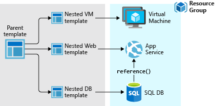

# 🪡 Automating Deployment and Configuration

### Azure Resource Manager (ARM);

<figure><figcaption></figcaption></figure>

Azure Resource Manager, Azure'da altyapıyı kod olarak yönetmek, kaynakları daha verimli kullanmak ve karmaşık uygulamaları kolayca deploy etmek için önemli bir araçtır. Azure'da bulunan birçok hizmet ve özellik, ARM ile entegre edilmiştir ve ARM şablonları, Azure kaynaklarını hızlı ve tutarlı bir şekilde dağıtmak için kullanılır.

1. **Şablon Tabanlı Dağıtım**: ARM, JSON tabanlı şablonlar kullanarak Azure kaynaklarını tanımlamanıza olanak tanır. Bu şablonlar, altyapı ve hizmetlerinizi kod olarak temsil etmenizi ve tekrar kullanılabilir şablonlar oluşturmanızı sağlar.
2. **Grup Yönetimi**: ARM, kaynakları mantıksal gruplara dahil etmenizi sağlar. Bu gruplar, ilişkili kaynakları kolayca yönetmenizi ve izlemenizi sağlar. Kaynakları mantıksal bir birimde toplama ve yönetme kolaylığı sağlar.
3. **İşlem Geçmişi ve İzleme**: ARM, kaynakların oluşturulması, güncellenmesi ve silinmesi gibi işlemleri otomatik olarak izler ve geçmişte yapılan değişikliklere geri dönmenize olanak tanır.
4. **Rol Tabanlı Erişim Denetimi (RBAC)**: ARM, kullanıcıların ve grupların Azure kaynaklarına erişimini denetlemek için rol tabanlı erişim denetimi (RBAC) sağlar. Bu, güvenliği artırmanıza ve sadece yetkilendirilmiş kullanıcıların kaynaklara erişimini sağlamanıza yardımcı olur.
5. **Otomatik Ölçeklendirme**: ARM, kaynakları otomatik olarak ölçeklendirmenizi ve uygulamanızın ihtiyacına göre kaynakları artırmanızı veya azaltmanızı sağlar. Bu, uygulamalarınızın yüksek taleplere cevap vermesini ve maliyetleri optimize etmenizi sağlar.
6. **Bağımlılıkların Yönetimi**: ARM, kaynaklar arasındaki bağımlılıkları tanımlamanıza ve yönetmenize olanak tanır. Bu, kaynakların sırayla oluşturulmasını veya belirli bir sıra izlemesini sağlar.
7. **Gelişmiş Hata Yönetimi**: ARM, deploy sırasında oluşabilecek hataları yakalamak ve hata durumlarında geri dönme yeteneği sunar. Bu, güvenilir ve hata toleranslı altyapılar oluşturmanıza yardımcı olur.
8. **Uzaktan Yönetim ve Otomasyon**: Azure PowerShell, Azure CLI (Command-Line Interface) gibi araçlar ve Azure SDK (Software Development Kit) ile birlikte kullanarak ARM, Azure kaynaklarını uzaktan yönetmek ve otomasyon senaryoları oluşturmak için kullanılabilir.

Azure Resource Manager (ARM) şablonları, Azure kaynaklarını tanımlamak, dağıtmak ve yönetmek için kullanılan JSON tabanlı dosyalardır. Bu şablonlar, altyapı ve hizmetleri kod olarak temsil eder ve Azure'daki kaynakları otomatik olarak dağıtmak ve yapılandırmak için kullanılır. ARM şablonları, Azure'da altyapıyı ve hizmetleri oluşturmanın ve yönetmenin temel bir parçasıdır.

<figure><figcaption></figcaption></figure>

ARM şablonlarının ana bölümleri şunlardır:

1. **$schema**: Bu, şablonun hangi ARM şablon şemasını kullandığını belirten bir linktir. Şema, şablonun nasıl yazılması ve yorumlanması gerektiğine dair kuralları içerir. Yani, bu sizin şablonunuzun "dilbilgisi kitabı" gibidir.
2. **contentVersion**: Bu, şablonunuzun sürüm numarasını içerir. Bir yazılım sürümü gibi düşünebilirsiniz. Eğer şablonunuzda değişiklik yaparsanız, bu sürüm numarasını güncelleyerek hangi sürümün kullanıldığını takip edebilirsiniz.
3. **apiProfile**: Bazı ARM şablonları belirli Azure API sürümlerine özgüdür. Eğer şablonunuz belirli bir API setini kullanıyorsa, bu kısımda bu API profilini belirtirsiniz. Bu, şablonunuzun belirli bir Azure hizmetinin belirli bir sürümüyle uyumlu olmasını sağlar.
4. **parameters**: Şablonunuzu daha esnek hale getiren, dışarıdan alınan değerlerdir. Örneğin, kullanıcının şablonu çalıştırırken belirteceği bir sanal makine boyutu veya bir depolama hesabı adı gibi.
5. **variables**: Şablonunuz içinde birden fazla yerde kullanabileceğiniz sabit veya hesaplanmış değerleri tanımlarsınız. Örneğin, belirli bir kaynak için kullanacağınız ortak bir konum değeri tanımlayabilirsiniz.
6. **functions**: Şablonunuzda tekrar eden karmaşık kod bloklarını daha düzenli hale getirmek için kullanılan özel fonksiyonlardır. Bu fonksiyonlar, şablon içinde birden fazla kez kullanılabilecek özel işlemleri tanımlar.
7. **resources**: Şablonunuzla oluşturmak veya yönetmek istediğiniz Azure kaynaklarını belirtirsiniz. Her kaynak için tip, ad, konum, boyut gibi özellikleri ve diğer kaynaklarla olan bağlantıları (bağımlılıkları) tanımlarsınız.
8. **outputs**: Şablonunuz çalıştırıldıktan sonra, sonuç olarak dışarı vermek istediğiniz bilgileri tanımlar. Örneğin, oluşturduğunuz bir sanal makinenin IP adresi gibi bilgileri dışarı çıkarabilirsiniz. Bu bilgiler başka şablonlar veya otomasyon işlemleri tarafından kullanılabilir.

#### Örnek ARM Şablonu;

Aşağıda basit bir ARM şablon örneği verilmiştir:

```json
{
    "$schema": "https://schema.management.azure.com/schemas/2019-04-01/deploymentTemplate.json#",
    "contentVersion": "1.0.0.0",
    "parameters": {
        "storageAccountName": {
            "type": "string",
            "metadata": {
                "description": "Oluşturulacak Azure Storage Hesabının adı."
            }
        },
        "location": {
            "type": "string",
            "defaultValue": "westus",
            "metadata": {
                "description": "Kaynakların oluşturulacağı konum."
            }
        }
    },
    "variables": {
        "storageAccountType": "Standard_LRS"
    },
    "resources": [
        {
            "type": "Microsoft.Storage/storageAccounts",
            "apiVersion": "2019-06-01",
            "name": "[parameters('storageAccountName')]",
            "location": "[parameters('location')]",
            "sku": {
                "name": "[variables('storageAccountType')]"
            },
            "kind": "StorageV2",
            "properties": {}
        }
    ],
    "outputs": {
        "storageAccountKey": {
            "type": "string",
            "value": "[listKeys(resourceId('Microsoft.Storage/storageAccounts', parameters('storageAccountName')), '2019-06-01').keys[0].value]"
        }
    }
}
```

* **$schema ve contentVersion**: Şablonun şeması ve içerik sürümü belirtilmiştir.
* **parameters**: Kullanıcıdan alınacak iki parametre tanımlanmıştır: `storageAccountName` ve `location`. `storageAccountName`, oluşturulacak depolama hesabının adı için, `location` ise kaynakların hangi Azure bölgesinde oluşturulacağı için kullanılır.
* **variables**: Depolama hesabının türü (SKU) belirtilmiştir. Burada "Standard\_LRS" (standart, yerel olarak yedeklenmiş depolama) kullanılmıştır.
* **resources**: Asıl kaynak olan Azure Storage hesabı tanımlanmıştır. Bu kısımda kaynak tipi, API sürümü, adı, konumu ve SKU'su belirtilmiştir.
* **outputs**: Şablon çalıştırıldıktan sonra dışarı verilecek olan depolama hesabının anahtarını (key) içerir. Bu, oluşturulan depolama hesabına erişim için gereklidir.

<figure><figcaption></figcaption></figure>

**Azure Portal**:

* Azure Portal'a giriş yapın.
* Sol üstteki arama çubuğuna "Deploy a custom template" yazarak bu seçeneği arayın ve seçin.
* Ardından, "Build your own template in the editor" seçeneği ile JSON şablonunuzu yapıştırın veya "Load a template file" seçeneği ile şablon dosyanızı yükleyin.
* Gerekli parametreleri doldurun ve "Review + create" ardından "Create" butonuna tıklayarak deploy işlemini başlatın.

**Azure CLI**:

* Azure Command-Line Interface (CLI) aracılığıyla ARM şablonunu deploy etmek için bir terminal açın.
* Azure hesabınıza CLI üzerinden `az login` komutu ile giriş yapın.
* Şablonu deploy etmek için aşağıdaki komutu kullanın, burada `<resource-group-name>` kaynak grubunuzun adı ve `<path-to-file>` ise şablon dosyanızın yolu olacak şekilde değiştirin:

```xml
az group deployment create -g <resource-group-name> --template-file <path-to-file>
```

**Azure PowerShell**:

* Azure PowerShell modülünü kullanarak ARM şablonunu deploy etmek için PowerShell penceresi açın.
* Azure'a `Connect-AzAccount` komutu ile oturum açın.
* Aşağıdaki komutu kullanarak ARM şablonunuzu deploy edin, burada `<resource-group>` kaynak grubunuzun adı ve `<path-to-file>` ise şablon dosyanızın yolu olacak şekilde değiştirin:

```powershell
New-AzResourceGroupDeployment -ResourceGroupName <resource-group> -TemplateFile <path-to-file>
```


#### Exporting deployments as ARM template;

<figure><figcaption></figcaption></figure>

Azure üzerinde daha önceden gerçekleştirdiğiniz bir deploy işleminin tüm detaylarını içeren bir ARM şablonunun dışarıya çıkarılması sürecini tanımlar. Bu süreç sayesinde, Azure'da deploy edilmiş bir kaynak grubunun tam yapılandırmasını - kaynak tipleri, ayarlar, yapılandırma değerleri ve bağımlılıklar dahil olmak üzere - JSON formatında bir şablona dönüştürebilir ve kaydedebilirsiniz.

Bu şablon, daha sonrasında, aynı Azure kaynaklarını farklı bir abonelikte, bölgede veya ortamda (örneğin, geliştirme, test veya prodüksiyon) hızlı bir şekilde ve aynı ayarlarla yeniden oluşturmak için kullanılabilir.&#x20;

<figure><figcaption></figcaption></figure>

Bu özellik, bulut kaynaklarınızın yönetimi ve tekrarlanabilirliği konusunda size büyük esneklik ve hız kazandırır. Örneğin, bir geliştirme ortamında oluşturduğunuz bir uygulama yapılandırmasını test veya prodüksiyon ortamına taşımak istediğinizde, manuel olarak her bir kaynağı tekrar oluşturmak yerine, bu dışa aktarılmış şablonu kullanarak tüm kaynak grubunu tek bir komutla kolayca deploy edebilirsiniz. Bu, zaman tasarrufu sağlar ve yapılandırma hatalarını azaltır, çünkü tüm kaynaklar aynı yapılandırma ile konsistent bir şekilde oluşturulur.

Özetle, Azure'da "Exporting deployments as ARM template" özelliği sayesinde, Azure portal üzerinden manuel olarak oluşturduğunuz veya deployment ile oluşturduğunuz kaynakların tamamının yapılandırmasını, bir ARM şablonu olarak dışa aktarabilirsiniz. Bu şablon, ilgili kaynak grubunu içerisinde bulunan kaynakların tam bir tanımını içerir ve sonradan bu yapılandırmayı tekrar kullanarak, aynı kaynakları otomatik bir şekilde ve hızlıca başka bir ortamda veya abonelikte yeniden oluşturmanıza olanak tanır.


Azure'da belirli bir kaynağa ait ARM şablonunu dışa aktarmak için `Get-AzResourceGroupDeploymentTemplate` komutunun `-Resource` parametresinin kullanabilirsiniz.

```powershell
Export-AzResourceGroup -ResourceGroupName <Resource-Group-Name> -Resource <Resource-ID>
```

Yukarıdaki komutu kullanarak, belirli bir kaynağın yapılandırmasını ve özelliklerini bir ARM şablonu olarak dışa aktarabilir, bu yapılandırmayı başka yerlerde yeniden kullanabilirsiniz.

<figure><figcaption></figcaption></figure>



Aynı zamanda az cli kullanarak da, tıpkı powershell de olduğu gibi, tüm resource group altındaki kaynakları veya spesifik bir resource için ARM template oluşturabiliriz. Aşağıda yardımcı bir döküman paylaşıyorum.



### VHD Templates;

Azure'da VHD (Virtual Hard Disk) template'leri, sanal makineler (VM) oluşturmak ve yapılandırmak için kullanılan bir araçtır. Bu template'ler, Azure üzerinde VM'lerin hızlı ve tutarlı bir şekilde dağıtılmasını sağlar.&#x20;

#### VHD Template Tanımı:

* Bir VHD template, bir sanal makinenin disk görüntüsünü içeren bir dosyadır. Bu disk görüntüsü, işletim sistemi, uygulamalar ve yapılandırma ayarları gibi VM'nin tüm bileşenlerini kapsar.
* VHD dosyası, bir VM'nin tamamen işlevsel bir kopyası olarak düşünülebilir.

#### VHD Template'leri ve Azure VM'leri:

* Azure'da VM oluştururken, kullanıcılar genellikle mevcut bir VHD template'ini kullanır. Bu, işletim sistemi ve gerekli uygulamaların ön yüklemesini içerir.
* VHD template'leri, Azure Blob Storage üzerinde saklanır ve ihtiyaç duyulduğunda kullanılabilir.

#### VHD Template Türleri:

* **Generalized Template'ler:** Bu template'ler, tüm özgün kullanıcı verilerinin ve ayarlarının kaldırıldığı, genelleştirilmiş bir VM görüntüsüdür. Genellikle yeni VM'ler oluşturmak için kullanılır. Bu template'ten oluşturulan VM'ler, ilk açılışta tamamlanması gereken hostname (bilgisayar adı), admin kullanıcısı ve diğer VM ile ilgili kurulum işlemlerini gerektirir.
* **Specialized Template'ler:** Bu template'ler, VM'nin tam bir kopyasıdır ve özel ayarlar, uygulamalar ve kullanıcı verileri içerir. Bu template'ten oluşturulan VM'ler tamamen yapılandırılmıştır ve bu imajdan VM oluşturulurken hostname ve admin kullanıcı/şifre gibi parametreler gerektirmez.

#### VHD Template'leri ile VM Oluşturma Süreci:

* VM oluşturulurken, Azure kullanıcıların bir VHD template'i seçmelerine olanak tanır. Bu, VM'nin nasıl yapılandırılacağını belirler.
* Kullanıcılar, Azure portalı, Azure CLI, veya PowerShell aracılığıyla bu template'leri kullanarak yeni VM'ler oluşturabilir.

#### Kullanım Senaryoları ve Avantajları:

* VHD template'leri, çeşitli kullanım senaryolarına hizmet eder. Örneğin, aynı yapılandırmaya sahip çok sayıda VM oluşturmak, test ortamlarını hızla kurmak veya özel uygulama yapılandırmalarını korumak için kullanılır.
* Bu template'ler, VM oluşturma sürecini hızlandırır ve tutarlı bir yapılandırma sağlar, bu da özellikle büyük ölçekli ve karmaşık ortamlarda zaman ve kaynak tasarrufu sağlar.

### **VM Extension;**

Azure VM Extension, Azure sanal makinelerinde (VM) kurulum esnasında veya sonradan yapılandırma ve otomasyon görevleri sağlayan küçük uygulamalardır. Bu görevler şunları içerebilir:

* Yazılım kurulumu: VM’ye istediğiniz yazılımı yükleyebilirsiniz. Örneğin, Azure Monitor agent, Chef, Datadog gibi araçları VM’ye kurabilirsiniz.
* Antivirüs koruması: VM’yi virüslere ve kötü amaçlı yazılımlara karşı koruyabilirsiniz. Örneğin, Microsoft Antimalware, Symantec Endpoint Protection gibi antivirüs programlarını VM’ye kurabilirsiniz.
* VM içinde bir komut dosyası çalıştırma: VM’de PowerShell veya Bash komut dosyalarını çalıştırabilirsiniz. Örneğin, Custom Script Extension, VM’de herhangi bir PowerShell veya Bash komut dosyasını çalıştırmanıza olanak tanır. Bu komut dosyaları, Azure Storage veya GitHub’tan indirilebilir.

Azure VM Extension’ları, Azure CLI, PowerShell, Azure Resource Manager (ARM) şablonları ve Azure portalı kullanarak çalıştırabilirsiniz.

**Custom Script Extension**, Azure VM Extension’larından biridir. Bu uzantı, Azure API’yi kullanarak VM’lerde PowerShell veya Bash komut dosyalarını çalıştırmanızı sağlar.

<figure><figcaption></figcaption></figure>

Sistemi güncelleyip, sisteme redis kuran bir script:

```bash
#!/bin/bash
# Custom script to update and upgrade Ubuntu 20.04
# Update the package manager
sudo apt update
# Upgrade the installed packages
sudo apt upgrade -y
# Install redis packages
sudo apt install redis -y
# Print a success message
echo "Update and upgrade completed on $(hostname)"
```

<figure><figcaption></figcaption></figure>

Göreceğiniz üzere, sunucu üzerinde redis servisi kurulu gözükmektedir.



**Desired State Configuration (DSC),** Azure'da bir VM'in belirli bir yapılandırma durumunda kalmasını sağlamak için kullanılan bir yönetim aracıdır. DSC, PowerShell'in bir parçası olarak karmaşık dağıtımları kolaylaştıran ve yeniden başlatma gibi adımları içerebilen bir yapılandırma platformudur. DSC ile oluşturulan yapılandırma scriptleri okunması kolay ve declarative bir biçimde yazılır, yani istenilen son durumu tanımlarlar ve bu durumun sürekli sağlanmasını garanti ederler.

DSC'nin kullanılması gereken senaryolar, özellikle post-deployment yapılandırmasında yeniden başlatma gibi karmaşık adımlar içeren durumlardır. Custom Script Extension (CSE) bu tür karmaşık senaryoları desteklemediğinde DSC tercih edilmelidir. DSC'nin yapılandırma blokları, yapılandırmanın adını verdiğiniz en dıştaki script bloğudur ve her bir "node" bloğu, yapılandırmanın uygulanacağı bilgisayarları ve kaynakları tanımlar. Bu, Azure VM'lerinizin yönetimini otomatikleştirmek ve istenen durumun sürekliliğini sağlamak için güçlü bir araçtır.






