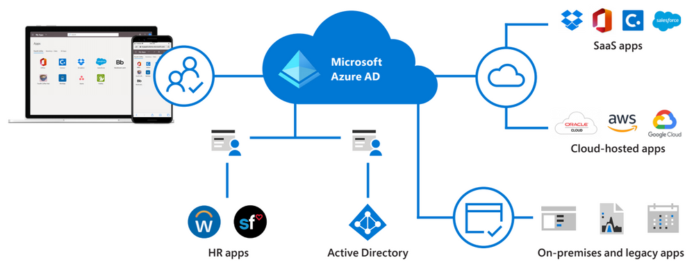
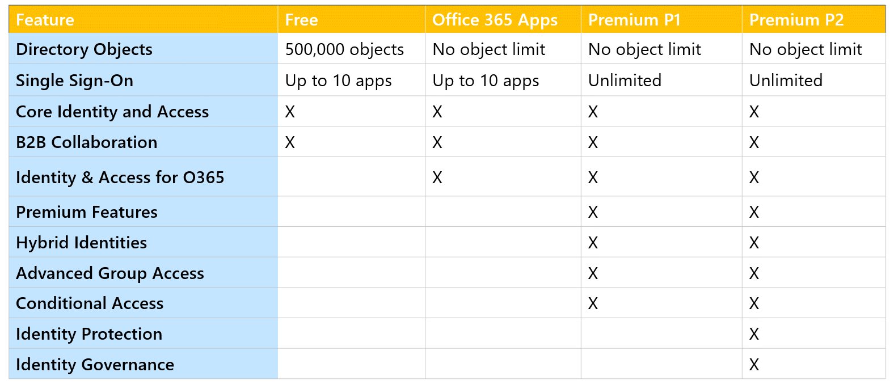
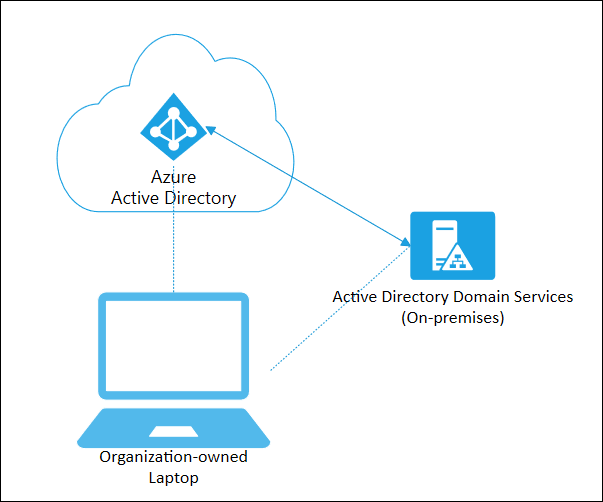
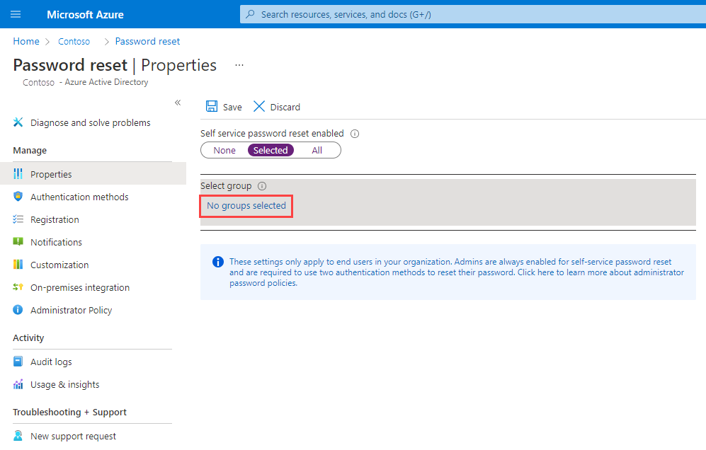
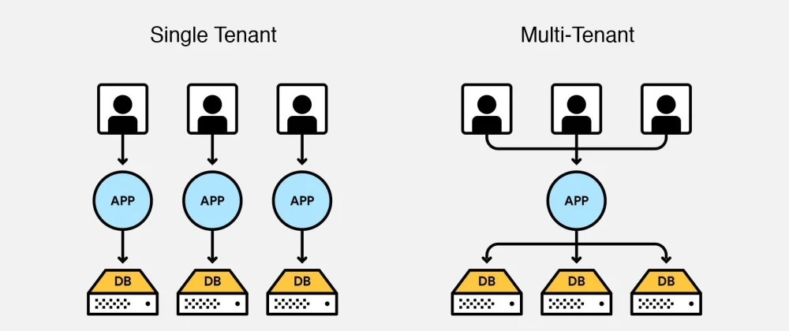

# 👨👨👧👧 Azure Active Directory ( Entra ID )



<figure><figcaption></figcaption></figure>

Azure AD, Microsoft'un bulut tabanlı kimlik hizmetidir. Bu, organizasyonların kullanıcıları, grupları ve cihazları merkezi bir yerde yönetmelerini sağlar. Temel olarak, kullanıcıların şirket içindeki ve dışındaki uygulamalara güvenli ve sorunsuz bir şekilde erişimini yönetir.

1. **Tek Oturum Açma (SSO)**: Kullanıcıların bir kez oturum açarak birçok farklı uygulama ve hizmete erişimini sağlar.
2. **Çok Faktörlü Kimlik Doğrulama (MFA)**: Güvenliği artırmak için iki veya daha fazla doğrulama yöntemi gerektiren bir kimlik doğrulama süreci.
3. **Koşullu Erişim**: Kullanıcıların, cihazların, uygulamaların ve ağ konumlarının koşullarını temel alarak belirli kaynaklara erişimini yönetme yeteneği.
4. **B2B ve B2C İşlevselliği**: Dış paydaşlarla (iş ortakları, müşteriler vb.) güvenli bir şekilde işbirliği yapma yeteneği.
5. **Entegrasyon**: Microsoft 365, SharePoint, Teams ve birçok üçüncü taraf SaaS uygulamasıyla bütünleşik çalışabilme yeteneği.

Azure AD, organizasyonların kimliklerini ve erişim politikalarını merkezileştirmelerine, bu sayede daha güvenli ve yönetilebilir bir IT ortamı oluşturmalarına yardımcı olur. Kullanıcıların işleriyle ilgili uygulamalara ve verilere her yerden erişimini sağlarken, aynı zamanda bu erişimi denetleyebilir ve güvence altına alabilir.

#### Konsept:

<figure><figcaption></figcaption></figure>

1- **Identity**: Kimlik, bir kaynağın (kullanıcı, uygulama, servis) sistem veya servislerle etkileşimde bulunurken kendisini tanımlamasına yardımcı olan bir özelliktir. Yani bir kullanıcı veya uygulama bir şeylere erişmek istediğinde, kimliği onların kim olduklarını belirler. Azure'da, "Azure Active Directory" (Azure AD) kimlik ve erişim yönetimini sağlar.

2- **Account** (Hesap): Bir kullanıcı ya da servisin, belirli bir servis veya uygulamaya giriş yapmak ve erişim sağlamak için kullandığı kimliğe denir. Genel olarak, kullanıcı adı ve şifre gibi bilgilerle ilişkilendirilir.

3- **Azure AD Account** (Azure AD Hesabı): Azure Active Directory (Azure AD) hesabı, Microsoft'un bulut tabanlı kimlik ve erişim yönetimi hizmetinde kullanılan bir hesaptır. Bu hesap, kullanıcıların Azure, Microsoft 365, ve bir dizi diğer Microsoft servislerine güvenli bir şekilde giriş yapmasını sağlar.

4- **AD Tenant or Directory** : Azure Active Directory (Azure AD) içinde organizasyonunuz için ayrılmış, kullanıcılar, gruplar ve diğer kimlik ile ilgili kaynakların saklandığı ve yönetildiği özel bir alandır. Bu, kullanıcıların ve uygulamaların kimlik doğrulama ve yetkilendirme işlemlerini gerçekleştirdiği, organizasyonunuzun kendi kullanıcılarını, gruplarını, uygulama erişim politikalarını ve diğer kaynakları yönettiği bir kimlik ve erişim yönetim sistemidir. Sadece organizasyonunuza özeldir ve Azure hizmetlerine, uygulamalara ve kaynaklara erişim için kullanılan politika ve kimlik bilgilerini içerir.

#### Azure AD & ADDS:

1. **Tanım ve Fonksiyonlar**:
   * **Azure AD**: Bulut tabanlı bir kimlik ve erişim yönetimi hizmetidir. Kullanıcıların bulut uygulamalarına (örn. Office 365, SaaS uygulamaları) erişimini yönetmek için tasarlanmıştır.
   * **ADDS**: Geleneksel olarak şirket içi ağlarda çalışan, kullanıcı bilgilerini, grup politikalarını ve ağ kaynaklarına erişim haklarını yöneten bir hizmettir.
2. **Kullanım Ortamı**:
   * **Azure AD**: Tamamen bulut tabanlıdır ve Microsoft Azure platformunda çalışır.
   * **ADDS**: Genellikle yerel olarak, şirket içi sunucularda çalışır.
3. **Kimlik Doğrulama**:
   * **Azure AD**: Modern kimlik doğrulama protokollerini (örn. OAuth, SAML) destekler.
   * **ADDS**: Geleneksel NTLM ve Kerberos kimlik doğrulama protokollerini kullanır.
4. **Yönetim**:
   * **Azure AD**: Web tabanlı bir arayüze sahip olan Azure portalı üzerinden yönetilir.
   * **ADDS**: "Active Directory Users and Computers" (ADUC) gibi araçlarla yönetilir.
5. **Grup Politikaları**:
   * **Azure AD**: Geleneksel Grup Politikalarını (GPO) desteklemez. Bunun yerine, Azure AD'nin bazı sürümleri koşullu erişim politikaları gibi benzer özellikleri sunar.
   * **ADDS**: Geniş bir Grup Politikası (GPO) desteği sunar.
6. **Entegrasyon**:
   * **Azure AD**: Bulut uygulamalarıyla entegrasyonu kolaydır.
   * **ADDS**: Şirket içi ağ kaynakları ve uygulamalarla entegrasyon için tasarlanmıştır.
7. **Lisanslama ve Maliyet**:
   * **Azure AD**: Farklı sürümleri (Ücretsiz, P1, P2) vardır ve maliyetler bu sürümlere göre değişkenlik gösterir.
   * **ADDS**: Windows Server lisansına bağlıdır ve genellikle CAL (Client Access License) gerektirir.

Sonuç olarak, Azure AD ve ADDS, farklı kullanım senaryoları ve ihtiyaçları için tasarlanmıştır. Azure AD, modern bulut tabanlı ortamlar ve uygulamalar için kimlik yönetimi çözümü sunarken, ADDS geleneksel şirket içi ağlar ve kaynaklar için kimlik ve erişim yönetimi sağlar.

#### Azure AD Editions:


<figure><figcaption></figcaption></figure>

1. **Azure AD Ücretsiz (Free)**
   * Temel kimlik ve erişim yönetimi (IAM) için bulut tabanlı bir çözüm sunar.
   * Tek oturum açma (Single Sign-On - SSO) özelliği sunar.
   * 500.000 nesne sınırına sahiptir.
2. **Azure AD Office 365**
   * Office 365 hizmetleri için optimize edilmiş sürümdür.
   * Tek oturum açma (SSO) ve kullanıcı bazlı özellikleri içerir.
3. **Azure AD Premium P1**
   * Gelişmiş özellikleri ve kurumsal gereksinimlere yönelik çözümleri içerir.
   * Koşullu erişim, çok faktörlü kimlik doğrulama (MFA) gibi gelişmiş güvenlik özellikleri sunar.
   * Hibrit organizasyonlar için Azure AD Join ve Group-based licensing gibi özellikleri sunar.
   * Self-service password reset ve Self-service group management gibi kullanıcı tabanlı özellikler sunar.
4. **Azure AD Premium P2**
   * P1'de bulunan tüm özelliklere ek olarak, daha gelişmiş güvenlik ve kimlik koruma özellikleri sunar.
   * Risk temelli kimlik koruma ve ileri seviye güvenlik raporları gibi özelliklerle, şüpheli aktivitelerin otomatik olarak tespit edilmesi ve tepki verilmesini sağlar.
   * Access Reviews ve Privileged Identity Management (PIM) gibi özellikleriyle, kimliklere yönelik riskleri yönetme ve denetleme olanağı sunar.


#### User Accounts:

<figure><figcaption></figcaption></figure>

Azure Active Directory'deki "user accounts", kullanıcıların sistem ve uygulamalara erişimini sağlamak için kullanılan kimlik bilgilerini içerir. Her kullanıcı hesabı, kullanıcının ismi, kullanıcı adı, parola ve diğer profil bilgilerini içerir ve bu hesaplar, kullanıcılara belirli uygulama ve hizmetlere erişim izni verirken aynı zamanda bu erişimi yönetmeye ve kontrol etmeye de yardımcı olur. Özellikle güvenlik, erişim kontrolü ve kullanıcı aktivitelerinin izlenmesi açısından kritik öneme sahiptirler.

#### Azure Portal'da Kullanıcı Oluşturma:

1. **Azure Portal'a Giriş Yapın:**
   * Web tarayıcınızı açın ve [Azure Portal](https://portal.azure.com/) adresine gidin.
   * Azure hesabınızla giriş yapın.
2. **Azure Active Directory’ye Navigasyon Yapın:**
   * Sol menüdeki "Azure Active Directory" seçeneğine tıklayın.
3. **Kullanıcılar Sekmesine Git:**
   * "Azure Active Directory" penceresinde, sol menüdeki "Users" (Kullanıcılar) sekmesini bulun ve tıklayın.
4. **Yeni Kullanıcı Oluştur:**
   * "All users" (Tüm kullanıcılar) sayfasının üst kısmında yer alan "+ New user" (+ Yeni kullanıcı) butonuna tıklayın.
5. **Kullanıcı Bilgilerini Doldurun:**
   * **User name:** Kullanıcının tam adı ve kullanıcı adı (e-posta formatında) bilgisi.
   * **Name:** Kullanıcının tam adı.
   * **First name** ve **Last name:** Kullanıcının ilk ve soyadı.
   * **Password:** Kullanıcı için bir parola belirleyin. "Auto-generate password" (Parolayı otomatik oluştur) seçeneğini kullanabilir ya da kendi belirlediğiniz bir parolayı girebilirsiniz.
   * **Groups** ve **Roles:** Kullanıcıyı ilgili gruplara ekleyin ve rolleri atayın (isteğe bağlı).
   * Diğer alanları da organizasyonunuzun gereksinimine göre doldurun.
6. **Oluştur Butonuna Tıklayın:**
   * En altta yer alan "Create" (Oluştur) butonuna tıklayarak yeni kullanıcınızı oluşturun.


#### Guest Accounts:


<figure><figcaption></figcaption></figure>

Azure AD'deki "guest account" (misafir hesabı), organizasyonunuz dışından bir kişiye, belirli kaynaklarınıza veya servislerinize sınırlı ve kontrollü erişim sağlamak için oluşturulan bir hesap türüdür. Misafir hesapları genellikle iş ortakları veya müşteriler gibi dış işbirlikçiler için kullanılır, böylece bu kişiler kendi kimlik bilgileriyle organizasyonunuzun Azure AD kaynaklarına güvenli bir şekilde erişebilir. Misafir kullanıcılar, e-posta ile gönderilen bir davet üzerinden sisteme dahil edilir ve erişimleri yöneticiler tarafından kontrol edilir.

#### Adım Adım Guest Account Oluşturma:

1. **Azure Portal’a Giriş:**
   * İnternet tarayıcınızı açın ve [Azure Portal](https://portal.azure.com/) adresine gidin.
   * Azure hesabınızla giriş yapın.
2. **Azure Active Directory'ye Git:**
   * Sol menüden "Azure Active Directory"’yi seçin.
3. **Kullanıcılar Sekmesine Geçiş:**
   * Sol taraftaki menüden "Users" seçeneğini tıklayın.
4. **Yeni Misafir Kullanıcı Oluştur:**
   * "All users" sayfasının üst kısmında yer alan "+ New guest user" (+ Yeni misafir kullanıcı) butonuna tıklayın.
5. **Kullanıcı Bilgilerini Girme:**
   * **Name:** Misafir kullanıcının adı.
   * **Email address:** Misafir kullanıcının e-posta adresi. (Dış organizasyondan bir adres olmalıdır.)
   * Davet mesajı ve konfigürasyon ayarlarını (isteğe bağlı olarak) yapın.
6. **Davet Gönderme:**
   * "Invite" (Davet Et) butonuna tıklayarak misafir kullanıcıya bir davet e-postası gönderilmesini sağlayın.
7. **Rol ve Grup Atama:**
   * Misafir kullanıcınızı oluşturduktan sonra, ihtiyacı olan erişim rollerini ve grup üyeliklerini atayın. Bunu yapmak için "Users" bölümünden oluşturduğunuz kullanıcıyı seçin ve ilgili alanlarda gerekli atamaları yapın.
8. **Erişim İzinlerini Kontrol Etme:**
   * Misafir kullanıcının doğru kaynaklara uygun erişim izinlerine sahip olduğundan emin olun.

Davet e-postasını alan misafir kullanıcı, e-postadaki bağlantıya tıklayarak erişim sağlayabilir ve gerekli olduğunda kendi parolasını oluşturabilir.


#### Bulk Operations:



```csv
UserPrincipalName,DisplayName,GivenName,Surname,Password,JobTitle
jdoe@yourdomain.com,John Doe,John,Doe,Pass@word1,Developer
asmith@yourdomain.com,Alice Smith,Alice,Smith,Pass@word2,Project Manager
```


Azure Active Directory'de "bulk operations" (toplu işlemler), birçok kullanıcı veya grup üzerinde aynı anda yapılan işlemleri ifade eder. Yani, bir seferde birçok obje (kullanıcı, grup, vb.) üzerinde ekleme, güncelleme veya silme gibi işlemler yapma olanağı sağlar.

Örneklerle açıklamak gerekirse:

* **Toplu Kullanıcı Ekleme:** Şirketiniz yeni bir projeye başladı ve 100 yeni çalışan işe aldı. Bu çalışanların hepsini sistemimize eklememiz gerekiyor. Bunun yerine her birini tek tek eklemek yerine, bir Excel dosyasına (CSV formatında) tüm bilgilerini koyup, bu dosyayı Azure AD'ye yükleyerek hepsini bir seferde sisteme ekleyebiliriz.
* **Toplu Lisans Atama:** Diyelim ki 200 kullanıcınıza bir yazılım lisansı atamanız gerekiyor. Toplu işlemler sayesinde, bu 200 kullanıcıyı seçip, hepsine aynı anda bu lisansı atayabilirsiniz.
* **Toplu Grup Yönetimi:** Örneğin, bir projede yer alan 50 kişiyi aynı gruba eklemek istiyorsunuz. Toplu işlemlerle, bu 50 kişiyi seçip, hepsini aynı anda belirlediğiniz gruba ekleyebilirsiniz.

Bu işlemler, Azure portalı üzerinden, PowerShell scriptleri ile veya API kullanılarak yapılabilir ve genellikle büyük organizasyonlar için zaman tasarrufu sağlar.


### Group Accounts:

Azure AD grupları, organizasyonunuzdaki kullanıcıları ve cihazları gruplamak için kullanılan bir yapıdır. Bu gruplar, belirli kullanıcı kümelerine belirli uygulama ve ağ kaynaklarına erişim izinleri atamanıza olanak tanır. Gruplar, aynı zamanda e-posta dağıtım listeleri olarak da kullanılabilir ve politikaları ve rol tabanlı erişim kontrolünü (RBAC) uygulamak için de kullanılabilir.


#### Group Types:

#### 1. Security Groups

* **Tanım:** "Security Groups" (Güvenlik Grupları), kullanıcıları ve cihazları bir araya getirerek belirli kaynaklara erişim kontrolü sağlamak amacıyla kullanılır.
* **Amaç:** Güvenlik grupları, kaynaklara erişim izinlerini belirli kullanıcı kümelerine atamak ve yönetmek amacıyla kullanılır. Bu, erişim kontrolü ve politika uygulama konularında kolaylık sağlar.
* **Kullanım Alanları:** Güvenlik grupları, Azure AD üzerindeki uygulamalara, Azure Abonelik kaynaklarına, ve diğer çevrimiçi kaynaklara erişim sağlamak üzere kullanılabilirler. Azure'da Rol Tabanlı Erişim Kontrolü (RBAC) izinleri ve Azure Policy gibi politikaları atama konusunda da kullanılırlar.


#### 2. Microsoft 365 Groups

* **Tanım:** "Microsoft 365 Groups", kullanıcıların bir araya getirildiği, işbirliğini ve kaynak paylaşımını kolaylaştıran bir grup türüdür.
* **Amaç:** Microsoft 365 grupları, kullanıcıları tek bir ad altında toplayarak ekip işbirliğini ve kaynak paylaşımını destekler. Kullanıcılar, grup üyesi olarak e-posta konuşmalarını, dosya paylaşımını, takvim etkinliklerini, ve diğer birçok Microsoft 365 özelliğini kullanabilirler.
* **Kullanım Alanları:** Microsoft 365 grupları, ekip üyeleri arasında e-posta dağıtım listeleri oluşturmak, SharePoint siteleri oluşturmak, takvim etkinliklerini paylaşmak, ve Microsoft Teams kanalları oluşturmak gibi amaçlar için kullanılır. Bunlar aynı zamanda Planner, OneNote, ve diğer Microsoft 365 uygulamalarıyla da entegre çalışır.

Özetle:

* **Security Groups**, daha çok erişim kontrolü ve güvenlik amaçlı olarak kullanılır.
* **Microsoft 365 Groups**, işbirliği, ekip çalışması ve kaynak paylaşımını hedefler ve Microsoft 365 uygulamaları ile entegre şekilde çalışır.


#### Assignment Types:

#### 1. Assigned

* **Tanım:** "Assigned" (Atanmış) grup türünde, yöneticiler manuel olarak grup üyelerini belirler ve atar.
* **Kullanım Senaryosu:** Genel olarak spesifik kullanıcıları veya cihazları belirli bir grup içerisinde toplamak istediğinizde kullanılır. Örneğin, belirli bir proje ekibini oluştururken bu atama türünü kullanabilirsiniz.
* **Yönetim:** Bu grup türü, manuel üye yönetimine dayalı olduğu için yöneticilerin üyelikleri düzenli olarak gözden geçirmeleri ve güncellemeleri gerekebilir.

#### 2. Dynamic User

* **Tanım:** "Dynamic User" (Dinamik Kullanıcı) grup türünde, üyelikler belirli kurallara ve ifadelere dayalı olarak otomatik olarak atanır.
* **Kullanım Senaryosu:** Kullanıcı özelliklerine (örn. departman, rol, lokasyon vb.) göre grup üyeliği atamak istediğinizde bu türü kullanabilirsiniz.
* **Yönetim:** Dinamik kullanıcı grupları otomatik olarak yönetildiği için, yöneticilerin manuel olarak üyelikleri güncellemelerine gerek yoktur. Kullanıcı özellikleri değiştiğinde, grup üyelikleri otomatik olarak güncellenir.

#### 3. Dynamic Device (only for Security group type)

* **Tanım:** "Dynamic Device" (Dinamik Cihaz) grup türünde, cihaz özelliklerine dayalı kurallar kullanılarak grup üyeliği otomatik olarak atanır.
* **Kullanım Senaryosu:** Cihazın özelliklerine (örn. işletim sistemi, ad, kayıt durumu vb.) göre grup üyeliği atamak istediğinizde bu türü kullanabilirsiniz.
* **Yönetim:** Dinamik cihaz grupları da otomatik olarak yönetildiği için, yöneticilerin cihazları manuel olarak gruplara eklemelerine veya çıkarmalarına gerek yoktur. Cihazın özellikleri değiştiğinde, grup üyelikleri otomatik olarak güncellenir.


#### Azure AD Join:


<figure><figcaption><p><strong>Hybrid Azure AD Join</strong></p></figcaption></figure>

"Azure AD Join" yani "Azure Active Directory Katılımı", organizasyonların kendi cihazlarını (genellikle iş istasyonları ve dizüstü bilgisayarlar) Azure Active Directory'ye (Azure AD) eklemelerini ve bu cihazları Azure AD üzerinden yönetebilmelerini sağlar. Bu süreç, özellikle bulut tabanlı kimlik ve erişim yönetimi senaryoları için kritik öneme sahiptir ve kullanıcıların şirket kaynaklarına tek bir kimlik seti ile erişimini sağlar.

Azure AD Join, aşağıdaki senaryolarda ve avantajlarda önemli bir rol oynar:

#### 1. **Tek Oturum Açma (Single Sign-On - SSO)**

* Kullanıcılar, Azure AD hesap bilgileri ile cihazlarına giriş yapabilir ve otomatik olarak Azure AD ile entegre olan uygulama ve hizmetlere (örn. Office 365) SSO ile erişim sağlar.

#### 2. **Kurumsal Uygulama Erişimi**

* Azure AD Join, kullanıcılara şirket içindeki veya bulut tabanlı uygulamalara güvenli erişim sağlar.

#### 3. **Kuruluş İçi ve Bulut Kaynaklarına Erişim**

* Cihazlar Azure AD'ye eklendiğinde, kullanıcılar VPN’siz olarak kuruluş içi kaynaklara erişebilir ve bulut tabanlı kaynaklara erişirken ekstra güvenlik sağlar.

#### 4. **Yönetilebilirlik**

* Cihazlar Azure AD'ye eklendiğinde, IT yöneticileri bu cihazları Azure AD üzerinden merkezi olarak yönetebilir ve politika uygulayabilir (örn. güvenlik politikaları, cihaz yönetim politikaları vb.)

#### Azure AD Join Süreci:

Azure AD Join süreci genellikle aşağıdaki adımları içerir:

1. **Cihazın Kaydedilmesi:**
   * Kullanıcı, cihazıyla birlikte Windows Ayarları'ndan Azure AD Join sürecini başlatır ve organizasyon kimlik bilgileri ile giriş yapar.
2. **Kimlik Doğrulama:**
   * Azure AD, kullanıcı kimliğini doğrular ve eğer kullanıcı cihazı eklemek için uygun izinlere sahipse, süreci ilerletir.
3. **Cihaz Kaydı:**
   * Cihaz, Azure AD'ye kaydedilir ve bir cihaz kimliği alır. Cihaz aynı zamanda otomatik olarak Azure AD ile eş zamanlı olarak cihaz durumunu günceller (örn. BitLocker durumu, sağlık durumu vb.)
4. **Erişim Belgelerinin Alınması:**
   * Cihaz, Azure AD'den erişim belgeleri (token) alır, bu da cihaza ve kullanıcıya kuruluş kaynaklarına güvenli bir şekilde erişme olanağı sağlar.

#### Sonuç:

Azure AD Join, modern iş yerlerinde bulut tabanlı kimlik ve erişim yönetimini sağlama konusunda kritik bir rol oynar. Kullanıcılara, cihazlarına ve uygulamalarına her yerden güvenli erişim sağlar, aynı zamanda IT yöneticilerine merkezi yönetim ve kontrol olanağı tanır.



* **Azure AD Join:** Cihazın bulut tabanlı Azure AD'ye doğrudan katıldığı, tamamen bulut tabanlı bir senaryodur. On-premises AD gereksinimi yoktur.
* **Hybrid Azure AD Join:** Cihazın on-premises AD'ye ve aynı zamanda Azure AD'ye katıldığı, hibrit bir kimlik yönetimi senaryosudur. On-premises AD ve Azure AD Connect senkronizasyonu gereklidir.



#### Self service password reset (SSPR):


<figure><figcaption></figcaption></figure>

Azure'da "Self-Service Password Reset" (SSPR), kullanıcıların kendi şifrelerini unuttuklarında veya hesaplarına erişemeyecek durumda olduklarında kendi şifrelerini sıfırlamalarını veya yeniden oluşturmalarını sağlayan bir özelliktir. Bu, IT departmanının veya sistem yöneticilerinin müdahalesine gerek kalmadan kullanıcıların şifre sorunlarını kendi başlarına çözmelerine olanak tanır ve böylece kullanıcının üretkenliğini artırırken IT destek taleplerini azaltır.

#### Temel Özellikleri ve Faydaları:

1. **Kullanıcı Dostu:** Kullanıcılar, kayıtlı iletişim bilgilerini (e-posta, telefon vb.) kullanarak kendi şifrelerini sıfırlayabilir veya yeniden oluşturabilirler.
2. **Azalan IT Maliyetleri:** IT destek ekiplerinin şifre sıfırlama talepleriyle daha az ilgilenmelerini sağlar, bu da maliyet ve zaman tasarrufu anlamına gelir.
3. **Gelişmiş Güvenlik:** Multi-Factor Authentication (MFA) ile entegrasyon sayesinde, şifre sıfırlama süreci daha güvenli hale gelir.
4. **Politika Uygulama:** Yöneticiler, SSPR politikalarını, şartlarını ve kullanılacak kimlik doğrulama metodlarını belirleyebilir.
5. **Raporlama ve İzleme:** SSPR aktivitelerini ve kullanımını izlemek, başarılı ve başarısız şifre sıfırlama girişimlerini incelemek mümkündür.

#### SSPR Nasıl Çalışır?

Aşağıda, Azure AD SSPR sürecinin genel bir özeti bulunmaktadır:

1. **Kullanıcı Kaydı:** Kullanıcılar, SSPR için ilk kez kaydolduklarında, kimlik doğrulama yöntemlerini (alternatif e-posta, telefon numarası vb.) sağlarlar.
2. **Şifre Sıfırlama İsteği:** Kullanıcı şifresini unuttuğunda veya sıfırlaması gerektiğinde, "Forgot my password" bağlantısına tıklar.
3. **Kimlik Doğrulama:** Kullanıcı, önceden kaydedilmiş kimlik doğrulama yöntemlerinden birini kullanarak kimliğini doğrular (Örneğin, güvenlik soruları yanıtları, SMS ile doğrulama kodu vb.)
4. **Şifre Yenileme:** Kimlik doğrulama başarılı olduktan sonra, kullanıcı yeni bir şifre oluşturur.
5. **Tamamlama:** Kullanıcı, yeni şifre ile sisteme giriş yapar.

SSPR, kullanıcılara kendi kimlik bilgilerini yönetme olanağı sağlar ve bu, özellikle büyük ölçekli organizasyonlar için veya uzaktan çalışan ekipler için oldukça yararlı bir özelliktir. Aynı zamanda, IT yöneticileri ve destek ekipleri için de zaman ve kaynak tasarrufu sağlar.




#### Tenant:


<figure><figcaption></figcaption></figure>

Tenant genellikle bir organizasyonun veya şirketin, Azure Active Directory (Azure AD) üzerindeki temsilini ifade eder. Tenant, bir organizasyonun, kullanıcıların, grupların, ve kaynakların, Azure ve Microsoft hizmetlerine erişimini idare ettiği birimdir. Azure Tenant, ayrıca bir organizasyonun Azure aboneliğini, uygulamalarını ve servislerini, ve kullanıcı ve grup kimlik bilgilerini yönettiği yerdir.

#### Multi-Tenant Environment;

"Multi-Tenant Environment", birden fazla müşterinin (tenant) aynı uygulama veya hizmet üzerinde izole edilmiş ve ayrılmış ortamlarını ifade eder. Bu konsept, her bir müşterinin (tenant'ın) verilerinin ve yapılandırmalarının birbirinden ayrıldığı ve birbirine erişemediği bir bulut ortamını tanımlar.

1. **Relationship (İlişki):**
   * Her Azure AD organizasyonu veya tenant tamamen bağımsızdır.
   * tenant'lar arasında ebeveyn-çocuk ilişkisi bulunmamaktadır.
   * Her tenant ayrı bir varlık olarak kabul edilmektedir.
2. **Resource Independence (Kaynak Bağımsızlığı):**
   * Bir tenant'daki bir kaynağın oluşturulması veya silinmesi, diğer tenant'daki hiçbir kaynağı etkilemez.
3. **Administration Independence (Yönetim Bağımsızlığı):**
   * Kullanıcının izin seviyesi sadece o tenant içinde geçerlidir.
   * Eğer bir kullanıcı bir tenant'da "Global Administrator" (Genel Yönetici) ise ve başka bir tenant'da normal bir kullanıcı ise, bu kullanıcı diğer tenant'da yönetici haklarına sahip olmayacaktır.
4. **Synchronization Independence (Eşitleme Bağımsızlığı):**
   * Hesap verilerinin eşitlemesi her Azure AD tenant için bağımsız olarak kurulabilir.


