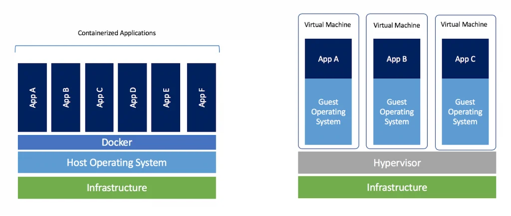

# 🛳 Azure Container

<figure><figcaption></figcaption></figure>

#### **Sanal Makineler:**

* Sanal makineler, tam teşekküllü bir işletim sistemi gerektirirler; her biri kendi işletim sistemine (Guest OS), kütüphanelerine ve bağımsız uygulamalarına sahiptir.
* Bu yapılar, fiziksel donanım üzerinde hypervisor adı verilen bir aracı yazılım tarafından ayrılır ve yönetilir. Bu, her bir sanal makinenin kendi içinde tamamen izole edilmiş bir ortam oluşturmasını sağlar.
* Sanal makinelerin her biri, fiziksel kaynakları (örneğin CPU, bellek) kendi aralarında bölüşür ve bu kaynaklar genellikle sabittir.

#### **Containerlar:**

* Containerlar, işletim sistemini paylaşır ve böylelikle ayrı ayrı işletim sistemlerine (Guest OS) ihtiyaç duymazlar. Bunun yerine, her bir container sadece uygulamanın çalıştırılması için gerekli olan kütüphaneleri ve bağımsız dosyaları (Libs/Bin) içerir.
* Container runtime (örneğin Docker), containerların yönetimi ve izolasyonu için kullanılır ve bu yapılar daha hafif ve esnektir.
* Containerlar daha hızlı başlatılır ve daha az kaynak kullanır çünkü birden fazla container aynı işletim sistemi çekirdeğini paylaşabilir ve gerektiğinde kaynakları dinamik olarak alıp bırakabilir.

### Azure Container Instances;

Azure Container Instances (ACI), Microsoft Azure'un, kullanımı kolay ve yönetim gerektirmeyen bir container hizmetidir. ACI, herhangi bir sanal makine ya da ekstra konfigürasyon olmaksızın Azure'da container'ları çalıştırmanızı sağlar.

* ACI, sanal makinelerin aksine containerları saniyeler içinde başlatma yeteneğine sahiptir, bu da uygulamalarınızı çok daha hızlı bir şekilde çalıştırmanıza olanak tanır.
* ACI, dış dünya 'ya açık uygulamalar için idealdir çünkü Public IP ve DNS name desteği sunar, bu sayede container uygulamalarınızı internete kolayca açabilirsiniz.
* Containerlar, aynı container host üzerinde dahi olsalar birbirlerinden izole edilmiş şekilde çalışır. Bu, uygulamalarınızın birbirlerinin çalışmalarını etkilemeyecek şekilde güvenli bir ortamda çalıştırılmasını sağlar.
* ACI, kaynak gereksinimlerinize göre özel boyutlar seçmenize olanak tanır, böylece ihtiyaç duyduğunuz kaynak miktarını tam olarak belirleyebilir ve aralarında geçiş yapabilirsiniz.
* ACI, Azure Files kullanarak kalıcı depolama oluşturmanıza imkan tanır. Container depolaması geçicidir ancak Azure Files ile verilerinizi kalıcı hale getirebilirsiniz.
* ACI, doğrudan sanal ağlara (VNet) deploy edilebilir ve hem Windows hem de Linux containerlarını destekler, bu da uygulamanın çalışması için esneklik sağlar.


Azure Container Registry (ACR), Azure 'da konteyner imajlarınızı depolamanıza ve yönetmenize olanak tanıyan bir servistir. Docker konteyner imajlarınızı ACR'ye yükleyebilir ve buradan Azure Kubernetes Service (AKS) veya Azure Container Instances gibi hizmetlere kolayca dağıtabilirsiniz. ACR, güvenilir bir şekilde imaj saklama, sürüm kontrolü ve imajlara erişim için entegre kimlik doğrulama mekanizmaları sunar.


### Container groups;

<figure><figcaption></figcaption></figure>

Container grupları, birden fazla container'ın tek bir container host üzerinde bir arada çalıştığı bir yapıdır. Bu yapı, tüm container'ların kaynakları (CPU, bellek), ağ yapılandırmasını (IP adresleri, portlar) ve depolama alanlarını paylaşmalarını sağlar. Bu sayede, aynı görevi yerine getiren ya da birbiriyle iletişim halinde olan uygulamaları gruplayarak yönetmek ve çalıştırmak kolaylaşır. Bir container grubu genellikle bir public IP adresi üzerinden erişilebilir ve belirli portlar üzerinden dış dünyaya hizmet sunar. Bu gruplar ARM şablonları veya YAML dosyaları kullanılarak kolayca deploy edilebilir, ve kaynak kullanımları her bir container'ın ihtiyaçlarına göre topluca hesaplanır. Bu da, yönetilebilir container tabanlı uygulamalar oluşturmanızı sağlar.


Sidecar container, ana uygulama containerının yanında çalışan ve ona yardımcı olan bir containerdır. Genellikle ana uygulamanın yapmadığı yardımcı işlevleri üstlenir.


### Azure Kubernetes Services;

<figure><figcaption></figcaption></figure>

Bu servis, Kubernetes cluster'ınızı Azure üzerinde yönetmenize olanak tanır ve iki ana tür node'dan oluşur:

1. **Azure Managed Node (Master):** Bu, Kubernetes Master node'unu temsil eder ve AKS tarafından otomatik olarak yönetilir. Cluster oluşturulduğunda bu node otomatik olarak oluşturulur ve kullanıcı tarafından görülemez. Kubernetes'in çekirdek bileşenlerini (API sunucusu, etcd, denetleyici yöneticisi, planlayıcı vb.) çalıştırır.
2. **Customer Managed Nodes:** Bunlar, kendi uygulamalarınızın ve servislerinizin çalıştırıldığı nodelardır. Bu nodelar üzerinde konteynerlerinizi ve pod'larınızı planlamak ve çalıştırmak için kendi kaynaklarınızı (CPU, bellek, disk) kullanırsınız ve bu nodeların sayısı üzerinden ücretlendirilirsiniz.

#### **Bileşenler:**

* **kubelet:** Bu, her bir müşteri tarafından yönetilen node üzerinde çalışır ve Azure yönetim node'undan (master) gelen konteyner planlama taleplerini alır.
* **kube-proxy:** Ağ trafiğini yönlendirir ve pod'ların ve servislerin IP adreslerini yönetir.
* **vNIC (Sanal Ağ Arabirimi):** Sanal bir ağ kartıdır ve node'un ağ ile iletişim kurmasını sağlar.
* **Container Runtime:** Konteynerlerin oluşturulmasına ve ağ ile depolama bileşenleriyle etkileşime girmesine izin veren ortamı sağlar.
* **Containers:** Uygulamalarınızın ve servislerinizin çalıştığı konteynerlerdir.

Bu bileşenler, Kubernetes cluster'ınızın sağlıklı ve verimli bir şekilde çalışmasını sağlamak için bir arada çalışır. AKS'nin kullanımı, bu karmaşık bileşenleri yönetme yükünü azaltır ve uygulama dağıtımını, ölçeklendirmeyi ve yönetimini kolaylaştırır.

#### **Azure Kubernetes Service terminolojisi;**

<figure><figcaption></figcaption></figure>

* **Pools:** Pools, benzer konfigürasyona sahip node'ların mantıksal gruplandırılmasıdır. Örneğin, belli bir performansa veya göreve sahip olan VM'ler (sanal makineler) bir pool oluşturabilir.
* **Nodes:** Node'lar, konteynerize uygulamaların çalıştığı VM'lerdir. Kubernetes içinde bu node'lar, Kubernetes master node'u tarafından yönetilir ve son kullanıcıya görünmez.
* **Pods:** Podlar, Kubernetes'te dağıtımın en küçük birimidir. Bir pod, uygulamanızın tek bir örneğini temsil eden bir veya daha fazla konteyner içerebilir.
* **Deployment:** Deployment, podunuzun bir veya daha fazla aynı kopyasını yaratmanızı sağlar. Bu sayede uygulamanızı ölçeklendirebilir ve güncellemeleri yönetebilirsiniz.
* **Manifest:** Manifest, Kubernetes'te bir YAML veya JSON dosyasıdır ve pod, service, volume ve diğer Kubernetes objelerinin nasıl oluşturulacağını tanımlar.

### AKS Networking;

<figure><figcaption></figcaption></figure>

* **ClusterIP:** Bu, sadece Kubernetes cluster'ı içinde iletişim kurmak için kullanılan varsayılan bir servis türüdür. Dış dünyadan doğrudan erişilemez ve yalnızca cluster içindeki diğer uygulamalar veya servisler tarafından erişilebilir.
* **NodePort:** Bu servis türü, bir AKS node'undaki belirli bir porta (örneğin 31000 ila 32767 arasında bir port) gelen trafiği, hizmete bağlı bir pod'a yönlendirir. Bu sayede, dış dünyadan bir Kubernetes servisine erişim sağlanabilir. NodePort, belirli bir port üzerinden dış dünyadan direkt trafiğin AKS node'larına ulaşmasına olanak tanır.
* **LoadBalancer:** Bir Azure Yük Dengeleyici oluşturur ve dış trafikten gelen istekleri uygun servislere yönlendirir. Genellikle, uygulamalarınızı internet üzerinden erişilebilir kılmak için kullanılan standart bir yöntemdir. Bu servis türü, gelen non-direct trafiği alır ve otomatik olarak bir public IP adresi atayarak, AKS içindeki hizmetlere yük dağıtımı yapar.

Azure Kubernetes Service (AKS) cluster'ı oluştururken karşılaşabileceğiniz ağ yapılandırma seçeneği bulunmaktadır. İki temel ağ seçeneği bulunmaktadır: kubenet ve Azure CNI (Container Network Interface).

* **Kubenet:** Bu, Kubernetes'in varsayılan ağ eklentisidir. Kubenet, her bir node için bir VNet (Sanal Ağ) oluşturur. Kubenet ile, podlar node bazında izole edilmiş ağlar kullanır ve birbirleriyle ve dış dünya ile iletişim kurabilmek için NAT (Network Address Translation) üzerinden geçer.
* **Azure CNI:** Azure CNI, pod'ların doğrudan Azure Sanal Ağ'ına (VNet) bağlandığı ve her pod'a bir IP adresi atandığı daha gelişmiş bir ağ yapılandırmasıdır. Bu sayede pod'lar sanal ağdaki diğer servislerle ve kaynaklarla doğrudan etkileşime girebilir. Azure CNI, özellikle gelişmiş ağ senaryoları ve güvenlik gereksinimleri için tercih edilir çünkü her pod, sanal ağın yerel özelliklerini ve güvenlik politikalarını kullanabilir.

### AKS Storage;

<figure><figcaption></figcaption></figure>

* **Volumes:** Kubernetes'te, volume'lar veri saklamak, almak ve kalıcı hale getirmek için kullanılır. Lokal depolama hızlı ve kullanımı kolaydır fakat Kubernetes pod'ları geçici (ephemeral) olarak ele alır. Eğer kalıcı depolama ihtiyacınız varsa, Azure Files veya Azure Managed Disk kullanarak kalıcı volume'lar oluşturabilirsiniz.
* **Persistent Volumes (PV):** PV, pod ile birlikte yaratılır ve pod silindiğinde normalde onunla birlikte silinen depolama alanını, pod silinse bile verileri koruyacak şekilde kalıcı hale getirir.&#x20;
* **Storage Class:** Storage Class 'lar, oluşturulacak depolamanın türünü tanımlamak için kullanılır. Performans ihtiyaçlarına göre Premium veya Standard gibi farklı depolama katmanları seçilebilir. `reclaimPolicy` parametresi ile depolamanın silinip silinmeyeceğini belirleyebilirsiniz.
* **Persistent Volume Claims (PVC):** PVC'ler, pod'lar tarafından kullanılmak üzere Azure Managed Disk veya Azure File gibi belirli bir depolama kaynağından yer istemek için kullanılır. PVC'ler, boyut, erişim modu ve StorageClass gibi özelliklere göre ne tür depolamanın tahsis edileceğini belirtir.

### AKS Scaling;

<figure><figcaption></figcaption></figure>

* **Manual Scale:** Manuel ölçeklendirme, ihtiyaçlara bağlı olarak kullanıcı tarafından el ile yapılan bir ayarlama işlemidir. Bu, pod replikalarının sayısını veya node'ların (sunucuların) sayısını artırarak gerçekleştirilebilir.
* **Cluster Autoscaler:** Cluster Autoscaler, AKS cluster'ındaki node sayısını otomatik olarak talebe göre artırabilir veya azaltabilir. Kubernetes API, her 10 saniyede bir cluster'ı kontrol eder ve node sayısını ayarlamak gerekip gerekmediğini belirler.
* **Horizontal Pod Autoscaler (HPA):** HPA, pod replikalarının sayısını otomatik olarak artırır veya azaltır. Bu karar, belirli performans metriklerine (örneğin, CPU veya memory kullanımı) dayanır. Metrics API, her 30 saniyede bir metrikleri kontrol eder ve replika sayısında bir değişiklik yapılması gerekip gerekmediğine karar verir.

### AKS Bursting;

<figure><figcaption></figcaption></figure>

AKS Bursting, Azure Kubernetes Service (AKS) içinde yüksek talep anlarında kaynakların dinamik olarak artırılabilmesi için kullanılan bir özelliktir. Bu özellik, AKS cluster'ınızın birden fazla node üzerinde yüksek talebi karşılayamadığı durumlarda ek kaynak sağlar.

Yukarıda, AKS cluster'ında Cluster Autoscaler ve Horizontal Pod Autoscaler'ın yanı sıra bir "Virtual Node" gösterilmektedir. Virtual Node, Azure Container Instance (ACI) ile entegredir. Burada olan şu:

* Cluster ve Horizontal Pod Autoscaler'lar, AKS içindeki node ve pod sayısını artırarak ölçeklendirme yapar.
* Talep arttığında ve mevcut node'lar yeterli olmadığında, Virtual Node devreye girer.
* Virtual Node, ACI tarafından sağlanan kaynaklardır ve AKS cluster'ınıza neredeyse sınırsız ölçeklendirme kapasitesi ekler.
* Bu ölçeklendirme işlemi sırasında, yeni pod'lar ACI üzerinde hızla başlatılabilir, bu da anlık yük artışlarını yönetmek için idealdir.


* **Cluster Autoscaler:** AKS'de, talebe göre otomatik olarak fiziksel node sayısını artırır veya azaltır. Uzun süreli ve düzenli kaynak ihtiyacı olan durumlar için idealdir.
* **Horizontal Pod Autoscaler (HPA):** Bir servisin veya uygulamanın pod sayısını, örneğin CPU ya da bellek kullanımı gibi belirli metriklere dayanarak otomatik olarak ayarlar.
* **Virtual Node:** Azure Container Instances (ACI) ile entegre edilmiş bir özelliktir ve AKS cluster'ınızın ölçeklendirme kapasitesini genişletir. Ani ve yüksek talepler için, fiziksel sunucuların başlatılması ve yapılandırılmasını beklemeden hızlı ölçeklendirme sağlar.\
  \
  \
  Cluster Autoscaler ve HPA, genel ölçeklendirme gereksinimleri için kullanılırken, Virtual Node özellikle ani yük artışları, kısa süreli iş yükleri vb senaryolar için tercih edilir.



