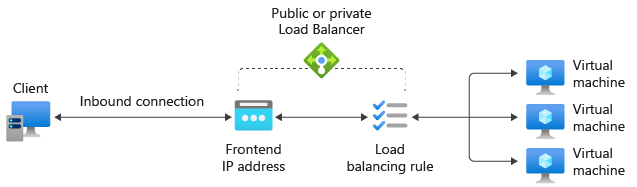
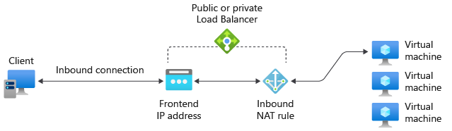
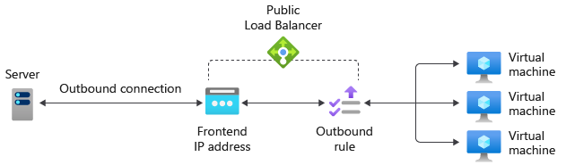
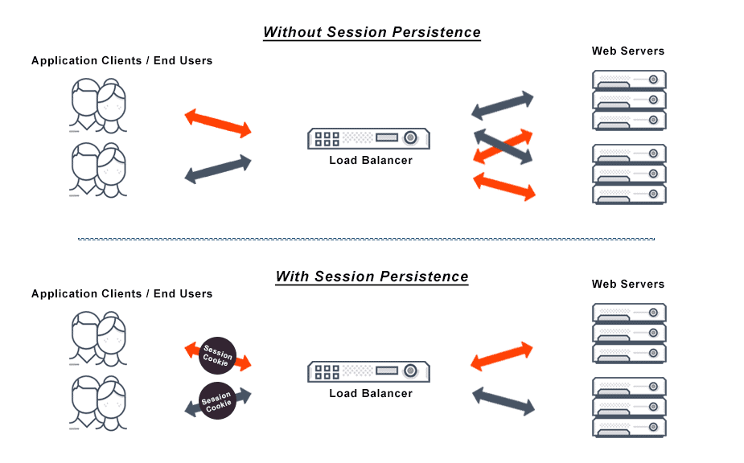
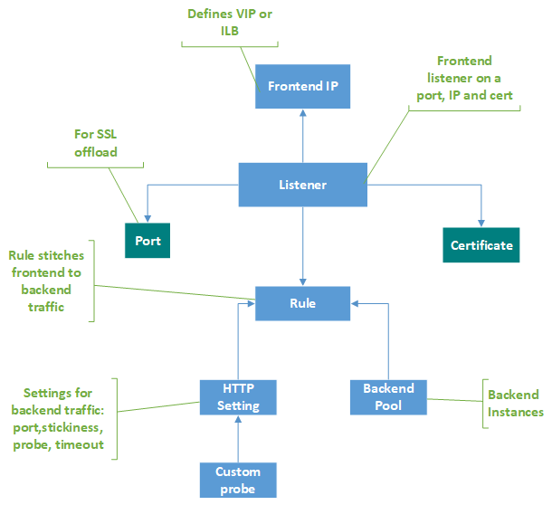
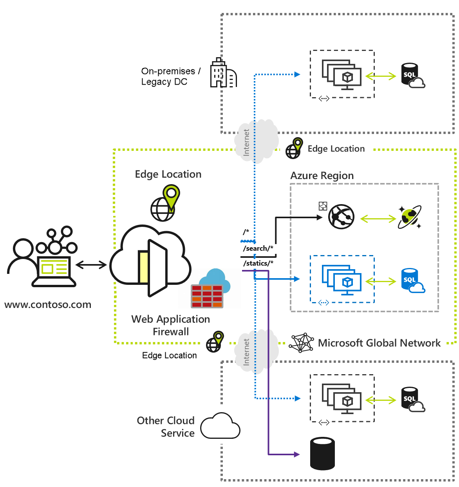

# 🧑‍🌾 Load Balancing

### Azure Load Balancer;

Azure Load Balancer, Azure bulut hizmetlerinde, gelen ağ trafiğini birden fazla sunucu arasında dağıtarak yükü dengelenmesini ve böylece uygulama performansını ve kullanılabilirliğini artıran bir hizmettir. Azure Load Balancer, ağ katmanında (Layer 4 - TCP/UDP) çalışır. Bu, uygulama katmanı yerine TCP ve UDP protokollerini kullanarak trafik dağıtımı yaptığı anlamına gelir.

<figure><figcaption></figcaption></figure>


Azure Load Balancer ve Application Gateway Arasındaki Fark Nedir?

**Cevap:** Azure Load Balancer, ağ seviyesinde (Layer 4) çalışır ve temel yük dengeleme işlevleri sunar. Azure Application Gateway ise uygulama seviyesinde (Layer 7) çalışır ve daha karmaşık özellikler sunar, örneğin URL tabanlı yönlendirme ve web uygulaması güvenlik duvarı vb.


1. **Public Load Balancer (Genel Yük Dengeleyici):**
   * **Tanım ve Kullanım:** Azure'daki Public Load Balancer, internet üzerinden gelen trafik için tasarlanmıştır. Azure sanal makinelerine (VM'ler) veya VM setlerine dış dünyadan erişimi yönetir ve dağıtır.
   * **IP Adresi ve Erişim:** Genel bir IP adresi kullanır. Bu, internet üzerinden herkese açık ve erişilebilen bir IP adresidir.
   * **Uygulama Senaryoları:** İnternet üzerinden erişilebilir web sunucuları veya diğer uygulamalar için kullanılır.&#x20;
2. **Internal Load Balancer (Dahili Yük Dengeleyici):**
   * **Tanım ve Kullanım:** Internal Load Balancer, Azure Virtual Network (VNet) içindeki trafik için kullanılır. Bu, Azure kaynaklarınızın internete maruz kalmadan iç ağ üzerinde iletişim kurmasını sağlar.
   * **IP Adresi ve Erişim:** Özel bir IP adresi kullanır. Bu adres, yalnızca VNet içindeki veya bağlı ağlardaki kaynaklar tarafından erişilebilir. İnternet üzerinden doğrudan erişilemez.
   * **Uygulama Senaryoları:** Özellikle şirket içi uygulamalar, veri tabanları ve iç hizmetler için idealdir. Bu yük dengeleyiciler, VNet içindeki kaynaklar arasında trafik akışını yönetir ve dengelemeye yardımcı olur, ancak bu trafik dış dünya ile doğrudan iletişim kurmaz.

**Farklar:**

* **Erişim:** Public Load Balancer internet üzerinden erişilebilirken, Internal Load Balancer sadece özel ağlar üzerinden erişilebilir.
* **IP Adresi:** Public, genel IP adresleri kullanır; Internal ise özel IP adresleri kullanır.
* **Kullanım Senaryoları:** Public genellikle dış müşterilere yönelik hizmetler için, Internal ise şirket içi veya sınırlı erişim gerektiren uygulamalar için tercih edilir.

\
Azure Load Balancer'da farklı türde kurallar bulunur ve her biri belirli görevler için kullanılır:

1. **Load Balancing Rules (Yük Dengeleme Kuralları):**

<figure><figcaption></figcaption></figure>

* **Açıklama:** Bu kurallar, gelen trafiği Azure'daki birden fazla sunucu arasında dağıtmak için kullanılır. Her kural, gelen istekleri belirli bir protokol (genellikle TCP veya UDP), bir ön uç portu ve bir arka uç portu üzerinden yönlendirir.
* **İşlev:** Örneğin, bir web uygulaması için 80,8080 vb portlardan gelen trafiği, Load Balancer'ın arkasındaki VM'ler arasında dengelemek için yük dengeleme kuralları kullanılır.&#x20;

1. **Inbound NAT Rules (Gelen NAT Kuralları):**

<figure><figcaption></figcaption></figure>

* **Açıklama:** Bu kurallar, Azure'un dışından gelen trafik için belirli VM'ler için port çevirisi yapar. Her kural, dışarıdan gelen bir portu, Load Balancer arkasındaki belirli bir VM'nin portuna yönlendirir.
* **İşlev:** Bu, özellikle belirli makineler için uzaktan erişim kurmak (RDP veya SSH gibi) istendiğinde kullanışlıdır. Her makineye özgü bir port açarak, dış dünyadan doğrudan o makineye erişim sağlar.

1. **Outbound Rule (Giden Kural):**

<figure><figcaption></figcaption></figure>

* **Açıklama:** Arka uç havuzundaki (backend pool) sanal makinelerin internete veya başka bir hizmete trafik göndermesine izin veren kurallardır.
* **İşlev:** Örneğin, bir VM'nin güncellemeleri indirmesi veya bir harici API'ye istek göndermesi gerekiyorsa, outbound rule'lar bu trafiği yönlendirmek için kullanılır.

#### Session persistence:

<figure><figcaption></figcaption></figure>

Azure'da "session persistence", bilinen bir diğer adıyla "sticky sessions", bir kullanıcının ya da oturumun süresi boyunca tüm isteklerinin aynı arka uç sunucuya (örneğin, bir sanal makineye) yönlendirilmesini sağlayan bir yöntemdir. Bu, Load Balancer'ın kullanıcı oturum bilgilerini, çerezleri veya diğer bilgilerini hatırlamasını ve sürekli olarak aynı kullanıcıya hizmet veren arka uç sunucuya trafik göndermesini sağlar.

1. **None (Varsayılan):**
   * Bu yapılandırma, oturum sürekliliği olmadan çalışır. Burada trafik, kaynak IP, kaynak port, hedef IP, hedef port ve protokol olmak üzere beş öğenin birleşiminden oluşan bir hash üzerinden yönlendirilir. Bu yöntemle, aynı kullanıcı oturumundaki ardışık istekler farklı arka uç sunuculara düşebilir, çünkü her istek bağımsız olarak değerlendirilir.
2. **Client IP:**
   * Bu yöntemde, trafik yönlendirme, yalnızca kaynak IP ve hedef IP'nin hash'ine dayanır. Bu, aynı kaynak IP adresinden gelen isteklerin, hedef IP adresi değişmediği sürece aynı arka uç sunucuya yönlendirilmesini sağlar. Bu, kullanıcı oturumunun belirli bir arka uç sunucuyla "yapışkan(sticky)" olmasını sağlar.
3. **Client IP and protocol:**
   * Trafik burada, kaynak IP adresi ve kullanılan protokolün hash'ine dayanarak yönlendirilir. Aynı kaynak IP adresi ve protokolü kullanan istekler, süreklilik arz eden şekilde aynı arka uç sunucuya yönlendirilecektir. Bu, önceki yönteme benzer, ancak protokol bilgisi de süreklilik için dikkate alınır.

Oturum sürekliliği, özellikle kullanıcı oturumunun durum bilgisini koruması gereken uygulamalar için önemlidir. Örneğin, bir alışveriş sepeti uygulamasında kullanıcının oturumu süresince alışveriş sepeti bilgisini korumak için bu özelliğe ihtiyaç duyulabilir. Ancak, bu yöntem yük dağılımını etkileyebilir ve bazı arka uç sunucular üzerinde diğerlerine göre daha fazla yük oluşmasına neden olabilir, bu yüzden kullanımı ihtiyaca göre dikkatlice değerlendirilmelidir.


Azure Load Balancer SSL sonlandırmayı doğrudan desteklemez. Azure Load Balancer, ağ katmanında (Layer 4) çalışır ve TCP/UDP trafik yük dengelemesi sağlar. Bu, yalnızca ağ trafiğinin dağıtımıyla ilgilendiği ve uygulama katmanı protokollerini (örneğin HTTP/HTTPS) veya bu protokollerle ilişkili işlemleri (örneğin SSL sonlandırma) işlemediği anlamına gelir.

SSL sonlandırması uygulama katmanında (Layer 7) gerçekleşir. Azure'da SSL sonlandırması yapmak için genellikle Azure Application Gateway kullanılır. Azure Application Gateway, HTTP, HTTPS ve Websocket trafiğini yönetebilir ve SSL sonlandırması, URL tabanlı yönlendirme, özel çerezler, HTTP başlıklarına göre yönlendirme ve Web Application Firewall (WAF) gibi daha gelişmiş özellikler sunar.\



<figure><figcaption></figcaption></figure>

Özetle,

Azure Load Balancer is a Layer 4 network balancer, can balance TCP and UDP traffic and doesn't support SSL offloading. If you want to implement load balancing application layer(HTTPS), use Application Gateway.

### Azure Application Gateway;

<figure><figcaption></figcaption></figure>

\
Azure Application Gateway, Microsoft Azure'da sunulan bir web trafik yük dengeleyici hizmetidir. Bu hizmet, özellikle web uygulamaları için tasarlanmıştır ve kullanıcıların internet üzerinden uygulamalara erişimini yönetir.&#x20;

#### Bileşenler:

<figure><figcaption></figcaption></figure>

1. **Frontend IP**: Application Gateway'e gelen tüm isteklerin ilk olarak ulaştığı yerdir. Burada tanımlanan IP adresi, genellikle bir Kamu IP'si (İnternet'e açık) veya özel bir IP olabilir (İç ağ içinde kullanım için).
2. **Listener**: İstekleri dinleyen ve belirli bir protokol (HTTP veya HTTPS) ve porta göre işleyen bileşendir. Listener, hangi tür trafik ve isteklerin işleneceğini ve hangi kuralların uygulanacağını belirler.
3. **Certificate**: Eğer HTTPS dinleyicisi varsa ve SSL/TLS şifreleme kullanılıyorsa, bu sertifika bu şifrelemeyi sağlamak için kullanılır. Bu, trafik şifrelemesi ve güvenliği için esastır.
4. **Rule (Kural)**: İsteklerin nasıl işleneceğini belirleyen kurallardır. Bu kurallar, hangi yoldan gelen isteklerin hangi backend havuzuna yönlendirileceğini tanımlar.
5. **Port**: Listener tarafından dinlenen belirli bir portu tanımlar. HTTP genellikle port 80 üzerinden, HTTPS ise port 443 üzerinden işlenir.
6. **HTTP Setting**: Arka uç havuzundaki sunuculara iletilen trafik için ayarları belirler. Bu, zaman aşımı, prob ayarları ve yapışkan oturum (session stickiness) gibi detayları içerir.
7. **Custom Probe (Özel Sonda)**: Backend havuzundaki sunucuların sağlık durumunu kontrol etmek için kullanılır. Bu sondalar, belirli bir yük dengeleme veya yönlendirme kararı verilmeden önce sunucunun sağlıklı olup olmadığını belirler.
8. **Backend Pool**: İsteklerin yönlendirildiği ve işlendiği sunucuların veya hizmetlerin bir koleksiyonudur.
9. **Backend Instances**: Backend pool içindeki bireysel sunucular veya hizmetlerdir.

#### Routing Rules;

Azure Application Gateway'in iki tür yönlendirme kuralı mevcuttur: "Path Based Routing" ve "Multiple-site Routing".&#x20;

1. **Path Based Routing**:

<figure><figcaption></figcaption></figure>

* Bu kural, URL'deki belirli bir yola (path) göre istekleri farklı backend havuzlarına yönlendirir.
* Örneğin, `/images/*` yolundaki bir istek, görüntü dosyalarını barındıran bir backend havuzuna yönlendirilirken; `/video/*` yolundaki bir istek, video dosyalarını barındıran başka bir backend havuzuna yönlendirilir.
* Bu yöntem, farklı türde içerikler için farklı sunucu havuzları kullanarak uygulamanın daha verimli çalışmasını sağlar.
* Bu yönlendirme, uygulamanın içeriğine göre optimize edilmiş sunucu kaynaklarını kullanmasına olanak tanır.

1. **Multiple-site Routing**:

<figure><figcaption></figcaption></figure>

* Bu kural, tek bir Application Gateway üzerinden birden fazla siteye ev sahipliği yapmayı sağlar.
* Kullanıcılar farklı alan adları (örneğin `contoso.com` ve `fabrikam.com`) kullanarak gateway'e istek gönderdiğinde, istekler her bir alan adını karşılayan farklı backend havuzlarına yönlendirilir.
* Bu yöntemle, tek bir fiziksel yapı üzerinden çok sayıda bağımsız web sitesinin yönetimi mümkün olur ve altyapı maliyetlerinden tasarruf edilir.

Her iki yönlendirme kuralı da, web trafiğini daha akıllı ve etkin bir şekilde yönetmek için kullanılır. Path Based Routing içerik türüne göre, Multiple-site Routing ise alan adına göre yönlendirme yapar.

#### Application Gateway Alternatifleri;

<figure><figcaption></figcaption></figure>

1. **Azure Front Door**:

<figure><figcaption></figcaption></figure>

* Modern bir CDN (İçerik Dağıtım Ağı) çözümüdür ve güvenilir, hızlı içerik teslimi sağlar.
* Microsoft'un küresel kenar ağını (edge network) kullanır; bu ağ yüzlerce global ve yerel nokta da dünya genelinde dağıtılmıştır.
* Yol tabanlı (path based) ve çoklu site (multi-site) yönlendirme mevcuttur.
* Web Uygulaması Güvenlik Duvarı (WAF), opsiyonel bir bileşen olarak eklenebilir.

1. **Azure Traffic Manager**:

<figure><figcaption>
Priority Method
</figcaption></figure>

* DNS tabanlı bir yük dengeleyicidir ve dünya çapında halka açık olan ve kullanıcıların doğrudan erişim sağladığı internet uygulamalarına gelen trafiği yönetir.
* DNS'in yönlendirme yeteneğini kullanarak, istemci isteğini uygun uç noktaya yönlendirir.
* Traffic Manager, yapılandırdığımız yönlendirme kuralına göre en iyi uç noktayı bulur ve DNS yanıtını uç noktanın adı ile döndürür. İstemci daha sonra doğrudan bu uç noktaya ulaşır..
* Yönlendirme metotları arasında Öncelik (Priority), Ağırlıklı (Weighted), Coğrafya (Geography), Performans (Performance) ve İç İçe Profil (Nested Profile) bulunur.

### Azure Bastion;

\
Azure Bastion, Azure sanal makinelerine güvenli ve kolay erişim sağlayan bir hizmettir. Bu hizmet, tarayıcı tabanlı bir arayüz üzerinden doğrudan RDP (Remote Desktop Protocol) ve SSH (Secure Shell) bağlantıları kurmanıza olanak tanır.&#x20;

<figure><figcaption></figcaption></figure>

Azure Bastion özellikleri:

1. **Direct RDP and SSH in Azure Portal**:
   * Kullanıcıların sanal makinelerine tarayıcı üzerinden doğrudan RDP veya SSH yapmasını sağlar.
   * Bu, herhangi bir SSH veya RDP istemcisini yerel bilgisayara yüklemeye gerek kalmadan çalıştırılabilir.
2. **Public IP is not required**:
   * Sanal makinelerinizi internet üzerinden doğrudan erişilebilir hale getirmek için genel IP adresi ataması gerekmez.
   * Bastion, özel IP adresleri üzerinden bağlantı kurarak VM'lerin güvenliğini artırır.
3. **No need to tweak NSGs (Network Security Groups)**:
   * Bastion, özel IP adresler üzerinden bağlantı kurduğu için, NSG kurallarını yönetmek ve karmaşık kurallar yazmak gerekmez.
4. **Port scanning protection**:
   * Genel IP adresleri yayınlamadığı için, saldırganlar tarafından port tarama faaliyetleri gerçekleştirilemez.
5. **Hardening**:
   * Bastion hizmeti, güvenlik önlemleriyle donatılmış bir platform olarak yönetilir ve güçlendirilir.
6. **Basic and Standard SKUs**:
   * Basic SKU, temel RDP/SSH erişimi sağlar.
   * Standard SKU ise, Azure Bastion'un daha büyük ölçekte yönetim özelliklerini ve daha fazla bağlantıyı desteklemesini sağlar.

Azure Bastion, özellikle güvenlik duvarlarının ve ağ güvenlik gruplarının karmaşıklığı olmadan, sanal makinelerinize güvenli bir şekilde erişmek istediğinizde kullanışlıdır.


Bir Azure Bastion hizmeti oluştururken, hizmetin karşılayabileceği eşzamanlı RDP ve SSH oturumlarının sayısını belirlemek için belirli bir "instance count" değeri ayarlarsınız. Daha yüksek bir instance count, daha fazla kullanıcı tarafından eşzamanlı bağlantıların desteklenmesi anlamına gelir, bu da daha büyük ölçekte veya daha yüksek kullanıcı trafiğine sahip ortamlar için uygundur.

Örneğin, eğer bir şirketin Azure'daki çok sayıda VM'ine aynı anda birçok mühendisin erişmesi gerekiyorsa, yeterli erişim kapasitesini sağlamak için daha yüksek bir instance count değeri seçilebilir. Bu sayede, yüksek talep zamanlarında bile tüm mühendislerin sorunsuz bir şekilde çalışmalarına devam edebilmeleri sağlanır.

