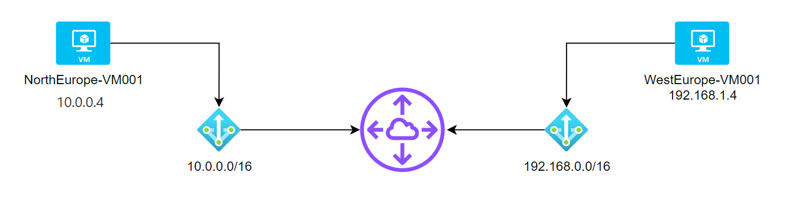
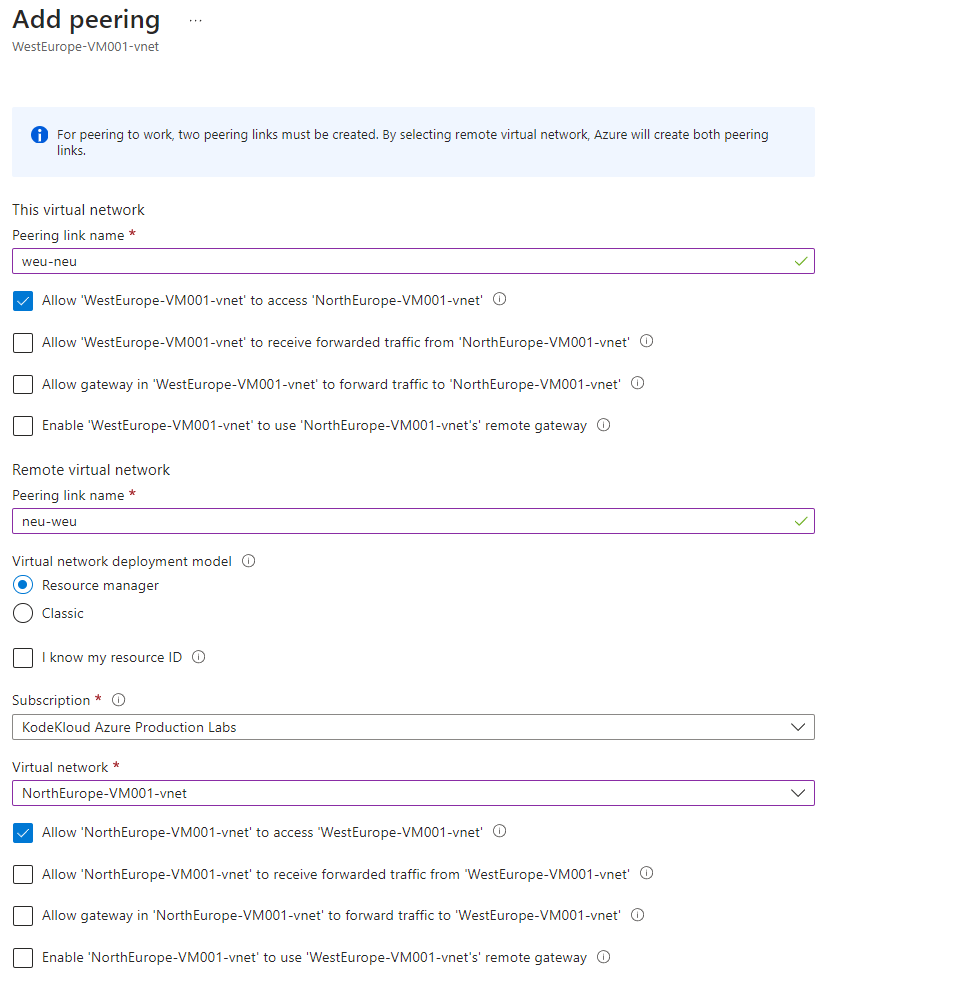
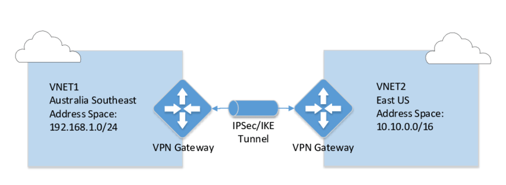
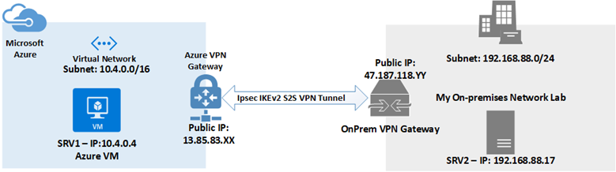
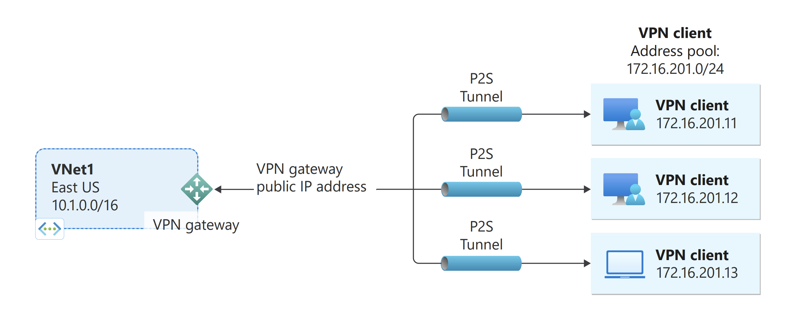
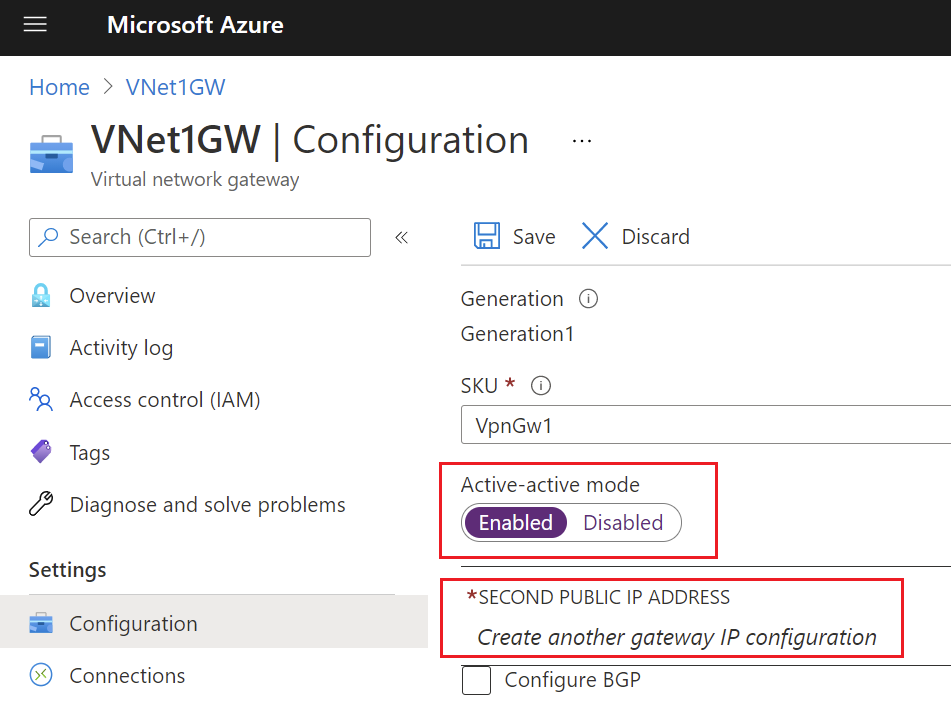
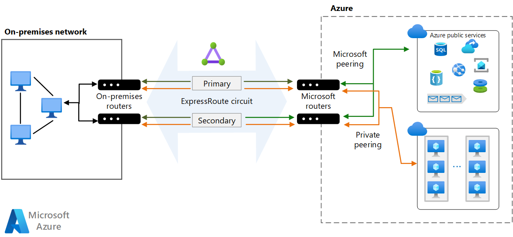

# 🥍 Network Advanced

### VNet Peering:

VNet Peering, iki farklı Azure sanal ağını birbirine bağlar. Bu, ağlar arasında trafiği iletebilir hale getirir ve Azure'daki kaynakların ve servislerin birbirleriyle iletişim kurmasını sağlar. VNet Peering oluşturmak için her iki sanal ağın sahibi tarafından onay gereklidir ve her iki taraf da izin vermelidir. Ayrıca, bağlanan sanal ağların IP adres aralıkları birbirine çakışmamalıdır. VNet Peering, farklı Azure bölgeleri arasında veya aynı bölgedeki farklı abonelikler arasında da çalışabilir.&#x20;

Azure'da "Global VNet Peering" ve "Regional VNet Peering" olmak üzere iki farklı VNet Peering türü vardır.&#x20;

<figure><figcaption></figcaption></figure>

1. **Global VNet Peering**: Bu, farklı Azure bölgelerinde yer alan VNet'ler arasındaki iletişimi mümkün kılan bir yapıdır. Örneğin, Region X'deki VNet-A ile Region Y'deki VNet-B arasında kurulan bir Global VNet Peering, bu iki farklı bölgedeki VNet'lerin güvenli ve özel bir şekilde veri alışverişinde bulunmasına olanak tanır.
2. **Regional VNet Peering**: Aynı Azure bölgesi içindeki VNet'ler arasında iletişim kurmayı sağlar. Bu, aynı bölgedeki VNet'lerin, örneğin VNet-B ve VNet-C'nin, yüksek hızda ve düşük latency ile veri transferi yapmalarına imkan verir.

VNet Peering avantajları şunlardır:

* **Microsoft backbone ağı üzerinden veri transferi**: Bu, veri transferi sırasında privacy ve security'yi artırır ve düşük latency sağlar.
* **High-speed data transfer**: VNet Peering, network yapılandırmasını basitleştirir ve ağ performansını artırır. (Trafiğin internet üzerinden gönderilmesine gerek kalmaz)
* **Provides connectivity between Azure virtual networks**: VNet Peering, farklı senaryolarda connectivity sağlar; aynı region içindeki VNet'ler, farklı regionlardaki VNet'ler, aynı subscription içindeki veya farklı subscription'lardaki VNet'ler, aynı tenant veya farklı tenant'lara ait VNet'ler arasında bağlantı kurulabilir.

#### Peering işlemi:

<figure><figcaption></figcaption></figure>

<figure><figcaption></figcaption></figure>

İki sanal ağ (VNet), WestEurope-VM001-vnet ve NorthEurope-VM001-vnet arasında bir peering kurulumu gerçekleştireceğiz.&#x20;

1. İlk olarak, her iki VNet için peering linklerine benzersiz isimler vermeliyim. Ben WestEurope VNet için `weu-neu` ismini, NorthEurope VNet için ise `neu-weu` ismini seçtim.
2. Daha sonra trafik izinlerini ayarlamam gerekiyor:
   * WestEurope VNet'in NorthEurope VNet'e erişimine izin vermek için "Allow 'WestEurope-VM001-vnet' to access 'NorthEurope-VM001-vnet'" kutucuğunu işaretledim.
   * NorthEurope VNet'in WestEurope VNet'e erişimine izin vermek için "Allow 'NorthEurope-VM001-vnet' to access 'WestEurope-VM001-vnet'" kutucuğunu işaretledim.
3. "Remote virtual network" bölümünde, peering yapılacak uzak VNet için daha önceden belirlediğim peering link ismini ve VNet'i seçtim.
4. Peering işlemini yapacağım Azure aboneliğimi, yani "KodeKloud Azure Production Labs"ı seçtim.
5. Peering yapacağım uzak VNet olarak "NorthEurope-VM001-vnet"i seçtim.
6. İşlem tamamlandı. Kaydedip çıkabiliriz.

<figure><figcaption></figcaption></figure>

* North Europe tarafına geldiğimizde, peering işleminin buraya yansıdığını gözlemliyoruz.

<figure><figcaption></figcaption></figure>

* Görüleceği üzere, 2 farklı region'da çalışan ve farklı vnetlere sahip sunucular birbirleri ile iletişime geçebildi.



1. **Allow 'NorthEurope-VM001-vnet' to receive forwarded traffic from 'WestEurope-VM001-vnet'**:
   * Bu seçenek, WestEurope-VM001-vnet'den gelen ve belirli bir yöneltme politikası veya cihaz tarafından belirli bir hedefe yönlendirilen (forwarded) trafiğin NorthEurope-VM001-vnet tarafından alınıp alınmayacağını kontrol eder. Yani, WestEurope VNet'inden gelen trafik doğrudan değil de, bir yöneltme kuralları seti (route table) veya ağ geçidi (gateway) üzerinden geçirilerek NorthEurope VNet'ine gönderiliyorsa, bu trafik NorthEurope VNet tarafından kabul edilebilir.
2. **Allow gateway in 'NorthEurope-VM001-vnet' to forward traffic to 'WestEurope-VM001-vnet'**:
   * Bu seçenek, NorthEurope-VM001-vnet içerisinde yer alan bir ağ geçidinin (VPN veya ExpressRoute gibi), WestEurope-VM001-vnet'e trafik göndermesine izin verilip verilmeyeceğini belirler. Burada ağ geçidi, VNet dışındaki ağlara (örneğin, şirket içi ağlar veya internet) bir köprü görevi görür ve bu köprü üzerinden trafik WestEurope VNet'ine yönlendirilebilir.
3. **Enable 'NorthEurope-VM001-vnet' to use 'WestEurope-VM001-vnet's remote gateway**:
   * Bu seçenek, NorthEurope VNet'in, WestEurope VNet'ine atanan ve orada konumlandırılan bir ağ geçidini kullanarak kendi trafiğini dış ağlara (internet veya şirket içi ağlar gibi) yönlendirip yönlendiremeyeceğini kontrol eder. Eğer bu seçenek etkinleştirilirse, NorthEurope VNet, kendi bağlantıları yerine WestEurope VNet'in ağ geçidini kullanarak dış dünyaya bağlanabilir. Bu genellikle, bir VNet'in doğrudan internete çıkışı olmadığında veya maliyet tasarrufu amacıyla diğer VNet'in ağ geçidini ortak kullanmak istendiğinde kullanılır.


### VPN Gateway;

#### Vnet-to-vnet;

<figure><figcaption></figcaption></figure>

Azure'da "VNet-to-VNet" (Sanal Ağdan Sanal Ağa), iki veya daha fazla Azure Sanal Ağı'nın (VNet) birbirleriyle güvenli bir şekilde bağlantı kurmasını sağlayan bir yöntemdir. Bu, özellikle farklı Azure bölgelerinde veya hatta farklı Azure aboneliklerinde yer alan sanal ağların birbirleriyle iletişim kurabilmesi için kullanılır.

<figure><figcaption>
vnet peering vs vnet-to-vnet
</figcaption></figure>

VNet-to-VNet VPN bağlantısı, aşağıdaki kullanım senaryoları için kullanışlıdır:

1. Farklı bölgelerdeki veya coğrafi konumlarındaki sanal ağlar arasında iletişim: Örneğin, bir Azure bölgesinde bulunan bir sanal ağı, başka bir Azure bölgesindeki bir sanal ağa bağlayabilirsiniz. Bu, farklı coğrafi bölgelerdeki kaynaklarınız arasında güvenli bir ağ bağlantısı oluşturmanıza olanak tanır.
2. Yedekleme ve felaket kurtarma: Birincil sanal ağ ile yedek sanal ağ arasında bir VNet-to-VNet VPN bağlantısı kurarak, felaket kurtarma senaryoları için kaynaklarınızı yedekleyebilirsiniz. Birincil veri merkezindeki hizmet kesintilerine karşı yedek veri merkezindeki kaynaklara erişim sağlamak için bu bağlantıyı kullanabilirsiniz.
3. Farklı aboneliklerdeki sanal ağlar arasında iletişim: Farklı Azure aboneliklerine sahipseniz ve bu aboneliklerdeki kaynaklar arasında iletişim kurmanız gerekiyorsa, VNet-to-VNet VPN bağlantısı kullanarak bu iletişimi sağlayabilirsiniz.

VPN Gateway'ler, güvenli iletişim için IPsec protokolünü kullanır ve iletişim sırasında veri şifrelemesi sağlar.

Azure'da VNet-to-VNet VPN bağlantısı oluşturmak ve yönetmek için Azure Portal veya Azure Command-Line Interface (CLI) gibi yönetim araçları kullanılabilir. Bağlantıyı oluştururken, her iki sanal ağın IP adres aralıklarının çakışmamasına dikkat edilmelidir.

#### Site-to-Site;

<figure><figcaption></figcaption></figure>

Azure Site-to-Site (S2S) bağlantısı, Microsoft Azure sanal ağınızı yerel ağınızla (genellikle bir şirket ağı) VPN (Sanal Özel Ağ) üzerinden güvenli bir şekilde bağlamak için kullanılan bir yöntemdir. Bu tür bir bağlantı, şirketinizin yerel ağındaki kaynakların ve uygulamaların Azure'daki sanal makineler ve hizmetlerle sorunsuz bir şekilde iletişim kurmasına olanak tanır.

<figure><figcaption></figcaption></figure>

#### Sanal Ağ ve VPN Gateway Oluşturma

* **Gateway Alt Ağı Oluşturun**: Sanal ağınızda özel bir gateway alt ağı oluşturun. Bu alt ağ, VPN gateway için ayrılmalıdır.
* **VPN Gateway Oluşturun**: Sanal ağınızda bir VPN Gateway oluşturun ve bu gateway'i "Route-Based" VPN türü olarak ayarlayın.

#### Yerel VPN Aygıtı Yapılandırma

* **VPN Aygıtı Seçin**: Uyumlu bir VPN aygıtı seçin ve yerel ağınızda kurun. bknz, [https://learn.microsoft.com/en-us/azure/vpn-gateway/vpn-gateway-about-vpn-devices](https://learn.microsoft.com/en-us/azure/vpn-gateway/vpn-gateway-about-vpn-devices)
* **Yapılandırma**: Aygıtı, Azure VPN Gateway ile bağlantı kuracak şekilde yapılandırın. Bu, IP adresleri, şifreleme protokolleri ve tünel ayarlarını içerir.

#### VPN Gateway ile Yerel VPN Aygıtı Arasında Bağlantı Kurma

* **Bağlantı Oluşturun**: Azure portal üzerinden, VPN Gateway ve yerel VPN aygıtı arasında bir bağlantı oluşturun.
* **Paylaşılan Anahtar Belirleme**: VPN bağlantısı için bir paylaşılan anahtar (pre-shared key) belirleyin. Bu anahtar, her iki tarafta da aynı olmalıdır.

#### IPsec Tünelini Yapılandırma

* **IPsec Tüneli Kurun**: VPN Gateway ve yerel VPN aygıtı arasında bir IPsec VPN tüneli kurun. Bu, güvenli veri aktarımını sağlar.

#### Yönlendirme ve Ağ Politikaları

* **Yönlendirme Kuralları Belirleme**: Yerel ağınızdan Azure sanal ağınıza olan trafik akışını yönetecek yönlendirme kurallarını belirleyin.
* **Ağ Politikalarını Ayarlayın**: Hangi trafiklerin VPN üzerinden geçeceğini ve hangi trafiklerin dışarıda tutulacağını belirleyin.

#### Bağlantıyı Test Etmek

* **Bağlantıyı Test Edin**: Kurulum tamamlandıktan sonra, yerel ağınızdan Azure sanal ağınıza olan bağlantıyı test edin.

#### Point-to-site;

Azure Point-to-Site (P2S) VPN, bireysel kullanıcıların Azure sanal ağlarına uzaktan, güvenli bir şekilde bağlanmalarını sağlayan bir VPN çözümüdür. Bu tür bir bağlantı, genellikle evden çalışanlar ya da mobil çalışanlar gibi bireysel cihazların Azure'daki kaynaklara güvenli bir şekilde erişmesini gerektiren durumlarda kullanılır.

<figure><figcaption></figcaption></figure>

#### Çalışma Prensibi

* **Bağlantı Kurulumu**: Kullanıcı, Azure sanal ağına özel bir VPN istemcisi kullanarak bağlanır. Bu istemci, kullanıcının cihazına kurulur ve VPN bağlantısını yönetir.
* **Kimlik Doğrulama**: Kullanıcı, Azure sanal ağa bağlanmadan önce kimlik doğrulamasından geçer. Bu genellikle bir sertifika veya Azure AD kimlik bilgileri aracılığıyla yapılır.
* **Şifreli Tünel**: Bağlantı, kullanıcı cihazı ve Azure VNet arasında güvenli, şifrelenmiş bir tünel üzerinden gerçekleşir.
* **Erişim Kontrolü**: Yöneticiler, hangi kullanıcıların ve cihazların Azure kaynaklarına erişebileceğini kontrol edebilir.

<figure><figcaption></figcaption></figure>

#### Sanal Ağ ve Gateway Oluşturmak

* **Sanal Ağ Oluşturun**: Azure portalında bir sanal ağ (VNet) oluşturun.&#x20;
* **Gateway Alt Ağı**: Sanal ağınızda özel bir gateway alt ağı oluşturun. Bu alt ağ, VPN gateway için ayrılmış olmalıdır.
* **VPN Gateway Oluşturun**: Sanal ağınızda bir VPN Gateway oluşturun. Gateway tipi olarak "VPN" ve VPN türü olarak "Route-Based" seçin.

#### VPN Gateway için Point-to-Site Yapılandırması

* **Point-to-Site Yapılandırması**: VPN Gateway'inizde Point-to-Site yapılandırmasını gerçekleştirin. Burada, adres havuzu (VPN kullanıcıları için IP adres aralığı) ve diğer ayarları belirleyin.

#### VPN İstemcisini İndirmek ve Kurmak

* **VPN İstemcisini İndirin**: Azure portalından özel VPN istemcisini indirin. Her VPN Gateway için özel bir VPN istemcisi üretilir.
* **İstemciyi Kullanıcı Cihazlarına Kurun**: İndirdiğiniz VPN istemcisini kullanıcıların cihazlarına kurun.

#### Bağlantıyı Test Etmek

* **VPN Bağlantısını Test Edin**: Kullanıcıların cihazlarından VPN bağlantısını başlatarak test edin. Bağlantı başarılı olmalı ve kullanıcılar Azure VNet üzerindeki kaynaklara erişebilmelidir.

### Gateway Transit;

<figure><figcaption></figcaption></figure>

Diyelim ki bir şirketin merkezi ofisi ve birkaç şubesi var. Her şube için ayrı bir VNet oluşturulmuş olsun. Merkezi ofiste, site-to-site VPN ile şubeler arası bağlantıyı sağlayacak bir ağ geçidi kurulur. Gateway Transit kullanılarak, şubelerin her biri bu merkezi VPN ağ geçidini kullanabilir, böylece her şube için ayrı ağ geçitleri kurmaya gerek kalmaz.

Normalde, her şubenin kendi site-to-site VPN bağlantısına ihtiyacı olurdu. Ancak Gateway Transit sayesinde, tüm şubeler merkezi ofisteki tek bir ağ geçidini kullanır. Bu, hem yapılandırma karmaşıklığını azaltır hem de maliyeti düşürür.

#### Sonuç ve Avantajlar

* **Maliyet Tasarrufu**: Her şube için ayrı VPN Gateway kurma ihtiyacı ortadan kalkar.
* **Yönetim Kolaylığı**: Ağ geçidi ve güvenlik politikaları merkezden yönetilir, bu da ağ yönetiminin daha kolay ve tutarlı olmasını sağlar.
* **Ölçeklenebilirlik**: Yeni şubeler eklendiğinde, kolayca mevcut ağ yapısına entegre edilebilirler.

### High Availability;

<figure><figcaption></figcaption></figure>

1. **Active/Standby**: Bu yapılandırmada, iki VPN Gateway örneği vardır: biri aktif (trafik alıp gönderiyor) ve diğeri yedek (standby). Yedek Gateway, aktif olanın başarısız olması durumunda devreye girer. Bu, sürekli servis sağlamanın yanı sıra, planlı bakım süreçlerinde de kesintisiz çalışmayı garantiler. Ancak, yedek Gateway pasif durumda olduğu için, kaynak kullanımı ve maliyet açısından daha verimlidir.
2. **Active/Active**: Bu durumda, her iki VPN Gateway de aktiftir ve trafiği eş zamanlı olarak işler. Bu, daha yüksek bir yüksek kullanılabilirlik seviyesi sağlar ve her iki Gateway de dengeli bir şekilde trafik yükünü paylaşır. Eğer bir Gateway başarısız olursa, diğeri tüm trafiği üstlenir, böylece kesintisiz erişim sağlanmış olur. Ayrıca, birden fazla on-premises cihazla bağlantı kurmak için kullanılabilir.

Her iki durumda da, maliyet genellikle her iki Gateway maliyetini içerir, ancak Active/Active yapılandırması genellikle daha fazla yüksek kullanılabilirlik sağladığı için tercih edilebilir. Yüksek kullanılabilirlik, özellikle kritik iş uygulamaları ve sürekli erişim gerektiren senaryolar için önemlidir. Azure'da yüksek kullanılabilirlik, otomatik failover mekanizmaları, yedekli donanım ve ağ yapılandırmaları ile sağlanır.

<figure><figcaption>
Azure VPN Gateway için varsayılan yüksek kullanılabilirlik yapılandırması "Active/Standby" modudur. Eğer daha yüksek bir kullanılabilirlik istiyorsanız ve Gateway üzerinden sürekli daha fazla trafik geçmesini bekliyorsanız, "Active/Active" modunu tercih edebilirsiniz.
</figcaption></figure>

### ExpressRoute;

<figure><figcaption></figcaption></figure>

Azure ExpressRoute, şirketlerin on-premises ağ altyapılarından Microsoft Azure bulut hizmetlerine, genel İnternet dışında özel, güvenli ve yüksek performanslı bir bağlantı kurmalarını sağlayan bir hizmettir. Bu bağlantı, daha düşük gecikme süreleri ve daha yüksek güvenlik seviyesi sunarak, bulut tabanlı uygulamaların ve veri aktarımlarının hız ve güvenilirliğini artırır. ExpressRoute, ayrıca, bant genişliği ihtiyaçlarına göre ölçeklenebilen farklı bant genişliği ve hizmet seviyesi seçenekleri sunar.&#x20;

ExpressRoute bağlantısı, farklı bağlantı modelleri kullanılarak kurulabilir:

<figure><figcaption></figcaption></figure>

1. **Cloud Exchange Co-location**: Eğer şirketinizin veri merkezi, Microsoft Azure gibi bulut sağlayıcılarına doğrudan bağlantı sunan bir veri merkezinde yer alıyorsa, şirketinizin ağı ile Azure'un ağı arasında özel bir bağlantı kurabilirsiniz. Bu, veri merkezinin sağladığı altyapı üzerinden gerçekleşir.
2. **Point-to-Point Ethernet Connection**: Şirketinizin ağının ve Azure'un ağının arasında, doğrudan ve özel bir Ethernet bağlantısı kurabilirsiniz. Bu, genellikle iki lokasyon arasında fiziksel bir kablo ile sağlanır.
3. **Any-to-Any (IPVPN)**: Şirketinizin geniş alan ağı (WAN) ile Azure arasında özel bir ağ bağlantısı kurarak, Azure hizmetlerini şirketinizin normal ağının bir parçası gibi kullanabilirsiniz. Bu, WAN üzerinden yönetilen bir L3 bağlantısıdır.
4. **Direct Model**: Şirketinizin ağı, Microsoft'un bulut hizmetlerine bir peering (bağlantı noktası) konumu üzerinden doğrudan bağlanabilir. Bu, genel İnternet yerine özel bir ağ yolu kullanır.



### Virtual Wan;

<figure><figcaption></figcaption></figure>

Azure Virtual WAN, çeşitli ağ bağlantı türlerini birleştiren ve merkezi bir ağ yönetimi sağlayan bir ağ hizmetidir. Noktadan noktaya (P2S), siteden siteye (S2S), ve ExpressRoute bağlantıları gibi farklı bağlantı türlerini Geniş Alan Ağı'na (WAN) bağlama yeteneği sunar.&#x20;

Uluslararası bir şirketin, dünya genelinde bulunan çeşitli şubelerini ve uzaktan çalışanlarını düşünebiliriz. Her bir şubenin, Azure'da barındırılan kurumsal uygulamalara güvenli ve hızlı erişim sağlaması gerekmektedir. Şirket, her bir şube için ayrı ayrı VPN'ler yönetmek yerine, Azure Virtual WAN kullanarak ağ yönetimini merkezileştirebilir. Her şube ofisi, kendi bölgesindeki bir Virtual WAN hub'ına bağlanır ve bu hub aracılığıyla Azure kaynaklarına ve diğer şubelere sorunsuz bir şekilde erişim sağlar.


Virtual WAN içerisinde, bağlantılarınızı yöneteceğiniz bir veya birden fazla hub oluşturmanız gerekmektedir. Her hub, belirli bir bölgeye hizmet eder.



