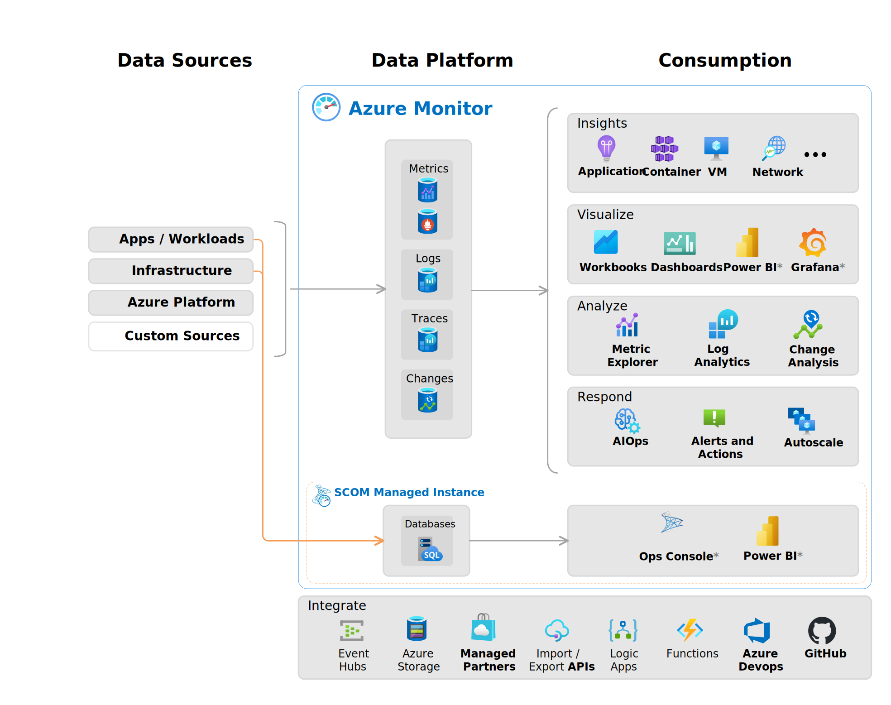

# ⏰ Resource Monitoring And Alerts

### Azure Monitor;

<figure><figcaption></figcaption></figure>

Azure Monitor, Microsoft Azure'da uygulamalarınızın, hizmetlerinizin ve altyapınızın performansını ve sağlığını izlemek için kullanılan bir hizmettir. Geniş bir veri toplama, analiz ve uyarı işlevselliği sunar, böylece Azure kaynaklarınız ve Azure üzerinde çalışan uygulamalarınız hakkında derinlemesine bilgi edinebilir ve proaktif olarak yönetebilirsiniz.

### Azure Metrics;

Azure Metrics, Azure Monitor'ın bir parçasıdır ve Azure kaynaklarınızın performansını ölçmek için kullanılan zaman serisi verileridir. Metrikler, Azure kaynaklarınızın sağlığı ve performansı hakkında gerçek zamanlı bilgiler sağlar ve bu bilgilerin ölçümünü ve takibini yapmanıza olanak tanır.

Metrikler, CPU kullanımı, bellek kullanımı, disk I/O, ağ trafiği gibi belirli bir kaynakla ilgili nicel verileri içerir. Örneğin, bir sanal makinenin CPU kullanımı yüzdesi veya bir web uygulamasının HTTP istek sayısı gibi. Azure'da hemen hemen her hizmet ve kaynak, kendi özel metriklerini üretir ve bu metrikler Azure Monitor aracılığıyla toplanır ve saklanır.

### Azure Activity Logs;

Azure Activity Logs, Azure'daki subscription seviyesindeki olayları kaydetmek için kullanılan bir servistir. Bu loglar, Azure Resource Manager (ARM) tarafından yapılan tüm operasyonları ve hizmet sağlık durumunu içerir. Kısacası, Azure kaynaklarınız üzerinde gerçekleştirilen tüm yönetim işlemlerini detaylı bir şekilde kaydeder.

Azure Activity Logs'un sağladığı özellikler:

* **Abonelik Seviyesinde Kayıt:** Azure'daki tüm abonelik seviyesi olayları Azure Activity Logs'ta kaydedilir. Bu, ARM işlemleri ve hizmet sağlığı olaylarını içerir.
* **Denetim:** Activity Log, kaynak üzerinde gerçekleştirilen işlemler hakkında bilgi sağlar. Hangi işlemlerin yapıldığını, kimin başlattığını, ne zaman yapıldığını, durumunu ve diğer ham verileri içerir.&#x20;
* **Saklama Süresi:** Activity Log varsayılan olarak etkindir ve verileri 90 gün süreyle saklar. Saklama süresi ihtiyaca göre uzatılabilir ve veriler bir depolama hesabına gönderilebilir.
* **Veri Sorgulama:** Azure Activity Logs, abonelikler, zaman aralıkları, ciddiyet dereceleri, kaynak grupları, kaynaklar, operasyonlar, olay türleri ve anahtar kelime aramaları gibi çeşitli filtreler kullanarak sorgulanabilir.

Azure Activity Log için tanımlanmış farklı olay kategorileri yer almaktadır ve her bir kategori belirli türdeki olayları kapsar:

1. **Administrative:** Bu kategori, Azure Resource Manager üzerinden yapılan tüm create (oluşturma), update (güncelleme), delete (silme) ve action (aksiyon) operasyonlarını içerir. Örneğin, bir kaynağın oluşturulması veya bir servisin yapılandırmasının değiştirilmesi gibi yönetim etkinlikleri bu kategori altında kaydedilir.
2. **Security:** Microsoft Defender for Cloud tarafından üretilen tüm güvenlik uyarıları bu kategori altında sınıflandırılır. Güvenlikle ilgili herhangi bir olay veya uyarı bu bölümde görüntülenir.
3. **Service Health:** Azure servislerinin sağlık durumları ile ilgili olaylar bu kategoride yer alır. Azure kaynaklarınıza etki eden hizmet kesintileri ve diğer sağlık olayları bu kategoriye dahildir.
4. **Alert:** Azure Alerts tarafından tetiklenen her türlü uyarı bu kategori altında toplanır. Belirli koşulların gerçekleşmesi durumunda oluşturulan uyarılar burada listelenir.
5. **Recommendation:** Azure Advisor tarafından üretilen tüm öneriler bu kategoride yer alır. Performans, maliyet tasarrufu, güvenlik ve diğer iyileştirmelerle ilgili öneriler bu bölümde sınıflandırılır.
6. **Policy:** Azure Policy tarafından uygulanan tüm politika etkileri bu kategoride yer alır. Politikaların kaynaklarınıza olan etkileri ve uygunluk durumları bu log kategorisi altında incelenebilir.
7. **Autoscale:** Otomatik ölçeklendirme ile ilgili tüm olaylar bu kategoride yer alır. Kaynakların otomatik olarak ölçeklendirilmesine ilişkin olaylar bu kategori altında kaydedilir.
8. **Resource Health:** Azure kaynaklarınızla ilişkili sağlık olayları bu kategori altında listelenir. Kaynaklarınızın sağlıklı olup olmadığı ve herhangi bir sorun yaşayıp yaşamadığı bu bölümde gösterilir.

### Azure Monitor Alerts;

Azure Monitor Alerts, Azure kaynaklarınızın durumu ve performansı ile ilgili anormal durumları izlemenizi ve belirli olaylar meydana geldiğinde sizi uyarmak için yapılandırılmış uyarılardır. Bu uyarılar, metrik eşiklerinin aşılması, loglardaki belirli olayların ortaya çıkması veya hizmet sağlığı ile ilgili sorunlar gibi çeşitli koşullar temel alınarak tetiklenebilir.

Azure Monitor Alerts, operasyonel verimliliği artırmak ve potansiyel sorunlara hızlı bir şekilde yanıt vermek için otomasyon ve uyarı mekanizmalarını sağlar. Uyarılar, ayrıca "Action Groups" ile entegre edilebilir; böylece belirli bir uyarı tetiklendiğinde otomatik eylemler tanımlayabilirsiniz, mesela bir e-posta bildirimi gönderilmesi veya bir Azure Function'ın tetiklenmesi gibi.&#x20;

1. **Uyarı Kuralı Oluşturma:**
   * Azure portalına giriş yapın ve Azure Monitor hizmetine gidin.
   * Sol menüdeki "Alerts" sekmesine tıklayın.
   * "Create" veya "New alert rule" butonuna tıklayarak yeni bir uyarı kuralı oluşturma işlemine başlayın.
2. **Koşul Belirleme:**
   * Yeni uyarı kuralı oluşturma ekranında, tetikleyici olarak işlev görecek koşulu belirleyin. Bu, belirli bir metrik (örneğin, CPU kullanımı), log kaydı (örneğin, belirli bir hata kodu) veya aktivite log olayı (örneğin, kaynak gruplarında yapılan değişiklikler) olabilir.
   * Koşul ayarlarına geçin ve sizin için önemli olan eşik değerlerini ve diğer parametreleri tanımlayın.
3. **Eylem Grubu Yapılandırma:**
   * Uyarı kuralı için bir "Action Group" belirleyin. Action Group, belirli bir uyarı tetiklendiğinde hangi eylemlerin gerçekleştirileceğini tanımlar.
   * Bu eylemler, e-posta bildirimi gönderme, SMS yoluyla uyarı gönderme, bir Azure Function tetikleme veya harici bir hizmete webhook çağrısı yapma gibi otomatik eylemler olabilir.
   * Yeni bir Action Group oluşturabilir veya var olanlardan birini seçebilirsiniz.
4. **Uyarı Kuralını Kaydetme ve Etkinleştirme:**
   * Tüm ayarları inceledikten ve doğru olduğundan emin olduktan sonra uyarı kuralını kaydedin.
   * Uyarı kuralı artık etkinleştirilmiş olup, belirlediğiniz koşullar karşılandığında otomatik olarak tetiklenecektir.

### Log Analytics;

Azure Monitor'ın bir parçası olan ve Azure kaynaklarınızdan toplanan operasyonel verileri ifade eder. Bu günlükler, sanal makineler, uygulamalar, veritabanı hizmetleri ve diğer Azure hizmetleri gibi çeşitli kaynaklardan toplanan olaylar, performans verileri, hatalar ve diğer telemetri verilerini içerir. Bu hizmet, bulut ve on-premise ortamlarınızdan büyük miktarda log verisini toplamanıza, saklamanıza, araştırmanıza ve analiz etmenize olanak tanır.&#x20;

<figure><figcaption></figcaption></figure>

1. **Veri Toplama:**
   * Çeşitli kaynaklardan (Azure kaynakları, on-premise sunucular, diğer bulut sağlayıcılarından gelen kaynaklar) log ve telemetri verilerini toplayabilir. Bu veriler güvenlik olayları, uygulama logları, sistem logları ve daha fazlasını içerebilir.
2. **Veri Saklama:**
   * Toplanan verileri, uzun süreli analiz ve erişim için Azure'da saklar. Veriler, kullanıcı tarafından belirlenen bir süre boyunca Log Analytics çalışma alanında tutulabilir.
3. **Sorgulama ve Analiz:**
   * Kapsamlı bir sorgulama dilini kullanarak (Kusto Query Language - KQL), toplanan veriler üzerinde kompleks sorgular çalıştırabilir ve hızlı analizler yapabilirsiniz.
4. **Görselleştirme:**
   * Sorgulama sonuçlarını Azure Portal'daki panolarda görselleştirebilir ve çeşitli grafikler ve tablolar ile verileri anlamak için kullanabilirsiniz.
5. **Uyarı Yönetimi:**
   * Log verileri üzerinde belirli desenler veya eşikler tespit ettiğinizde uyarılar oluşturabilirsiniz. Bu, proaktif izleme ve olaylara müdahale etme kabiliyeti sağlar.
6. **Entegrasyon:**
   * Log Analytics, Azure Automation, Azure Functions ve diğer Azure hizmetleri ile entegre çalışabilir, otomasyon senaryoları ve gelişmiş analizler için geniş bir esneklik sunar.

### Application Insights;

Diyelim ki bir e-ticaret web siteniz var ve bu site ASP.NET ile geliştirilmiş. Site aniden yavaşlamaya başladı ve bazı kullanıcılar ödeme yaparken hata ile karşılaştılar. Application Insights'ı bu web sitesine entegre ederseniz, şu şekilde yardımcı olabilir:

1. **Performans İzleme:** Application Insights, sitenizin yavaşladığı zamanları ve bu yavaşlamaların neden olduğu sayfaları belirler. Belki de bir SQL sorgusu çok uzun sürüyor veya bir hizmete yapılan API çağrısı zaman aşımına uğruyor.
2. **Hata Teşhisi:** Ödeme sırasında kullanıcılar bir hata ile karşılaşıyorsa, Application Insights hata günlüklerini toplar ve size tam olarak hangi hata kodlarının gerçekleştiğini, hangi işlemlerin hata verdiğini ve hataların gerçekleştiği zaman dilimlerini gösterir.
3. **Kullanıcı İzleme:** Hangi kullanıcıların hata ile karşılaştığını ve kullanıcıların sitenizdeki yolculuklarını izleyerek, sorunun hangi adımda ortaya çıktığını belirleyebilirsiniz.
4. **Canlı Metrikler:** Gerçek zamanlı trafik ve performans metrikleri sayesinde, bir sorun olduğunda anında bilgi sahibi olabilir ve hızlı müdahale edebilirsiniz.
5. **Uyarılar:** Belirli bir hata çok kez meydana gelirse veya sayfa yükleme süresi belirli bir eşiği aşarsa, size otomatik olarak bildirim gönderilir.
6. **Entegrasyonlar:** Power BI ile verileri görselleştirebilir, Visual Studio ile hata ayıklama yapabilir, REST API üzerinden veri alabilir veya Continuous Export ile verileri başka bir yere aktarabilirsiniz.

