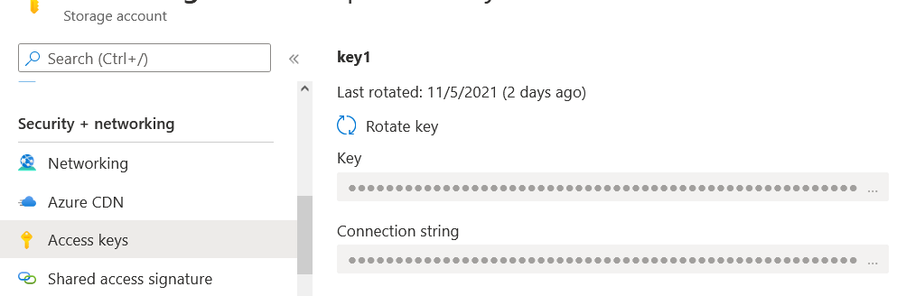

# 💂 Securing Storage

### Storage Account;

Azure Storage account, Microsoft Azure'da çeşitli türdeki verileri saklamak için kullanılan bir hizmettir. Bu hesap aracılığıyla, kullanıcılar çeşitli depolama hizmetlerine erişebilir ve verilerini güvenli bir şekilde yönetebilirler.

1. **Yüksek Erişilebilirlik ve Dayanıklılık**: Azure Storage hesapları, verilerinizi çeşitli dayanıklılık seviyelerine göre saklayabilme yeteneğine sahiptir. Veriler, birden fazla veri merkezine ve hatta bölgeler arası olarak replike edilebilir, bu da verilerinizin yüksek düzeyde erişilebilir ve güvenli olmasını sağlar.
2. **Güvenlik**: Azure Storage hesaplarına yazılan tüm veriler, Storage Encryption Service tarafından otomatik olarak şifrelenir. Verilere erişim, storage key, shared access signature ve Azure Active Directory gibi farklı yetkilendirme yöntemleri kullanılarak sağlanır. Bu, hassas verilerinizin yetkisiz erişime karşı korunmasına yardımcı olur.
3. **Ölçeklenebilirlik ve Yönetilen Hizmet**: Azure Storage, platform olarak yönetilen bir hizmettir. Bu, gereksinimlere bağlı olarak depolama ve performansı otomatik olarak ölçeklendirebileceğiniz anlamına gelir, böylece IT ekiplerinin altyapı üzerinde harcadığı zamanı azaltır ve uygulamaların büyüme ihtiyaçlarına kolayca adapte olmasını sağlar.
4. **Erişim**: Azure Storage'a HTTP veya HTTPS protokolleri üzerinden erişilebilir, bu da verilere geniş bir yelpazede erişim sağlar. Microsoft tarafından sağlanan SDK'lar sayesinde, geliştiriciler Azure Storage'ı kendi kodlarıyla kolayca entegre edebilirler. Azure PowerShell, Azure CLI ve REST API desteği ile geliştiricilerin ve sistem yöneticilerinin verileri yönetme esnekliği artar.
5. **Depolama Seçenekleri**:
   * **Standard**: Daha düşük maliyetli ve genellikle soğuk veri veya daha az I/O yoğunluğu gerektiren uygulamalar için uygun olan bir depolama katmanıdır.
   * **Premium**: Yüksek I/O performansı gerektiren ve düşük gecikme süresine ihtiyaç duyan iş yükleri için tasarlanmıştır, örneğin sanal makineler için disk depolama.
6. **Veri Türleri**:
   * **Sanal Makineler için Depolama**: Azure sanal makinelerin diski olarak kullanılan depolama alanıdır.
   * **Yapılandırılmamış Veri**: Blob depolama gibi, yapılandırılmamış veri için depolama alanıdır.
   * **Yapılandırılmış Veri**: Azure Table Storage gibi, yapılandırılmış veri saklamak için kullanılır.


#### Azure Storage Services;

<figure><figcaption></figcaption></figure>

Azure'da dört ana türde depolama hizmeti vardır ve her biri farklı türdeki veriler için kullanılır:

<figure><figcaption><p>blob storage diagram</p></figcaption></figure>

1.  **Azure Containers/Blob Storage**:

    * Bir "container", Blob Storage'da veri saklamak için kullanılan bir klasör gibidir.
    * "Blobs" ise büyük dosyalardır; metin, fotoğraf, video ve ses gibi yapılandırılmamış verileri saklamak için kullanılırlar.


2.  **Azure Files**:

    * Bu hizmet, dosyalarınızı bulutta saklamanıza ve paylaşmanıza olanak tanır, böylece onlara internet üzerinden her yerden erişebilirsiniz.
    * "Directories" (dizinler), dosyalarınızı organize etmek için klasör yapısıdır, tıpkı bilgisayarınızdaki gibi.


3.  **Azure Tables**:

    * "Table", Excel'deki bir tabloya benzer; verilerinizi sütunlar ve satırlar şeklinde düzenleyebileceğiniz bir yerdir.
    * Her "entity" (varlık), tablodaki bir satıra karşılık gelir ve ad, adres gibi farklı bilgiler içerir.


4. **Azure Queues**:
   * "Queue", uygulamanızın farklı parçaları arasında mesaj göndermek için bir posta kutusu gibidir.
   * Bu mesajlar ("messages"), uygulamanızın farklı bölümleri tarafından daha sonra işlenmek üzere saklanır.


Storage Account types;

<figure><figcaption></figcaption></figure>

### Storage redundancy;

#### Locally Redundant Storage;

<figure><figcaption></figcaption></figure>

LRS, verilerinizin üç kopyası aynı veri merkezi içindeki farklı donanım kümeleri üzerinde saklanır. Bu, bir donanım bileşeninde sorun olduğunda bile verilerinizi koruyan bir düzenlemedir.

LRS'nin üç önemli özelliği:

1. **Replikasyon**: Veri, aynı veri merkezindeki arıza alanları arasında üç kopya olarak saklanır. Bu kopyalar, donanım veya sistem hatası olursa veri kaybını önlemek için birbirinden bağımsızdır.
2. **Dayanıklılık**: LRS, %99.99 dayanıklılık sunar, bu da verilerin çok düşük bir kayıp olasılığıyla korunduğu anlamına gelir.
3. **Başarısızlık Olasılığı**: LRS, yalnızca bir veri merkezi içinde replikasyon yaptığı için, eğer tüm veri merkezi devre dışı kalırsa, veriler erişilemez hale gelir. Bu, özellikle coğrafi olarak etkileyebilecek büyük afetler veya olaylar için bir risk oluşturur.

#### Zone Redundant Storage;

<figure><figcaption></figcaption></figure>

ZRS, bir Azure bölgesindeki farklı availability zone arasında veri replikasyonu sağlar. Her availability zone, kendine özgü güç, soğutma ve ağ donanımıyla fiziksel olarak ayrılmış bir veri merkezi grubudur.

1. **Replikasyon**: ZRS, verileri tek bir Azure bölgesindeki birden fazla availability zone içerisinde replike eder. Her availability zone, bağımsız güç, soğutma ve ağ kaynaklarına sahip ayrı veri merkezi kümeleridir. Bu, verilerin üç farklı fiziksel konumda saklandığı anlamına gelir.
2. **Dayanıklılık**: ZRS, veri dayanıklılığını %99.99 seviyesinde sağlar. Bu, veri kaybı riskinin son derece düşük olduğu anlamına gelir ve Azure’un verilerinizin güvende olduğuna dair yüksek bir güvence sunar.
3. **Başarısızlık Olasılığı**: Eğer bir availability zone kullanılamaz hale gelirse, diğer zone'lar hizmet vermeye devam eder, böylece bir zone'daki arıza tüm bölgeyi etkilemez. Ancak, tüm bölgeyi etkileyen bir afet veya kesinti durumunda verilere erişim mümkün olmayabilir.

#### Geo Redundant Storage;

<figure><figcaption></figcaption></figure>

1. **Replikasyon**: GRS, verileri birincil bölgedeki bir veri merkezinde üç farklı arıza alanında saklar ve ardından bu verileri asenkron bir şekilde ikinci bir coğrafi bölgeye replike eder. İkinci bölgedeki veri merkezi de verileri kendi içinde üç arıza alanında tutar.
2. **Dayanıklılık**: GRS, %99.99 dayanıklılık sunar. Bu, veri kaybı olasılığının son derece düşük olduğu anlamına gelir.
3. **Failover**: Birincil bölgede bir sorun oluştuğunda, ikincil bölge otomatik olarak devreye girer ve verilere read-only erişim sağlar. Failover, Microsoft tarafından ya da müşteri tarafından tetiklenebilir.
4. **Düşünülmesi Gerekenler**: Birincil bölge normal koşullar altında tüm operasyonlar için kullanılabilirken, ikincil bölge sadece failover durumunda ve read-only erişim için kullanılabilir hale gelir.


#### Read access Geo Redundant Storage;

<figure><figcaption></figcaption></figure>

1. **Replikasyon**: RA-GRS, verilerinizi birincil bölgedeki bir veri merkezinde üç farklı arıza alanına (fault domain) kopyalar ve bu veriler asenkron olarak ikinci bir coğrafi bölgedeki veri merkezine replike edilir. İkincil bölgedeki veri merkezi de verileri kendi içinde üç arıza alanında saklar.
2. **Dayanıklılık**: RA-GRS, %99.99 dayanıklılık sunar, yani veri kaybı riski son derece düşüktür.
3. **Erişim**: En önemli fark, ikincil bölgenin, bir failover olayı olsun veya olmasın, sürekli olarak read-only erişime açık olmasıdır. Bu, birincil bölgede bir sorun olmadan bile, ikincil bölgedeki replike verilere erişilebileceği anlamına gelir. Failover, otomatik veya müşteri tarafından başlatılabilir.


#### Geo Zone Redundant Storage;

<figure><figcaption></figcaption></figure>

1. **Replikasyon**: Veriler, birincil Azure bölgesindeki birden fazla availability zone içinde üç kopya olarak saklanır. Bu, bölge içi kullanılabilirlik ve dayanıklılık sağlar. Daha sonra, bu veriler asenkron olarak bir ikincil coğrafi bölgeye replike edilir, burada da kendi arıza alanlarına sahip üç kopya halinde saklanır.
2. **Dayanıklılık**: GZRS, %99.99 dayanıklılık oranı sunar, bu da verilerinizin kaybolma ihtimalinin son derece düşük olduğu anlamına gelir.
3. **Failover**: Birincil bölgede bir sorun olduğunda, sistem otomatik olarak ikincil bölgeye failover yapabilir. Bu durumda, ikincil bölge read-only erişim için kullanılabilir hale gelir. Failover işlemi Microsoft tarafından otomatik olarak veya müşteri tarafından manuel olarak başlatılabilir.


#### Read Access Geo Zone Redundant Storage;

<figure><figcaption></figcaption></figure>

1. **Replikasyon**: RA-GZRS, verileri birincil bölgedeki birden fazla kullanılabilirlik bölgesi içinde üç kopya olarak saklar. Bu, bölge içi dayanıklılığı artırır. Bu veriler daha sonra ikincil bir coğrafi bölgeye asenkron olarak replike edilir, burada da kendi arıza alanlarına sahip üç kopya halinde saklanır.
2. **Dayanıklılık**: RA-GZRS, %99.99 dayanıklılık sağlar. Bu, teknik olarak verilerinizin kaybolma ihtimalinin son derece düşük olduğu anlamına gelir.
3. **Erişim**: RA-GZRS ile, ikincil bölgedeki verilere her zaman read-only erişim sağlanabilir. Bu, birincil bölge tamamen kullanılabilir olsa bile, ikincil bölgedeki verilere erişimin mümkün olduğu anlamına gelir. Bu durum, veri yedekliliği ve erişilebilirlik için ek bir katman sağlar.


### Accessing storage endpoints;

<figure><figcaption></figcaption></figure>

Azure'un depolama hizmetleriyle etkileşim kurmanın temel bir parçasıdır. Azure storage account adınıza ve kullandığınız hizmete göre her hizmetin kendine özgü bir uç noktası vardır. Bu uç noktalar, hizmetlere HTTPS protokolü üzerinden güvenli bir şekilde erişim sağlamak için kullanılır.

Her bir Azure storage hizmeti için bir URL şablonu vardır:

```actionscript
<protocol>://<storage account name>.<service>.core.windows.net
```

Bu şablon şu bileşenleri içerir:

* **Protokol**: İletişim için kullanılan protokol (`http` veya `https`).
* **Storage Hesap Adı**: Azure'da oluşturduğunuz depolama hesabının adı.
* **Servis**: Erişmek istediğiniz Azure depolama servisinin türü (örneğin `blob`, `queue`, `file`, `table`).

"onurstorage" adında bir Azure storage account olduğunu düşünelim, farklı Azure storage servis türleri için endpoint'ler şu şekilde olacaktır:

* **Blob Hizmeti için**: `https://onurstorage.blob.core.windows.net`
  * Blob hizmeti, büyük miktarda metin veya ikili veriyi depolamak için kullanılır. Örneğin, resimler, video dosyaları veya diğer büyük medya dosyalarınızı burada saklayabilirsiniz.
* **Queue Hizmeti için**: `https://onurstorage.queue.core.windows.net`
  * Queue hizmeti, genellikle uygulamalar arasında mesajları sıraya almak ve iletmek için kullanılır. Bu, uygulamalarınızın veya mikro hizmetlerinizin ölçeklenebilir ve esnek bir şekilde iletişim kurmasına olanak tanır.
* **File Hizmeti için**: `https://onurstorage.file.core.windows.net`
  * File hizmeti, SMB protokolü üzerinden erişilebilen paylaşılan dosya depolama sunar. Bu, dosya tabanlı uygulamalarınız veya klasik iş yükleriniz için ideal bir çözümdür.
* **Table Hizmeti için**: `https://onurstorage.table.core.windows.net`
  * Table hizmeti, yapılandırılmış NoSQL veri depoları için kullanılır. Büyük miktarda yapılandırılmış veriyi hızlı ve esnek bir şekilde saklamak ve erişmek için idealdir.

Eğer özel bir alan adınız varsa ve Azure storage hizmetleri için bu özel alan adını kullanmak istiyorsanız, DNS CNAME kaydı oluşturarak Azure depolama endpoint'lerini özelleştirilmiş domain adınızla eşleştirebilirsiniz. Örneğin:

* **DNS CNAME girdisi**: `blobs.onurstorage.com` `onurstorage.blob.core.windows.net` adresine yönlendirilir.

Bu yapılandırma, `blobs.onurstorage.com` adresini kullanarak Azure Blob hizmetinize erişmenizi sağlar. Bu, markanızın görünürlüğünü korur ve kullanıcıların Azure depolama hizmetlerinize erişirken kendi alan adınızı görmesine olanak tanır.


<figure><figcaption></figcaption></figure>

* **Public network access**: Bu seçenek, storage account'unuza public network üzerinden erişimi kontrol eder. Üç seçenek bulunur:
  * **Enabled from all networks**: Eğer bu seçenek aktifse, herhangi bir IP adresinden storage account'a erişilebilir.
  * **Enabled from selected virtual networks and IP addresses**: Bu seçenek, sadece belirli sanal ağlar ve IP adreslerinden storage account'a erişime izin verir.
  * **Disabled**: Bu seçenek aktif olduğunda, public network üzerinden erişim tamamen engellenmiş olur ve yalnızca private endpoints üzerinden erişim mümkündür.
* **Setup Private Endpoint**: Bu buton, storage account'unuza özel bir ağ üzerinden erişim sağlamak için özel endpoint'ler oluşturmak amacıyla kullanılır. Özel endpoint'ler, Azure virtual network'ünüzdeki services'e özel bir bağlantı sağlar ve public internet üzerinden erişilemez.
* **Control public access to storage account**: Bu ifade, storage account'unuza public network üzerinden erişimin nasıl kontrol edileceğini genel bir şekilde ifade eder.
* **Restrict access to specific VNets using service endpoints**: Bu seçenek, belirli Azure Virtual Networks (VNets) üzerinden service endpoints aracılığıyla erişimi sınırlamanıza olanak tanır.
* **Allow IP ranges from internet or on-premises**: Burada, yalnızca belirlenen IP aralıklarından storage account'a erişim sağlanabileceği belirtilir. Bu, internetten veya on-premises ağlardan erişim sağlayan IP adreslerini kapsar.

Azure Storage'da her güvenlik özelliği, verilerin korunmasında önemli bir rol oynar:

1. **Encryption (Şifreleme)**: Azure Storage, depolanmış verileri otomatik olarak Storage Service Encryption (SSE) ile şifreler. Bu, ek bir yapılandırma olmaksızın, storage account'a yazılan tüm verilerin şifrelendiği anlamına gelir.
2. **Authentication (Kimlik Doğrulama)**: Azure Active Directory (Azure AD) ve Role-Based Access Control (RBAC) kullanılarak, storage services'e erişim taleplerini kimlik doğrulayabilir ve servislere erişim için yetkilendirme sağlayabilirsiniz.
3. **Data in transit**: HTTPS ve SMB 3.0 protokolleri, verilerin transferi sırasında güvenliğini sağlamak için kullanılır. Bu, verilerin bir ağ üzerinden taşınırken korunmasını garantiler.
4. **Disk encryption**: Linux ve Windows sanal makinelerindeki işletim sistemi (OS) ve veri diskleri, Azure Disk Encryption (ADE) kullanılarak şifrelenebilir. Bu, disklerin içeriğinin yetkisiz erişime karşı korunmasını sağlar.
5. **Shared access signature**: Storage account'a erişim için ince ayar yapılmış ve detaylı izinler, Shared Access Signature (SAS) aracılığıyla verilebilir. SAS, belirli IP adreslerine, belirli zaman aralıklarında ve belirli operasyonlar için erişim izni vermek gibi ayrıntılı erişim kontrolleri sağlar.



**Storage Service Encryption (SSE):**

* **Protection**: SSE, Azure Disks, Blob, File, Queue ve Table'da depolanan verilerin dinlenme halindeyken şifrelenmesini sağlar. Veriler erişildiğinde şifre çözülür.
* **Compliance**: Kurumlar, Azure storage'da depolanan verileri şifrelemek için kendi iç şifreleme yöntemlerini geliştirmek zorunda değillerdir. SSE, kuruluşların uyumluluk ve güvenlik gereksinimlerini karşılamalarına yardımcı olur.
* **Strong cipher**: SSE, verileri şifrelemek için 256-bit AES şifrelemesi kullanır. Şifreleme, şifre çözme, veri yönetimi ve anahtar yönetimi, storage servisi tarafından yapılır ve SSE devre dışı bırakılamaz.
* **Bring your own keys**: Kurumlar, şifreleme anahtarlarını ve bunların rotasyonunu kontrol etmek istiyorlarsa, Microsoft tarafından yönetilen anahtarların yerine Müşteri Tarafından Yönetilen Anahtarlar kullanabilirler. Bu, Azure Key Vault'ta bir anahtar oluşturarak ve storage servisinin şifreleme ve şifre çözme için anahtarı Key Vault'tan almasını sağlayarak yapılır.

**Azure Disk Encryption (ADE):**

* **Encrypt disks**: ADE, Windows ve Linux sanal makinelerinin OS ve Data Disklerini şifreleyebilir. ADE, Windows için BitLocker ve Linux için DM-Crypt kullanır. Şifreleme anahtarları Azure Key Vault'ta saklanır.
* **Restrict access**: Disk şifrelendiğinde, yalnızca VM sahibi VM'de depolanan verilere erişebilir. Eğer birisi VHD'yi indirip başka bir VM'ye bağlarsa, anahtarları olmadan verileri okuyamazlar.
* **Encrypted backup**: Azure Backup kullanılırken, şifreleme anahtarları recovery service vault'a yedeklenir ve yedeklemeler de şifrelenir. ASE, 256-bit AES şifrelemesi kullanır.
* **Considerations**: Hem OS hem de Data disklerini şifreliyorsanız, şifreleme ve şifre çözme aktivitesinden dolayı küçük bir performans etkisi olacaktır. Bu etki çok minimaldir, ancak eğer uygulamanız CPU yoğunsa, performansı artırmak için yalnızca Data diskini şifreleyebilirsiniz.



### Authorization;

1. **Storage Account Keys (Depolama Hesabı Anahtarları):** Her depolama hesabı için iki adet 512-bit anahtar üretilir ve bu anahtarlar döndürülebilir (yani değiştirilebilir). Hesap anahtarları, kök şifreler gibidir ve yetkisiz erişimi önlemek için güvence altına alınmalıdır.
2. **Azure AD:** Azure Active Directory (AD) ve Role-Based Access Control (RBAC) kullanarak kullanıcıların isteklerini kimlik doğrulayabilir ve yetkilendirebiliriz. Şu anda Azure AD kimlik doğrulaması yalnızca Blob, Queue ve Tables için desteklenmektedir. Files için ise SMB erişimi, Azure AD Domain Services yardımıyla verilebilir.
3. **Shared Access Signature (Ortak Erişim İmzası):** Ortak erişim imzası (SAS), depolama alanına çok detaylı bir düzeyde erişim yetkisi verir. SAS, hesap anahtarları kullanılarak oluşturulur ancak erişim detaylı bir şekilde ayarlanabilir.
4. **Anonymous (Anonim):** Blob ve konteynerlarımıza anonim erişim sağlayabiliriz. İstek anonim olduğunda herhangi bir yetkilendirme gerekmez.


**Storage Account Keys;**

<figure><figcaption></figcaption></figure>

Azure Storage hizmetlerine erişim için kullanılan güvenlik anahtarlarıdır. Azure Storage hesabınız için otomatik olarak iki adet anahtar oluşturulur: key1 ve key2. Bu anahtarlar, Azure Blob, Table, Queue ve File hizmetlerine programatik erişim sağlamak için kullanılır.

Her anahtar 512-bit uzunluğundadır ve API çağrılarınızda yetkilendirme header'ında kullanabilirsiniz. Kullanıcılar, `Microsoft.Storage/storageAccounts/listKeys/action` iznine sahipse, Azure Portal, Azure CLI veya Azure PowerShell aracılığıyla anahtarları görüntüleyebilir veya kopyalayabilir.

Anahtarlarınızın güvenliğini sağlamak çok önemlidir çünkü bu anahtarlar hesabınızdaki tüm kaynaklara tam erişim sağlar. Bu nedenle, Microsoft bu anahtarları Azure Key Vault'ta saklamanızı ve düzenli olarak değiştirmenizi önerir.

Örnek vermek gerekirse, bir uygulama geliştiricisi eğer Azure Storage'da bir Blob'a erişmek istiyorsa, bu anahtarları kullanarak bir Storage client oluşturup istediği işlemleri gerçekleştirebilir. Örneğin, bir dosyayı yüklemek veya bir dosyayı indirmek gibi.


**Shared Access Signature;**

<figure><figcaption></figcaption></figure>

Azure Storage hizmetlerindeki kaynaklara erişimi detaylı ayarlamak için kullanılan bir güvenlik mekanizmasıdır. SAS, belirli bir zaman aralığı için, belirli hizmetlere ve işlemlere erişim yetkisi verir, böylece bir kullanıcının veya hizmetin tam hesap anahtarınızı bilmemesini sağlarken gerekli kaynaklara erişmesine izin verir.&#x20;

SAS, üç farklı şekilde oluşturulabilir:

1. **User delegation SAS**: Azure AD kimlik doğrulamasını kullanarak bir SAS oluşturur. Bu, nesne düzeyinde detaylı ayarlanmış erişim sağlar.
2. **Service SAS**: Belirli bir storage hizmetine(blob,files,queue,tables etc) erişim sağlar.
3. **Account SAS**: Tüm hizmetlere geniş erişim sağlar ancak yine de belirli izinlerle sınırlıdır.

Pratikte bir SAS kullanımına örnek vermek gerekirse, bir uygulama geliştiricisi Azure Storage'daki bir dosyayı indirmek istediğinde, SAS token'ı ile birlikte bir GET isteği gönderebilir. Bu istek, belirtilen başlangıç ve bitiş zamanları arasında ve izin verilen IP adres aralığından yapıldığında, belirtilen protokole uygun olarak güvenli bir şekilde dosyaya erişim sağlar. Bu, özellikle uygulamalarınızın veya kullanıcılarınızın sınırlı süreliğine veya sınırlı erişim gerektiğinde güvenli bir şekilde kaynakları kullanmasını sağlamak için idealdir.


**Azure AD Authentication;**

Azure Storage hesapları için Azure Active Directory (AD) kimlik doğrulaması, Multi-Factor Authentication (MFA), Koşullu Erişim gibi güvenlik özellikleriyle entegre çalışarak daha güvenli bir erişim sağlar. Bu yöntem, Azure'un Role-Based Access Control (RBAC) yetkilendirme modelini kullanır.

Azure AD Authentication ile kimlik doğrulaması yapılırken, kullanıcılar veya uygulamalar önce Azure AD üzerinden bir login isteği gönderir. Başarılı bir kimlik doğrulama sonrasında, Azure AD bir Bearer Token verir. Bu token, Storage API'sine gönderilen isteklerde kullanılarak, istenen Storage kaynaklarına (blob, queue, table) erişim sağlanır.

RBAC rolleri, kaynaklara erişim izinlerini yönetmek için kullanılır. Örneğin, bir kullanıcıya veya uygulamaya 'Storage Blob Data Contributor' rolü atanabilir. Bu rol, kullanıcının blob verilerini yönetmesine (blobları okuma, yazma ve silme gibi işlemleri gerçekleştirme) olanak tanır.

**Örnek Kullanım:**



1. Azure Blob Storage'daki verilere erişmek için Azure AD'de bir App Registration oluşturursunuz.
2. App Registration işleminden Client ID ve Client Secret alırsınız.
3. Azure portalında, Azure Storage hesabınıza gidip "Access control (IAM)" kısmına erişerek "Add role assignment" ile 'Storage Blob Data Contributor' rolünü atarsınız. Bu rolü, uygulamanızın App Registration'ına atamak için Client ID'yi kullanırsınız.
4. Uygulamanız, Azure AD'ye Client ID ve Client Secret ile login isteği gönderir.
5. Azure AD, uygulamanızı doğrular ve bir Bearer Token döndürür.
6. Uygulamanız, Bearer Token kullanarak Azure Storage API'sine erişim isteği gönderir.
7. 'Storage Blob Data Contributor' rolüne sahip olduğu için, uygulamanız istenen blob verilerini okuyabilir, yazabilir veya silebilir.


**Anonymous access;**

Azure Storage'da "Anonymous Access" yani anonim erişim, kullanıcılara herhangi bir kimlik doğrulama gerektirmeden storage hizmetlerinde bulunan bloblar ve konteynerlere erişim izni verir. Bu özellik, genellikle halka açık içerikleri paylaşmak için kullanılır ve üç farklı erişim seviyesi sunar:

1. **Private (no anonymous access)**: Bu ayar seçildiğinde, depolama hesabına erişim tamamen kısıtlanır ve yalnızca yetkilendirilmiş istemciler (SAS veya Azure AD kimlik doğrulaması kullananlar) erişebilir.
2. **Blob (anonymous read access for blobs only)**: Bu seçenek, yalnızca blob seviyesinde anonim okuma erişimi sağlar. Kullanıcılar veya uygulamalar, herhangi bir kimlik doğrulaması yapmadan doğrudan blob URL'leri üzerinden blob içeriğini okuyabilirler.
3. **Container (anonymous read access for containers and blobs)**: Bu ayar, hem konteynerin hem de içerdiği tüm blobların anonim okuma erişimine izin verir. Yani, kullanıcılar konteynerin içeriğini listeleyebilir ve bloblara erişebilirler.


