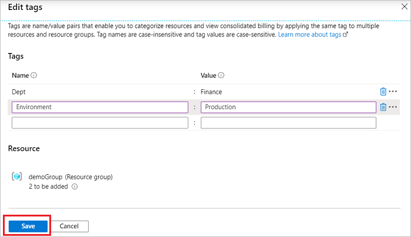
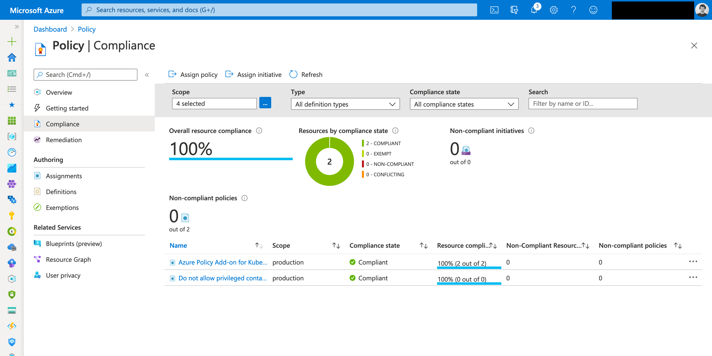

# 💰 Subscriptions

Azure'da bir abonelik (Subscription), sağlanan Azure hizmetleri için ödemeleri ve faturalandırmayı yönetmek amacıyla oluşturulan bir birimdir. Subscription'lar Azure'da kaynakların (sanal makineler, depolama hesapları, ağlar vb.) oluşturulduğu temel birimlerdir.

Subscription kullanmanın temel nedenleri şunlardır:

1. **Faturalandırma Ayırma:** Birden fazla projeniz veya departmanınız varsa, her biri için ayrı bir abonelik oluşturarak maliyetleri ayrı ayrı izleyebilirsiniz.
2. **Erişim Kontrolü:** Azure Rol Tabanlı Erişim Kontrolü (RBAC) kullanarak, belirli kaynaklara kimlerin erişim sağlayabileceğini ayarlayabilirsiniz. Bu, her abonelikte farklı erişim düzeyleri ve izinler belirlemenize olanak tanır.
3. **İzolasyon:** Farklı projeler veya iş yükleri için izolasyon oluşturmak amacıyla her birini ayrı bir abonelikte tutabilirsiniz. Bu, potansiyel olarak riskli veya deneysel bir iş yükünün diğer iş yüklerini etkilememesini sağlar.
4. **Kota Yönetimi:** Azure'da kaynak kullanımı için belirli kotalar bulunmaktadır. Farklı abonelikler oluşturarak bu kotaların üzerine çıkmamış olursunuz.&#x20;
5. **Politika Yönetimi:** Azure Policy kullanarak, belirli bir aboneliğe uygulanan kuralları ve kısıtlamaları tanımlayabilirsiniz. Bu, belirli bir abonelik kapsamında ne tür kaynakların oluşturulabileceğini veya hangi konfigürasyonlarda oluşturulabileceğini sınırlamanıza olanak tanır.

Özetlemek gerekirse, Subscription'lar, Azure'da kaynakların organizasyonunu, faturalandırmayı, erişim kontrolünü ve kaynak yönetimini kolaylaştırmak için kullanılır.

#### Hierarchy:

<figure><figcaption></figcaption></figure>

* Yönetim grupları, abonelikleri bir araya getirerek daha yüksek bir düzeyde organize etme olanağı sağlar. Bu, birden fazla aboneliği bir araya getirerek genel yönetim, izleme ve politika uygulama olanağı sunar.
* Her abonelik, kaynakları mantıklı bir şekilde gruplamak için bir veya daha fazla kaynak grubu içerir. Örneğin, bir web uygulamasının sanal makineleri, veritabanları ve ilişkili ağ bileşenleri tek bir kaynak grubunda toplanabilir.
* Azure'da, tüm yönetim grupları ve abonelikler için üst düzeyde bir "Kök Yönetim Grubu" (Root Management Group) otomatik olarak oluşturulur. Bu, tüm organizasyon için genel politikaların ve yapılandırmaların uygulanmasına yardımcı olur.
* Kök Yönetim Grubu ( root management group ) dışında, yönetim grupları iç içe geçmiş (nested) 6 seviyeye kadar oluşturulabilir. Bu, karmaşık organizasyon yapıları için ekstra esneklik sağlar.
* Bu hiyerarşik yapı, politikaların, erişim kontrollerinin ve maliyet yönetiminin tüm organizasyona veya belirli bölümlerine uygulanmasını kolaylaştırır.

#### RBAC:

<figure><figcaption></figcaption></figure>

Azure'da kaynaklarınıza kimlerin ne tür erişimlere sahip olabileceğini belirlemek isterseniz, Role Based Access Control (RBAC) tam da bu iş için tasarlanmıştır. İsminde de belirtildiği gibi, RBAC, kullanıcılara roller aracılığıyla erişim sağlar.

#### Temel Kavramlar:

1. **Role (Rol):** İzinlerin bir koleksiyonudur. Örneğin, bir "Reader" rolü, Azure kaynaklarına sadece okuma erişimi sağlar, değişiklik yapamaz.
2. **Principal:** Erişim izni vermek istediğiniz kullanıcı, grup, servis hesabı veya uygulama.
3. **Scope:** Rollerin uygulandığı alan. Bu, bir abonelik, bir resource group veya tek bir kaynak olabilir.

#### RBAC Nasıl Çalışır?

1. Öncelikle, bir principal'i (örn. bir kullanıcıyı) seçersiniz.
2. Bu principal'e atamak istediğiniz bir rolü seçersiniz (örn. Reader, Contributor, Owner vb.).
3. Son olarak, bu rolün uygulanacağı scope'u belirlersiniz. Bu, bir abonelik, bir resource group veya spesifik bir kaynak olabilir.

Örneğin, bir veritabanını yalnızca okumak için belirli bir kullanıcıya erişim izni vermek istiyorsanız:

* Kullanıcıyı (principal) seçersiniz.
* "Reader" rolünü atarsınız.
* Ve bu rolü doğrudan veritabanına (scope) uygularsınız.

#### Neden RBAC Kullanmalıyız?

1. **Least Privilege Principle:** Kullanıcılara sadece ihtiyaç duydukları erişimi sağlayarak güvenliği artırabilirsiniz.
2. **Scalability:** RBAC, çok sayıda kullanıcıya veya gruba kolayca erişim izni vermenizi sağlar.
3. **Audit and Monitor:** RBAC sayesinde kimlerin hangi erişime sahip olduğunu kolayca görebilir ve denetleyebilirsiniz.

#### Önemli Notlar:

* Azure'da birçok önceden tanımlı RBAC rolü vardır. Ancak ihtiyaça özel roller de oluşturabilirsiniz.
* RBAC, Azure kaynaklarınız üzerinde kimin ne yapabileceğini denetlemenin yanı sıra, Azure Portal'da kimin ne görebileceğini de denetler.

Sonuç olarak, Azure'da RBAC, kaynaklarınıza erişimi ince ayar yaparak yönetmenizi sağlayan güçlü bir araçtır. Bu, özellikle büyük ekiplerle veya hassas verilere sahipseniz çok değerlidir.

<figure><figcaption>
Azure Scopes
</figcaption></figure>

#### Azure RBAC vs Azure AD Roles:

Azure RBAC (Role-Based Access Control) ve Azure AD Roles, Azure'da erişim kontrolü için kullanılan iki farklı rol tabanlı yönetim sistemidir. Her ikisi de belirli işlevselliklere erişim izni sağlamak için kullanılır, ancak farklı alanlarda ve farklı amaçlarla çalışır. İşte bu iki sistem arasındaki temel farklar:

#### Azure RBAC (Role-Based Access Control):

1. **Kapsam:** Azure RBAC, Azure kaynakları üzerindeki erişimi kontrol etmek için kullanılır. Bu, sanal makineler, veritabanları, ağ kaynakları vb. gibi Azure hizmetlerini içerir.
2. **Amaç:** Azure kaynaklarına erişimi denetlemek, belirli kullanıcılara veya gruplara belirli kaynaklarla ilgili işlemleri gerçekleştirme yetkisi vermek veya almak için kullanılır.
3. **Örnek Roller:** Reader (Okuyucu), Contributor (Katkıda Bulunan), Owner (Sahip) gibi roller Azure RBAC'de bulunur.
4. **Uygulama:** Azure aboneliği, kaynak grupları veya bireysel kaynaklar gibi farklı kapsamlarda roller atanabilir.

#### Azure AD Roles:

1. **Kapsam:** Azure AD Roles, Azure Active Directory içindeki erişimi kontrol etmek için kullanılır. Bu, kullanıcı yönetimi, grup yönetimi, uygulama kayıtları, ve kimlik doğrulama gibi Azure AD hizmetlerini içerir.
2. **Amaç:** Azure AD'deki özelliklere ve fonksiyonlara erişimi denetlemek için kullanılır. Örneğin, bir kullanıcının Azure AD'de kullanıcıları ekleyip ekleyemeyeceği veya uygulama kayıtları oluşturup oluşturamayacağı bu rollerle kontrol edilir.
3. **Örnek Roller:** User Administrator (Kullanıcı Yöneticisi), Global Administrator (Genel Yönetici), Application Administrator (Uygulama Yöneticisi) gibi roller Azure AD'de bulunur.
4. **Uygulama:** Azure AD içinde, direkt kullanıcılara veya kullanıcı gruplarına roller atanabilir.

#### Özet:

* **Azure RBAC:** Azure kaynakları üzerindeki erişimi kontrol etmek için kullanılır.
* **Azure AD Roles:** Azure Active Directory'deki işlevlere ve özelliklere erişimi kontrol etmek için kullanılır.

Her iki sistem de rol tabanlı erişim kontrolü sunar, ancak farklı Azure hizmetlerini ve özelliklerini hedefler.&#x20;

#### Built-in-roles and Custom Roles:

Azure'da rol tabanlı erişim kontrolü (RBAC) kullanılarak kaynaklara kimin ne yapabileceğini belirleyebilirsiniz. Bu roller içerisinde iki ana kategori vardır: Built-in roles (Önceden Tanımlı Roller) ve Custom Roles (Özel Roller).

1.  **Built-in Roles (Önceden Tanımlı Roller)**:

    * Azure tarafından önceden tanımlanmış rollerdir.
    * Azure kaynaklarına belirli işlemler yapma yeteneği tanıyan bir dizi eylem ve özellik içerir.
    * Örnekler: Owner, Contributor, Reader, User Access Administrator.
    * Bu roller, yaygın kullanım senaryolarını kapsamak için tasarlanmıştır.

    **Avantajları**:

    * Kullanıcıların veya uygulamaların ne yapabileceğini hızla ve kolayca tanımlamanızı sağlar.
    * Önceden test edilmiş ve optimize edilmiştir, bu nedenle bu rolleri kullanarak genellikle güvenli bir yapı oluşturabilirsiniz.
2.  **Custom Roles (Özel Roller)**:

    * Özel iş ihtiyaçlarınıza göre belirli izinleri özelleştirebilirsiniz.
    * Özel bir role, belirli eylemleri yapma yeteneği ekleyebilir veya çıkarabilirsiniz.
    * Özel roller, bir Azure AD dizininde veya yönetim grubunda oluşturulduğunda, sadece o kapsamdaki kaynaklarda kullanılabilir. Ancak, bir abonelikte veya kaynak grubunda oluşturulduğunda, sadece o abonelikte veya kaynak grubunda kullanılabilir.

    **Avantajları**:

    * Tamamen özelleştirilebilir; belirli iş ihtiyaçlarınızı tam olarak karşılamak için rolleri özelleştirebilirsiniz.
    * Daha ince taneli erişim kontrolü sağlar.

**Farkları**:

* Built-in roller, Azure tarafından sağlanırken, özel roller özel ihtiyaçlarınızı karşılamak için oluşturulmuştur.
* Built-in roller değiştirilemezken, özel roller tamamen özelleştirilebilir.

#### Azure Tags:

<figure><figcaption></figcaption></figure>

Azure tag, Azure kaynaklarını etiketlemek için kullanılan anahtar-değer çiftleridir. Bu etiketler, kaynakları sınıflandırmak, organize etmek ve daha sonra bu kaynakları kolayca sorgulamak için kullanılır.

Azure tag'ın avantajları şunlardır:

1. **Organizasyon:** Kaynaklarınızı projelere, ekiplere veya herhangi bir kategoriye göre sınıflandırabilirsiniz.
2. **Maliyet Takibi:** Etiketleri kullanarak belirli kaynaklar veya kaynak grupları için harcamaları izleyebilirsiniz.
3. **Güvenlik ve Uyumluluk:** Etiketler yardımıyla belirli gereksinimlere sahip kaynakları tanımlayabilir ve bu kaynaklar için politikalar oluşturabilirsiniz.
4. **Otomasyon:** Etiketlere dayalı otomasyon kuralları ve politikalar oluşturarak, kaynaklar üzerinde otomatik işlemler gerçekleştirebilirsiniz.

Kullanım Örneği:

Diyelim ki bir şirkette, farklı departmanlar için Azure'da birçok kaynak çalıştırıyorsunuz (örneğin, Satış, Pazarlama ve Mühendislik). Her bir departmanın kaynaklarını izlemek, yönetmek ve maliyetlerini ayırmak istiyorsunuz.

Bu durumda, tüm kaynaklara ilgili departmanı temsil eden bir tag ekleyebilirsiniz:

* VM1: { "departman": "Satış" }
* VM2: { "departman": "Pazarlama" }
* VM3: { "departman": "Mühendislik" }

Bu şekilde, özellikle maliyet izleme araçlarını kullanarak, "Satış" departmanı için harcanan toplam maliyeti sorgulayabilir veya sadece "Mühendislik" departmanına ait kaynakları listeleyebilirsiniz.

Ayrıca, belirli bir departmana ait kaynakları otomatik olarak yedeklemek veya güncellemek gibi otomasyon görevleri için de etiketleri kullanabilirsiniz.

#### Resource Locks:&#x20;

Azure "Resource Locks" (Kaynak Kilitleri), Azure kaynaklarınızı veya kaynak gruplarınızı yanlışlıkla veya istenmeden değiştirilmesinden veya silinmesinden koruma altına almak için kullanılan bir güvenlik özelliğidir.

Resource Locks'un iki ana seviyesi vardır:

1. **ReadOnly (Salt Okunur):** Bu lock seviyesi, kaynak üzerinde her türlü değişikliği (yapılandırma değişiklikleri dahil) engeller. Ayrıca, bu lock seviyesi kaynağın silinmesini de engeller. Ancak, kaynağın mevcut durumunu görebilir ve bu kaynağa erişebilirsiniz.
2. **Delete (Silme):** Bu lock seviyesi, sadece kaynağın silinmesini engeller. Kaynak üzerinde diğer değişiklikleri yapmanıza izin verir.

Resource Locks'un avantajları şunlardır:

1. **Koruma:** Kaynakların yanlışlıkla veya istenmeden değiştirilmesini veya silinmesini engeller.
2. **Esneklik:** Farklı lock seviyeleri ile kaynakları nasıl kilitlemek istediğinizi seçebilirsiniz.

Örnek olarak, bir veritabanını düşünelim. Bu veritabanı üretim ortamında çalışıyor ve kritik verileri içeriyor. Bu veritabanının yanlışlıkla silinmemesi için "Delete" lock'u ekleyebilirsiniz. Ancak, bu veritabanının yapılandırmasının da yanlışlıkla değiştirilmemesini isterseniz, "ReadOnly" lock'u ekleyebilirsiniz.

#### Costs:

**Cost Management + Billing (Maliyet Yönetimi + Faturalama)**: Azure Cost Management + Billing, Azure kaynaklarınızın maliyetlerini ve kullanımını izlemenize, analiz etmenize ve raporlamalarını almanıza olanak tanır.

<figure><figcaption></figcaption></figure>

Cost Management ekranı ile ilgili bilgiler:

* **Overview (Genel Bakış):** Bu bölüm, maliyet yönetimi hakkında genel bir bakış sunar.
* **Access control (Erişim Kontrolü):** Kimlerin maliyet yönetimi bölümüne erişebileceğini ve ne tür işlemler yapabileceğini yönetebilirsiniz.
* **Diagnose and solve problems (Problemleri Teşhis Et ve Çöz):** Oluşabilecek sorunları teşhis etmenize ve bu sorunları çözmenize yardımcı olabilecek araçları içerir.
* **Cost analysis (Maliyet Analizi):** Maliyetlerinizi detaylı bir şekilde analiz edebilir ve hangi kaynakların ne kadar maliyet oluşturduğunu görebilirsiniz.
* **Cost alerts (Maliyet Uyarıları):** Belirli bir maliyet sınırına ulaştığınızda sizi uyaracak alarm kurabilirsiniz.
* **Budgets (Bütçeler):** Aylık, yıllık vb. bütçeler oluşturabilir ve bu bütçelere uygun hareket edip etmediğinizi izleyebilirsiniz.
* **Advisor recommendations (Danışman Önerileri):** Azure, maliyetlerinizi nasıl optimize edebileceğiniz konusunda önerilerde bulunabilir.
* **Invoices (Faturalar) ve Payment methods (Ödeme Yöntemleri):** Faturalandırma bilgilerinizi ve ödeme yöntemlerinizi yönetebilirsiniz.
* **Products + services:** Azure aboneliklerinizi ve diğer ürün/hizmetleri buradan yönetebilirsiniz.
* **Settings:** Maliyet yönetimi ile ilgili ayarları bu bölümden yapabilirsiniz.
* **Support + troubleshooting (Destek + Sorun Giderme):** Azure destek ekibiyle iletişime geçebilir ve olası sorunları gidermek için yardım alabilirsiniz.

#### Cost savings:

Azure'da maliyet tasarrufu yapmanın çeşitli yolları bulunmaktadır. Bu yolları uygulayarak toplam sahip olunan maliyeti azaltabilirsiniz.

1. **Azure Reserved Instances (RI)**
   * Uzun vadeli planlanan ve sürekli (24x7) çalışacak olan sunucular (instances) için rezervasyon yapabilirsiniz.
   * Bu rezervasyonlar 1 yıl ya da 3 yıl için yapılabilmekte ve ödemeler peşin ya da aylık eşit taksitler halinde gerçekleştirilebilir.
2. **Azure Hybrid Benefit (AHUB)**
   * Windows ve SQL lisansları, Software Assurance üzerinden satın alınabilir ve bu lisanslar Azure VM'lerinde ve PaaS hizmetlerinde kullanılabilir.
   * AHUB, ödeme yaparken kullanılan (PAYG) lisans maliyetinden daha uygundur.
3. **Credits (Krediler)**
   * Visual Studio Enterprise, Visual Studio Professional ve MPN gibi kredi bazlı abonelikler, size Azure'da çözüm testi ve geliştirme için kullanabileceğiniz aylık krediler sağlar.
4. **Regions (Bölgeler)**
   * Azure'da her bölge farklı bir fiyatlandırmaya sahiptir.
   * Kaynakları dağıtırken, düşük maliyetli bölgeleri seçmek tasarruf sağlar. Ancak bu seçimi yaparken, uygulamanızın uyumluluğunu veya performansını tehlikeye atıp atmamanız gerektiğini göz önünde bulundurmalısınız.

#### Azure Policy:

<figure><figcaption></figcaption></figure>

Azure Policy, Microsoft Azure'da kaynaklarınızın kuruluşunuzun gereksinimleri, standartları ve düzenlemelerine uygun olarak dağıtıldığından ve yönetildiğinden emin olmanızı sağlamak amacıyla kullanılır. Azure Policy ile belirli kurallar veya şartlar tanımlayabilir ve bu kuralların kaynaklarınıza uygulanmasını zorunlu kılabilirsiniz.

Azure Policy'nin temel bileşenleri ve işlevleri şunlardır:

1. **Policies (Politikalar)**: Belirli bir yapılandırmayı zorunlu kılan veya izin verilen yapılandırmaları tanımlayan ifadelerdir. Örneğin, belirli bir bölgede sanal makinelerin oluşturulmasını yasaklamak için bir politika uygulayabilirsiniz.
2. **Assignments (Atamalar)**: Politikaların nerede ve hangi kaynaklara uygulanacağını tanımlar. Örneğin, belirli bir abonelikte veya kaynak grubunda bir politikanın uygulanmasını isteyebilirsiniz.
3. **Initiatives (Girişimler)**: Birden fazla politikayı gruplamak için kullanılır. Bu, benzer veya ilgili politikaları bir araya getirerek yönetimi daha kolaylaştırabilir.
4. **Exemptions (İstisnalar)**: Belirli kaynakların veya kaynak gruplarının politikaların uygulanmasından muaf tutulmasını sağlar.
5. **Compliance (Uyumluluk)**: Kaynakların uygulanan politikalara ve girişimlere uygun olup olmadığını gösterir. Uyumsuzluk raporları, yöneticilere hangi kaynakların politika gereksinimlerini karşılamadığını hızla belirlemelerine yardımcı olur.


Azure Policy'de "remediation" (düzeltme) işlemi, kaynakların bir politikayla uyumlu hale getirilmesi sürecini ifade eder. Başka bir deyişle, bir politika belirli bir yapılandırmayı zorunlu kılar ve bu yapılandırmaya uymayan kaynaklar tespit edildiğinde, bu kaynakları otomatik olarak uyumlu hale getiren bir işlem bu düzeltme (remediation) işlemidir.


1. **Policy Definition (Politika Tanımı)**
   * Azure kaynaklarının nasıl yapılandırılması gerektiğini tanımlar.
   * `if` ve `then` yapısını kullanarak, belirli bir koşulda ne yapılması gerektiğini belirtir.
   * Özel parametrelerle tanımlanabilir, bu da politikaların daha esnek ve yeniden kullanılabilir olmasını sağlar.
2. **Policy Assignment (Politika Ataması)**
   * Bir politika tanımını belirli bir kapsama (abonelik, kaynak grubu, yönetim grubu vb.) atar.
   * Kapsam içindeki kaynaklar bu politika tanımına tabi olur.
   * İstisnalar tanımlanabilir, böylece belirli kaynaklar veya gruplar politika uygulamasından muaf tutulabilir.
3. **Initiative Definition (Initiative Tanımı)**
   * Birden çok politika tanımını bir araya getirir.
   * Benzer veya ilgili politikaları gruplayarak organizasyon ve uygulama sürecini kolaylaştırır.
4. **Initiative Assignment (Initiative Ataması)**
   * Initiative tanımını belirli bir kapsama atar.
   * Kapsamdaki kaynaklar, bu initiative'deki tüm politika tanımlarına tabi olur.
5. **Policy Parameters (Politika Parametreleri)**
   * Politika tanımlarının daha esnek olmasını sağlar.
   * Aynı politika tanımını farklı değerlerle veya yapılandırmalarla yeniden kullanma olanağı sunar.
6. **Policy Exemptions (Politika İstisnaları)**
   * Belirli kaynakların veya kaynak gruplarının politika veya initiative'lerin uygulanmasından muaf tutulmasını sağlar.
   * Özel durumlar veya geçici ihtiyaçlar için kullanışlıdır.
7. **Compliance (Uyumluluk)**
   * Kaynakların uygulanan politika veya initiative'e uygun olup olmadığını gösterir.
   * Uyumsuzluk raporları, hangi kaynakların politika gereksinimlerini karşılamadığını belirlemeye yardımcı olur.
8. **Remediation Tasks (Düzeltme Görevleri)**
   * Uyumsuz kaynakları otomatik olarak düzeltmek için oluşturulan görevlerdir.
   * Politika tanımındaki kurallara uygun olarak kaynakları otomatik olarak yapılandırır veya düzeltir.


Remediation Tasks:

1. **deployIfNotExists (Eğer Yoksa Dağıt) Efekti**: Bir kaynak veya yapılandırma henüz mevcut değilse, Azure Policy ile bu kaynağı oluşturabilir veya yapılandırmayı uygulayabilirsiniz. Eğer kaynak zaten varsa ve sadece belirli bir özellik veya yapılandırma eksikse, Azure Policy bu eksik özelliği veya yapılandırmayı da ekleyebilir.

> Örnek: **Senaryo**: Sanal makineler için belirli bir ağ güvenlik grubunu (NSG) zorunlu kılmak istiyoruz.
>
> Eğer bir sanal makine belirli bir NSG'ye bağlı değilse, "deployIfNotExists" efekti bu NSG'yi otomatik olarak oluşturabilir ve sanal makineye bağlayabilir.
>
> Kısaca, bir şeyin **yokluğunda**, gerektiğinde otomatik olarak **oluşturma** yeteneğine sahiptir.

1. **modify (Değiştir) Efekti**: Zaten var olan bir kaynağın belirli bir özelliğini veya yapılandırmasını değiştirir. Yani, bu efekt sadece mevcut kaynakları değiştirir, yeni bir şey oluşturmaz.

> Örnek: Tüm Blob depolama hesaplarının erişim seviyesinin "özel" olması gerekiyorsa, ve bir Blob depolama hesabı yanlışlıkla "genel" erişim seviyesine sahipse, "modify" efekti ile bu erişim seviyesi otomatik olarak "özel"e değiştirilir.
>
> Kısaca, bir şey zaten **mevcut ise**, onu otomatik olarak **değiştirme** yeteneğine sahiptir.



Bu nedenle:

* "deployIfNotExists" efekti, belirli bir kaynak veya yapılandırma mevcut DEĞİLSE onu oluşturur veya uygular.
* "modify" efekti, belirli bir kaynak zaten MEVCUTSA ve bazı değişiklikler yapılması gerekiyorsa, bu değişiklikleri uygular.

