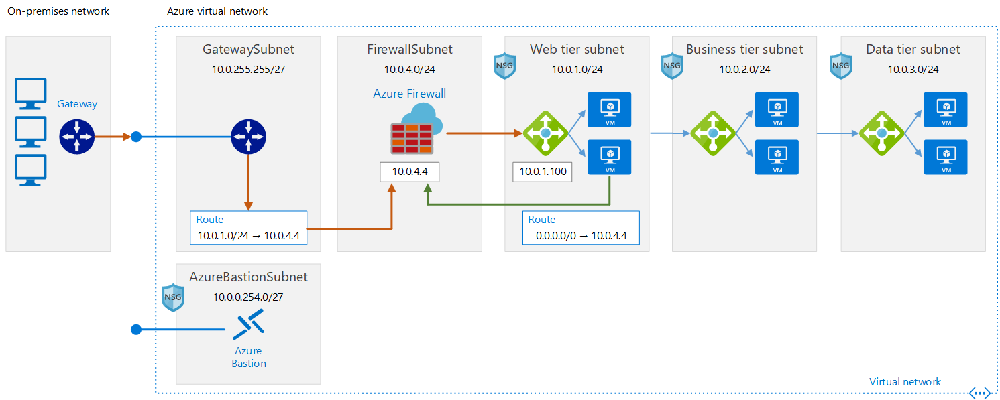
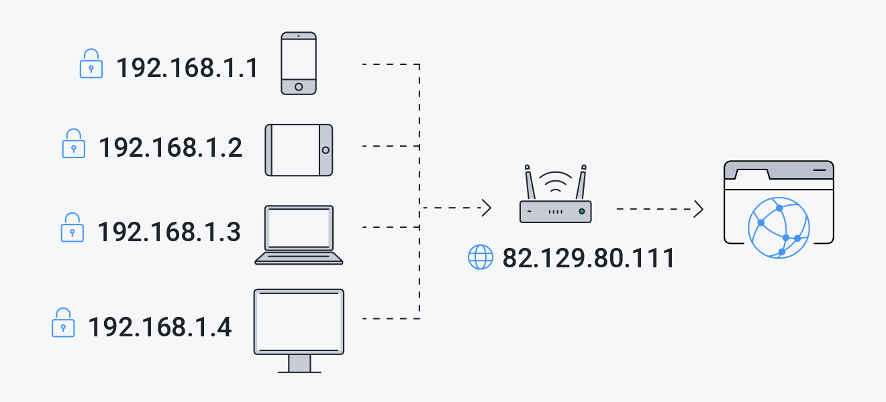
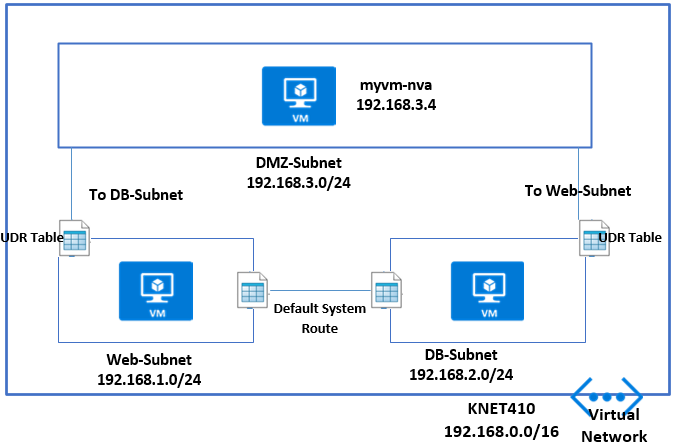
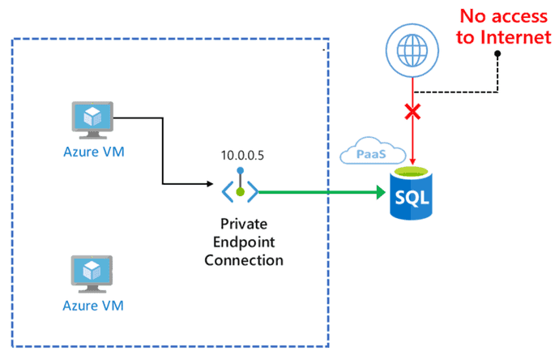
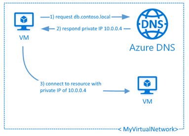
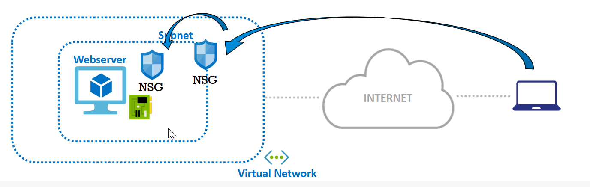
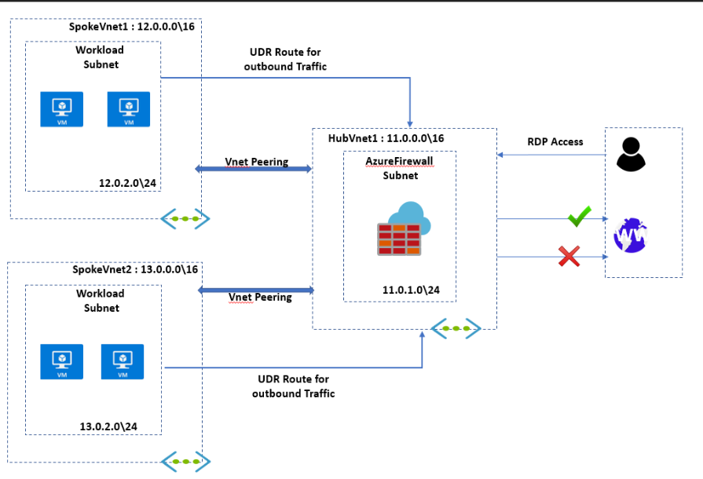
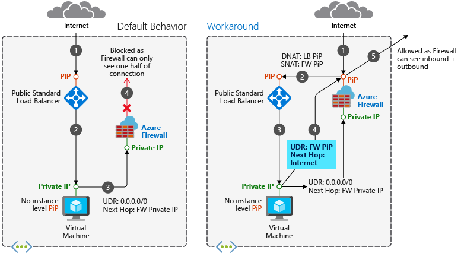

# 🌎 Virtual Network (VNET)

<figure><figcaption></figcaption></figure>

Azure Virtual Network (VNet), Azure kaynaklarınızı İnternet'ten ve diğer Azure VNets'ten mantıksal olarak izole edebileceğiniz bir izolasyon ve segmentasyon platformudur. VNets, Azure'un Ağ Hizmeti olarak sunulduğu bir servistir ve ağınızı Azure'da özel bir şekilde tanımlamanızı sağlar.

#### Bize ne sağlar?

* **İzolasyon ve Segmentasyon**: Azure'da kendi özel ağ alanınızı oluşturmanıza olanak tanır, bu da VM'ler, uygulama hizmetleri gibi Azure kaynaklarınızı izole bir ortamda çalıştırmanızı sağlar.
* **Güvenli İletişim**: VNet içindeki kaynaklar arasında, diğer VNet'ler arasında ve hatta on-premises ağlarınızla Azure arasında güvenli iletişim kurabilirsiniz.
* **Hibrit Bağlantılar**: VPN Gateway ve ExpressRoute gibi hizmetlerle Azure VNet, kendi veri merkezinizle güvenli ve özel bir bağlantı kurmanıza olanak tanır.
* **Filtreleme ve Güvenlik Duvarı**: NSG (Network Security Group) ve Azure Firewall gibi hizmetlerle gelen ve giden trafiği filtreleyerek, daha güvenli bir ağ yapısı oluşturabilirsiniz.
* **Özel Adres Alanı**: İhtiyacınıza göre IP adres alanını (CIDR bloğu) özelleştirebilir ve alt ağları (subnets) oluşturabilirsiniz.
* **Bölgesel Dağıtım**: Azure VNet, belirli bir Azure bölgesinde veya birden fazla bölgede dağıtılabilir, bu da coğrafi yedeklilik ve yüksek erişilebilirlik sağlar.
* **Entegrasyon**: Azure hizmetleri (Azure Cosmos DB, Azure SQL Database, Azure Storage vb.) ile doğrudan VNet entegrasyonu sayesinde, bu hizmetlere özel ağ üzerinden erişim sağlanabilir.
* **Özelleştirilmiş Yönlendirme**: User Defined Routes (UDR) ile trafiğin nasıl yönlendirileceğini özelleştirebilirsiniz. Özel cihazlar veya uygulama hizmetleri için trafiği belirli bir yolla yönlendirmek istiyorsanız, bu özellikle bu yönlendirmeleri tanımlayabilirsiniz.
* **VNet Peering**: İki veya daha fazla VNet'i birbiriyle eşleştirerek, farklı VNets arasında özel IP adresleri üzerinden iletişim kurabilirsiniz.
* **Dns ve Ad Çözünürlüğü**: Azure DNS ve özel DNS sunucularıyla, VNet içerisindeki kaynakların ad çözünürlüğünü sağlar.
* **Genişletilmiş Güvenlik Seçenekleri**: DDoS koruması, NAT Gateway, Bastion ve benzeri birçok ek hizmet ile VNet, ağınızı daha güvenli ve esnek hale getirmenize yardımcı olur.

#### Komponentler:

1. **Adres Alanı (Address Space)**:
   * **Detay**: VNet'in kullanabileceği IP adresleri topluluğudur.
   * **Kullanım Örneği**: 10.0.0.0/16 adres alanını belirleyerek, 10.0.0.1'den 10.0.255.255'e kadar toplamda 65,536 IP adresi oluşturabilirsiniz.
2. **Alt Ağ (Subnet)**:
   * **Detay**: Belirtilen adres alanını segmentlere ayırma yöntemidir.
   * **Kullanım Örneği**: 10.0.0.0/16 adres alanından, 10.0.1.0/24 gibi bir alt ağı oluşturarak bu aralıkta 256 adet IP adresi sağlamış olursunuz.
3. **Network Security Group (NSG)**:
   * **Detay**: Trafik filtreleme kurallarını tanımlayarak, belirli trafiği izin verme veya engelleme imkanı sağlar.
   * **Kullanım Örneği**: SSH trafiğini (port 22) sadece belirli bir IP adresinden kabul eden bir NSG kuralı oluşturabilirsiniz.
4. **Yönlendirici Tablosu (Route Table)**:
   * **Detay**: Veri paketlerinin hangi yoldan gideceğini belirler.
   * **Kullanım Örneği**: VNet içindeki trafik için varsayılan gateway olarak belirli bir cihazı tanımlayabilirsiniz.
5. **VNet Peering**:
   * **Detay**: İki farklı VNet'in birbiriyle doğrudan iletişim kurmasını sağlar.
   * **Kullanım Örneği**: A ve B adında iki VNet'in birbirine erişebilmesi için VNet Peering kurabilirsiniz.
6. **VPN Gateway**:
   * **Detay**: Şifrelenmiş bir tünel üzerinden Azure ve on-premises ağlarınızı bağlar.
   * **Kullanım Örneği**: Şirket içi ağınızı ve Azure'da bulunan sanal ağınızı güvenli bir şekilde birbirine bağlamak için VPN Gateway kullanabilirsiniz.
7. **Application Gateway & Load Balancer**:
   * **Detay**: Uygulama ve ağ seviyesinde trafiği dengeler.
   * **Kullanım Örneği**: Bir web uygulamanızın trafiğini, arka plandaki birden çok sunucu arasında dengeli bir şekilde dağıtmak için kullanabilirsiniz.
8. **Azure DNS**:
   * **Detay**: DNS ad çözünürlüğü sağlar.
   * **Kullanım Örneği**: "ornekdomain.com" adlı bir domaini Azure DNS üzerinden yönlendirerek, web uygulamanızın IP adresini çözümleyebilirsiniz.
9. **Service Endpoints**:
   * **Detay**: Azure servislerine özel ağ üzerinden erişim imkanı sunar.
   * **Kullanım Örneği**: VNet üzerinden Azure Storage'a özel erişim sağlamak için Service Endpoints kullanabilirsiniz.
10. **Private Link**:
    * **Detay**: Azure servislerini veya özel barındırılan servisleri VNet'inize özel bir IP ile ekler.
    * **Kullanım Örneği**: Bir Azure SQL Veritabanına VNet üzerinden özel bir IP ile erişmek için Private Link kullanabilirsiniz.
11. **NAT Gateway (Ağ Adresi Çevirisi Kapısı)**:
    * **Detay**: Azure'da public IP adreslerini ve Azure sanal ağ özel IP adresleri arasında çeviri sağlar.
    * **Kullanım Örneği**: Sanal makinelerinizin internete çıkışını tek bir public IP üzerinden sağlamak istiyorsanız, NAT Gateway kullanabilirsiniz.
12. **Bastion**:
    * **Detay**: Doğrudan, güvenli RDP ve SSH erişimi sağlar. VPN veya ekstra bir atlamalı sunucu gerektirmez.
    * **Kullanım Örneği**: Azure'da bulunan bir sanal makineye internet üzerinden güvenli bir şekilde bağlanmak için Bastion hizmetini kullanabilirsiniz.
13. **Virtual WAN**:
    * **Detay**: Büyük ölçekli şube bağlantıları için optimize edilmiş, otomatikleştirilmiş özel ağ trafiği yönlendirme özelliği sunar.
    * **Kullanım Örneği**: Şirketinizin farklı lokasyonlardaki şubelerini Azure üzerinden merkezi bir ağ yapısında birleştirmek için Virtual WAN kullanabilirsiniz.
14. **DDoS Protection**:
    * **Detay**: Azure kaynaklarınızı dağıtık hizmet reddi saldırılarına (DDoS) karşı korur.
    * **Kullanım Örneği**: Web sitenizi veya uygulamanızı DDoS saldırılarına karşı korumak için DDoS Protection hizmetini etkinleştirebilirsiniz.
15. **Firewall**:
    * **Detay**: Azure'da bulunan kaynaklarınıza gelen ve giden trafiği filtreleyen bir güvenlik duvarıdır.
    * **Kullanım Örneği**: Firmanızın Azure'da bulunan tüm uygulama ve hizmetlerini tek bir merkezden kontrol edebilmek için Azure Firewall kullanabilirsiniz.
16. **User-Defined Routes (UDR)**:
    * **Detay**: VNet içindeki trafiğin nasıl yönlendirileceğini manuel olarak belirtir.
    * **Kullanım Örneği**: Özel bir cihaz veya hizmet aracılığıyla trafik yönlendirmek isterseniz, UDR'leri kullanarak bu yönlendirmeleri manuel olarak tanımlayabilirsiniz.
17. **ExpressRoute**:
    * **Detay**: Azure'a özel, yüksek bant genişlikli bir bağlantı sağlar.
    * **Kullanım Örneği**: Şirketinizin on-premises veri merkezi ile Azure arasında özel ve yüksek hızda bir bağlantı kurmak için ExpressRoute kullanabilirsiniz.
18. **Virtual Network Service Endpoints**:
    * **Detay**: Azure sanal ağından belirli Azure hizmetlerine erişimi optimize eden ve güvence altına alan bir özelliktir. Bu, trafiği internet üzerinden değil, Azure ağı üzerinden Azure hizmetine yönlendirir.
    * **Kullanım Örneği**: Sanal ağınızdan Azure Cosmos DB'ye özel erişim sağlamak için bu hizmeti kullanabilirsiniz.
19. **Private Endpoint**:
    * **Detay**: Azure hizmetini doğrudan sanal ağınıza özel olarak getiren bir özelliktir. Bu, hizmetin sanal ağ içindeki özel bir IP adresine erişilebilir olmasını sağlar.
    * **Kullanım Örneği**: Azure Blob Storage hizmetine sanal ağınızdan özel bir IP adresi üzerinden erişmek isterseniz, Private Endpoint oluşturabilirsiniz.

### Private and Public IP addresses:

<figure><figcaption></figcaption></figure>

#### Private:

Private IP Adresi (Özel IP Adresi), İnternet üzerinde doğrudan erişilemeyen ve genellikle bir yerel ağ içinde cihazların birbiriyle iletişim kurmasını sağlayan bir IP adresidir. Özel IP adresleri genellikle ev, iş yeri veya okul gibi yerel ağlarda kullanılır. İnternet üzerinden bu adreslere doğrudan erişim mümkün değildir.

İnternet Protokolü sürüm 4 (IPv4) için özel IP adres aralıkları şunlardır:

1. 10.0.0.0 - 10.255.255.255 (/8)
2. 172.16.0.0 - 172.31.255.255 (/12)
3. 192.168.0.0 - 192.168.255.255 (/16)

IPv6 için özel adres aralığı "Unique Local Address" olarak bilinir ve "fc00::/7" önekine sahiptir.

Bir cihazın özel bir IP adresi varsa ve bu cihaz İnternet üzerindeki başka bir cihazla iletişim kurmak istiyorsa, bir yönlendirici (router) aracılığıyla "Network Address Translation" (NAT) adı verilen bir teknik kullanılır. NAT, özel IP adreslerini genel IP adreslerine dönüştürerek bu cihazların İnternet üzerinden iletişim kurmasına olanak tanır.

#### Public:

Public IP Adresi (Genel IP Adresi), İnternet üzerinde benzersiz olan ve dış dünyayla iletişim kurmak için kullanılan bir IP adresidir. Bu adres, cihazın veya ağın İnternet üzerindeki diğer cihazlar veya ağlarla iletişim kurmasını sağlar.

Genel IP adresleri, dünya genelinde benzersiz olmalıdır, böylece İnternet üzerindeki cihazlar doğru bir şekilde birbirleriyle iletişim kurabilir. Bu adresler, Internet Assigned Numbers Authority (IANA) tarafından beş farklı bölgesel İnternet kayıt kuruluşuna atanır. Bu kuruluşlar, IP adreslerini çeşitli internet servis sağlayıcılara, kuruluşlara ve endüstriyel şirketlere dağıtır.

Genel IP adresleri, genellikle modeminiz veya yönlendiriciniz tarafından sağlanır. Eğer bir evde ya da iş yerinde birden çok cihaz varsa, bu cihazlar genellikle özel IP adresleriyle yerel ağda iletişim kurarlar. Ancak, bu cihazlar İnternet'e erişmek istediklerinde, NAT (Network Address Translation) yardımıyla bu cihazların tümü aynı genel IP adresini kullanarak İnternet'e bağlanır.

Özetlemek gerekirse, public (genel) IP adresi, bir cihazın veya ağın İnternet üzerinde tanımlanmasını ve İnternet üzerindeki diğer cihazlarla iletişim kurmasını sağlayan benzersiz bir adresidir.

### Azure Public IP adresses basic and standard SKU:

1. **Allocation method (Atama yöntemi):**
   * **Standard**: Statik atama yöntemini kullanır.
   * **Basic**: IPv4 için Dinamik veya Statik, IPv6 için ise Dinamik atama yöntemini kullanır.
2. **Idle Timeout (Boşta Kalma Süresi):**
   * Her iki SKU için de ayarlanabilir bir boşta kalma süresi vardır (4-30 dakika). Ancak varsayılan olarak her ikisi için de 4 dakika olarak ayarlanmıştır.
3. **Security (Güvenlik):**
   * **Standard**: Gelen trafiğe varsayılan olarak kapalıdır. Network security group (NSG) gereklidir.
   * **Basic**: Gelen trafiğe varsayılan olarak açıktır. NSG önerilir ama zorunlu değildir.
4. **Availability zones (Kullanılabilirlik bölgeleri):**
   * **Standard**: Farklı kullanılabilirlik bölgelerini destekler ve sadece 3 kullanılabilirlik bölgesinin aktif olduğu bölgelerde oluşturulabilir.
   * **Basic**: Kullanılabilirlik bölgelerini desteklemez.
5. **Routing preference (Yönlendirme tercihi):**
   * **Standard**: Azure ve İnternet arasındaki trafik kontrolü için daha ayrıntılı yönlendirme seçenekleri sunar.
   * **Basic**: Bu özelliği desteklemez.
6. **Global tier (Küresel katman):**
   * **Standard**: Cross-region yük dengeleyicilerini destekler.
   * **Basic**: Bu özelliği desteklemez.

### User Defined Routes:

<figure><figcaption></figcaption></figure>

Azure'da "User Defined Routes" (UDR) ya da Türkçe adıyla "Kullanıcı Tanımlı Yönlendirmeler", Azure Sanal Ağlar (VNet) içindeki trafiği özel bir şekilde yönlendirmek amacıyla oluşturulan kurallardır. Temel olarak, Azure'da oluşturduğunuz sanal ağlar arasında trafik nasıl akacaksa ona göre bir yol haritası çizmenizi sağlar.

#### 1. Özel Cihazlara Trafik Yönlendirme:

Azure üzerinde çalışan birçok özel cihaz bulunabilir. Örneğin, bir güvenlik duvarı cihazınız varsa, belirli tehlikeli web sitelerine erişimi engellemek isteyebilirsiniz. UDR'leri kullanarak, tüm web trafiğini bu güvenlik duvarı cihazına yönlendirerek, tehlikeli sitelere erişimi kontrol altına alabilirsiniz.

**Örnek:** Diyelim ki şirketinizin Azure'da çalışan bir sanal makinesi var ve bu makinenin sadece belirli web sitelerine erişmesini istiyorsunuz. Bu durumda, trafiği bir güvenlik duvarına yönlendirip, bu duvarın sadece belirli sitelere erişimine izin vermesini sağlayabilirsiniz.

#### 2. Farklı Subnetler Arası Trafik:

Bir sanal ağ içerisinde farklı alt ağlar (subnet) oluşturabilirsiniz. Bazı durumlarda, iki alt ağın doğrudan birbirine erişimini değil de belirli bir sunucu (örneğin DMZ sunucusu) üzerinden erişimini isteyebilirsiniz. UDR'leri kullanarak bu alt ağlar arasındaki trafiği belirlediğiniz sunucu üzerinden yönlendirebilirsiniz.

**Örnek:** İki farklı subnetiniz var: Üretim (Production) ve Geliştirme (Development). Güvenlik nedeniyle, bu iki subnet'in doğrudan birbirine erişimini istemiyorsunuz. Ancak bazı durumlarda, Geliştirme subneti, Üretim subnetindeki bir uygulamanın test versiyonuna erişmek isteyebilir. Bu tür bir erişim talebi olduğunda, bu trafiği DMZ sunucusuna yönlendirebilir ve bu sunucu üzerinden istenen erişimi kontrol edebilirsiniz. Böylece, iki subnet arasında kontrollü ve güvenli bir erişim sağlamış olursunuz. UDR kullanarak bu trafiği DMZ sunucusuna yönlendirip, doğrudan erişimi engelleyebilirsiniz.

#### 3. VPN veya ExpressRoute üzerinden Trafik Yönlendirme:

Azure, diğer lokasyonlardaki veri merkezleri veya ofislerle bağlantı kurmanızı sağlayan VPN ve ExpressRoute gibi özellikler sunar. UDR'leri kullanarak, bu bağlantılar üzerinden hangi trafiğin geçeceğini belirleyebilirsiniz.

**Örnek:** Şirketinizin merkezi ABD'de, şubesiyse Türkiye'de. Türkiye'deki şube, merkezdeki bazı sunuculara erişmek istiyor. UDR'leri kullanarak, Türkiye'den gelen trafiği sadece bu sunuculara yönlendirebilir ve diğer sunuculara erişimi engelleyebilirsiniz.

UDR oluştururken, trafiğin nereye gideceğini belirtmeniz gerekir. Bu "sonraki hop" (next hop) olarak adlandırılır. Örneğin, bir güvenlik duvarına yönlendirme yapmak istiyorsanız, bu güvenlik duvarının IP adresini sonraki hop olarak belirtirsiniz.

Son olarak, bu kuralların işlemesi için ilgili alt ağlara atanmaları gerekir. Yani, bir kural oluşturmakla işiniz bitmez; bu kuralı hangi alt ağlarda uygulayacağınıza da karar vermelisiniz.

### Service Endpoint:

<figure><figcaption></figcaption></figure>

#### 1. Temel Tanım:

Azure Service Endpoint, sanal ağınızın (VNet) özel IP adres bloğundan Azure hizmetlerine özel ve doğrudan bir erişim sağlar. Bu, trafiği internet üzerinden değil, Azure'un özel ağı üzerinden yönlendirerek, hizmetinizi diğer Azure hizmetleriyle daha güvenli bir şekilde entegre etmenizi sağlar.

#### 2. Neden Kullanılır?

#### a. Güvenlik:

Azure hizmetlerine internet üzerinden değil, doğrudan VNet üzerinden erişerek güvenliği artırabilirsiniz. Service Endpoint'leri etkinleştirdiğinizde, bu hizmetlere yapılan tüm trafiği belirli bir VNet veya alt ağa sınırlayabilirsiniz.

#### b. Performans:

Service Endpoint, trafiği Azure'un özel ağı üzerinden yönlendirir, bu da daha düşük gecikme süreleriyle daha hızlı ve tutarlı erişim sağlar.

#### c. Kolay Yönetim:

Ağ güvenlik grubu (NSG) kuralları ile kolayca yönetebilir ve belirli hizmetlere erişimi sınırlayabilirsiniz.

#### 3. Nasıl Çalışır?

Service Endpoint etkinleştirildiğinde, belirli Azure hizmetlerine yönlendirilen trafiği, VNet'inizin IP adres bloğundan doğrudan Azure hizmetine yönlendirir. Bu, özel bir IP adresi üzerinden Azure hizmetine doğrudan erişim sağlar.

#### 4. Desteklenen Hizmetler:

Azure Service Endpoint şu anda Azure SQL Database, Azure Storage ve diğer birçok Azure hizmeti gibi birçok Azure hizmeti için desteklenmektedir.

#### 5. Kurulum:

Service Endpoint'leri, Azure portalı, Azure CLI veya PowerShell kullanarak kolayca etkinleştirilebilir ve yönetilebilir.

#### 6. Dikkat Edilmesi Gerekenler:

* Service Endpoint, hizmete erişimi yalnızca belirli bir VNet veya alt ağla sınırlamaz. Güvenliği artırmak için ek olarak Ağ Güvenlik Grubu (NSG) kuralları da uygulamanız gerekir.
* Service Endpoint trafiği, Azure'un özel ağını kullanarak belirli Azure hizmetlerine yönlendirilir, ancak bu trafiğin diğer VNets veya on-premise ağlarınıza erişimi yoktur.

#### Sonuç:

Azure Service Endpoint, Azure hizmetleri ile özel ağlar arasında güvenli, hızlı ve doğrudan bir bağlantı kurmanızı sağlar. Güvenlik, performans ve yönetim kolaylığı gibi avantajları nedeniyle tercih edilmelidir.&#x20;

### Private Link:

<figure><figcaption></figcaption></figure>

#### 1. Temel Tanım:

Azure Private Link, Azure hizmetlerine ve kendi özel hizmetlerinize özel IP adresleri üzerinden erişmenizi sağlar. Bu, hizmetlerinizi Azure Virtual Network (VNet) içinde özel olarak barındırmanıza ve Azure hizmetlerine internet üzerinden değil, Azure'un özel ağı üzerinden erişmenize olanak tanır.

#### 2. Neden Kullanılır?

#### a. Güvenlik:

Azure hizmetlerine ve kendi özel hizmetlerinize özel IP adresleri üzerinden erişerek, veri sızıntıları ve internet tabanlı saldırılara karşı güvenliği artırabilirsiniz.


Private Link ile Azure hizmetlerini sanal ağınıza eklemeniz yalnızca bu hizmete özel bir IP üzerinden erişim sağlar. Ancak dışarıdan erişimi tamamen engellemek için ilgili servisin ağ güvenlik ayarlarını da yapılandırmanız gerekmektedir.


#### b. Özel Erişim:

Azure hizmetlerine özel bir IP üzerinden erişim sağlar, böylece hizmetlerinizi VNet içinde gizleyebilirsiniz.

#### c. Global Erişim:

Farklı bölgelerde bulunan Azure hizmetlerine, global VNet peering üzerinden erişim sağlar.

#### d. Sadeleştirilmiş Ağ Topolojisi:

NAT yapılandırmaları veya geçitler olmadan özel ve doğrudan erişim sağlar.

#### 3. Nasıl Çalışır?

Azure Private Link, Azure hizmetini veya kendi özel hizmetinizi bir VNet içinde özel bir IP adresiyle yayınlar. Bu sayede, hizmete doğrudan özel bir IP adresi üzerinden erişim sağlanır.

#### 4. Desteklenen Hizmetler:

Azure Private Link, Azure Storage, Azure SQL Database, Azure Cosmos DB ve diğer birçok Azure PaaS hizmeti için desteklenmektedir.

#### 5. Kurulum:

Azure Private Link, Azure portalı, Azure CLI veya PowerShell aracılığıyla kolayca oluşturulabilir ve yönetilebilir.

#### 6. Azure Service Endpoint ile Farkları:

#### a. Erişim Tipi:

* **Service Endpoint**: Sadece belirli bir VNet'ten Azure hizmetlerine erişimi optimize eder ve doğrudan erişim sağlar.
* **Private Link**: Azure hizmetini VNet içindeki özel bir IP adresiyle yayınlar, bu sayede VNet içinde veya peered VNet'ten doğrudan bu IP adresi üzerinden erişim sağlanır.

#### b. Erişim Kapsamı:

* **Service Endpoint**: Trafik sadece Azure'un özel ağı üzerinden Azure hizmetine yönlendirilir.
* **Private Link**: Azure hizmeti, özel bir IP ile VNet içinde bulunur, böylece bu hizmete olan tüm erişim VNet içinden sağlanır.

#### c. Yayın:

* **Service Endpoint**: Yayın yapılmaz, sadece trafik yönlendirilir.
* **Private Link**: Azure hizmeti, VNet içinde özel bir IP ile yayınlanır.

#### Sonuç:

Azure Private Link, Azure hizmetlerine ve kendi hizmetlerinize özel IP adresleri üzerinden erişim sağlayarak yüksek güvenlik ve özel erişim sunar. Özellikle veri gizliliği ve güvenliği kritik olan senaryolarda tercih edilmelidir. Azure Service Endpoint ile benzer bir amaca hizmet ediyor olsa da, çalışma şekilleri ve sundukları özellikler bakımından farklılıklar gösterir.

The dig query I sent to my storage account using a private link and without using a private link returned the following results.

<figure><figcaption>
Scenario where I connect to the Storage service without using a Private link.
</figcaption></figure>

<figure><figcaption>
Scenario where I connect to the Storage service using a Private link.
</figcaption></figure>


Azure Private Link ile bir hizmeti sanal ağınıza getirdiğinizde, bu hizmete özel IP üzerinden erişim sağlarken isim çözümlemesi için Özel DNS Bölgesi kullanılır. Bu, uygulamalarınızın ve hizmetlerinizin doğal olarak bu özel IP adresine yönlendirilmesini sağlar, böylece hizmetin FQDN'sini kullanarak erişim sağlayabilirsiniz. Bu yaklaşım, uygulamalarınızın veya hizmetlerinizin yapılandırmasını değiştirmeden özel IP üzerinden erişim sağlamasını kolaylaştırır.


### **Azure DNS:**&#x20;

Azure DNS, Microsoft Azure'da barındırılan bir Domain Name System (DNS) hizmetidir. DNS, kullanıcının bir web sitesinin adını (örn., www.example.com) tarayıcısına girdiğinde, bu ismin arkasında hangi IP adresinin bulunduğunu bulmak için kullanılır. Azure DNS, bu çözümlemeyi Azure altyapısında yüksek güvenilirlik ve performansla gerçekleştiren bir servistir.

### Private DNS Zone:

<figure><figcaption></figcaption></figure>

\
Azure Private DNS Zone, Azure'da sanal ağlar (VNet) içinde özel DNS adı çözümlemesi yapmak için kullanılan bir servistir. Bu, özel bir IP adres aralığına sahip olan sanal ağınızdaki kaynakların birbirlerini özel DNS adlarıyla bulabilmesini sağlar.

**Senaryo:** Bir şirket, Azure'da iki sanal makine (VM) kurmuştur: `webserver` ve `dbserver`. Bu iki sunucu arasında güvenli bir iletişim kurulmalı ve sunucuların birbirlerini isimleriyle tanıması gerekmektedir. Şirket, bu ad çözümlemesinin sadece Azure sanal ağ içinde gerçekleşmesini ve dış dünyadan erişilememesini istemektedir.


Azure Private DNS Zone'da "Auto Registration" özelliği, belirli bir sanal ağ (VNet) içinde oluşturulan veya değiştirilen kaynaklar için DNS kayıtlarının otomatik olarak oluşturulmasını veya güncellenmesini sağlar. \
\
Bir Azure sanal ağı (VNet) oluşturduğunuzu ve bu VNet'i bir Private DNS Zone'a bağladığınızı varsayalım. Eğer Auto Registration özelliği etkinleştirilirse, bu VNet içindeki her yeni sanal makine (VM) için otomatik olarak bir A kaydı oluşturulacaktır. Eğer bir VM silinirse veya IP adresi değişirse, bu değişiklikler otomatik olarak ilgili DNS kayıtlarına yansıtılacaktır.


**Adımlar:**

1. **Özel DNS Bölgesi Oluşturma:**
   * Azure Portal'dan `Private DNS Zones` bölümüne gidin.
   * Yeni bir özel DNS bölgesi oluşturun ve adını `mycompany.local` olarak belirleyin.
2. **Sanal Ağı Bölgeye Bağlama:**
   * Oluşturduğunuz `mycompany.local` bölgesine gidin.
   * `Virtual Network Links` bölümünde, sanal ağınızı (VNet) bu bölgeye bağlayın.
3. **DNS Kayıtlarını Oluşturma:**
   * `mycompany.local` bölgesine gidin ve `+ Record set` seçeneğini tıklayarak yeni bir kayıt ekleyin.
   * İlk kayıt için:
     * Name: `webserver`
     * Type: `A Record`
     * IP Address: `webserver` VM'nin özel IP adresi
   * İkinci kayıt için:
     * Name: `dbserver`
     * Type: `A Record`
     * IP Address: `dbserver` VM'nin özel IP adresi
4. **Test Etme:**
   * `webserver` VM'ye SSH veya RDP ile bağlanın.
   * `ping dbserver.mycompany.local` komutunu çalıştırarak `dbserver`'in IP adresinin başarıyla çözümlenip çözümlenmediğini kontrol edin.

Bu basit senaryo, `webserver`'ın `dbserver`'a özel DNS adı üzerinden nasıl erişebileceğini gösterir. Şirket içi diğer VM'ler de bu bölgeye kolayca eklenerek birbirleriyle isimleri üzerinden iletişim kurabilir. Bu, güvenli, özel ve özelleştirilebilir bir ad çözümlemesi sağlar.


Azure Private DNS Zone'a birden fazla sanal ağ (VNet) ekleyebilirsiniz. Bu özellik, farklı sanal ağlardaki kaynakların aynı özel DNS bölgesini kullanarak birbirlerine isimleriyle erişebilmesini sağlar.

Bir Private DNS Zone'a birden fazla sanal ağı eklediğinizde:

1. Her bir sanal ağ, bu özel DNS bölgesine kayıt ekleyebilir veya mevcut kayıtları sorgulayabilir.
2. Farklı sanal ağlarda bulunan kaynaklar, aynı özel DNS bölgesini kullanarak birbirlerine isimleriyle erişebilir.

\
Ancak, farklı sanal ağlardan aynı Private DNS Zone'a erişim sağladığınızda, bu sanal ağlardaki kaynakların birbirine erişebilmesi için ilave yapılandırmaların (örneğin, NSG kuralları veya sanal ağ peeringi) doğru bir şekilde yapılandırılması gerekir.\
\
Özetle, bir Private DNS Zone sadece ad çözümlemesini sağlar. İki sanal ağdaki kaynakların birbirleriyle etkileşimde bulunabilmesi için sanal ağ peeringi, NSG kuralları ve diğer ağ yapılandırmalarının doğru bir şekilde ayarlanmış olması gerekir. DNS çözümlemesi başarılı olsa bile, bu yapılandırmalar doğru ayarlanmadıysa kaynaklar birbirlerine erişemez.


### Azure Network Security Group:

<figure><figcaption></figcaption></figure>

Azure Network Security Group (NSG), Azure'da sanal ağ kaynaklarınız arasındaki ağ trafiğini filtrelemek için kullanılan bir güvenlik özelliğidir. NSG, belirli türdeki trafiği izin vermek veya engellemek için kullanabileceğiniz güvenlik kuralları içerir.

**Azure Network Security Group (NSG) Özellikleri ve Nasıl Çalıştığına Dair Genel Bir Bakış:**

1. **Güvenlik Kuralları:** Her NSG, bir dizi gelen ve giden trafik için güvenlik kuralı içerir. Bu kurallar, belirli bir protokol, Port aralığı ve kaynak/hedef adres aralığına göre trafiği izin verme veya engelleme şeklinde tanımlanır.
2. **Öncelik:** Her güvenlik kuralı bir önceliğe sahiptir. Daha düşük numaralı öncelikler daha yüksek önceliğe sahiptir. NSG, bir paketin hangi kurala uyduğunu belirlemek için kuralları öncelik sırasına göre değerlendirir.
3. **Varsayılan Kurallar:** Her yeni NSG, trafiği engellemek veya izin vermek için bir dizi varsayılan kural ile birlikte gelir. Özel olarak tanımlanan kurallar, varsayılan kuralların üzerinde önceliğe sahiptir.
4. **Uygulama Alanı:** NSG'leri doğrudan bir sanal makineye veya bir subnete uygulayabilirsiniz:
   * **Sanal Makineye Uygulama:** NSG, belirli bir VM'nin ağ arayüzüne (NIC) doğrudan uygulanabilir.
   * **Subnete Uygulama:** NSG, bir sanal ağdaki belirli bir alt ağa uygulanabilir, böylece bu alt ağdaki tüm VM'ler için trafiği filtreler.
5. **Etki Alanı:** Gelen ve giden trafiği ayrı ayrı filtreleyebilirsiniz. "Gelen trafik" kuralları, dış kaynaklardan VM'ye yönlendirilen trafiği denetler. "Giden trafik" kuralları ise VM'den dış hedeflere yönlendirilen trafiği denetler.
6. **Durum tabanlı (stateful):** NSG kuralları durum tabanlıdır. Yani, eğer gelen bir trafiğe izin verilirse, bu trafiğin cevabı (örneğin, bir TCP ACK paketi) otomatik olarak izin verilir.

**NSG Oluşturma ve Yönetme:**

NSG'leri Azure Portal, Azure CLI, Azure PowerShell veya Azure Resource Manager şablonları aracılığıyla oluşturabilir ve yönetebilirsiniz. Kurallarınızı tanımlarken, trafiğin izin verilip verilmediğini, protokol türünü (TCP, UDP, ICMP vb.), port aralığını, kaynak ve hedefi belirlemeniz gerekir.

**Sonuç:**

NSG'ler, Azure'da ağ güvenliği için temel bir bileşendir. Kaynaklarınıza hangi türde trafiğin erişmesine izin verileceğini veya engelleneceğini kontrol etmek için NSG'leri etkili bir şekilde kullanabilirsiniz. NSG'lerin doğru bir şekilde yapılandırılması, Azure altyapınızın güvenliğini önemli ölçüde artırabilir.

Azure NSG'de kullanabileceğiniz "Source" seçeneklerini detaylı olarak inceleyelim:

1. **Service Tag:** Service Tag'ler, Azure'da önceden tanımlanmış IP adresi gruplarıdır. Azure'da çalışan belirli hizmetlerin IP adres aralıklarını temsil ederler, böylece bu hizmetlere erişimi kolaylıkla kontrol edebilirsiniz. Örnek olarak:
   * **VirtualNetwork:** Sanal ağ içindeki tüm IP adreslerini temsil eder.
   * **Internet:** Azure'un dışındaki tüm adresleri temsil eder.
   * **AzureLoadBalancer:** Azure yük dengeleyicisi için ayrılan IP adreslerini temsil eder.
   * Ve daha birçok önceden tanımlanmış service tag bulunmaktadır (Storage, SQL, CosmosDB vb.)
2. **Any:** Bu seçenek, tüm IP adreslerini temsil eder. Yani bu seçeneği seçtiğinizde, herhangi bir IP adresinden gelen trafiği kapsar.
3. **IP Addresses:** Bu seçenek, belirli IP adresleri veya IP adresi aralıklarını temsil eder. Örneğin, '10.0.0.5' veya '10.0.0.0/24' gibi. Bu seçeneği kullanarak sadece belirli IP adresleri veya adres aralıklarından gelen trafiği izin verme veya engelleme kuralları oluşturabilirsiniz.
4. **Application security group (ASG):** ASG, belirli sanal makineleri veya diğer Azure kaynaklarını mantıksal gruplar halinde organize etmenizi sağlar. Örneğin, bir uygulama güvenlik grubu içerisinde sadece web sunucularınızı gruplandırabilirsiniz. NSG kurallarınızda bu ASG'yi belirttiğinizde, sadece bu grup içerisindeki sanal makinelerle ilgili trafiği kontrol edebilirsiniz.

Azure'da Network Security Group (NSG) kullanılarak trafiği kontrol etmek için iki ana kural türü bulunmaktadır: Gelen (Inbound) ve Giden (Outbound) kurallar. Bu kurallar, trafiğin sanal makineler arasında veya sanal makine ile dış dünya arasında nasıl hareket edeceğini kontrol eder.

Bir trafiğin Azure'daki bir sanal makineye veya bu sanal makineden dışarıya nasıl hareket edeceğini anlamak için şu adımları takip edebiliriz:

1. **Dışarıdan İçeriye (Inbound) Trafik:**
   * İlk olarak, trafik subnet seviyesindeki NSG'ye ulaşır.
   * Bu NSG'deki gelen (inbound) kuralları uygulanır.
   * Eğer trafik bu kurallardan geçerse, sanal makinenin ağ arayüzüne (NIC) uygulanan NSG'ye ulaşır.
   * NIC seviyesindeki gelen (inbound) kuralları uygulanır.
   * Eğer trafik bu kurallardan da geçerse, trafiğin hedefi olan sanal makineye ulaşır.
2. **İçeriden Dışarıya (Outbound) Trafik:**
   * İlk olarak, trafik sanal makineden başlar ve onun ağ arayüzündeki (NIC) NSG'ye ulaşır.
   * NIC seviyesindeki giden (outbound) kuralları uygulanır.
   * Eğer trafik bu kurallardan geçerse, subnet seviyesindeki NSG'ye ulaşır.
   * Subnet seviyesindeki giden (outbound) kuralları uygulanır.
   * Eğer trafik bu kurallardan da geçerse, trafiğin hedefine doğru hareket eder.


Azure’da bir network security group (NSG) oluşturmak istiyorsanız, region seçiminin önemi vardır. NSG’yi oluşturduğunuz regiondaki Azure kaynaklarına uygulayabilirsiniz, ancak farklı regionlardaki kaynaklara uygulayamazsınız. Bu nedenle, NSG’nizi hangi kaynaklara uygulamak istediğinize bağlı olarak uygun bir region seçmeniz gerekir.

NSG’nizi başka bir regiona taşımak isterseniz, Azure Resource Manager şablonunu kullanarak mevcut yapılandırma ve güvenlik kurallarını dışa aktarabilir ve yeni regionda şablonu dağıtarak NSG’yi oluşturabilirsiniz.&#x20;

NSG’nizi oluşturduktan sonra, sanal ağınızdaki alt ağlara veya sanal makinelere atayabilirsiniz. NSG’yi atadığınız kaynaklar farklı kaynak gruplarında olsa bile, aynı regionda olmaları yeterlidir.&#x20;


### Azure Firewall:

<figure><figcaption></figcaption></figure>

Azure Firewall, Microsoft Azure üzerinde hizmet olarak sunulan bir bulut tabanlı güvenlik duvarıdır. Azure sanal ağınızı korumak ve yönetmek için kullanılır ve merkezi bir noktadan uygulama ve ağ trafiği filtreleme kuralları oluşturmanıza, günlükleri toplamanıza ve güvenlik politikalarını uygulamanıza olanak tanır.

#### Azure Firewall, özellikleri:

1. **Yüksek Derecede Ölçeklenebilirlik (High Scalability):** Azure Firewall, bulut ortamındaki kaynak taleplerine göre otomatik olarak ölçeklendirme yapabilen bir hizmettir. Yani eğer ağ trafiğiniz artarsa, Azure Firewall da bunu algılayarak daha fazla kaynak sağlar. Eğer trafik azalırsa, kullanılmayan kaynakları azaltır. Bu dinamik ölçeklendirme, sürekli olarak değişen iş yükleri için idealdir ve her zaman uygun kapasiteyle hizmet sunulmasını sağlar.
2. **Kurallar Tabanlı Filtreleme (Rule-Based Filtering):** Azure Firewall, hem ağ katmanında (Layer 3-4) hem de uygulama katmanında (Layer 7) trafik filtreleme kuralları uygulamanıza olanak tanır. Bu, belirli IP adreslerine, portlara veya uygulama tabanlı (HTTP, HTTPS gibi) protokollere dayalı kurallar oluşturabileceğiniz anlamına gelir. Örneğin, yalnızca belirli web sitelerine erişime izin vermek veya bazı hizmetlerin kullanımını kısıtlamak için kullanılabilir.
3. **Teşhis ve Günlük Kaydı (Diagnostics and Logging):** Azure Firewall, Azure Monitor ve Azure Log Analytics ile entegre çalışır. Bu, ağ trafiği üzerinde detaylı incelemeler yapmanızı, anormal hareketleri izlemenizi ve güvenlik ihlalleri için uyarılar almanızı sağlar. Trafik akışları, engellenen bağlantılar ve sistem sağlığı ile ilgili bilgiler gibi faydalı verileri toplar ve kaydeder.
4. **Entegrasyon ve Yönetim Kolaylığı (Integration and Easy Management):** Azure Management Portal, PowerShell ve Azure CLI aracılığıyla Azure Firewall kolayca yönetilebilir. Ayrıca, Azure Security Center ile entegre olması, güvenlik politikalarınızın ve kurallarınızın tüm Azure servisleri ile uyum içinde çalışmasını sağlar, böylece genel güvenlik yönetiminizi kolaylaştırır.
5. **Bölgesel ve Küresel Güvenlik Duvarları (Regional and Global Firewalls):** Azure Firewall, belirli bir bölgede (örneğin, Batı Avrupa veya Doğu ABD) konuşlandırılabilir ve aynı zamanda birden fazla Azure bölgesindeki kaynaklarınız için trafik filtreleme kuralları uygulayabilir. Küresel koruma, birden çok bölgeyi kapsayan geniş bir ağ yapılandırmasına sahip kuruluşlar için özellikle yararlıdır.

Azure Firewall üzerinde kullanabileceğiniz temel kural türleri şunlardır:

1. **Application Rules (Uygulama Kuralları)**: Bu kurallar, Layer 7 (Uygulama katmanı) trafiğini kontrol eder. HTTP, HTTPS ve MSSQL protokolleri üzerinden belirli FQDN'ler (Fully Qualified Domain Names) için erişim izinlerini yönetir. Uygulama kuralları ayrıca, web kategorilerine göre trafik filtreleme imkanı da sunar.
2. **Network Rules (Ağ Kuralları)**: Ağ seviyesindeki Layer 3 (IP) ve Layer 4 (TCP/UDP) trafiğini kontrol eder. Bu kurallar, belirli IP adresleri ve portlar arasında trafik akışını izin vermek veya engellemek için kullanılır.
3. **NAT Rules (NAT Kuralları)**: NAT kuralları, gelen bağlantılar için IP adreslerinin ve portların nasıl yönlendirileceğini belirler. DNAT (Destination NAT) işlemleri bu kurallarla yönetilir, böylece dışarıdan gelen bir bağlantı isteği, Azure sanal ağınızdaki belirli bir hizmet veya uygulamaya yönlendirilebilir.

<figure><figcaption>
An example scenario for Azure firewall
</figcaption></figure>


