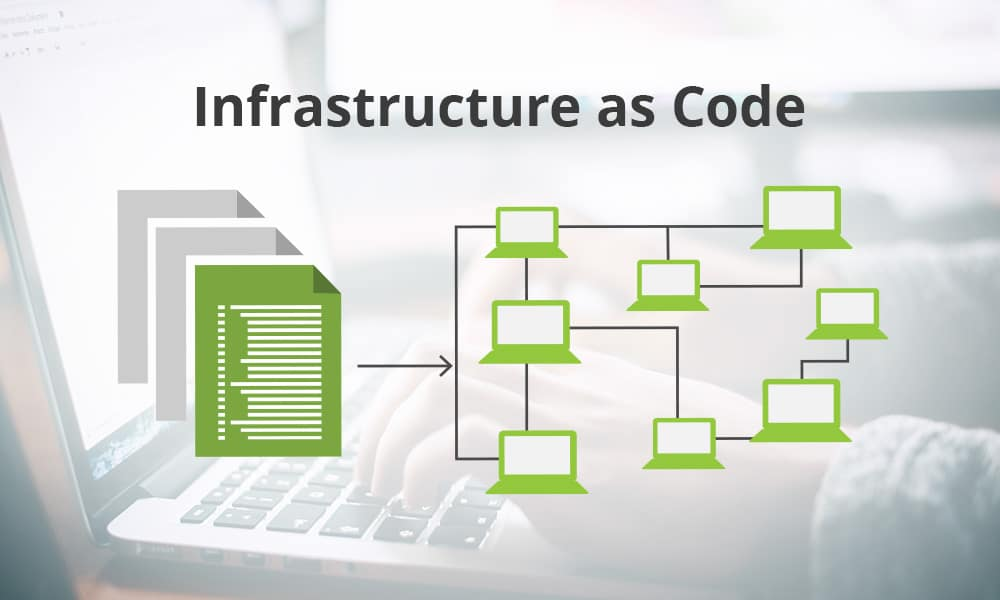

# 🎁 Application lifecycle

Infrastructure-as-Code (IaC), altyapının otomatik olarak yönetilmesi ve bir kod seti gibi dağıtılması prensibine dayanır. Bu yaklaşım, altyapıyı manuel olarak yapılandırmak yerine, yapılandırmaları kod olarak yazmayı ve bu kodu kullanarak sunucuları ve hizmetleri otomatik olarak dağıtmayı sağlar. Bu yöntem, hızlı ve tutarlı altyapı kurulumu, yönetimi ve değişikliklerin izlenmesi için kullanılır.

<figure><figcaption></figcaption></figure>

1. **ARM Templates**: Azure Resource Manager (ARM) şablonları, Microsoft Azure'daki kaynakların yönetimi için kullanılır. Bu şablonlar, JSON formatında yazılır ve Azure'da bir veya daha fazla kaynağın dağıtımını ve yapılandırmasını belirler.
2. **Bicep Templates**: Bicep, ARM şablonları için daha okunaklı ve basit bir dil sunar. Bicep dosyaları, derlendikten sonra ARM şablonlarına dönüştürülür ve Azure'da kullanılır.
3. **Azure Automation**: Azure kaynaklarınızın yönetimini ve otomasyonunu kolaylaştıran bir hizmettir. Bu hizmet, karmaşık ve zaman alıcı görevleri otomatikleştirmek için Runbook'lar ve iş akışları gibi araçları kullanır. Runbook'lar, otomasyon için kullanılan, PowerShell veya Python scriptleri içerebilen süreçlerdir.
4. **Terraform**: HashiCorp tarafından geliştirilen ve çok çeşitli hizmet sağlayıcıları ve platformlarla uyumlu olan açık kaynaklı bir IaC aracıdır. Terraform, altyapının güvenli ve verimli bir şekilde dağıtılmasını ve yönetilmesini sağlayan bir konfigürasyon dili olan HCL (HashiCorp Configuration Language) kullanır.

Bu araçlar, altyapının hızla ve güvenilir bir şekilde kurulmasını, ölçeklenmesini ve güncellenmesini sağlar. Her biri kendi avantajlarına ve kullanım durumlarına göre farklı senaryolarda tercih edilir. Örneğin, Terraform, birden fazla bulut sağlayıcısında kullanım için uygundur, oysa ARM ve Bicep şablonları özellikle Azure için tasarlanmıştır. Azure Automation, özellikle Azure ortamında süreç ve iş akışlarını otomatize etmek için kullanışlıdır.



