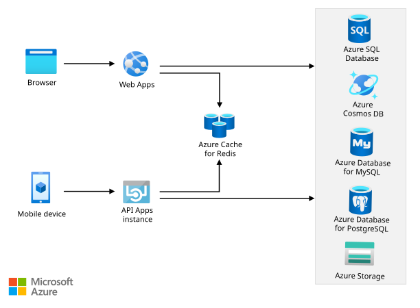
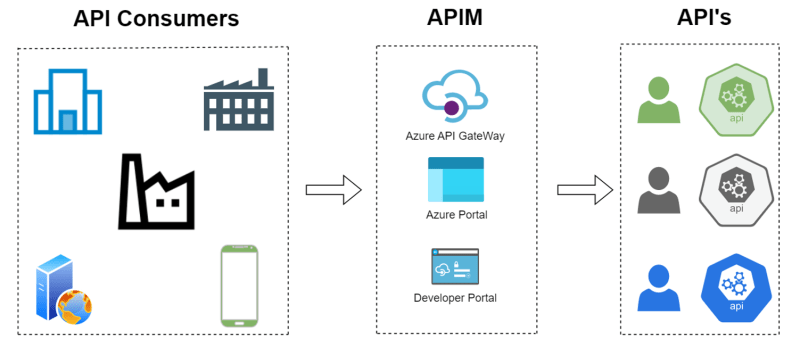

# 🥍 Application optimization solution

### Azure Redis Cache,

<figure><figcaption></figcaption></figure>

Azure Redis Cache, Microsoft'un Azure bulut platformunda sunulan, yönetilen bir Redis hizmetidir. Bu hizmet, key-value tabanlı çalışmaktadır. Azure Redis Cache, uygulamalarınızın performansını artırmak için veriye hızlı erişim sağlar. Özellikle, veritabanı erişimlerini azaltarak, sık kullanılan verileri bellekte tutarak ve iş yükünü dağıtarak uygulama performansınızı optimize etmenize yardımcı olur. Azure Redis Cache, yüksek erişilebilirlik, güvenlik ve ölçeklenebilirlik gibi özellikler sunar, böylece iş yüklerinizin ihtiyaçlarına uygun olarak kolayca yapılandırılabilir ve yönetilebilir.



### Azure API Management, 

<figure><figcaption></figcaption></figure>

Azure API Management, API'ler için bir yönetim katmanı sağlar ve API'lerinizi geliştirmek, yayınlamak, güvenliğini sağlamak, izlemek ve kontrol etmek için kapsamlı bir platform sunar.

Azure API Management'in temel işlevleri şunlardır:

1. **API Yönetimi**: API'lerinizi oluşturmanıza, düzenlemenize ve yayınlamanıza olanak tanır. API'lerinizi tek bir yerden kolayca yönetebilir ve güncelleyebilirsiniz.
2. **API Erişim Kontrolü**: API'lerinize erişim kontrolü sağlar. İstemcilerin kimlik doğrulamasını gerektiren API'lere erişmesini sağlar veya belirli istemcilerin erişimini sınırlayabilirsiniz.
3. **API Güvenliği**: API'lerinizi güvence altına almak için bir dizi güvenlik önlemi sağlar. Kimlik doğrulama, yetkilendirme, API anahtarları, OAuth 2.0 ve diğer güvenlik standartlarını destekler.
4. **API İzleme ve Analiz**: API trafiğini izlemenize ve analiz etmenize olanak tanır. API kullanımı, performansı, hata durumları ve diğer metrikler hakkında detaylı bilgiler sağlar.
5. **API Politikaları**: API isteklerini işlemek için özelleştirilebilir politikaları destekler. Örneğin, isteklerin sınırlandırılması, dönüştürülmesi, güvenlik denetimleri ve diğer işlevleri uygulamak için politikaları kullanabilirsiniz.
6. **API Yayınlama ve Sürümleme**: API'lerinizi farklı ortamlarda yayınlamak ve sürümlemek için destek sağlar. Bu, geliştirme, test ve üretim ortamları arasında geçiş yapmanızı kolaylaştırır.

Azure API Management, kuruluşların API'lerini etkili bir şekilde yönetmelerine ve dış geliştiricilere API'lerini sunmalarına olanak tanır. API'lerinizi güvenli, ölçeklenebilir ve yüksek performanslı bir şekilde sunmak için önemli bir araçtır.


