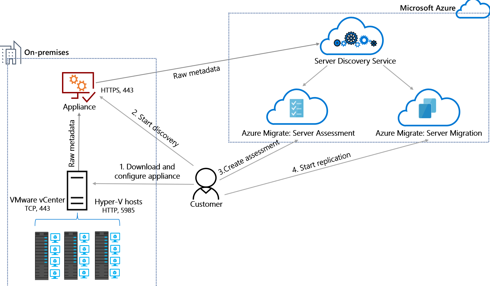

# 🦿 Assessing workloads

Azure'da iş yüklerini değerlendirme (Assessing workloads) süreci, bir organizasyonun on-premise (yerinde) bulunan kaynaklarını Azure bulutuna taşımadan önce hangi kaynakların taşınacağını ve nasıl taşınacağını belirlemeyi içerir.

#### **Assessment tools,**

* **Server Assessment**: Fiziksel sunucuları ve Hyper-V veya VMware gibi sanallaştırma ortamlarında çalışan sanal makineleri değerlendirir. Bu değerlendirme, sunucularınızı Azure'a taşımak için hazırlar.
* **Database Assessment**: Microsoft SQL Server veritabanlarını değerlendirerek Azure SQL Veritabanı, Azure SQL Managed Instance veya SQL on VM gibi Azure hizmetlerine göç için hazırlık yapar.
* **Webapp Assessment**: Çalışan web uygulamalarını değerlendirir ve Azure'a göç için hazırlanmalarını sağlar.

### Azure Migrate:

<figure><figcaption></figcaption></figure>

Azure Migrate, Microsoft tarafından sunulan, şirketlerin kendi veri merkezlerinden Azure'a göç etme süreçlerini planlamalarına, gerçekleştirmelerine ve izlemelerine yardımcı olan bir hizmettir. Genellikle şirketlerin sunucularını, uygulamalarını, veri tabanlarını ve diğer veri merkezi kaynaklarını değerlendiren ve Azure’a taşınmaları için rehberlik eden merkezi bir göç servisidir.

Azure Migrate, buluta geçiş sürecindeki kuruluşlara birçok yönden yardımcı olur ve karmaşıklığı azaltarak daha hızlı ve etkin bir geçiş yapılmasını sağlar. Bu hizmet, göç etmek isteyen şirketlerin ihtiyaçlarını anlamalarına ve göç stratejilerini belirlemelerine yardımcı olacak değerli içgörüler sunar.

#### Keşif ve Değerlendirme

* İlk adım, mevcut sunucularınızı, uygulamalarınızı taramak ve bulut geçişi için bir envanter oluşturmaktır. Azure Migrate, şirketinizin ağındaki kaynakları otomatik olarak tespit edebilen araçlar(appliance,csv) sunar. Tespit edilen bu kaynakların buluta taşınabilirliği incelenir. Uygulamalarınızın ve verilerinizin Azure'da çalışabileceği, ne kadar kaynak kullanabileceği ve maliyetlerin ne olacağı gibi bilgiler değerlendirilir.

#### Geçiş

* Azure Migrate, sanal makinelerinizi, veri tabanlarınızı ve diğer uygulamalarınızı Azure'a taşımak için çeşitli araçlar sunar. Bu araçlar arasında Azure Site Recovery, Azure Database Migration Service gibi hizmetler bulunur. Seçilen taşınma yöntemi ve araçları kullanarak, kaynaklarınız Azure'a aktarılır. Bu süreçte, işlerinizin kesintiye uğramaması veya minimum düzeyde kesinti ile gerçekleşmesi için dikkatli bir şekilde planlama yapılır.




