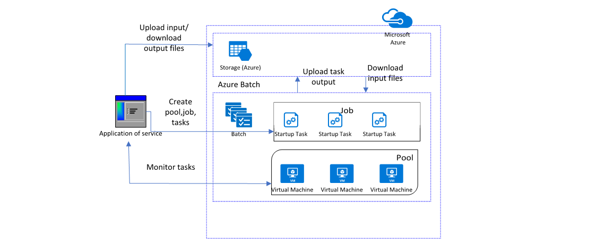

# 🔋 Azure Batch Demostration

<figure><figcaption></figcaption></figure>

Azure Batch, büyük ölçekli paralel ve yüksek performanslı hesaplama işlerini yönetmek ve çalıştırmak için tasarlanmış bir hizmettir. Kullanıcıların, bilimsel analizler, veri işleme, render işlemleri gibi yoğun görevleri, yüzlerce, binlerce hatta on binlerce sanal makine üzerinde çalıştırmalarına olanak tanır.

1. **Application or Service:** Azure Batch hizmetine bağlanan ve iş yüklerini yöneten bir yazılımdır. Bu, genellikle bir kullanıcının kendi bilgisayarında çalıştırdığı bir komut satırı aracı veya bir web uygulaması olabilir. Uygulama, Azure Batch'de iş oluşturmak, görevleri izlemek ve sonuçları almak için kullanılır.
2. **Pool:** Azure Batch içindeki "Pool", birden çok sanal makinenin (VM) bir koleksiyonunu ifade eder. Her bir sanal makine, belirli bir iş yükünü çalıştırmak için ayrılmış kaynaklara sahiptir. Kullanıcılar pool oluşturarak, işlerini çalıştıracak VM'lerin sayısını ve tipini belirleyebilirler.
3. **Job:** Bir "Job", belirli bir işlem veya iş yükü için yapılandırılmış bir konteynerdir. Job içinde bir veya birden çok "Task" bulunur ve bu job, bir pool üzerinde çalıştırılacak olan işleri temsil eder.
4. **Task:** Bir "Task", işlenmesi gereken spesifik bir işlemi ifade eder. Bu, genellikle bir uygulama çalıştırmak, bir script yürütmek veya bir komut dosyası başlatmak gibi bir işlem olabilir. Görevler, bir job içinde bağımsız olarak veya birbirine bağlı bir şekilde çalıştırılabilir.
5. **Startup Task:** Bir "Startup Task", pool içindeki her VM başladığında otomatik olarak çalıştırılan bir görevdir. Bu, VM'leri özelleştirmek, yazılım yüklemek veya başlatma sırasında belirli yapılandırma komutlarını çalıştırmak için kullanılır.
6. **Storage (Azure):** Azure Batch işlemleri için gerekli olan giriş ve çıkış dosyalarının saklandığı yerdir. Dosyalar, Azure Storage üzerinde güvenli bir şekilde depolanır ve işlerin veya görevlerin gerektiği zaman erişimine izin verilir.
7. **Upload Task Output:** İşlenen görevlerin çıktıları, iş tamamlandıktan sonra Azure Storage'a geri yüklenir. Bu sayede sonuçlar daha sonra analiz edilmek üzere saklanır.
8. **Download Input Files:** Görevler çalıştırılmadan önce, Azure Storage'dan gerekli giriş dosyaları sanal makineler üzerine indirilir. Böylece, görevler bu dosyalar üzerinde işlem yapmak üzere gereken tüm bilgilere sahip olurlar.
9. **Monitor Tasks:** Görevlerin durumu, uygulama veya servis tarafından izlenebilir. Böylece kullanıcılar, görevlerin ilerlemesini takip edebilir ve herhangi bir sorun olduğunda müdahale edebilirler.

***

### Demo

1 - ilk adım olarak, rg-onurBatch-001 isminde bir resource group oluşturuyoruz.

```bash
az group create --name rg-onurBatch-001 --location eastus2
```

<figure><figcaption></figcaption></figure>


2 -  Batch servisimize bağlamak için bir Azure Depolama hesabı oluşturuyoruz. Uygulamamıza veya çalıştıracağımız görevlere ait, giriş ve çıkış dosyalarının tutulacağı depolama hesabı olarak kullanacağız.

```bash
az storage account create --resource-group rg-onurBatch-001 --name onurbatchstorage --location eastus2 --sku Standard_LRS
```

<figure><figcaption></figcaption></figure>


3 - Aşağıdaki komut ile, "onurbatchaccount" adında yeni bir Batch hesabı oluşturuyoruz, ve bunu "onurbatchstorage" adında bir Storage hesabı ile ilişkilendiriyoruz. Azure Batch işleri sırasında kullanılacak giriş/çıkış dosyaları ve diğer veri depolama ihtiyaçları için bu Storage hesabı kullanacağız.

```bash
az batch account create --name onurbatchaccount --storage-account onurbatchstorage --resource-group rg-onurBatch-001 --location eastus2
```

<figure><figcaption></figcaption></figure>


4 - Aşağıdaki komutla, "onurbatchaccount" adlı Azure Batch hesabına Azure CLI aracılığıyla oturum açıyoruz.

```bash
az batch account login --name onurbatchaccount --resource-group rg-onurBatch-001 --shared-key-auth
```


5 - Aşağıdaki komutu kullanarak, Azure Batch hizmetinde `myPool` adında yeni bir sanal makine havuzu oluşturuyoruz. Havuzumuzda, Ubuntu Server 20.04 LTS sürümüne sahip bir imaj kullanacağız.&#x20;

`--node-agent-sku-id` seçeneği ile Azure Batch hizmetinin, Ubuntu 20.04 ile uyumlu çalışmasını sağlayacak olan node agent'ı belirliyoruz.&#x20;

`--target-dedicated-nodes` seçeneği ile havuzumuzda sürekli olarak çalışacak olan ve iş yüklerimizi işlemek üzere ayrılacak olan node sayısını 2 olarak belirtiyoruz. Bu nodelar yalnızca bizim işlerimiz için kullanılacak.&#x20;

`--vm-size` ile de nodelarda kullanılacak sanal makine boyutunu `Standard_D2s_v3` olarak ayarlıyoruz ki bu, Azure tarafından sunulan bir VM boyutudur ve belirli bir CPU, bellek ve diğer kaynaklara sahiptir.

Özetle, belirtilen özelliklere sahip bir havuz oluşturmuş oluyoruz ve bu havuz, iş yüklerimizi çalıştırmak için kullanılacak sanal makineleri içerecek.

```bash
az batch pool create --id myPool --image canonical:0001-com-ubuntu-server-focal:20_04-lts --node-agent-sku-id "batch.node.ubuntu 20.04" --target-dedicated-nodes 2 --vm-size Standard_D2s_v3
```

<figure><figcaption></figcaption></figure>


6 - Havuzumuzun durumunu sorgulamak için aşağıdaki komutu kullanmalıyız. Göreceğiniz üzere, kaynaklar Steady yani, hazır durumdadır.

```bash
az batch pool show --pool-id myPool --query "allocationState"
```

<figure><figcaption></figcaption></figure>


7 - Aşağıdaki komut, Azure Batch'te `myJob` adında yeni bir iş (job) oluşturmak ve bu işi `myPool` adındaki havuza atamak için kullanılır. `--id myJob` seçeneği ile işe benzersiz bir tanımlayıcı atıyoruz, `--pool-id myPool` seçeneği ile de bu işin çalıştırılacağı havuzu belirtiyoruz. Bu şekilde, `myPool` havuzundaki sanal makineler üzerinde, `myJob` işi altında tanımlanacak görevler (tasks) çalıştırılabilir hale getirilir.

```bash
az batch job create --id myJob --pool-id myPool
```

<figure><figcaption></figcaption></figure>


8 -  Bu komut dizisi, `myJob` adlı Azure Batch işi için dört farklı görev (`task`) oluşturur. Her görev, Unix/Linux komut satırını kullanarak basit bir işlem gerçekleştirir: "Hello World from node:" mesajını yazdırır, ardından o anki görevin çalıştığı Azure Batch düğümünün (node) ID'sini yazdırır ve son olarak 90 saniye bekler.

```bash
for i in {1..4}; do    az batch task create --task-id myTask$i --job-id myJob --command-line "/bin/bash -c 'echo -n Hello World from node: ; printenv AZ_BATCH_NODE_ID'"; done
```

<figure><figcaption></figcaption></figure>


9 -  Aşağıdaki komut, Azure Batch servisinde `myJob` adlı iş içerisindeki `myTask1` adlı görevin detaylarını görüntülemek için kullanılır. `--job-id` seçeneği ile hangi işe bakmak istediğinizi, `--task-id` ile de o iş içindeki hangi görevin detaylarını sorgulamak istediğinizi belirtirsiniz. Bu Komut, belirtilen görevin durumu, çalışma zamanı, başlangıç ve bitiş zamanları gibi önemli bilgileri döndürür. Ekran görüntüsünde göreceğiniz üzere, Exit code 0 dönmüş. Yani task başarılı bir şekilde çalışmış.

```bash
az batch task show --job-id myJob --task-id myTask1
```

<figure><figcaption></figcaption></figure>


10 - İşlem tamamlandı. Ekran görüntüsünden de göreceğiniz üzere, komut başarılı bir şekilde çalışmış ve stdout'a istediğimiz bilgiyi basmış.

<figure><figcaption></figcaption></figure>

<figure><figcaption></figcaption></figure>

<figure><figcaption></figcaption></figure>

<figure><figcaption></figcaption></figure>


