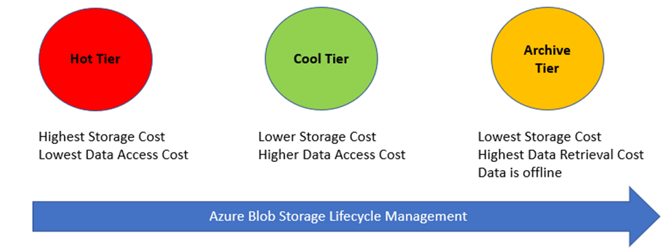
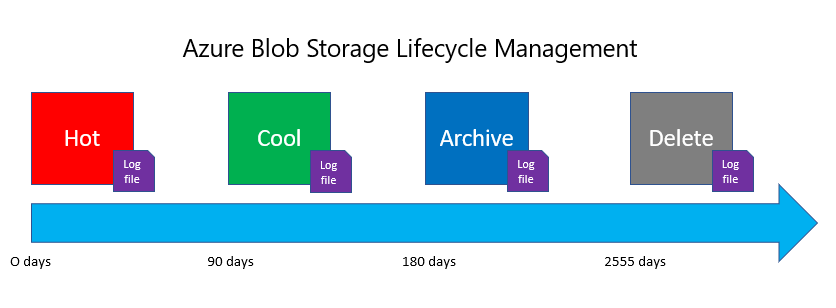

# 📹 Azure blob storage - Lifecycle & immutable demo

Azure Storage'da "erişim katmanı" (access tier), depolanan verilerin erişim sıklığına göre optimize edilmesini sağlar. Bu, maliyeti dengeler ve depolama ihtiyaçlarınıza en uygun çözümü seçmenize olanak tanır. Azure'da üç ana erişim katmanı bulunur: Sıcak (Hot), Soğuk (Cool) ve Arşiv (Archive). Her biri, verilerin ne sıklıkta erişildiği ve saklanma süresi gibi faktörlere göre farklı kullanım senaryoları için tasarlanmıştır.

<figure><figcaption></figcaption></figure>

#### Hot Tier

* Bu katman, sık erişilen veriler için tasarlanmıştır.
* Erişim maliyeti diğer katmanlara göre daha düşüktür, ancak aylık depolama maliyeti daha yüksektir.
* Anlık yedekleme, medya depolama ve sık erişilen "big data" için idealdir.

#### Cool Tier

* Az erişilen veriler için uygun bir seçenektir (en az bir ay için depolanacak veriler).
* Sıcak katmana göre daha düşük aylık depolama maliyeti sunar, ancak verilere erişim veya verileri dışa aktarma maliyeti daha yüksektir.
* Kısa vadeli yedeklemeler gibi az kullanılan veriler için idealdir.

#### Archive Tier

* Çok nadiren erişilen ve uzun süre saklanması gereken veriler için en uygun maliyetli çözümdür.
* Verilerin depolanma maliyeti son derece düşüktür, fakat verilere erişim süresi en uzun olan katmandır ve verilere erişim maliyeti en yüksektir.
* Yasal gereklilikler veya düzenlemelere uygunluk gibi nedenlerle uzun süreli veri saklama ihtiyaçları için idealdir.

<figure><figcaption></figcaption></figure>

Bir e-ticaret şirketi, kullanıcı işlemlerinin loglarını Azure Blob Storage'da saklamaktadır. Şirket, log dosyalarına sıklıkla erişmek ve analiz yapmak istemekte fakat maliyetleri de optimize etmek istemektedir.

1. **0-90 gün:** İşlemler gerçekleştikçe, log dosyaları "Hot" katmana yüklenir. Bu dönemde, analitik ekipleri bu logları sıkça analiz eder ve müşteri hizmetleri bu logları müşteri sorunlarını çözmek için kullanır.
2. **91-180 gün:** 90 günün sonunda, log dosyaları "Cool" katmana taşınır. Bu loglar artık sık kullanılmamaktadır ama yine de belirli analizler ve düzenli raporlar için erişilebilir durumdadır. Maliyet düşürme amacıyla bu katmanda saklanmaktadır.
3. **181-2555 gün:** 180 günün sonunda, loglar artık nadiren erişilen "Archive" katmanına taşınır. Bu katmandaki veriler, yasal gereklilikler veya uzun vadeli analiz ihtiyaçları için gerektiğinde erişilebilir halde tutulur.
4. **2556 gün:** 7 yıllık yasal saklama süresi sonunda, artık gereksiz olan log dosyaları otomatik olarak silinir, böylece şirketin veri saklama maliyetleri ve yönetim yükü azaltılır.

Azure Portal üzerinden, Azure Storage hesabınızın lifecycle management kurallarını belirleyebilirsiniz. Burada, blob verilerinizin hangi koşullar altında farklı erişim katmanlarına taşınacağını veya silineceğini belirten politikalar oluşturabilirsiniz.

#### Azure blob immutable storage:

<figure><figcaption></figcaption></figure>

1. **Lock Time-based Retention Policy**: Belirli bir süre boyunca blobların (blob1.pdf, blob2.txt, blob3.doc gibi) üzerine yazma veya silme işlemlerinin yapılamayacağı bir süre bazlı saklama politikasını kilitler. Burada gösterilen konteyner, kilitlenmiş politika altında ve bloblar üzerinde okuma işlemleri serbestken, yazma ve silme işlemleri yasaktır.
2. **Legal Hold**: Bir hukuki bekletme durumunda, blobların üzerine yazma veya silme işlemlerinin yapılamayacağını belirtir. Hukuki tutma devredeyken, veriler yine okunabilir ancak değiştirilemez veya silinemez. Bu, genellikle dava, denetim veya inceleme gibi hukuki süreçler sırasında gereklidir.

Temel fark, **Lock Time-based Retention Policy**'nin önceden belirlenmiş bir zaman dilimi için verileri değiştirilemez kıldığı, **Legal Hold**'un ise süresi belirsiz bir yasal gereklilik veya süreçle ilgili olduğu ve bu sürecin tamamlanmasına kadar verileri değiştirilemez kıldığıdır. Her iki politika da verileri koruma altına almak için kullanılır ancak farklı senaryolara ve gereksinimlere göre uygulanırlar.

Her iki politika da "Write Once, Read Many" (WORM) formatında depolama sağlar. Bu, verilerin bir kez yazılmasına ve birden çok kez okunmasına olanak tanırken, belirlenen süre boyunca veya hukuki bir tutma uygulanırken değiştirilmesini veya silinmesini engeller. Bu özellikler, özellikle düzenleyici gerekliliklere uyum sağlamak ve verilerin değiştirilemezliğini garanti altına almak için kritik öneme sahiptir.



### Azure blob immutable storage Demo:

1 - Yeni bir storage account oluşturalım. Öncelikle "basics" kısmında genel bilgileri (account name vb) girmeliyiz. Ardından "Data protection" kısmına gelip,&#x20;

* "Enable versioning for blobs" seçeneği işaretlenmelidir.
* "Enable version-level immutability support" seçeneği işaretlenmelidir.

<figure><figcaption></figcaption></figure>

2 - Retention interval süresi belirlemeliyiz. 20 gün boyunca tüm verilerimizin korunmasını istiyoruz. Bunun için, Data protection > Manage policy seçeneklerine tıklıyoruz.

<figure><figcaption></figcaption></figure>

3 - Ardından "democontainer" adında bir container oluşturup, içerisine bir imaj upload ediyoruz. Ardından yüklediğimiz imajı silmek istediğimizde, gördüğünüz gibi uyarı alacaksınız. Özetle 20 gün boyunca, bu imajı değiştirip, silemeyeceğiz. Sadece okuma yapabiliriz.

<figure><figcaption></figcaption></figure>



### Lifecycle management Demo:

1 - Storage Account ekranında sol menüden, Data management > Lifecycle management ekranına geliyoruz. Burada en önemli kısım, "Enable access tracking"  seçeneğinin aktif olmasıdır. Çünkü dosya erişimlerinin en son ne zaman olduğuna dair bilgileri bu seçenek aktif olduğu sürece alabiliriz.

<figure><figcaption></figcaption></figure>

2 - Burada ben 3 adet kural oluşturdum. Fakat bir tane de beraber oluşturalım. Bunun için "Add a rule" butonuna tıklıyoruz.

<figure><figcaption></figcaption></figure>

* Rule name: move\_to\_cool\_2
* Rule scope: Apply rule to all blobs in your storage account
* Blob type: Block blobs
* Blob subtype: Base blobs

Bilgilerini girip sonraki adıma geçiyoruz.

<figure><figcaption></figcaption></figure>

* 90 gün boyunca erişilmeyen dosyaları (blobları) cool storage layer'ına taşımasını söylüyorum ve kaydediyorum.

<figure><figcaption></figcaption></figure>

* Kuralımız oluştu ve 48 saat içerisinde, istediğimiz şartlara uygun bir dosya/blob varsa taşımaya başlayacak.


