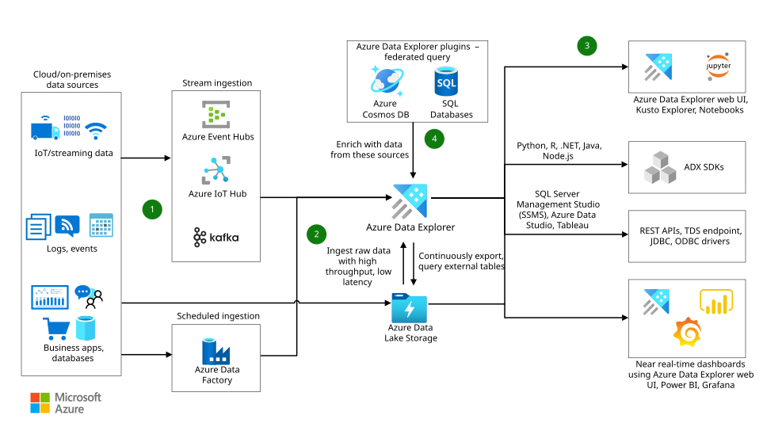

# 🚌 Azure Data Explorer

<figure><figcaption></figcaption></figure>

Azure Data Explorer, büyük miktarda telemetri ve log verilerini hızlı bir şekilde toplayıp analiz etmek için tasarlanmış, yönetilen, hızlı ve yüksek ölçeklenebilir bir veri keşif hizmetidir.

* **Amaç**: Azure Data Explorer, modern yazılımlar tarafından üretilen veri akışlarını toplayıp depolayabilir ve analiz edebilir. Çeşitli veri kaynaklarından büyük hacimli verilerin analizi için idealdir; bu kaynaklar arasında web siteleri, uygulamalar, IoT cihazları ve daha fazlası bulunmaktadır.
* **Ne Zaman Kullanmalısınız?**: Teşhis, izleme, raporlama, analitik veya makine öğrenimi amaçlarıyla çeşitli kaynaklardan veri toplamanız gerektiğinde Azure Data Explorer kullanılır.
* **Entegrasyonlar**: Azure Data Explorer, Azure Monitor ve Sentinel ile entegre edilebilir. Bu entegrasyonlar sayesinde güvenlik loglarını ve diğer teşhis loglarını Azure Data Explorer'e aktarabilir ve analiz, makine öğrenimi veya gösterge tablosu oluşturma gibi işlemler için kullanabilirsiniz.

Kullanım akışı şu şekildedir:

1. İlk adım, verilerinizi saklamak ve analiz etmek için bir Azure Data Explorer kümesi ve veritabanı oluşturmaktır.
2. Daha sonra, verilerinizi Azure Data Explorer'ye yüklersiniz. Bu veriler, loglar, telemetri verileri veya herhangi bir yapılandırılmamış veri olabilir.
3. Verilerinizi yükledikten sonra, Kusto Query Language (KQL) kullanarak veritabanınızda sorgular çalıştırabilirsiniz. KQL, verileri analiz etmek ve içgörüler elde etmek için güçlü ve esnek bir sorgu dilidir.

