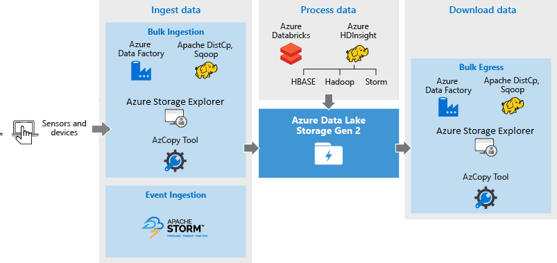
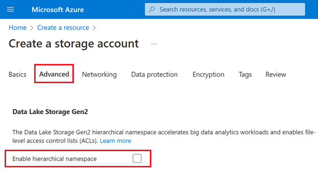

# 🔅 Azure Data Lake Storage

Azure Data Lake Storage (ADLS), büyük miktarda veriyi depolamak ve bu veriler üzerinde analiz yapmak için kullanılan bir Microsoft Azure depolama hizmetidir.

<figure><figcaption></figcaption></figure>

#### Azure Blob Storage vs Azure Data Lake Storage (ADLS)

#### Azure Blob Storage

* Metin olmayan yapılandırılmamış veri depolamak için idealdir (örneğin, fotoğraflar, videolar vb.).
* İhtiyaçlarınıza göre replikasyon seçebilirsiniz; varsayılan seçim Genel Olarak Kullanılabilir Depolama (GRS) olacaktır.
* Düz (flat) ad alanlarına sahiptir.
* Hadoop ile uyumlu değildir.
* Ayrıntılı (granüler) erişim mevcut değildir.

#### Azure Data Lake Storage (ADLS)

* Büyük miktarda metin verisi depolamak için idealdir.
* Varsayılan olarak sunulmadığı için replikasyonu ayarlamanız gerekir.
* Hiyerarşik ad alanlarına sahiptir.
* Hadoop verilerini saklayabilir.
* Ayrıntılı (granüler) erişim sağlanabilir.

Genel olarak, Azure Blob Storage daha çok genel amaçlı veri depolama için kullanılırken, ADLS özellikle büyük veri analizi ve Hadoop ekosistemine yönelik ihtiyaçlar için tasarlanmıştır ve daha karmaşık veri yönetimi senaryolarını destekler. ADLS'nin hiyerarşik ad alanı yapısı, veri dosyalarını bir dosya sistemi gibi organize etmeyi sağlar ve Hadoop uyumluluğu büyük veri işleme ve analizleri için önemlidir. Granüler erişim kontrolü, verilere daha ayrıntılı erişim sağlamak ve güvenlik, yönetim için daha fazla kontrol sunmak anlamına gelir.

#### Adım Adım Örnek:

**1. Veri Yüklemesi**

Bir şirketin, sosyal medya yorumlarından elde ettiği büyük bir metin veri seti olsun. Bu verileri, ADLS'ye yükler. Yükleme işlemi, Azure portalı, Azure CLI (komut satırı arayüzü) veya SDK'lar aracılığıyla yapılabilir.

**2. Veri Depolama ve Organizasyon**

ADLS'de veriler, dosya sistemi benzeri bir hiyerarşi içinde saklanır. Yani, verileri klasörler ve alt klasörler şeklinde organize edebilirsiniz. Örneğin, şirket verileri şu şekilde düzenleyebilir:

```textile
/social-media-data/2024/
    /twitter/
        /data-part1.json
        /data-part2.json
    /facebook/
        /data-part1.json
        /data-part2.json

```

Bu yapı, verilere hızlı ve kolay erişim sağlar ve yönetimini kolaylaştırır.


**3. Veri Erişimi ve Analizi**

Veri bilimcileri, yüklenen veriler üzerinde analiz yapmak isterlerse, ADLS üzerinde doğrudan büyük veri analizi araçları çalıştırabilirler. Örneğin, Apache Spark veya Hadoop gibi araçlar kullanılarak ADLS'de saklanan veri setlerinden içgörüler elde edilebilir.

**4. Güvenlik ve İzin Yönetimi**

ADLS, granüler erişim kontrolü sunar. Şirket, belirli klasörler veya dosyalar için farklı erişim düzeylerini belirleyebilir. Örneğin, sadece bazı veri bilimcilerinin 'twitter' klasörüne erişmesine izin verilebilir.

**5. Ölçeklendirme ve Maliyet Yönetimi**

Veri seti büyüdükçe, ADLS otomatik olarak ölçeklenir. Şirket, kullanılan depolama alanına göre ödeme yapar, böylece gereksiz maliyetlerden kaçınır.


<figure><figcaption><p>Storage account oluşturma kısmından, ADSL aktif edilebilir.</p></figcaption></figure>




