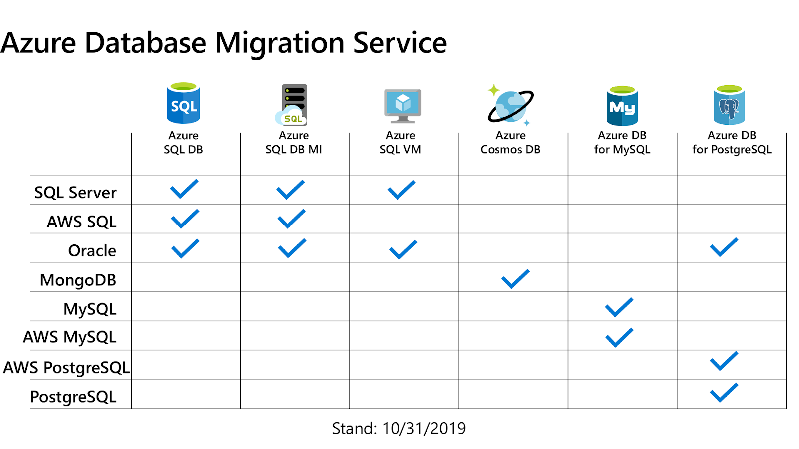

# Azure Database migration

Azure veritabanı taşıma süreci, verilerinizi mevcut bir kaynaktan Azure bulut hizmetlerine etkin bir şekilde taşımanıza olanak tanır. Bu süreçte iki ana taşıma türü kullanılabilir: online taşıma ve offline taşıma.

<figure><figcaption></figcaption></figure>

#### Online Taşıma ve Offline Taşıma

**Online Taşıma (Online Migration)**: Online taşıma, taşıma işlemi sırasında kaynak veritabanının aktif ve kullanılabilir kalmasını sağlar. Bu yöntem, kesintisiz bir hizmet sunarak iş sürekliliğini korur. Çevrimiçi taşıma, veriler canlı bir şekilde yeni hedefe aktarılırken kaynak veritabanına erişimin devam etmesine imkan tanır.

**Offline Taşıma (Offline Migration)**: Offline taşıma, taşıma işlemi sırasında kaynak veritabanının kullanıma kapalı olmasını gerektirir. Bu yöntemde, veri kaynağına erişim taşıma süreci tamamlanana kadar durdurulur. Genellikle daha hızlı tamamlanır, ancak iş sürekliliği kesintiye uğrar.

***

#### Azure Data Migration Assistant ve Azure Database Migration Service

Azure'da veritabanı taşıma için kullanılan iki önemli araç Azure Data Migration Assistant (DMA) ve Azure Database Migration Service (DMS)’dir. Bu iki araç arasındaki farklar aşağıdaki gibidir:

**Azure Data Migration Assistant (DMA)**:



* DMA, SQL Server gibi veritabanlarının Azure SQL Database veya Azure SQL Managed Instance gibi Azure platformlarına uygunluğunu değerlendirir.
* Bu araç, taşınacak veritabanlarını analiz eder, uyumluluk sorunlarını tespit eder ve performans iyileştirmeleri önerir.
* DMA, hem keşif ve değerlendirme işlemleri yapar hem de küçük ve orta ölçekli taşıma işlemlerini gerçekleştirebilir.



**Azure Database Migration Service (DMS)**:

<figure><figcaption></figcaption></figure>

* DMS, daha geniş kapsamlı bir taşıma hizmeti sunar ve SQL Server, MySQL, PostgreSQL gibi çeşitli veritabanı sistemlerinden Azure’a taşımayı destekler.
* Hem online hem de offline taşıma modlarını destekler, bu sayede iş ihtiyaçlarına göre kesintisiz veya planlı bir taşıma sağlar.
* DMS, genellikle daha büyük ve daha karmaşık veritabanı taşıma işlemleri için tercih edilir, çünkü birden fazla veritabanını ve büyük veri hacimlerini yönetebilir.



Özetle, DMA daha çok analiz ve küçük ölçekli taşıma işlemleri için idealdir, DMS ise daha büyük ve kompleks taşıma gereksinimleri için daha uygun bir çözümdür.&#x20;


