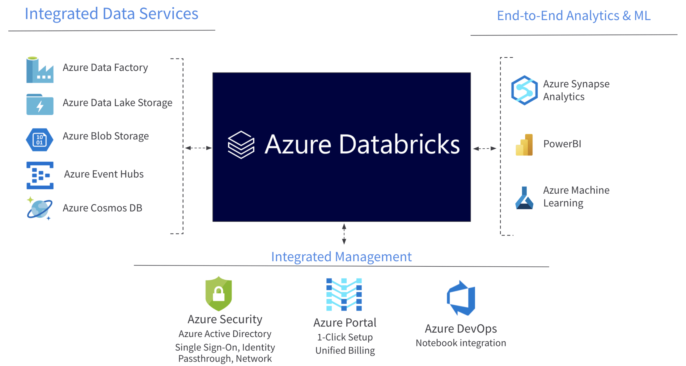

# 🧘‍♂️ Azure Databricks

Azure Databricks, büyük veri işleme, veri analizi ve yapay zeka projeleri için kullanılan bulut tabanlı analitik platformdur. **Apache Spark** tabanlı olarak çalışır ve kullanıcılarına kolay bir şekilde büyük veri setleri üzerinde analiz yapma, veri keşfi, makine öğrenimi modeli geliştirme gibi çözümler oluşturma imkanı sunar. Databricks, kullanıcıların verileri depolama hizmetlerinden (örneğin, Azure Blob Storage veya Azure Data Lake Storage) alıp işlemelerini sağlar, böylece veri analizi süreçlerini daha verimli ve etkili hale getirir.

<figure><figcaption></figcaption></figure>

* Veri analistlerinin data lake storage üzerinde SQL sorguları çalıştırmasına, verileri analiz etmesine, görselleştirmesine ve keşfetmesine olanak tanır. Elde edilen sonuçlar farklı şekillerde sunulabilir.
* ADF veya başka bir hizmet tarafından alınan veriler ADLS'de depolanır. Bu depolanan verilere Databricks üzerinden erişilebilir ve Spark kullanılarak analizler yapılabilir.
* Veri analizi, veri bilimi ve makine öğrenimi üzerine projeler gerçekleştirmek için kapsamlı bir araç seti sunmaktadır.

#### Komponentler,

* **Control Plane:** Control Plane, kullanıcı oturumlarını yönetmek için bir dizi bileşeni barındırır. Bu bileşenler arasında iş yüklerini yönetmek, sorgu sonuçlarını analiz etmek ve hesaplama kaynaklarını (cluster'ları) yönetmek için kullanılan Jobs, Notebooks ve Cluster Manager bulunur. Ayrıca, kullanıcı oturumlarını başlatmak, çalıştırmak ve sonlandırmak için web uygulaması, Hive metastore ve erişim kontrol listeleri gibi bileşenler de Control Plane'de yer alır. Ancak, bu bileşenlerin Azure aboneliğinizde bulunmaz. Bunun yerine, bu bileşenler doğrudan Databricks tarafından yönetilir ve Microsoft ile işbirliği içinde sağlanır.
* **Data Plane:** Data Plane'inde, "runtime clusters" adı verilen çalışma zamanı kümeleri bulunur. Bu kümeler, gerçek veri işleme işlerini gerçekleştiren ve kullanıcıların kodlarını çalıştırdığı compute kaynaklarını temsil eder.&#x20;

Örneğin, Bir perakende şirketi için, günlük satış verilerini analiz etmek ve işlemek önemlidir. Azure Databricks, bu süreci kolaylaştırır. Veriler depolama hesabında saklanır ve Azure Databricks, bu verilere erişir. Spark cluster'ları üzerinde veri analizi ve işleme işlemlerini gerçekleştirir. Veri analistleri ve iş analistleri, Spark notebook'larını kullanarak satış verilerini analiz eder ve içgörüler elde eder. Elde edilen içgörüler, görselleştirme araçları ve raporlar ile sunulur, böylece karar alıcılar operasyonel stratejilerini optimize edebilirler.



