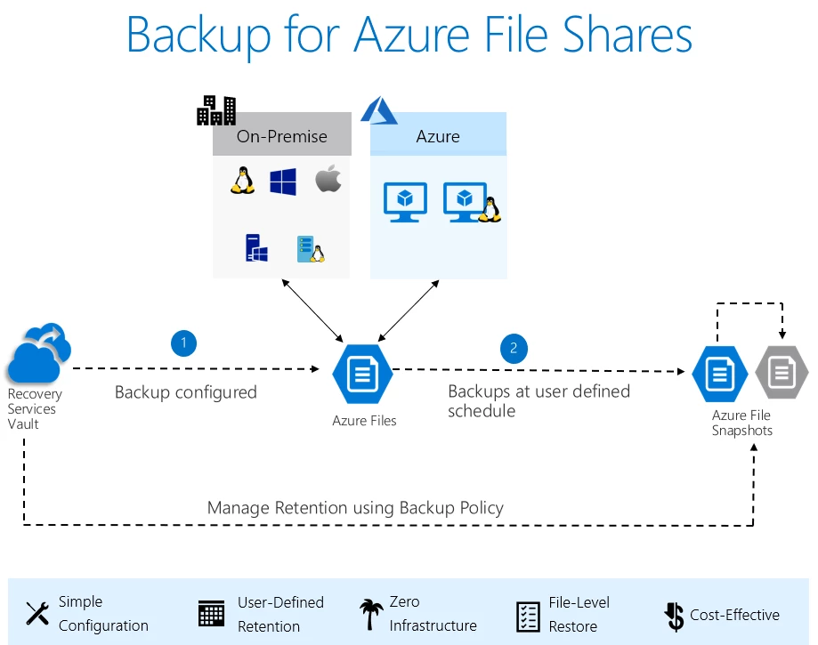

# 💈 Azure files backup and recovery

Azure Files, Microsoft'un bulut tabanlı depolama hizmetlerinden biridir ve Azure Backup ile entegre şekilde yedekleme ve kurtarma özellikleri sunar. Azure Files backup ve recovery, dosya paylaşımlarınızın anlık görüntülerini (snapshots) almanızı sağlar ve ayrıca backup hizmeti kullanılarak, Azure files yedekleri oluşturmanızı ve bir recovery services vault saklamanıza olanak tanır.

<figure><figcaption></figcaption></figure>

* **Snapshot Özellikleri**: Snapshotlar, dosya paylaşımının belirli bir zamandaki durumunu yakalar. Azure Portal, Azure PowerShell, Azure CLI, REST API ve SDK araçları kullanılarak oluşturulabilir.
* **Root Level Snapshot**: Snapshotlar, dosya paylaşımının kök seviyesinde alınır ve paylaşımdaki tüm dosya ve klasörleri kapsar. Kurtarma işlemi sırasında, bireysel dosya seviyesine kadar inilebilir.
* **Incremental Snapshots**: Alınan tüm Snapshotlar artımsaldır; yani sadece önceki Snapshot 'dan sonraki değişiklikler kaydedilir.
* **Snapshot Kısıtlamaları**: Snapshotlar oluşturulduktan sonra okunabilir, kopyalanabilir veya silinebilir fakat değiştirilemezler. Ayrıca, Snapshotlarla ilişkilendirilmiş bir dosya paylaşımını silmek mümkün değildir.
* **Otomasyon**: Snapshot oluşturma süreci manueldir, bunun yerine Azure Backup servisi kullanılarak yedekleme otomatize edilebilir.


