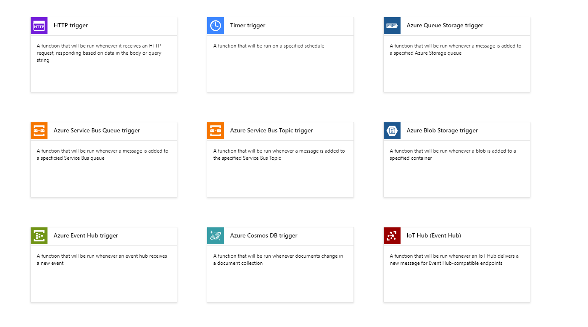

# Azure Functions Demostration

<figure><figcaption></figcaption></figure>

Azure Functions, Microsoft'un sunmuş olduğu bir sunucusuz (serverless) computing hizmetidir. Bu hizmet, geliştiricilerin sunucu yönetimi ile uğraşmadan, kod parçalarını bulutta çalıştırmalarına olanak tanır. Azure Functions, yalnızca kodun çalıştırılması gerektiğinde çalışır ve kullanılan kaynak miktarına göre ödeme yapılmasını sağlar.&#x20;

#### SSS:

1. Azure Functions, belirli olaylar gerçekleştiğinde tetiklenebilir. Bu, gerçek zamanlı veri işleme, dosya işleme, otomatik yedekleme ve daha fazlası gibi senaryolar için idealdir.
2. Azure Functions, gereksinimlere göre otomatik olarak ölçeklenir, böylece uygulama daha fazla istek aldığında daha fazla kaynak ayrılabilir ve trafik azaldığında kaynaklar azaltılabilir.
3. Yalnızca kodun çalıştırıldığı süre için ödeme yapılır, bu da kullanılmayan kapasite için ödeme yapılmadığı anlamına gelir.
4. Azure Functions, birçok popüler programlama dilini destekler, böylece geliştiriciler mevcut becerilerini kullanabilirler.
5. Azure Functions, Azure hizmetleriyle ve diğer harici hizmetlerle kolayca entegre edilebilir.

#### Trigger Kaynakları:

Azure Functions, çeşitli kaynaklardan tetiklenebilir. Bunlar arasında:

* **HTTP İstekleri:** Webhooks veya RESTful API'lar aracılığıyla doğrudan HTTP istekleri.
* **Zamanlayıcı:** Belirlenen zaman aralıklarında otomatik olarak çalışan işlemler.
* **Storage Account Olayları:** Azure Blob Storage, Queue Storage ve Table Storage'da gerçekleşen değişiklikler.
* **Azure Cosmos DB:** Veritabanındaki değişikliklerle tetiklenen işlemler.
* **Service Bus Sıraları ve Konuları:** Mesaj sıralarına ve konularına gönderilen mesajlar.
* **Event Grid:** Azure ve üçüncü taraf hizmetlerden gelen olaylar.
* **Daha Fazlası:** GitHub olayları, IoT Hub mesajları vb.


Azure Functions, esnek, maliyet etkin ve güçlü bir sunucusuz platform sunarak, modern bulut tabanlı uygulama geliştirmeyi kolaylaştırır.

***

### DEMO:

Azure Functions kullanarak bir web API'si oluşturup. Bu API adresine HTTP istekleri gönderip, Azure Blob Storage'da bir container oluşturacağız. Oluşturmak istediğimiz container ismini de yaptığımız isteğin içerisinde parametre olarak verebileceğiz.

***

Proje hazırlığının yapılması gerekmektedir. Biz örneğimizde, vscode kullanarak bu projeyi deploy edeceğiz.

İlk olarak, aşağıdaki adresten Azure Functions Core Tools paketini çalışmayı yapacağımız cihaza kurmalıyız:&#x20;



Kurulum tamamlandıktan sonra, Microsoft'un dökümanlarında da bahsettiği gibi gerekli vscode eklentilerini kurmalıyız. Aşağıda kurulması gereken extensionlar hakkında kaynak paylaşıyorum.



Ekran görüntüsünde de görüleceği üzere, Azurite,Azure Functions ve python extensionlarını vscode üzerine kurmamız gerekiyor.

<figure><figcaption></figcaption></figure>

Extension kurulumlarını yapıp, işlemlerimize devam ediyoruz. Öncelikle boş bir dizin oluşturup, vscode üzerinde bu boş dizini import ediyoruz.

<figure><figcaption></figcaption></figure>

Ardından, sol tarafta azure extensionuna tıklayıp, workspace içerisinde azure functions template'i oluşturuyoruz.

<figure><figcaption></figcaption></figure>

Create functions butonuna tıklayıp, istenilen bilgileri girmeliyiz. Burada, çalışacağımız dizin, kullanacağımız programlama dili ve versiyonu ve trigger seçenekleri gibi bir çok değeri belirtiyoruz.

<figure><figcaption></figcaption></figure>

Tüm bilgileri girdikten sonra, projemize ait bir template oluşmuş oldu. Şimdi bu bilgileri düzenlememiz gerekiyor.

<figure><figcaption></figcaption></figure>

Uygulama kodumuzu, function\_app.py dosyası içerisini temizleyip, yapıştırıyoruz.&#x20;

```python
import azure.functions as func
from azure.storage.blob import BlobServiceClient
import os

app = func.FunctionApp()

@app.route(route="create_container", methods=["GET", "POST"], auth_level=func.AuthLevel.ANONYMOUS)
def main(req: func.HttpRequest) -> func.HttpResponse:
    connection_str = os.getenv('AZURE_STORAGE_CONNECTION_STRING')  
    container_name = req.params.get('containername')  

    if not container_name:
        try:
            req_body = req.get_json()
        except ValueError:
            pass
        else:
            container_name = req_body.get('containername')

    if not container_name:
        return func.HttpResponse(
             "Please pass a container name on the query string or in the request body.",
             status_code=400
        )

    try:
        blob_service_client = BlobServiceClient.from_connection_string(connection_str)
        blob_service_client.create_container(container_name)
        return func.HttpResponse(f"Container '{container_name}' created successfully.", status_code=201)
    except Exception as e:
        return func.HttpResponse(
             f"Error creating the container: {str(e)}",
             status_code=500
        )

```

<figure><figcaption></figcaption></figure>

Ardından, requirements.txt dosyamızın içerisine aşağıdaki modülleri ekliyoruz.

```
azure-storage-blob
azure-functions
```

<figure><figcaption></figcaption></figure>

Ardından, function.json adında bir dosya oluşturup, uygulamamıza ait diğer spesifik bilgilerin yer aldığı bazı parametreleri ekliyoruz. (Opsiyonel)

```json
{
    "bindings": [
      {
        "authLevel": "anonymous",
        "type": "httpTrigger",
        "direction": "in",
        "name": "req",
        "methods": ["get", "post"]
      },
      {
        "type": "http",
        "direction": "out",
        "name": "$return"
      }
    ]
  }
```

<figure><figcaption></figcaption></figure>

Ardından, değişkenlerimizi ve diğer başlatma seçeneklerimizi ayarladığımız local.settings.json dosyasını düzenliyoruz. Burada AZURE\_STORAGE\_CONNECTION\_STRING değişkeninin değerini işlem yapmak istediğimiz storage hesabı altında, access keys kısmından alıyoruz. Kodumuz, storage connection string'i buradan alacak.

<figure><figcaption></figcaption></figure>

```json
{
  "IsEncrypted": false,
  "Values": {
    "AzureWebJobsStorage": "UseDevelopmentStorage=true",
    "FUNCTIONS_WORKER_RUNTIME": "python",
    "AzureWebJobsFeatureFlags": "EnableWorkerIndexing",
    "AZURE_STORAGE_CONNECTION_STRING": "<AZURE_STORAGE_CONNECTION_STRING>"
  }
}
```

Şu anda yapılacak tüm değişiklikler bu kadar, şimdi azurite extension'u çalıştırıp, lokal development ortamımızı ayağa kaldırmaya hazırız. vscode ekranında, klavyeden F1 tuşuna basıp azurite extensionunu ayağa kaldırıyoruz.

<figure><figcaption></figcaption></figure>

Şimdi sıra geldi projemizi çalıştırmaya, Azure extensionu üzerine tıklayıp, "start debugging to update..." butonuna tıklayıp, gelen uyarıya da "debug anyway" butonuna basıp, uygulamayı ayağa kaldırıyoruz.

<figure><figcaption></figcaption></figure>

Görüldüğü gibi, uygulama start oldu ve web üzerinden istekleri almaya hazır.&#x20;

<figure><figcaption></figcaption></figure>

Uygulamamız web'den cevap verdi. Şimdi parametre vererek, storage account üzerinde container oluşturmaya çalışalım.

<figure><figcaption></figcaption></figure>

<figure><figcaption></figcaption></figure>

<figure><figcaption></figcaption></figure>

Yukarıda gördüğünüz gibi, uygulamamız başarıyla çalıştı ve containerımız oluştu.


Fakat bu uygulama şu anda lokalimde çalışıyor, yani bunu henüz azure üzerine deploy etmedik. Bu uygulamayı azure üzerine deploy etmek için Azure portal üzerinden Function App oluşturuyoruz.

<figure><figcaption></figcaption></figure>

Azure hesabımız altında bir Function App oluşturduk. Şimdi vscode uygulamamızı tekrar açıp, projemizi azure da oluşturduğumuz "functiondemo0001" Function App 'ine push ediyoruz.

```powershell
func azure functionapp publish functiondemo0001
```

<figure><figcaption></figcaption></figure>

Uygulamamız push edildi ve functiondemo0001 Function App içerisinde uygulamamız gözüküyor.

<figure><figcaption></figcaption></figure>

Şimdi bir önemli kısımda şu; hatırlarsanız biz storage account bilgisini, local.settings.json dosyası içerisine eklemiştik. Fakat oraya eklediğimiz bilgi sadece lokal development ortamları için geçerli. Biz bu storage account connection string bilgisini, Function App altında, Environment Variables kısmından eklemeliyiz.

<figure><figcaption></figcaption></figure>

Değişkenimizi ekledik ve Apply butonuna bastık. Şimdi testlerimizi yapabiliriz.


İlk olarak, Function App Overview kısmından, "main" adındaki uygulamamıza tıklayıp, Code + Test menüsüne gelip, "Get function URL" butonuna basıp, istek yapacağımız adresi kopyalıyoruz.

<figure><figcaption></figcaption></figure>

&#x20;Ardından istek yaptığımız da container 'ın başarılı bir şekilde oluştuğunu görüyoruz.

<figure><figcaption></figcaption></figure>

<figure><figcaption></figcaption></figure>



