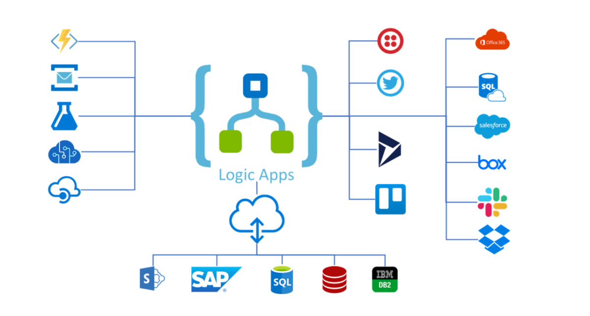
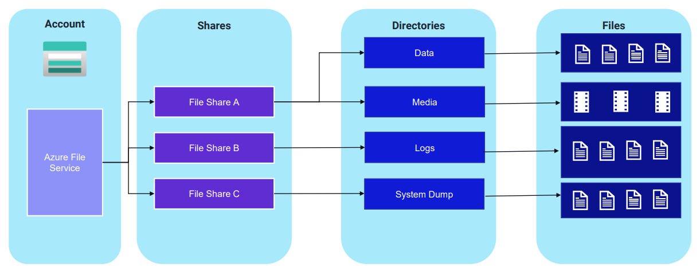

# 💪 Azure Logic Apps Demostration

<figure><figcaption></figcaption></figure>

Azure Logic Apps, Microsoft tarafından sağlanan bir hizmettir ve biraz büyülü bir kutuya benzer. Misal, senin bir sürü oyuncak (uygulama ve hizmet) koleksiyonun var ve bu oyuncakların birbiriyle konuşmasını, hatta bazı özel görevler yapmasını istiyorsun. Ancak, bu oyuncaklar farklı dillerde konuşuyor ve birbiriyle doğrudan iletişim kuramıyor. İşte burada Azure Logic Apps devreye giriyor. Bu büyülü kutu, bu oyuncakların birbiriyle nasıl iletişim kurabileceğini öğrenir ve onlara ne yapmaları gerektiğini söyler.

Örneğin, eğer birisi sana e-posta gönderirse ve bu e-postada özel bir kelime varsa, Azure Logic Apps bu e-postayı görebilir ve senin için otomatik olarak başka bir işlem yapabilir, örneğin bir dosyayı başka bir yere kaydedebilir veya sana bir hatırlatma gönderebilir. Bunu yapmak için, senin ona ne yapması gerektiğini önceden söylemen gerekir, yani bir tür "eğer bu olursa, şunu yap" tarzında talimatlar verirsin. Bu, büyülü kutunun senin için sıkıcı veya tekrar eden işleri otomatikleştirmesini sağlar, böylece sen daha önemli veya eğlenceli şeylere odaklanabilirsin.

Azure Logic Apps ile, birbirinden farklı pek çok uygulama ve hizmet ile çalışabilir ve onları bir araya getirebilir. Ve en güzel yanı, bunu yapmak için kod yazmana veya çok teknik olmana gerek yok. Sadece ne istediğini belirleyip, Logic Apps'in bunu nasıl yapacağını düzenlemen yeterli.


1. **Tetikleyiciler (Triggers):** Bir Logic Apps iş akışını başlatan olaylardır. Örneğin, bir e-posta alındığında, bir dosya bir klasöre yüklendiğinde veya belirli bir saatte tetikleyiciler devreye girer. Tetikleyici, "Bir şey olduğunda" diyerek başlayan cümlelerle tanımlanabilir.
2. **Eylemler (Actions):** Tetikleyici tarafından başlatılan iş akışında gerçekleştirilen görevlerdir. Örneğin, bir e-posta gönderme, bir veritabanına kayıt ekleme veya bir dosyayı başka bir yere taşıma gibi. Eylemler, "Sonra şunu yap" diyerek başlayan cümlelerle tanımlanabilir.
3. **Bağlayıcılar (Connectors):** Azure Logic Apps'in farklı uygulama ve hizmetlerle iletişim kurmasını sağlayan öğelerdir. Her bağlayıcı, belirli bir uygulama veya hizmete (örneğin, Twitter, Dropbox, Office 365 gibi) bağlanmayı ve onunla veri alışverişi yapmayı kolaylaştırır. Yüzlerce hazır bağlayıcı mevcuttur ve aynı zamanda özel bağlayıcılar oluşturabilirsin.
4. **Koşullar (Conditions) ve Dallanma (Branching):** Bir Logic Apps iş akışı içinde, belirli koşullara göre farklı yollar izlenebilir. Örneğin, bir e-postanın içeriğine göre, bir dosyayı farklı klasörlere kaydetmek veya farklı eylemler gerçekleştirmek. Bu, "Eğer bu durumda, şunu yap; değilse, bunu yap" şeklinde ifade edilebilir.
5. **Döngüler (Loops):** Tekrar eden görevleri gerçekleştirmek için kullanılır. Örneğin, bir listedeki her öğe için aynı işlemi yapmak istediğinde döngüler devreye girer.
6. **Değişkenler (Variables):** İş akışı sırasında bilgi saklamak ve manipüle etmek için kullanılır. Örneğin, bir sayım yapmak, bir metin biriktirmek veya durum bilgisi tutmak için değişkenler kullanılabilir.


### Demo:

Bir HTTP trigger tarafından tetiklenen bir Azure Logic App kullanarak, dinamik olarak container grubu (grupları) oluşturacağız. Kullanıcıdan alınan girdiye (örneğin, bir container adı) dayalı olarak, bu Logic App, Microsoft Azure Container Instances (ACI) hizmetinde yeni bir container grubu oluşturacak.

#### Adım 1: Logic App oluşturalım.

<figure><figcaption></figcaption></figure>

Azure Portal üzerinden, Logic App servisini arattırıp, ekran görüntüsündeki gibi bir logic app oluşturmalıyız. Tüm üst menülerde bulunan ayarlar default kalabilir.&#x20;

***

#### Adım 2: Oluşturduğumuz Logic App 'i yapılandıralım.

<figure><figcaption></figcaption></figure>

Oluşturduğumuz logic app dasboard'ına gelip, sol menüden, Workflows kısmına tıklıyoruz ve ardından sağ tarafta açılan ekrandan yeni bir workflow oluşturmak için workflow ismini girip devam ediyoruz.

<figure><figcaption></figcaption></figure>

Gördüğünüz gibi workflow oluşturuldu. Şimdi diğer adıma geçelim.

***

#### Adım 3: Workflow 'u dizayn edelim.

<figure><figcaption></figcaption></figure>

demo workflow'un üzerine tıklayıp, açılan ekranda "designer" menüsüne girmeliyiz.

<figure><figcaption></figcaption></figure>

Ardından, "Add a trigger" seçeneğine tıklayıp, yeni bir trigger oluşturacağız. Bu örneğimizde "When a HTTP request is received" trigger'ını kullanacağız. Yani, http istekleri üzerinden workflow'umuzu devreye girmesini istiyoruz.

<figure><figcaption></figcaption></figure>

Trigger kısmını hallettikten sonra, "+" butonuna basıp, Action eklemeliyiz. Yani, http isteği geldikten sonra ne yapacağız sorusunu cevaplamamız gerekiyor. Burada biz, "Initialize variable" action 'u seçiyoruz. Bunu seçmemizin sebebi şu: http isteği yapıldığında, body kısmında bazı bilgiler göndereceğim ve bu bilgileri "Initialize variable" action 'u ile yakalayıp, sonraki aşamalarda kullanacağım.

<figure><figcaption></figcaption></figure>

<figure><figcaption></figcaption></figure>

Eklediğimiz "Initialize variable" action 'u üzerine tıklayıp, düzenlememiz gerekiyor. Burada şunu yapıyoruz: http isteği yaparken, body'de gönderdiğimiz bilgiyi alıp, bunu "containername" adında değişkende tutuyorum. Bunu container isimlerini dinamik olarak vermek için kullanacağız.

<figure><figcaption></figcaption></figure>

Ardından, bir action daha ekliyoruz ve bu action ile gelen isteğin içeriğine göre container instance oluşturacağız. Elbette, container instance servisine bağlanması için gerekli auth metotlarını girmeliyiz.&#x20;

<mark style="color:red;">**Bu oluşturduğumuz MANAGED IDENTITY kimliğine, container oluşturacağımız resource group üzerinde yetki tanımlamalıyız. Aksi halde yetki hatası verecektir!!!**</mark>

<figure><figcaption></figcaption></figure>

Container oluşturma sürecine ait diğer eksik bilgileri de doldurmalıyız, hangi subscription, hangi resource group ve container instance sizeları vs. gibi bilgileri de ekliyoruz.

```json
[
  {
    "name": @{variables('containername')},
    "properties": {
      "image": "nginx:latest",
      "resources": {
        "requests": {
          "cpu": "1",
          "memoryInGB": "2"
        }
      }
    }
  }
]
```

***

#### Adım 3: Test edelim.

<figure><figcaption></figcaption></figure>

Workflow dashboard'ına gelip, Workflow URL bilgisini alıyoruz.&#x20;

<figure><figcaption></figcaption></figure>

Ardından, url'e post atmalıyız, bunun için terminal kullanabilirsiniz fakat, ben postman aracıyla devam ediyorum. Kopyaladığım linki adres çubuğuna yapıştırıp, POST seçeneğini seçiyorum. Ardından göndereceğim bilgiyi "text" olarak "raw" içerisine ekliyorum. Bu örnekte, "mycontainer1" adında bir bilgi gönderiyorum.&#x20;

İsteği gönderdikten sonra, logic app benim için, "mycontainer1" adında bir container oluşturmalı. Bunun için portal'a gidip, kontrol ediyorum.


<figure><figcaption></figcaption></figure>

Gördüğünüz üzere, "mycontainer1" adında container instance oluşturulmuş. Böylelikle logic app kullanarak dinamik bir şekilde container instance oluşturabildik.&#x20;


Tabii ki, bu sadece başlangıç noktası ve Logic Apps ile gerçekleştirilebilecek işlemlerin kapsamı çok geniştir. Örneğin, oluşturulan container'ların detaylarını belirli bir e-posta adresine otomatik olarak göndermek gibi işlemler yapılabilir. Bu örnek, Logic Apps'in sunduğu geniş olanak yelpazesinin sadece ufak parçasını temsil eder; gerçekte, Logic Apps ile sınırlarınızı zorlayacak binlerce farklı senaryo hayata geçirilebilir.



