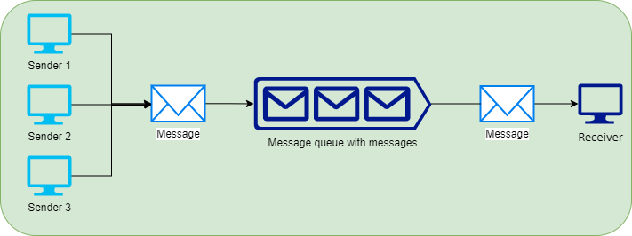

# ✈️ Azure messaging solutions

### Azure Queue storage:

<figure><figcaption></figcaption></figure>

Azure Queue Storage, hizmetler ve uygulamalar arasında mesajların asenkron olarak iletilmesini sağlayan bir hizmettir.&#x20;

* Uygulama bileşenleri arasında mesajları asenkron bir şekilde ileterek, işlemlerin birbirlerini bloke etmesini önler.
* Mesajlar güvenilir bir şekilde saklanır ve işlenene kadar veya belirlenen süre boyunca kuyrukta kalır.
* Milyonlarca mesajı saklayabilir ve uygulamaların büyümesine kolayca uyum sağlar.
* HTTP ve HTTPS protokolleri üzerinden, yetkilendirilmiş çağrılar kullanarak mesaj kuyruklarına erişilebilir.
* Her bir mesaj için boyut sınırı 64 KB'dır.
* Bir kuyruk, bir depolama hesabının toplam kapasitesi kadar mesaj içerebilir.
* Mesajlar belirli bir zaman aşımına uğrar ve bu süre zarfında işlenmezse tekrar kuyruğa döner.
* Azure Queue Storage, REST API aracılığıyla çok sayıda programlama dilinden erişilebilir, bu da farklı teknolojilerle çalışan sistemlerin entegrasyonunu kolaylaştırır.
* .NET, Java, Node.js, Python, PHP ve daha fazlası gibi popüler geliştirme platformları için SDK'lar sağlar.
* Azure'daki diğer hizmetlerle entegre olup, iş yüküne göre otomatik olarak ölçeklenebilir.
* Mesaj sayısı ve saklama süresine göre fiyatlandırılır, böylece kullanılan kaynak miktarına göre ödeme yapılır.
* Azure Functions ve Azure Logic Apps gibi diğer Azure hizmetleriyle kolayca entegre edilebilir.
* Bir mesaj okunduğunda, belirli bir süre için kilitlenebilir, bu da işleme sırasında aynı mesajın başka bir işlemci tarafından işlenmesini önler.

Örneğin, Bir uygulama, kullanıcılar tarafından yüklenen resimleri asenkron olarak işlemek için tasarlanmıştır; kullanıcı bir resim yüklediğinde, uygulama bu resmin referansını Azure Queue Storage'a mesaj olarak ekler. Arka planda çalışan bir servis, queue'dan düzenli olarak yeni mesajları kontrol eder ve mesaj gelince, mesajdaki referansı kullanarak yüklenen resmi alır. Servis, resmi analiz eder ve analiz tamamlandığında sonuçları saklar ve kullanıcıya analizin tamamlandığını bildiren bir sinyal gönderir. Bu süreç, kullanıcı arayüzünün hızlı ve yanıt verici kalmasını sağlar, çünkü uzun süren işlemlerde kullanıcı deneyimini yavaşlatmaz; kullanıcı, işleme tamamlandığında bildirim alır ve sonuçları görüntüleyebilir.

### Azure Service Bus:

Azure Service Bus, uygulamalar arasında güvenli ve güvenilir iletişim kurmayı sağlayan bir mesajlaşma hizmetidir. Service Bus, bulut tabanlı bir mesaj altyapısı sunar ve genellikle karmaşık uygulama senaryoları için uygundur.

**Service Bus'un iki temel bileşeni vardır:**

<figure><figcaption></figcaption></figure>

* **Kuyruklar (Queues)**: Bir noktadan bir noktaya mesaj iletimi için kullanılır. Bir kuyruk, bir gönderici tarafından iletilen mesajları sırayla tutar ve her mesajı tek bir alıcıya iletir. Kuyruklar genellikle iş yükü dengeleme ve asenkron işleme için kullanılır.

<figure><figcaption></figcaption></figure>

* **Topics ve Subscriptions**: pub-sub modelini destekler. Bir konu, birden fazla aboneliği olan bir yayın kanalı gibi düşünülebilir. Göndericiler mesajlarını konuya gönderir ve bu mesajlar daha sonra konuya abone olan tüm alıcılara iletilir. Bu, bir mesajın birden fazla alıcıya dağıtılmasını sağlar.

**Misal**: Bir e-ticaret sitesinde, bir kullanıcı bir sipariş verdiğinde, bir dizi ardışık işlem gerçekleştirilmesi gerekiyor: stok güncellemesi, ödeme işleminin işlenmesi, kargo işleminin planlanması ve müşteriye sipariş onayı gönderilmesi.

**Çözüm**:

1. **Sipariş İşleme**: Müşteri tarafından verilen sipariş sisteme girilir. Sipariş detayları bir 'Sipariş Oluşturuldu' mesajı olarak bir Service Bus konusuna (topic) gönderilir.
2. **Stok Yönetimi**: Stok yönetimi sistemi, sipariş konusuna abone olur. Yeni bir sipariş mesajı aldığında, ilgili ürünlerin stoklarını günceller.
3. **Ödeme İşlemi**: Ödeme sistemi de sipariş konusuna abone olur. Bir sipariş mesajı aldığında, ödeme bilgilerini işler ve ödemenin onaylanmasını sağlar.
4. **Kargo Planlama**: Kargo sistemi, siparişin ayrıntılarını almak ve teslimatı planlamak için sipariş konusuna abone olur.
5. **Müşteri Bildirimi**: Müşteri hizmetleri sistemi, siparişin durumu hakkında müşteriyi bilgilendirmek için sipariş konusuna abone olur. Sipariş başarıyla işlendiğinde, müşteriye bir onay e-postası gönderir.

Bu örnekte, her bir abone (stok yönetimi, ödeme işlemi, kargo planlama ve müşteri hizmetleri), Service Bus konusuna bağımsız bir şekilde abone olur ve ilgili olan mesajlar üzerinde işlem yapar. Bu, merkezi bir noktadan birden fazla sistem ve servise aynı anda bilgi iletebilmenin etkili bir yoludur. Her bir abone, aynı mesajı alır ve kendi iş akışlarına göre işler.



1. **Queue Storage**:
   * Basit kuyruk yapısı ile mesajları organize etmek için kullanılır.
   * 80 GB'ı aşan boyutlara erişebilir.
   * Kuyruk içerisindeki mesajın takibi yapılabilir.
   * SLA, kullanılan depolama katmanına bağlıdır.
2. **Service Bus Queues**:
   * İlk giren ilk çıkar (FIFO) garantisi sunar.
   * Peek-Lock ve Receive-Delete alma modları mevcuttur.
   * İşlemler işlem gruplarına dahil edilebilir.
   * Mesajları almak için sürekli sorgulama (polling) yapılmasını gerektirmez.
3. **Service Bus Topics**:
   * Her mesajı işlemek için birden fazla alıcıya sahiptir.
   * Tek bir mesaj birden fazla hedefe yönlendirilebilir.

