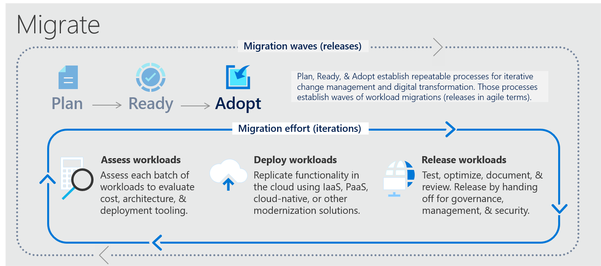

# ☣️ Azure Migration Framework

Azure Migration Framework, kuruluşların yerinde (on-premises) altyapılarından Azure bulut ortamına geçişlerini planlamaları, yürütmeleri ve yönetmeleri için bir dizi araç, yönerge ve best practices sağlar.

<figure><figcaption></figcaption></figure>

1. **Plan**: Burada, hangi workloads'ların buluta taşınacağını ve bunun nasıl gerçekleştirileceğini belirliyoruz. Maliyeti, mimariyi ve dağıtım araçlarını değerlendirerek başlıyoruz.
2. **Ready**: Bu adım, bulut göçü için gerekli yapıları ve süreçleri hazırlamayı içerir. Tekrar edilebilir ve iteratif değişiklik yönetimi için gerekli hazırlıkları yapıyoruz.
3. **Adopt**: Planlanan workloads'ların göçünü gerçekleştiriyoruz. Bu süreç, agil metodolojideki sürümlere benzer şekilde farklı dalgalar halinde yürütülüyor.
4. **Migrate**: Göç sürecinin esas bölümü burasıdır ve şunları içerir:
   * **Workloads Değerlendirme**: Her bir workload batch'inin maliyetini, mimarisini ve dağıtım araçlarını inceliyoruz.
   * **Workloads Dağıtma**: Kaynaklarımızı buluta taşıyoruz. Bunun için IaaS, PaaS, cloud-native gibi farklı yöntemler kullanabiliriz.
   * **Workloads Release**: Taşınan workloads'ları test ediyoruz, optimizasyonunu yapıyoruz, dokümantasyon işlemlerini tamamlıyoruz ve gözden geçiriyoruz. Ardından govern, yönetim ve güvenlik için sonraki aşamalara geçiyoruz.

#### Bulut göçü için dört farklı strateji:

1.  **Rehost (Taşıma)**: "Rehost", genellikle "lift-and-shift" olarak adlandırılan bir bulut göçü stratejisidir. Bu yaklaşımda, mevcut uygulamalar veya iş yükleri, mevcut mimarilerinde ve kodlarında herhangi bir değişiklik yapılmadan doğrudan bulut ortamına taşınır. Esasında, uygulamalarınızın veya veritabanlarınızın sunucularını, şu an yerel olarak çalıştıkları altyapıdan alıp bulut sağlayıcının altyapısına taşıyorsunuz. \
    \
    Rehost stratejisinin avantajı, hızlı ve etkin bir şekilde buluta geçiş yapmayı sağlamasıdır. Yani, uygulamalarınızı bulut ortamına taşımak istediğinizde ve bu işlemi olabildiğince çabuk ve mümkün olan en az dirençle gerçekleştirmek istediğinizde bu stratejiyi kullanırsınız. Özellikle büyük ve karmaşık sistemlerde, rehost yaklaşımı, kısa sürede buluta geçiş yaparak hemen maliyet tasarrufu ve esneklik avantajlarından yararlanmayı mümkün kılar. Ancak, bu stratejiyi takip ederseniz, bulutun daha ileri özelliklerini ve optimizasyonlarını kullanamayabilirsiniz çünkü uygulamanız hala yerel altyapı için tasarlanmış mimariyi kullanmaya devam eder.

2.  **Refactor (Yeniden Paketleme)**: "Refactor" ya da Yeniden Paketleme, mevcut bir uygulamanın bulut ortamından tam olarak yararlanacak şekilde, mimariye minimal değişiklikler yaparak yeniden düzenlenmesini ifade eder. Bu strateji, PaaS, Functions gibi bulut-native hizmetlerini kullanmak amacıyla uygulama bileşenlerinin güncellenmesi sürecini içerir. Refactor sürecinde, uygulamanın temel yapısı büyük ölçüde korunurken, bulut sağlayıcının sunduğu yönetim, ölçeklenebilirlik ve performans gibi avantajlardan yararlanmak için bazı bileşenler yeniden paketlenir veya yeniden yapılandırılır. \
    \
    Örneğin, bir veritabanını yönetilen bir veritabanı hizmetine taşıyarak veya bir monolitik uygulamanın bazı parçalarını mikro hizmetlere dönüştürerek bu avantajlardan yararlanabilirsiniz. Refactor, özellikle uygulamalarınızın esnekliğini artırmak ve bulut bilişim teknolojilerinden daha fazla yararlanmak istediğinizde, ancak uygulamanın genel mimarisini korumak istediğinizde uygundur. Bu, genellikle performansı optimize etmek, bulutun iyileştirme yeteneklerini kullanmak isteyen kuruluşlar için cazip bir seçenektir.

3.  **Rearchitect (Mimariyi Yeniden Tasarlama)**: Bu strateji, mevcut bir uygulamanın işlevselliğini artırmak ve bulutun avantajlarından tam olarak yararlanmak için uygulamanın yapısını ve kodunu gözden geçirmeyi ve yeniden düzenlemeyi içerir. Amacı, uygulamanın bulut ortamında daha iyi performans ve esneklik kazanmasını sağlamaktır. Eğer uygulamanızın bulutta daha verimli çalışması için önemli değişikliklere ihtiyaç duyuyorsanız veya bulut teknolojilerinin sunduğu yeni özellikleri ve hizmetleri entegre etmek istiyorsanız bu yaklaşımı tercih edebilirsiniz. \
    \
    Örneğin, bir uygulamayı mikro hizmetler mimarisine geçirerek, bağımsız çalışabilen küçük bileşenlere ayırabilir ve bu sayede daha iyi yönetilebilirlik ve hizmetler arası iletişim sağlayabilirsiniz. Bu süreç, genellikle uygulama kodunda büyük değişiklikler yapmayı ve bazen tamamen yeni hizmetler ve veri depolama çözümleri kullanmayı gerektirebilir.

4. **Rebuild (Yeniden İnşa)**: "Rebuild" yani Yeniden İnşa, bir uygulamanın temelinden itibaren, bulut ortamını en iyi şekilde kullanacak biçimde baştan sona yeniden yazılmasını ifade eder. Bu yaklaşım, özellikle eski veya modası geçmiş (End of Life - EOL) uygulamalar için geçerlidir. Bulutun yenilikçi özelliklerinden, esneklik ve yönetim avantajlarından faydalanmak amacıyla, mevcut uygulama tamamen elden geçirilir veya sıfırdan oluşturulur. Yeniden inşa stratejisi, uygulamanızın bulut bilişimin sunduğu tüm özellikleri kullanabilmesini sağlar. \
   \
   Örneğin, daha modern veri depolama çözümleri, mikro hizmetler mimarisi gibi özellikleri kullanabilir ve uygulamanızı bulutun yerel hizmetleriyle tam entegre edebilirsiniz. Bu, uygulamanın performansını, güvenliğini ve kullanılabilirliğini iyileştirebilir. Yeniden inşa etmek genellikle daha fazla zaman ve kaynak gerektirir çünkü uygulama geliştirme sürecini baştan başlatmanız gerekebilir. Ancak sonuç, bulutun tüm avantajlarına tam olarak uyum sağlayan, esnek ve geleceğe yönelik bir uygulama olacaktır. Bu strateji, buluta geçiş yaparken eski uygulamaları güncellemek veya yeni iş gereksinimlerini karşılamak için tercih edilebilir.

