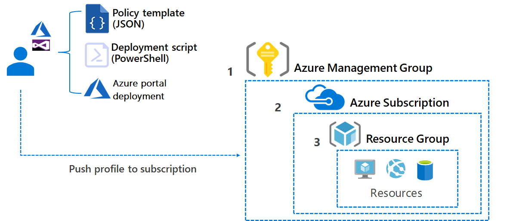

# 🚷 Azure Policy & RBAC

Azure Policy, Azure kaynaklarınızın kuruluşunuzun iş kuralları ve uyumluluk gereksinimleriyle uyumlu olduğundan emin olmanıza yardımcı olan bir hizmettir. Kurallar ve politikalar belirleyerek kaynakların oluşturulmasını ve yapılandırılmasını otomatik olarak denetlemenizi sağlar.

<figure><figcaption></figcaption></figure>

#### Best Pratices:

* Güvenlik düzeylerine göre kaynaklara erişim kısıtlamaları
* GDPR, HIPAA gibi düzenleyici gereksinimlere uygun kaynak yapılandırmalarının sağlanması
* Belirli türde veya boyutta kaynakların yaratılmasını kısıtlayarak maliyetleri kontrol altında tutma
* Geliştirme ve test ortamlarında belirli bir maliyet limitini aşan kaynakların kullanımını önleme
* Belirli VM boyutları veya Azure servislerinin kullanımını zorunlu kılarak kaynak standardizasyonunun sağlanması
* Performans veya maliyet optimizasyonu için kaynakların belirli yapılandırmalara uygun olmasını sağlama
* Kaynaklara otomatik etiketleme uygulayarak, maliyet merkezleri, departmanlar veya projeler bazında raporlama ve maliyet takibi
* Kaynakların uygun şekilde sınıflandırılmasını ve organizasyon genelinde tutarlı etiketleme uygulamalarının korunmasını sağlama
* Kritik verilere sahip kaynaklar için yedekleme politikalarının zorunlu tutulması
* Hassas verileri içeren kaynakların uygun şifreleme yöntemleriyle korunmasını sağlama



### RBAC:

<figure><figcaption></figcaption></figure>

#### Best Practices:

* Kullanıcılara ve uygulamalara, görevlerini yerine getirmek için mutlaka ihtiyaç duydukları en az erişim düzeyini verin. Bu, güvenlik risklerini en aza indirir ve potansiyel zararlı etkileri sınırlar.
* Azure, bir dizi yerleşik rol sunar. Mümkün olduğunda, özel roller oluşturmak yerine bu yerleşik rolleri kullanın. Bu roller, yaygın senaryoları kapsar ve Microsoft tarafından düzenli olarak güncellenir.
* Belirli ihtiyaçlarınızı karşılamak için özel roller oluşturmanız gerekiyorsa, bu rolleri olabildiğince dar kapsamlı tutun. Sadece gerekli izinleri içerecek şekilde özelleştirin.
* Kullanıcıları Azure Active Directory (AAD) gruplarına atayın ve bu gruplara rol atamaları yapın. Bu, rol atamalarını yönetmeyi kolaylaştırır ve bireysel kullanıcılar yerine gruplar üzerinden değişiklik yapılmasına olanak tanır.
* Kullanıcıların ve grupların erişim düzeylerini düzenli olarak gözden geçirin ve gereksiz erişim izinlerini kaldırın. Bu, eski çalışanların veya artık projede çalışmayan kişilerin erişiminin kaldırılmasına yardımcı olur.
* Azure'un denetim günlükleri ve erişim raporları özelliklerinden yararlanarak, kimin ne zaman ve hangi kaynaklara eriştiğini izleyin. Bu, güvenlik ihlallerini tespit etmeye ve uyumluluk durumunu belgelemeye yardımcı olur.
* Rol atamalarını otomatikleştirmek için Azure PowerShell, Azure CLI veya Azure SDK'larını kullanın. Bu, özellikle büyük ölçekli ortamlarda zaman tasarrufu sağlar ve hataları azaltır.



