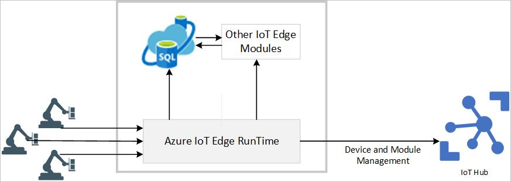

# 🧮 Azure SQL Edge

<figure><figcaption></figcaption></figure>

Azure SQL Edge, edge computing senaryoları için tasarlanmış bir veritabanı çözümüdür. Edge computing, verilerin bulut dışındaki cihazlarda işlenmesi ve analiz edilmesi anlamına gelir. Bu, özellikle IoT cihazları gibi sınırlı kaynaklara sahip edge cihazlarında işlem gücüne ve veri yönetimine ihtiyaç duyulan durumlarda kullanılır.

Bu SQL veritabanı motoru, tipik SQL Server özelliklerine benzer bir şekilde çalışır, ancak daha hafif ve taşınabilir bir formda tasarlanmıştır. Bu sayede, edge cihazlarında veri toplama, depolama, işleme ve analiz işlemleri için gerekli olan temel SQL yeteneklerini sağlar. &#x20;

Azure SQL Edge, veri yönetimi ve işleme yeteneklerinin yanı sıra cloud ile entegrasyon sağlayarak, edge cihazlarından gelen verilerin bulut tabanlı uygulamalarla etkileşimini kolaylaştırır. Bu da projeler ve kuruluşlarda, edge cihazlarından gelen verileri daha verimli bir şekilde işleyip değerlendirme imkanı sağlar.

Özetle, Azure SQL Edge, edge cihazlardan veri toplama, depolama, işleme ve analiz etme süreçlerinde bizlere yardımcı olur. Böylece, edge cihazlarından gelen verilerin hızlı bir şekilde işlenmesi ve değerlendirilmesi sağlanır.&#x20;

**Senaryo:**

* Bir akıllı tarım uygulamasını düşünelim. Bir çiftçi, tarlasındaki toprak nemini ve sıcaklığını izlemek için sensörler kurmuş olsun. Bu sensörler, belirli aralıklarla toprak verilerini ölçer ve bu verileri edge cihazına gönderir.
* Edge cihazı, gelen verileri alır ve yerel olarak depolar. Aynı zamanda, Edge cihazı üzerinde çalışan hafif bir SQL Edge veritabanı, bu verileri işlemek için kullanılır. Örneğin, verileri toplar, depolar, özetler ve analiz eder.
* Çiftçi, bir mobil uygulama veya web tabanlı bir arayüz aracılığıyla edge cihazındaki verilere erişebilir. Bu sayede, anlık toprak durumuyla ilgili bilgilere hızlı bir şekilde erişebilir ve gerektiğinde tarım uygulamalarını ayarlayabilir.
* Ayrıca, Azure SQL Edge, tarladaki sensörlerden gelen verileri bulut tabanlı bir veritabanına da aktarabilir. Bu, çiftçinin tarım verilerini bulutta depolayarak daha geniş çaplı analizler yapmasına olanak tanır. Örneğin, geçmiş verilere dayalı tahminler yapabilir. Bu sayede, çiftçi tarlasındaki verileri gözlemleyebilir ve tarım uygulamalarını daha verimli hale getirebilir.



