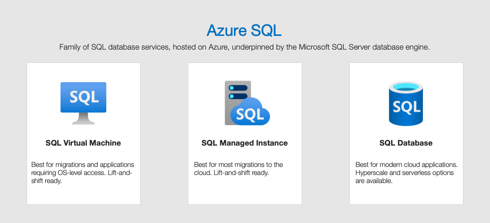
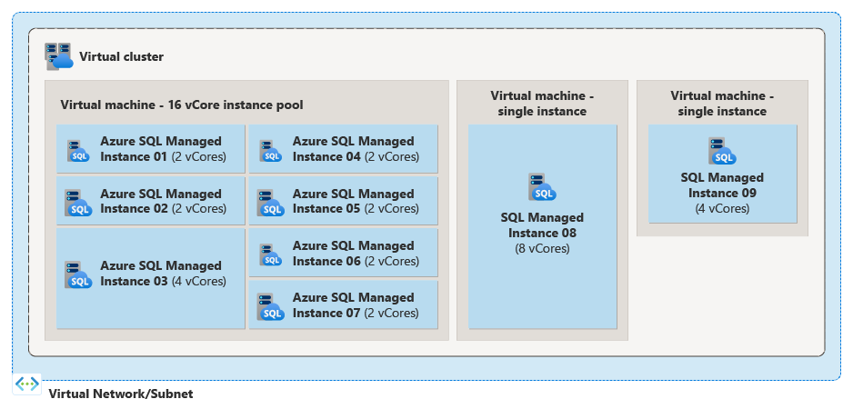
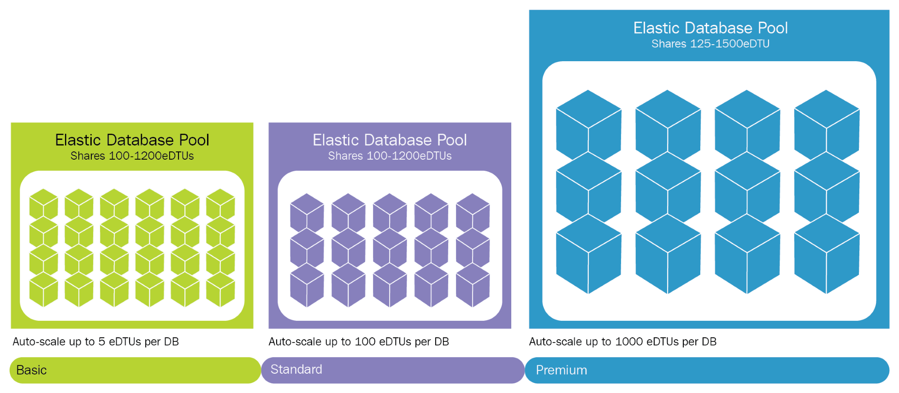

# 🟧 Azure SQL Solutions

<figure><figcaption></figcaption></figure>

### SQL Virtual Machine:

<figure><figcaption></figcaption></figure>

SQL Virtual Machine (SQL VM), Microsoft Azure'da sanal bir sunucu üzerinde SQL Server çalıştırmanıza izin veren bir hizmettir. Kullanıcılara işletim sistemi üzerinde tam kontrol sunar. SQL VM, eski sürümleri kullanmaya devam etmek isteyen veya belirli bir yapılandırmaya ihtiyaç duyan şirketler için idealdir.&#x20;

Örneğin, bir şirketin eski bir uygulaması varsa ve bunu buluta taşımak istiyor ama uygulamanın çalışması için belirli bir SQL Server sürümüne ihtiyaç duyuyorsa, SQL VM kullanabilirler. Bu şekilde, şirketler mevcut lisanslarını ve uygulamalarını buluta taşıyabilir.

**Özetle,**

* **IaaS (Infrastructure as a Service)**: Bu modelde, bir sanal makine üzerinde SQL Server çalıştırırsınız ve işletim sistemine tam erişiminiz olur.
* **SQL ve OS Sürüm Desteği**: İhtiyacınıza uygun SQL Server sürümünü ve işletim sistemini seçebilirsiniz.



***

### Managed Instances:

SQL Managed Instances, Azure'un tamamen yönetilen bir veritabanı hizmetidir, bu da Microsoft'un veritabanınızın bakımını, güvenliğini ve güncellemelerini üstlendiği anlamına gelir. Kullanıcılar, veritabanını yönetmekle ilgili teknik ayrıntılarla uğraşmak zorunda kalmadan SQL Server'ın en yeni özelliklerini kullanabilirler. Bu hizmet, şirketlerin kendi veri merkezlerindeki SQL Server veritabanlarını Azure'a kolayca taşımalarında  yardımcı olur. Ayrıca entegre edilmiş sanal ağ desteği ile güvenlik ve izolasyon sağlanır.

Örneğin, bir şirketin IT ekibinin zamanının çoğunu güncellemeler ve bakım işleriyle harcadığını düşünün. Bu şirket, SQL Managed Instances kullanarak, bu görevlerden kurtulabilir ve IT ekibi, şirketin asıl işlerine odaklanabilir.&#x20;



#### Instance pool,

Instance pool, Azure SQL Managed Instance’ın bir özelliği olarak, birden fazla Managed Instance'ın bir arada bulunduğu ve kaynakları (örneğin CPU, bellek, depolama) paylaştığı bir yapıdır. Bu, aynı pool içindeki tüm Managed Instance'ların ortak bir kaynak havuzundan faydalanmasına olanak tanır. Bu yöntem, genellikle birden fazla veritabanını yönetirken ve bunları scale ederken maliyeti de kontrol altında tutmaya yardımcı olur.

<figure><figcaption></figcaption></figure>

Örneğin, bir şirketin birden fazla küçük veya orta ölçekli uygulaması varsa ve her bir uygulama için ayrı bir Managed Instance'a ihtiyaç duyuluyorsa, bunları bir instance pool'a koyarak, birbirlerinin boşta kalan kaynaklarını kullanabilirler. Bu, bir uygulamanın düşük kullanımı sırasında kullanılmayan kaynakların, diğer daha yüksek kullanım gerektiren uygulamalara aktarılmasına imkan tanır. Böylece, her instance için ayrı ayrı kaynak rezerv etmek yerine, kaynaklar daha verimli bir şekilde kullanılır ve genel maliyetler düşürülebilir.



***

### Azure SQL Database:

Azure SQL Database, Microsoft tarafından sağlanan tam yönetilen bir Platform as a Service (PaaS) veritabanı hizmetidir. Bu hizmet, müşterilere SQL Server veritabanı motorunun özelliklerini kullanma imkanı sunar, ancak altyapının yönetimi Microsoft'un sorumluluğundadır.

\
**Elastic Pool,**&#x20;

Azure SQL Database hizmetinin bir parçasıdır ve birden fazla Azure SQL veritabanının kaynaklarını — CPU, bellek ve depolama gibi — ortak bir havuzdan paylaşmalarını sağlar. Elastic Pool, genellikle değişken ve öngörülemeyen performans gereksinimleri olan çok sayıda veritabanına sahip kuruluşlar için idealdir.

<figure><figcaption></figcaption></figure>

Örneğin, birden fazla veritabanınız varsa ve bunlar farklı zamanlarda farklı yükler altında oluyorsa, her bir veritabanı için ayrı ayrı kaynak ayırmak yerine, hepsi bir Elastic Pool içinde olabilir. Bu durumda, bir veritabanının yoğun bir dönemde ihtiyacı olan ek kaynaklar, kullanılmayan diğer veritabanlarının kaynaklarından karşılanır. Bu, yoğun kullanılmayan zamanlarda kaynak israfını önler, çünkü kaynaklar gerektiği gibi dağıtılır ve veritabanları arasında paylaştırılır. Bu sayede, veritabanlarının gereksinim duyduğu kaynaklara esnek bir şekilde erişim sağlanırken, gereksiz kaynak tahsisinin önüne geçilmiş olur ve genel maliyetler optimize edilir.



### Azure SQL Database vs Azure Managed instance

<figure><figcaption></figcaption></figure>

* Azure SQL Database, tam yönetilen bir Platform as a Service (PaaS) çözümü olarak hizmet verir ve her bir veritabanı için izole edilmiş kaynaklar (DTU veya vCore tabanlı) sağlar. Ancak SQL Server'ın bütün özelliklerini barındırmaz. Azure SQL Database'in yönetimi tamamen Microsoft'a aittir.
* Azure SQL Managed Instance, SQL'in birçok özelliğini sunar. Managed Instance, özellikle mevcut SQL Server tabanlı uygulamaların Azure'a kolayca taşınmasını hedefler. SQL Server Agent, cross-database queries ve Azure Virtual Network'e entegrasyon gibi özellikler sunarak "lift-and-shift" cloud'a taşımalar için ideal bir seçenektir. Ağ izolasyonu ve VNet entegrasyonu gibi gelişmiş ağ özellikleriyle, kurumsal düzeyde güvenlik ve izolasyon sağlar.&#x20;

Kısaca, Azure SQL Database ve Azure Managed Instance, farklı veritabanı ihtiyaçlarını karşılamak üzere oluşturulmuş iki popüler Azure SQL hizmetidir.&#x20;



