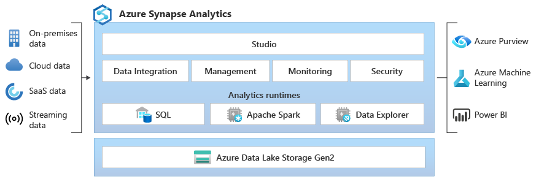

# 🎒 Azure Synapse Analytics

Azure Synapse Analytics, Microsoft tarafından sunulan entegre bir veri analizi hizmetidir. Bu platform,  veri işleme, veri entegrasyonu, veri depolama gibi çözümleri tek bir çatı altında birleştirir. SQL ve Apache Spark desteğiyle veri sorgulama, analiz ve raporlama işlemlerini kolaylaştırır. Ayrıca, Power BI ve Azure Machine Learning ile entegre çalışarak analizler ve görselleştirmeler sunar. Synapse, büyük miktarda verinin hızlı ve etkin bir şekilde işlenmesi için ideal bir çözümdür.

<figure><figcaption></figcaption></figure>

#### Komponentler;

1. **Synapse SQL Pool**: Bu, SQL tabanlı analizler için kullanılan, ölçeklenebilir ve yönetilen bir veritabanı hizmetidir. Sunucusuz ve tahsis edilmiş kaynak seçenekleri sayesinde, kullanıcılar büyük veri kümeleri üzerinde karmaşık sorgular çalıştırabilir.
2. **Synapse Spark Pool**: Bu, büyük veri işlemleri için Apache Spark kümelerini barındıran bir servistir. Kullanıcılar bu serviste Python, Scala, SQL ve .NET kullanarak veri işleme ve analitik işlemleri gerçekleştirebilirler.&#x20;
3. **Synapse Pipelines**: ETL işlemleri (veriyi çıkarma, dönüştürme ve yükleme) için bir otomasyon ve entegrasyon aracıdır. Azure Data Factory'nin özelliklerinden faydalanarak, veri aktarım işlemleri tasarlayabilir ve otomatik hale getirebilirsiniz.
4. **Synapse Link**: Bu bileşen, gerçek zamanlı olarak veri analizi yapabilmeniz için Azure Synapse ortamını Azure Cosmos DB ile bağlamanıza imkan tanır. Cosmos DB'deki veriler üzerinde doğrudan Synapse içerisinden analitik işlemler yapılabilir.
5. **Synapse Studio**: Bu, tüm bu servislerin yönetildiği ve kullanıcıların veri setleri üzerinde çalışmalarını kolaylaştıran bir web tabanlı IDE'dir. Synapse Studio üzerinden SQL ve Spark havuzları oluşturabilir, veri aktarım işlemleri gerçekleştirebilir ve çeşitli veri kaynaklarına bağlantılar kurabilirsiniz.

#### Compare ADF and Azure Synapse Analytics

1. **Entegrasyon Runtime'ın Paylaşımı**:
   * **Azure Data Factory**: Çalışma zamanı (runtime), birden fazla ADF arasında paylaşılabilir.
   * **Azure Synapse Analytics**: Entegrasyon runtime'ının paylaşımına izin verilmez. Her Synapse ortamının kendi özel runtime vardır.
2. **Çözüm Şablonları**:
   * **Azure Data Factory**: Çeşitli ETL işlemleri için şablonlar ADF şablon galerisinde mevcuttur.
   * **Azure Synapse Analytics**: Şablonlar, Synapse Çalışma Alanı Bilgi Merkezi'nde bulunabilir ve bu şablonlar analiz ve veri işlemleri için kullanılabilir.
3. **Bölgeler Arası Veri Akışları**:
   * **Azure Data Factory**: Farklı bölgelerdeki veri kaynakları arasında veri akışları desteklenir.
   * **Azure Synapse Analytics**: Bölgeler arası veri akışları desteklenmez, bu nedenle veri işlemleri aynı bölge içerisinde gerçekleştirilir.
4. **Veri Akışı İzleme için Spark İşleri**:
   * **Azure Data Factory**: ADF içindeki veri akışlarını izlemek için Spark işlerini desteklemez.
   * **Azure Synapse Analytics**: Synapse Spark havuzları (pools) kullanılarak veri akışlarının izlenmesi sağlanır.

ADF, daha çok ETL ve veri entegrasyon senaryolarına yönelikken, Synapse Analytics, analitik ve veri işleme yetenekleriyle öne çıkar.

#### Compare Azure Databricks and Azure Synapse Analytics

1. **Makine Öğrenimi**:
   * **Azure Databricks**: TensorFlow, PyTorch ve Keras gibi popüler açık kaynak makine öğrenimi kütüphanelerini destekler ve GPU kullanımına izin verir, bu sayede compute gerektiren işlemler hızlandırılabilir.
   * **Azure Synapse Analytics**: Azure ML'nin yerleşik desteği mevcut olup, SparkML ve MLLib gibi açık kaynak makine öğrenimi kütüphaneleri ile model eğitimi yapılabilir. Ayrıca, GPU destekli pools sunar.
2. **Özellik Seti**:
   * **Azure Databricks**: Apache Spark ortamı desteği sunar, bu da veri işlemleri ve analitik için hızlı ve etkin bir platform sağlar.
   * **Azure Synapse Analytics**: Dağıtık bir T-SQL sistemine sahiptir ve kendi Spark ortamını, veri entegrasyon özelliklerini içerir. Ayrıca, Synapse Studio ile birleşik bir kullanıcı deneyimi sunar.
3. **Raporlama**:
   * **Azure Databricks**: Power BI için özel bir bağlayıcı (connector) sunar, böylece kullanıcılar Databricks üzerinde gerçekleştirilen analitik işlemlerin sonuçlarını Power BI'a aktarabilir ve görselleştirebilir.
   * **Azure Synapse Analytics**: Power BI ile doğrudan entegrasyona sahiptir, Synapse Studio üzerinden Power BI raporları oluşturulabilir ve yönetilebilir.

Her iki platformun da veri bilimi ve büyük veri analitiği için güçlü araçlar olduğunu gösterirken, kullanılacak platformu seçerken iş yüküne ve kullanım senaryolarına özel gereksinimlere bağlı olarak karar vermek önemlidir. Azure Databricks, özellikle makine öğrenimi ve gelişmiş analitik için uygunken, Azure Synapse Analytics geniş çapta veri yönetimi ve entegrasyon yetenekleriyle birleşik bir deneyim sunar.


