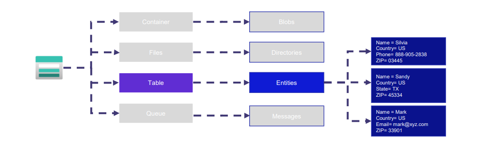
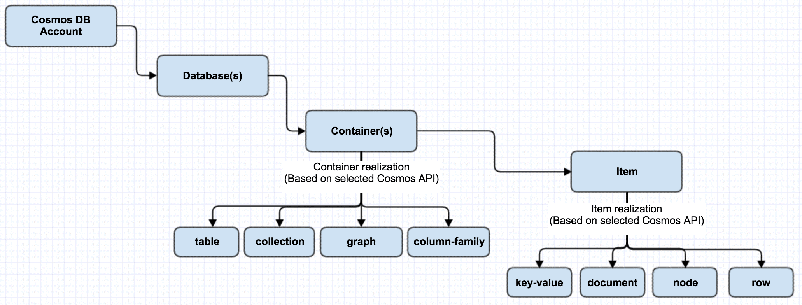

# 🔮 Azure Table Storage And Cosmos DB Demostration

### Azure Table Storage:

Azure Table Storage, Microsoft Azure'un sunduğu bir NoSQL key/value veri deposu hizmetidir. Büyük miktarda yapılandırılmış ve ilişkisel olmayan verileri depolamak ve yönetmek için ideal bir çözümdür.

<figure><figcaption></figcaption></figure>

**Özellikler,**

* **Şemasız Tasarım:** Azure Table Storage veri yapısını esnek bir şekilde oluşturmaya imkan verir. Uygulamanın gereksinimlerine göre sütun sayısı ve veri türleri belirlenebilir.
* **Anahtar/Değer Depolama:** Veriler anahtar-değer çiftleri şeklinde depolanır. Her satır benzersiz bir partition key ve row key ile tanımlanır.
* **Partition Key ve Row Key:** Bu iki anahtar sayesinde veriler gruplara ayrılarak erişim ve sorgulama performansı artırılır.
  * _Partition Key:_ Azure Table Storage verileri bölümlere (partition) ayırır. Partition Key, hangi satırın hangi bölüme ait olacağını belirler.
  * _Row Key:_ Bir Partition Key içerisindeki bir satırı benzersiz şekilde tanımlamak için kullanılır.
* **Yüksek Ölçeklenebilirlik:** Petabayt ölçeğinde veri depolama ve otomatik ölçeklenebilme özelliği sayesinde büyük veri yüklerine cevap verebilir.
* **REST API ve Client Kitaplıkları:** .NET, Java, Python gibi pek çok dil için hazır kütüphaneler ve REST API erişimi sağlar.


Bir ürün kataloğunu düşünelim:

* **Partition Key:** Ürün kategorisini temsil edebilir (Elektronik, Giyim, Ev Eşyaları, vb.)
* **Row Key:** Ürün KIMLIĞİ olabilir (ürün1234, gömlek789, vb.)

Bu yapıda,

* "Elektronik" kategorisi ile ilgili sorgu yaptığınızda, yalnızca Elektronik bölümüne bakarak hız kazanırsınız.
* Elektronik bölümü içinde "ürün1234" satırını almak istiyorsanız Row Key ile direk o satıra erişebilirsiniz.



**Örnek Kullanım Alanları;**

* Azure Table Storage, müşteri profilleri, kullanıcı ayarları ve benzeri kişiselleştirilmiş verileri depolamada kullanılabilir.
* Bir e-ticaret sitesinin ürün verileri, fiyatları, stok bilgileri vs. Table Storage'da tutulabilir.
* Uygulama ayarları, web sitelerinin konfigürasyon dosyaları gibi değiştirilebilir veriler Table Storage'da saklanabilir.
* Endüstriyel IoT senaryolarında sensör verileri veya akıllı cihaz verileri Table Storage'da toplanabilir.
* Uygulama performansı, kullanıcı davranışı analizleri için günlük kayıtları Table Storage'da depolanabilir.
* Oyuncu profilleri, skor tabloları, harita verileri gibi oyun verileri Table Storage ile yönetilebilir.
* Mobil uygulamaların arka uç hizmetleri, kullanıcı verileri Table Storage kullanılarak yönetilebilir.


Table Storage, ilişkisel veritabanları gibi karmaşık sorguları desteklemez. Birden fazla tablonun birleştirilmesini, şartlı ifadeleri içeren sorguları veya gruplama gibi işlemleri desteklemez. Ancak basit sorguları çok hızlı bir şekilde işleyebilir.



### Azure Table Storage Demo:


Verdiğimiz futbolcu bilgilerini bir tablo üzerinde, key-value eşlenikleri şeklinde saklayan python uygulaması.


1 - **Storage Account Oluşturma**: Aşağıdaki komutu kullanarak yeni bir storage account oluşturalım.

```powershell
az storage account create --name storageaccount35623 --resource-group rg-demo-tables-and-CosmosDB-001 --location eastus --sku Standard_LRS --kind StorageV2
```

<figure><figcaption></figcaption></figure>

2 - **Table oluşturma:** Aşağıdaki komutu kullanarak, storage account içerisinde, "footballPlayers" adında tablo oluşturuyoruz.

```powershell
az storage table create --name footballPlayers --account-name storageaccount35623
```

<figure><figcaption></figcaption></figure>

3 - **Connection String Bilgisi:** Table storage bağlantısı kurmak için, connection string ihtiyacımız bulunmaktadır. Bunun için, aşağıdaki komutu çalıştırıp, storage account connection string bilgisini almalıyız.

```powershell
az storage account show-connection-string --name storageaccount35623 --resource-group rg-demo-tables-and-CosmosDB-001
```

<figure><figcaption></figcaption></figure>

4 - **Kodumuzu test edelim:** Kodumuzu çalıştırıp, bizden istediği bilgileri girelim. Öncelikle, kodumuzun çalışması için gerekli olan extensionları yükleyelim.

```bash
pip install azure-data-tables
```

<figure><figcaption></figcaption></figure>

azure-data-tables extension'u pip ile sistemimize yükledik. Şimdi kodumuzu çalıştırıp, testimizi yapabiliriz. Öncelikle, çalıştırdığım kodu aşağıda paylaşıyorum:

```python
from azure.data.tables import TableServiceClient
from azure.core.exceptions import ResourceExistsError
import os

# Azure Table Storage bağlantı dizesini buraya girin
connection_string = "your_connection_string_here"

# Table service client'ı başlatma
table_service_client = TableServiceClient.from_connection_string(conn_str=connection_string)

# Tabloya erişim (tablo yoksa oluşturulur)
table_name = "footballPlayers"
try:
    table_client = table_service_client.create_table_if_not_exists(table_name=table_name)
except ResourceExistsError:
    table_client = table_service_client.get_table_client(table_name=table_name)

# Kullanıcıdan futbolcu bilgilerini alma
player_name = input("Futbolcu adını girin: ")
player_age = input("Futbolcunun yaşını girin: ")
player_country = input("Futbolcunun ülkesini girin: ")

# Bilgileri Azure Table Storage'a ekleyen entity
entity = {
    "PartitionKey": player_country,
    "RowKey": player_name,
    "Age": player_age,
}

try:
    table_client.create_entity(entity=entity)
    print(f"{player_name} başarıyla eklendi.")
except Exception as e:
    print(f"Bir hata oluştu: {e}")

```

Kodumuzu çalıştırdığımzda, bizden 3 adet bilgi istedi:

* player\_name
* player\_age
* player\_country

Bu bilgileri girdiğimizde, eklendiğine dair karşımıza bir mesaj çıktı.

<figure><figcaption></figcaption></figure>

Bilgiler eklendiğine göre, storage account 'a gidip bu bilgilerin gerçekten düzgün bir şekilde eklendiğini teyit edelim.

<figure><figcaption></figcaption></figure>

Göreceğiniz üzere, bilgiler eklenmiş. Demo başarılı bir şekilde çalıştı. Farklı bir test yapıp, tablomuza yeni bir anahtar girelim.

<figure><figcaption></figcaption></figure>

Eklediğimiz futbolcu bilgisinin yanına, pozisyon bilgisininde girilmesini istedik ve kodumuzu yukarıdaki şekilde güncelledik. Kodumuzu çalıştırdığımızda, table storage da bu bilgiyi teyit edelim.

<figure><figcaption></figcaption></figure>

Yeni anahtarımıza başarılı bir şekilde, değer girdik ve eklenip, eklenmediğini teyit ettik. Dolayısıyla table storage demosunu başarılı bir şekilde gerçekleştirdik. Ayrıca istenirse, bu bilgilere kod yardımıyla, SDK, API 'ler kullanarak programatik bir şekilde erişilebilir ve entity 'ler dinamik bir şekilde yönetilebilir.




***

### Cosmos DB:

Cosmos DB, Microsoft tarafından sunulan ve küresel ölçekte dağıtılmış çok modelli bir veritabanı hizmetidir. Verileri farklı veri biçimleriyle (belge, grafik, tablo vs.) depolayabilir ve bunlara anlık olarak erişebilirsiniz. Aynı zamanda yüksek kullanılabilirlik ve düşük gecikme süreleri sunar.&#x20;

Azure Table Storage, basit NoSQL tablo depolama hizmetidir. Veriler satır ve sütun şeklinde depolanır. Ancak sorgu yetenekleri ve özellik seti sınırlıdır. Cosmos DB ise çok daha gelişmiş bir hizmettir. Verileri farklı biçimlerde saklayabilir ve zengin sorgu imkanı sunar.

<figure><figcaption></figcaption></figure>

**Başlıca Kullanılabilir API'ler,**

1. **Azure Cosmos DB for MongoDB**
2. **Azure Cosmos DB for PostgreSQL**
3. **Azure Cosmos DB for NoSQL**
4. **Apache Cassandra**:


Kullanım Örneği: [https://learn.microsoft.com/en-us/azure/cosmos-db/nosql/quickstart-portal](https://learn.microsoft.com/en-us/azure/cosmos-db/nosql/quickstart-portal)


<figure><figcaption></figcaption></figure>

Azure Cosmos DB'de "Container", verilerin saklandığı birimlerdir. Genellikle bir veritabanıdaki tablolara benzetilebilir. Bir Azure Cosmos DB hesabında birden çok veritabanı olabilir ve her veritabanı içinde birden çok container bulunabilir. &#x20;

Özetle, Her bir veritabanı, içerisinde birden fazla container barındırabilir. Konteynerlar, verilerin saklandığı temel birimlerdir ve SQL'deki tablolara, MongoDB'deki koleksiyonlara veya Gremlin'deki grafiklere benzetilebilir. Yani, verilerinizi saklamak ve sorgulamak için kullandığınız yapılar konteynerlardır.\
\
Örneğin, bir e-ticaret uygulamasında "ürünler" adında bir container olabilir, bu container içinde her bir ürünün bilgilerini içeren bilgiler/belgeler bulunur. &#x20;






