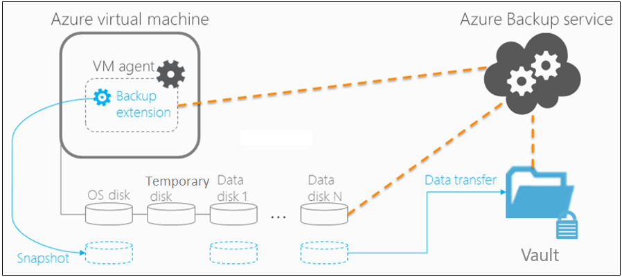

# 🎞️ Azure VM backup and recovery

<figure><figcaption></figcaption></figure>

Azure VM backup ve recovery, Microsoft Azure'da sanal makinelerin verilerini güvence altına almak için tasarlanmış bir süreçtir. Bu süreçte, yedeklemelerin otomatik olarak gerçekleşmesini ve güvenli bir şekilde kurtarma hizmeti kasasında (vault) saklanmasını sağlamak için politikalar (policies) oluşturabilir ve yönetebilirsiniz.

#### Azure VM backup ve recovery süreci,

1. **Snapshot Alınması**: Sanal Makine (VM) üzerinden bir snapshot alınır. Bu snapshot lokal olarak saklanır ve genellikle 5 gün gibi bir süre için saklanma (retention) süresine sahiptir. Bu süre içinde kolayca ve hızlıca geri yüklemek mümkündür, buna "Instant Restore" da denir.
2. **Snapshot Tier**: Alınan snapshot’lar yerel olarak saklanır ve Instant Restore için kolay bir geri yüklemeye olanak tanır.
3. **Backup Schedule**: Gruplanmış VM'ler için eş zamanlı başlatma ihtiyacı olduğunda, yedekleme politikaları dikkatli bir şekilde planlanmalıdır. Trafik yoğunluğunu en aza indirmek için, yedeklemelerin trafik yoğunluğunun düşük olduğu zamanlarda gerçekleştirilmesi idealdir. Ayrıca, farklı grupların ihtiyaçlarına göre birden fazla yedekleme politikası tasarlanabilir ve uygulanabilir.
4. **Retention Policies**: Hem kısa süreli hem de uzun süreli yedeklemeler için saklama politikaları belirlenir. İş gereksinimlerinize göre saklama süresi ayarlanabilir. İstemiyorsanız yedeklemeleri talep üzerine de alabilirsiniz.
5. **Vault Tier**: Lokalde alınan snapshot’lar daha fazla saklama süresi ve güvenlik için bir recovery service vault kasasına aktarılır.
6. **Revisit Backup Policies**: İş gereksinimleri değiştikçe, mevcut iş gereksinimleriyle uyumlu olması için yedekleme politikalarının gözden geçirilmesi ve güncellenmesi önemlidir.
7. **Cross Region Restore (CRR)**: Azure'da bulunan sanal makinelerinizi, eşleştirilmiş bir alternatif bölgeye geri yüklemenizi sağlayan bir özelliktir. Bu işlev, vault ayarlarında aktif hale getirilebilir ve birincil bölge felaket veya kesinti durumlarında veya Felaket Kurtarma (Disaster Recovery - DR) simülasyonları esnasında değerli bir kurtarma opsiyonu sunar.



